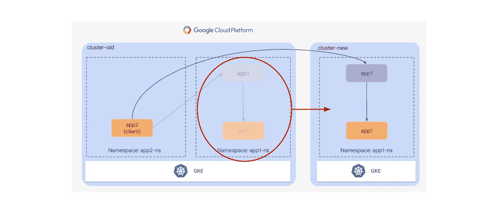

# 在 Kubernetes 集群之间迁移应用程序

> 原文：<https://medium.com/google-cloud/migrating-applications-between-kubernetes-clusters-8455cf1bfccd?source=collection_archive---------0----------------------->

**TL；DR** :在 Kubernetes 部署之间逐步迁移应用程序，以便不影响集群内流量，这可能是一项挑战。本文提出了一种利用标准但强大的工具的方法。



从未在两个 Kubernetes 集群之间迁移过应用程序的请举手！

很简单，对吧？不完全是。不总是。

这可能有几个原因:例如，它可能是由于一些主要的平台升级，或者是由于持续的资源重组。

虽然原则上这似乎是一项非常简单的任务，但是随着应用程序之间的依赖性增加，以及在迁移过程中减少停机时间的需求增加，这一过程可能会变得更加复杂。

第一种方法可以包括在新的集群中重新创建相同的环境，并且一旦新的部署就绪，最终切换任何外部 DNS 记录。遗憾的是，这并不总是可能的。

一个简单的用例将让我们更好地理解这个问题以及如何解决它。

让我们想象一个 Kubernetes 集群运行两个应用程序；一个依靠另一个。它们归不同的团队所有，这些团队可以以不同的速度迁移它们。

您将如何逐步迁移应用程序，避免停机？

在继续之前，让我们指出几个基本的、坚定的假设，这些假设与迁移并不严格相关，但肯定会降低总体集群维护工作量，并理顺迁移过程:

*   应用程序应该总是使用 DNS 名称而不是 IP 地址来引用内部和外部服务
*   清楚地了解我们的应用程序之间的关系很重要。这将有助于我们主动准备迁移，并及时应对可能出现的故障。

既然我们陈述了游戏的基本规则，让我们回到我们的例子。

我们如何将一个应用程序移动到新的集群，使得另一个应用程序甚至不知道它的依赖关系已经被迁移，从而避免故障？

当我开始触及问题的表面时，一些术语，如多集群、集群联合和服务网格，突然出现在我的脑海中。

有很多工具可以用来构建多集群环境、创建集群联盟和高效管理“微服务网络”。T2 只是众多例子中的一个。

太好了，看来我们成功了！…嗯，不完全是。

大多数多集群和联合工具都带有重要的警告:两个 Kubernetes 集群需要运行非常相似(如果不是相同的话)的 Kubernetes 版本，但情况肯定不总是这样。此外，许多用户可能会发现，仅仅为了迁移而使用这些工具是多余的，而且在他们的系统中注入这些工具是有风险的。

本文采用了一种更保守的方法，利用了一组基本但强大的工具，比如 DNS、Kubernetes 服务和一个可选的入口控制器。

# 我的环境

我将使用[谷歌云平台(GCP)](https://cloud.google.com/gcp) 进行演示。这将包括几个 Kubernetes 集群(以及一些负载平衡器，在我们创建服务时提供)和云 DNS。

我还将利用 [Traefik](https://traefik.io) 作为入口控制器。虽然这不是强制性的，但是强烈建议这样做，因为这样可以避免为每个要迁移的应用程序创建单个负载平衡器服务(以及相关的内部 GCP 负载平衡器)。我们一完成这些步骤，事情就会变得更清楚了。无论如何，记住你可以选择用你最喜欢的入口替换 Traefik。

# 演示时间！

我准备了两个空集群:`cluster-old`和`cluster-new`。

我们将开始在旧集群中部署两个应用程序:`app1`和`app2`。为了让实验更有趣，这两款应用将部署在不同的名称空间:分别是`app1-ns`和`app2-ns`。

每个应用程序都由一个 pod 和一个引用它的同名 ClusterIP 服务组成。

App1 是一个哑 HTTP 服务器，它在其根端口 80 上返回消息`"Hello, I’m app1"`。

这是我用来创建 pod 的 Kubernetes 清单:

```
# app1-pod.yamlkind: Pod
apiVersion: v1
metadata:
  name: app1
  labels:
    app: app1
spec:
  containers:
    - name: app1
      image: hashicorp/http-echo:0.2.3
      args:
        - "-text=Hello, I'm app1"
        - "-listen=:80"
```

这是服务的一部分:

```
# app1-svc.yamlkind: Service
apiVersion: v1
metadata:
  name: app1
spec:
  selector:
    app: app1
  ports:
    - port: 80
```

`App2`是一个非常简单的客户端:它使用 curl 每秒查询一次`app1`。将收到的回复写入系统标准输出，我们将能够看到它们查询容器日志。

```
# app2-pod.yamlkind: Pod
apiVersion: v1
metadata:
  name: app2
  labels:
    app: app2
spec:
  containers:
    - name: app2
      image: curlimages/curl:7.74.0
      command: ["/bin/sh", "-c"]
      args:
        - >
          while true; do
            curl -s -X GET http://app1.app1-ns
            sleep 1
          done
```

让我们创建名称空间并部署应用程序。

```
kubectl create namespace app1-ns
kubectl apply -f app1-pod.yaml --namespace app1-ns
kubectl apply -f app1-svc.yaml --namespace app1-nskubectl create namespace app2-ns
kubectl apply -f app2-pod.yaml --namespace app2-ns
```


目标是将这些应用程序从旧集群迁移到新集群，其中只创建了两个空的名称空间。

最关键的部分是迁移`app1`就不用说了，以至于`app2`都没注意到前者已经被挪过去了。

在高层次上，**这个想法是在旧的集群中创建一个新的服务，它不是指向本地 app1 应用程序，而是通过一个外部 DNS 条目链接到它的一个克隆，位于新的集群中。**

在这个过程中，在修改任何现有的路由之前，我们总是能够测试新创建的组件是否工作。

让我们开始实现该机制，首先确保该机制在同一个集群中工作:`app2`将很快通过外部 DNS 与`app1`通信。

安装 Traefik 是第一步。我就不赘述了，因为这不是本文的目的。我只是简单地遵循了[官方 helm 安装指南](https://doc.traefik.io/traefik/getting-started/install-traefik/)，并添加了一个[注释](https://cloud.google.com/kubernetes-engine/docs/how-to/internal-load-balancing)来创建一个 [GCP 内部负载平衡器](https://cloud.google.com/load-balancing/docs/internal)，而不是默认的 [HTTP 全局负载平衡器](https://cloud.google.com/load-balancing/docs/https)，这个实验并不真正需要。

```
kubectl create namespace traefik

helm repo add traefik https://helm.traefik.io/traefik
helm repo updatehelm install \
     --set service.annotations."cloud\.google\.com/load-balancer-type"=Internal \
     --namespace traefik \
     traefik \
     traefik/traefik
```

几秒钟后，您应该会看到为 Traefik LoadBalancer 服务分配的专用 IP 地址。

```
kubectl get services -n traefik

NAME      TYPE           CLUSTER-IP    EXTERNAL-IP     PORT(S)                      AGE
traefik   LoadBalancer   10.72.4.210   192.168.100.16   80:31679/TCP,443:31228/TCP   45s
```

把它记下来。我们很快就会需要它。

转向云 DNS，创建一个[私有 DNS 区域](https://cloud.google.com/dns/docs/zones#create-private-zone)。例如，`mycompany.internal`


在云 DNS 中创建 DNS 专用区域

[创建一个 A 记录](https://cloud.google.com/dns/docs/records)，`*old.mycompany.internal*`，指向刚刚分配的负载平衡器 IP。

完成后，您的 DNS 面板应该如下所示。


在旧集群中:

制作您的`app1`服务的副本。比如称之为`*app1-internal*`。

```
# app1-internal-svc.yamlkind: Service
apiVersion: v1
metadata:
  name: app1-internal
spec:
  selector:
    app: app1
  ports:
    - port: 80
```

创建一条[进刀路线](https://doc.traefik.io/traefik/routing/providers/kubernetes-crd/#kind-ingressroute)。

```
*# app1-ingress-route.yaml**apiVersion: traefik.containo.us/v1alpha1
kind: IngressRoute
metadata:
  name: app1
spec:
  entryPoints:
    - web
  routes:
  - kind: Rule
    match: Host(`app1.app1-ns`) || Host(`app1.app1-ns.svc.local`)
    services:
    - kind: Service
      name: app1-internal
      namespace: app1-ns
      port: 80*
```

请注意，我们要么匹配目标主机名`app1.app1-ns` 要么匹配`app1.app1-ns.svc.cluster.local`。这是因为，除了我们将实施的不同策略之外，请求仍将使用原始目的主机报头到达`app1`。

让我们部署这两个组件:

```
kubectl apply -f app1-internal-svc.yaml --namespace app1-ns
kubectl apply -f app1-ingress-route.yaml --namespace app1-ns
```

是时候验证我们的应用程序可以通过新路径到达了。为此，我已经进入了`app2`客户端，并通过新地址手动卷曲`app1`。

```
kubectl exec -it -n app2-ns app2 /bin/sh

curl -H “Host: app1.app1-ns” http://old.mycompany.internal
Hello, I'm app1
```

注意，我指定了一个主机头。如果不这样做，您将会收到 Traefik 的`*“404: Page not found.”*`回复。

创建一个[外部名称](https://kubernetes.io/docs/concepts/services-networking/service/#externalname)服务，指向`*old.mycompany.internal*` *。*

```
app1-ext-old-svc.yamlkind: Service
apiVersion: v1
metadata:
  name: app1
spec:
  externalName: old.mycompany.internal
  type: ExternalName
```

最后，用刚刚创建的服务替换`*app1-ns*`中原来的`app1`服务。

```
kubectl replace -f Desktop/medium/app1-ext-old-svc.yaml -n app1-ns
```

在实验过程中，我一直在 app2 上记录日志，我从未明显注意到 app1 停止响应。

`App1`仍然生活在旧集群中，但是从现在开始，客户端请求转到 ExternalName 服务，出集群到云 DNS，回到 Traefik，通过新的`app1-internal`服务，最后到 pod。


# 迁移

既然我们头脑中的机制起作用了，我们就为迁移做好了准备。

让我们设置新的集群。正如我们在旧版本中所做的:

*   在名称空间中部署`app1`和`app2`(命令同上)
*   部署 Traefik(命令同上)。获取新的内部负载平衡器 IP
*   在`mycompany.internal`中创建另一个 A 记录。将其称为`new.mycompany.internal`，并指向新的集群入口 IP
*   部署在旧集群中部署的相同 Traefik IngressRoute
*   在`*app1-ns*`名称空间中部署`app1-internal`服务(命令同上)

创建一个指向刚刚创建的 DNS 名称的新 ExternalName 服务。

```
# app1-ext-new-svc.yamlkind: Service
apiVersion: v1
metadata:
  name: app1
spec:
  externalName: new.mycompany.internal
  type: ExternalName
```

最后，让我们用刚刚创建的服务替换旧集群中的旧 ExternalName 服务:

```
kubectl replace -f Desktop/medium/svc-ext-name-new.yaml -n app1-ns
```

基本上没有停机，旧集群中的`app2`客户机将开始与新集群中的`app1`应用程序通信。


旧集群中的 App2 与新集群中的 app1 通信

注意，这个过程对于`app2`是完全透明的，因为我们没有改变其中对`app1`的任何引用。

我们现在可以对`app2`重复相同的过程，从而完成迁移。


应用程序已被移动到新群集。现在，它能够像在迁移之前一样引用 app1

迁移完成后:

*   `app1`服务可以转换回 ClusterIP 服务
*   旧的集群可以被移除
*   可以删除新集群中的云 DNS 区域、Traefik 和`*app1-internal*`服务


用于迁移和旧集群的组件将被删除。迁移已完成

尽管这是一个最小的设置，但是将相同的过程扩展到更大的部署应该是相当容易的，并且可以自动地大规模应用。但这是另一个话题了！

尽情享受吧！

> 感谢 [Ludovico Magnocavallo](https://medium.com/u/4eb6c1562d42?source=post_page-----8455cf1bfccd--------------------------------) 分享你的想法并帮助我完成这篇文章！