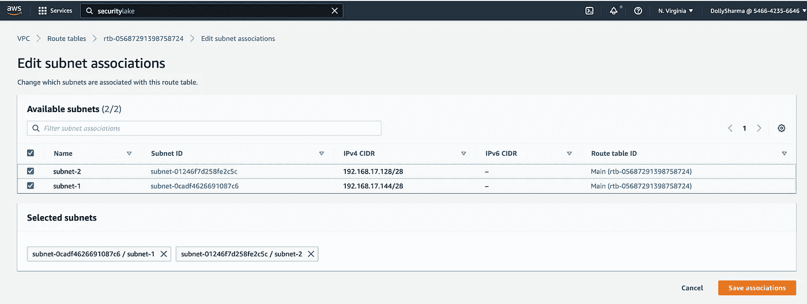
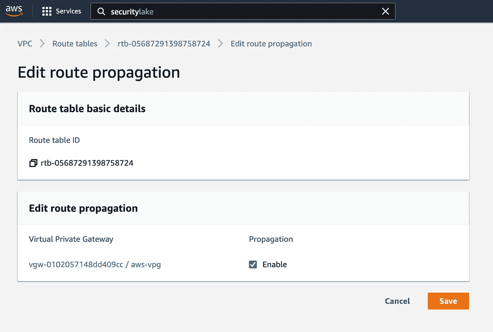
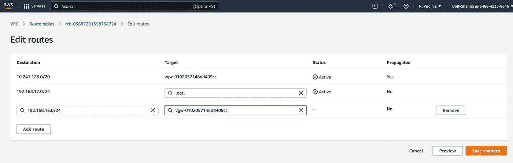
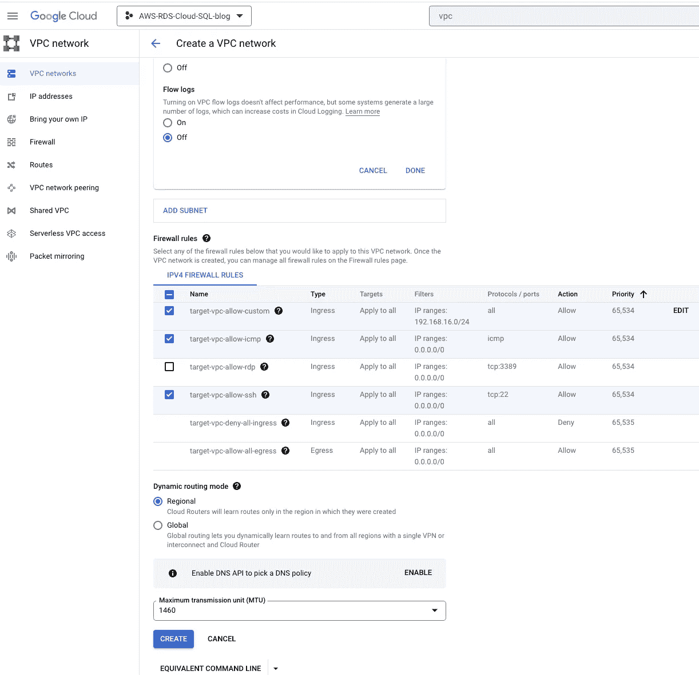
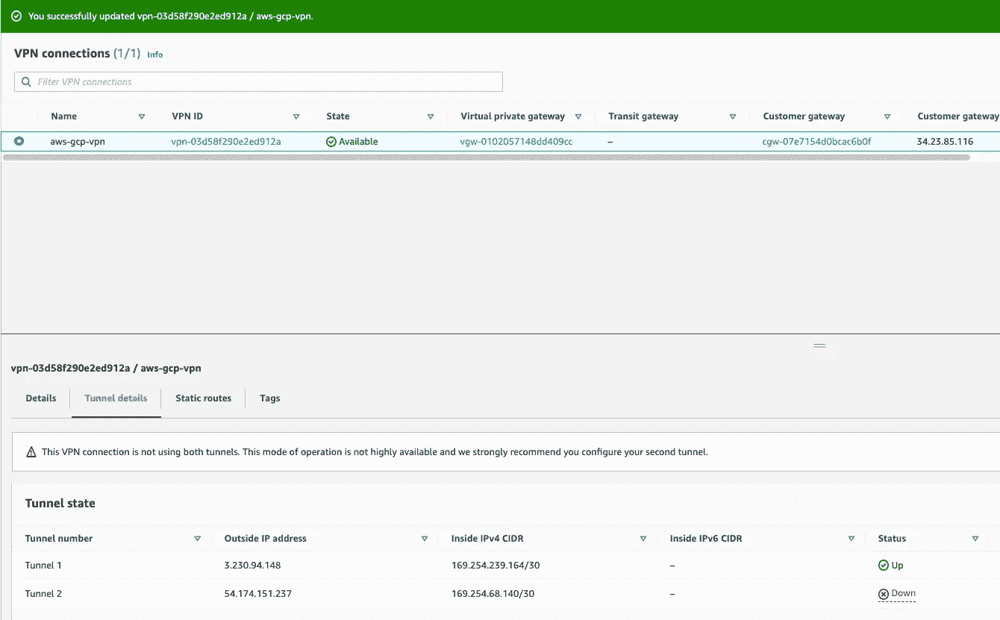
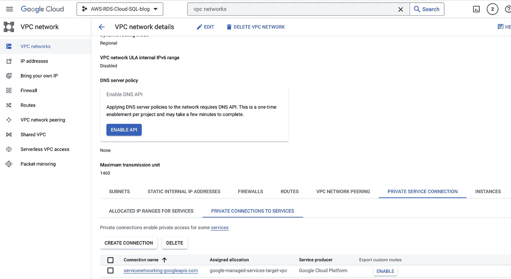
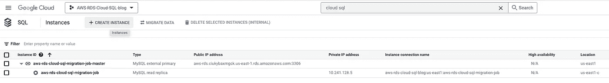

# 使用 GCP DMS 将 AWS RDS 迁移到云 SQL

> 原文：<https://medium.com/google-cloud/migrating-aws-rds-to-cloud-sql-using-gcp-dms-3614fda55d9e?source=collection_archive---------0----------------------->

[Growtika 开发商营销机构](https://unsplash.com/@growtika?utm_source=medium&utm_medium=referral)在 [Unsplash](https://unsplash.com?utm_source=medium&utm_medium=referral) 上拍摄的照片

如果您有在 AWS 上运行的任务关键型工作负载，您可能正在寻找一种方法来迁移到 GCP，同时保持相同的数据库引擎，将停机时间降至最低或接近零。本博客提供了使用 [**GCP 数据迁移服务将您的 AWS RDS 迁移到 GCP 云 SQL 的解决方案。**](https://cloud.google.com/database-migration)

GCP DMS: GCP 数据库迁移服务(AWS DMS)是一项托管迁移和复制服务，可帮助您快速、安全地将数据库和分析工作负载迁移到 GCP，同时最大限度地减少停机时间，实现零数据丢失。GCP DMS 支持各种数据库和分析引擎的迁移，如 MySQL 和 PostgreSQL，并在 preview 中支持 SQL Server 和 Oracle 迁移。

这篇博文将通过建立 VPN 连接，使用**数据迁移服务**将数据库从 Amazon RDS MySQL 实例迁移到 Google Cloud SQL 迁移实例。

## 先决条件

在开始之前，您必须完成以下先决条件:

*   AWS 和 GCP 控制台访问

## 术语:

以下是本指南中使用的术语定义。

**Cloud SQL:** 一个完全托管的关系数据库服务，它使**易于设置和** **管理**您在云中的 **PostgreSQL、MySQL、& SQL Server** 数据库。

**云 DMS:** 轻松将您的 AWS RDS 数据库提升并迁移到云 SQL，最大限度减少停机时间。

迁移您的整个数据库，包括数据和元数据，无需对源进行任何额外的更改。

DMS 是一项免费服务，允许你只为使用你全新的 GCP 数据库付费。

**IP allowlist:** 当源数据库在 Google Cloud 外部，并且具有外部可访问的 IPv4 地址和 TCP 端口时，公共 IP 连接是最合适的。如果源数据库托管在 Google Cloud 的另一个 VPC 中，那么连接源数据库和云 SQL 实例的最简单方法就是使用 VPC 对等。

**亚马逊 RDS** :亚马逊关系数据库服务是亚马逊 Web Services 提供的分布式关系数据库服务。它是一个运行在“云中”的 web 服务，旨在简化应用程序中使用的关系数据库的设置、操作和伸缩。

## 对于 AWS 站点到站点 VPN，请遵循以下步骤:

步骤 1:创建一个 VPC

名称:来源-vpc，地区:美国东部-1，VPC CIDR: 192.168.17.0/24，

步骤 2:在上述 RDS VPC 的不同可用性区域中创建两个子网:

子网 1: 192.168.17.127/28，子网 2: 192.168.17.144/28

步骤 3:使用 34.23.85.116 的 GCP 经典 VPN 网关 IP(**)创建一个客户网关**

**名称:aws-cg，ip 地址: **34.23.85.116(** GCP 保留静态公共 IP)**

****

**步骤 4:创建虚拟专用目标网关:**

**名称:aws-vpg**

****

**步骤 5:将虚拟专用网关连接到 VPC**

****

**步骤 6:创建站点到站点 VPN 连接**

**名称:aws-gcp-vpn，虚拟专用网关:aws-vpg，客户网关:aws-cg，路由选项:静态**

**本地 IPv4 网络 CIDR: 192.168.17.0/24(AWS VPC IP)**

**远程 IPv4 网络 CIDR:192.168.16.0/24 (GCP VPC IP)**

********

**步骤 7:下载配置文件(复制 GCP VPN 隧道设置所需的**预共享**密钥)**

****

**预共享密钥:**jfS _ . xpb 6 rad 4v vud . 5 jq 6 kou u9 ybv 4 l****

****

**步骤 8:隧道状态当前为关闭，因为我们尚未在目标端完成隧道设置**

****

**步骤 9:添加入站安全规则，以允许来自云 VPN (192.168.16.0/24)的所有协议和端口。**

****

**将两个子网都关联到 VPC 主路由表:**

**VPC →路由表→编辑子网关联**

****

**更新路由传播:**

**VPC →路由表→编辑路由传播**

****

**更新 GCP CIDR 山脉的路线:**

**VPC →路由表→编辑路由**

****

**步骤 10:配置客户网关设备(GCP VPN)**

## **对于 GCP 经典 VPN，请遵循以下步骤:**

> **步骤 1:在 GCP 控制台中启用以下 API:**

**计算引擎 API**

****

**服务网络 API**

****

> **步骤 2:创建目标 VPC**

**名称:塔吉特-vpc，VPC CIDR: 192.168.16.0/24，地区:美国东部 1**

********

> **步骤 3:为传统 VPN 网关保留一个公共 IP**

**名称:静态-公共-IP-经典-vpn**

****

> **步骤 4:创建一个经典的 VPN 网关**

****

**名称:gcp-vpn-gw，网络:target-vpc，地区:us-east1，ip 地址:保留的公共 IP**

****

> **步骤 5:设置隧道**

**名称:gcp-aws-vpn-tunnel，远程对等 ip 地址:3.230.94.148，IKE 版本:IKEv1，**

**IKE 预共享密钥:jfS _ . xpb 6 rad 4v vud . 5 jq 6 kou u9 ybv 4 l，**

**路由选项:基于路由的远程网络 IP 范围:192.168.17.0/24**

****

**第六步:**

****

**更新 AWS 流量的 GCP 防火墙规则:**

**VPC 网络→防火墙→添加防火墙规则**

****

**添加防火墙规则:**

****

## **验证:**

**AWS 端隧道状态应该为运行:**

****

**应建立 GCP VPN 隧道状态:**

****

## **按照以下步骤创建 AWS RDS 实例:**

1.  **数据库创建方法**

****

**2.模板**

****

**3.连通性:**

****

**4.数据库认证:**

****

**5.复制 RDS 实例端点:**

**终点:aws-rds.ciukybaxmgck.us-east-1.rds.amazonaws.com**

**6.将数据转储到 RDS。**

## **按照以下步骤设置 DMS 并启动迁移作业:**

1.  **登录 AWS 并配置您的[源数据库](https://cloud.google.com/database-migration/docs/mysql/configure-source-database)。**
2.  **启用数据迁移 API:**

****

**3.在 GCP 创建一个连接配置文件:在谷歌云导航菜单中，转到数据迁移服务。在 DMS 中，单击连接配置文件并创建一个新的连接配置文件。**

****注意:**连接配置文件用于存储源数据库信息。使用连接配置文件，我们将连接到源并创建我们的迁移作业。连接配置文件可重复用于多个迁移作业。**

*   **源数据库引擎— Amazon RDS for MYSQL**
*   **主机名—来自 Amazon RDS MYSQL 实例的端点**

**此菜单将创建一个名为“aws-rds-cloud-sql-connection”的新连接配置文件**

****

**4.创建连续/一次性迁移作业**

**创建新的迁移作业 **→** 定义源实例→定义目标→定义连接方法→**

**" AWS-rds-cloud-SQL-迁移-作业"**

****

**5.定义来源:**

****

**6.创建目的地:**

************

**7.定义连接方法:**

********

**8.测试迁移作业，它将失败，因为我们尚未配置防火墙和路由:**

****

# **允许来自 AWS 和 GCP 两端的防火墙用于云 SQL:**

## **在 GCP 侧执行以下步骤:**

**编辑该 VPC 对等，在 VPC 对等连接详情中勾选`Import Custom Routes`和`Export Custom Routes`，点击**保存**。**

****

**复制 google 托管云 SQL 的内部 ip 范围:**

**云 SQL 的内部 ip 范围:10.241.128.0/20(需要此 IP 范围才能在 AWS 安全组中允许)**

****

**为专用连接启用自定义路由:**

**在控制台中搜索 VPC→专用服务连接→专用服务连接→导出自定义路由**

********

**9.创建并开始作业**

****

## **在 AWS 端执行以下步骤:**

**验证路线:**

**更新云 SQL 的静态路由:**

**站点到站点 VPN 连接→静态路由→编辑路由**

****

**更新云 SQL 内部 IP 范围的 AWS 安全组(10.241.128.0/20):**

**VPC →安全组→编辑入站规则**

****

**8.对防火墙进行更改后，再次测试迁移作业:**

****

**10.在源数据库(AWS RDS)中将 [BINLOG_FORMAT](https://cloud.google.com/database-migration/docs/diagnose-issues?hl=en_US&_ga=2.190913322.-1273888051.1671891078) 从 Mixed 更改为 Row。**

****

**11.对源数据库进行更改后，再次测试迁移作业:**

********

**提升数据库:**

********

## **验证:**

**登录云 SQL 并验证数据:**

****

**参考链接:**

** [## 使用 VPN 配置连接|数据库迁移服务|谷歌云

### 如果您的源数据库在 VPN 中(例如，在 AWS 中，或者您的内部 VPN 中)，您还需要在…上使用 VPN

cloud.google.com](https://cloud.google.com/database-migration/docs/mysql/configure-connectivity-vpns)  [## 配置您的源|数据库迁移服务|谷歌云

### 无论您的企业正处于数字化转型的早期阶段，谷歌云都可以帮助您解决…

cloud.google.com](https://cloud.google.com/database-migration/docs/mysql/configure-source-database)**