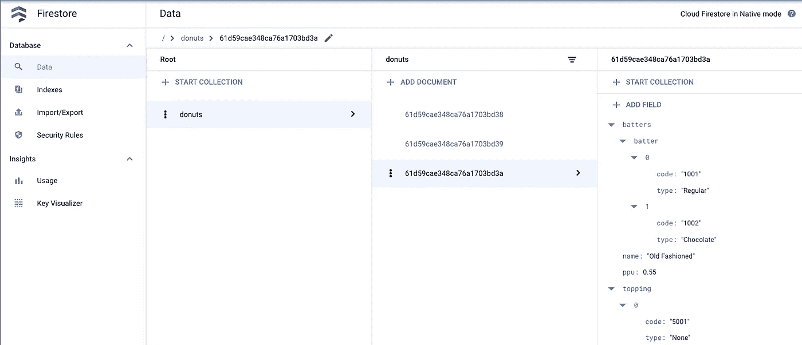

# 将集合从 MongoDB 迁移到云 Firestore

> 原文：<https://medium.com/google-cloud/migrating-collections-from-mongodb-to-cloud-firestore-dfeff15f1c8?source=collection_archive---------0----------------------->


图片来源:谷歌 [Firestore Logo](https://www.gcppodcast.com/images/icons/firestore.png) ，Mongo [MongoDB logo](https://assets-global.website-files.com/6130fa1501794e37c21867cf/6191a3901b4f74718ba3916a_613294646e81b85ff5c7a1ef_MongoDB.svg)

# 介绍

Cloud Firestore 是一个灵活的、可扩展的、云托管的 NoSQL 数据库，用于 Google Cloud 的移动、web 和服务器开发。Cloud Firestore 还提供与其他 Firebase 和谷歌云产品的无缝集成，包括云功能。Firestore 将数据存储为组织成集合的文档。借助 Cloud Firestore，您可以获得自动多区域数据复制、强大的一致性保证、原子批处理操作和真实事务支持。开发人员选择 Firestore 用于需要即时数据并使用实时监听器在客户端应用程序之间自动同步的客户端应用程序。

本文解释了如何通过三个简单的步骤将集合从 MongoDB 迁移到 Firestore。如果您想尝试这些步骤，这个存储库中提供了示例文件。

# 先决条件

1.  要迁移的源数据所在的 MongoDB 数据库
2.  Mongo Shell 与 MongoDB 进行交互
3.  安装 [Mongo 数据库工具](https://docs.mongodb.com/database-tools/installation/installation-linux/)特别是你将需要 mongoexport
4.  安装 [jq](https://stedolan.github.io/jq/) 处理 JSON 数据
5.  安装 nodejs 和[firestore-export-import](https://www.npmjs.com/package/firestore-export-import)NPM 包
6.  要导入数据的目标云 Firestore。添加一个 Firebase 服务帐户并获取服务帐户密钥，如这里的[所述](https://firebase.google.com/docs/admin/setup#initialize-sdk)。这个密钥是一个 JSON 文件，包含以下数据，包括您的私钥，以便您可以与 Firestore DB 对话。

```
{
  "type": "",
  "project_id": "",
  "private_key_id": "",
  "private_key": "",
  "client_email": "",
  "client_id": "",
  "auth_uri": "",
  "token_uri": "",
  "auth_provider_x509_cert_url": "",
  "client_x509_cert_url": ""
}
```

# 迁移是如何进行的？

我们将通过一个例子来理解这一点。

假设您在 MongoDB 中将一个 JSON 作为一个集合存储。

```
[
	{
		"type": "donut",
		"name": "Cake",
		"ppu": 0.55,
		"batters":
			{
				"batter":
					[
						{ "code": "1001", "type": "Regular" },
						{ "code": "1002", "type": "Chocolate" },
						{ "code": "1003", "type": "Blueberry" },
						{ "code": "1004", "type": "Devil's Food" }
					]
			},
		"topping":
			[
				{ "code": "5001", "type": "None" },
				{ "code": "5002", "type": "Glazed" },
				{ "code": "5005", "type": "Sugar", "unhealthy": true  },
				{ "code": "5007", "type": "Powdered Sugar", "unhealthy": true },
				{ "code": "5006", "type": "Chocolate with Sprinkles" },
				{ "code": "5003", "type": "Chocolate" },
				{ "code": "5004", "type": "Maple" }
			]
	},
...
]
```

> **注意**:如果您想亲自尝试，可以将这些数据作为`donuts`集合添加到您的 MongoDB 中。数据在[这里](https://raw.githubusercontent.com/VeerMuchandi/mongotofirestore/main/donuts.json)可用。`mongoimport --uri $MONGODB_URI --collection donuts --type json donuts.json --jsonArray.`

MongoDB 通过为集合中的每个对象分配一个 ObjectId 来存储这些数据，如下所示

```
> db.donuts.find();
{ "_id" : ObjectId("61d59cae348ca76a1703bd38"), "type" : "donut", "name" : "Raised", "ppu" : 
0.55, "batters" : { "batter" : [ { "code" : "1001", "type" : "Regular" } ] }, "topping" : [ {
 "code" : "5001", "type" : "None" }, { "code" : "5002", "type" : "Glazed" }, { "code" : "5005
", "type" : "Sugar", "unhealthy" : true }, { "code" : "5003", "type" : "Chocolate" }, { "code
" : "5004", "type" : "Maple" } ] }
....
....
```

Firestore 需要不同格式的数据，如下所示。

```
{
  "61d59cae348ca76a1703bd38": {
    "ppu": 0.55,
    "topping": [
      {
        "code": "5001",
        "type": "None"
      },
      {
        "type": "Glazed",
        "code": "5002"
      },
      {
        "type": "Sugar",
        "code": "5005",
        "unhealthy": true
      },
      {
        "type": "Chocolate",
        "code": "5003"
      },
      {
        "code": "5004",
        "type": "Maple"
      }
    ],
    "name": "Raised",
    "type": "donut",
    "batters": {
      "batter": [
        {
          "code": "1001",
          "type": "Regular"
        }
      ]
    },
    "__collections__": {}
  },
  ....
```

当您将数据从 MongoDB 迁移到 Firestore 时，我们需要在推送到目标之前将数据格式转换为与 Firestore 兼容的格式。这里解释的过程假设您希望保留来自源 MongoDB 的对象 id，作为引用目标 Firestore 数据库集合中的文档的 id。

这些步骤是:

1.  将来自源 MongoDB 的集合导出为 JSON
2.  转换数据格式
3.  将集合导入目标云 Firestore

# 从源 MongoDB 导出集合

*   设置 MONGODB_URI 环境变量

```
export MONGODB_URI=mongodb://IPADDRESS:27017/test
```

*   将`donuts`集合导出到一个 JSON 数组

```
mongoexport --uri=$MONGODB_URI --collection=donuts -o donuts_mongo_export.json --jsonArray
```

结果文件应该类似于[这个](https://github.com/VeerMuchandi/mongotofirestore/blob/main/donuts_mongo_export.json)。

# 转换数据格式

*   使用 jq 转换数据格式以与 Firestore 兼容

```
jq 'map( {(._id."$oid") : . }) | [.[]| map_values(del(.__v, ._id))]| add' donuts_mongo_export.json > donuts_firestore_import.json
```

这种转换完成了以下工作:

*   将 ObjectId 指定为键，将内容指定为数据
*   删除 _id 和 __v
*   将数组中的对象合并成一个对象

最终转换后的文件应该类似于[这个](https://github.com/VeerMuchandi/mongotofirestore/blob/main/donuts_firestore_import.json)。

# 将收藏导入 target Firestore

*   使用`firestore-import`将转换后的数据上传到云 Firestore。在这一步中，您将需要[服务帐户密钥 json](https://firebase.google.com/docs/admin/setup#initialize-sdk) 文件。

```
firestore-import -a <<PathToKey.json>> -b donuts_firestore_import.json —nodePath donuts -y
```

导入后，数据将显示在 Firestore 控制台上。



恭喜你！！您已经学会了将集合从 MongoDB 迁移到 Cloud Firestore。希望这篇简短的教程对你有所帮助。