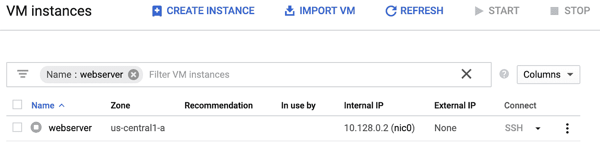

# 使用 Migrate for Anthos 从计算引擎迁移到 Kubernetes 引擎

> 原文：<https://medium.com/google-cloud/migrating-from-compute-engine-to-kubernetes-engine-with-migrate-for-anthos-b6fcc5ffb2fa?source=collection_archive---------0----------------------->

编辑:这里有一个[新的 codelab](https://codelabs.developers.google.com/codelabs/compute-engine-migrate-for-anthos) 涵盖了这个和下一篇博文！

手动将现有应用程序重写到 Kubernetes 并不总是可行的。这就是 Migrate for Anthos 可以提供帮助的地方，它可以使您现有的应用程序现代化，并让它们在 Kubernetes 中运行。**你甚至不需要运行 Anthos，只需谷歌 Kubernetes 引擎！**

让我们看一个例子，将一个计算引擎实例迁移到运行 Migrate for Anthos 的 Kubernetes 引擎集群，从基础开始。在此之后，我们将看看更复杂的例子，如从 VMWare 或其他云迁移到 Kubernetes 引擎。在这篇文章中，我们将讨论您的环境的准备工作和要求，如何将计算引擎实例迁移到一个容器中并将其部署在 Kubernetes 引擎上，并验证迁移是否有效。

# 做好准备

首先，我们需要确保我们已经满足了[的先决条件](https://cloud.google.com/migrate/anthos/docs/gce-to-gke-prerequisites)。基本上，我们的计算实例需要运行受[支持的操作系统](https://cloud.google.com/migrate/anthos/docs/compatible-os-versions)。对于我们的例子，我们将坚持使用 Ubuntu Server 16.04 LTS 实例。这是我们准备迁移的实例。


当你读到这里的时候，谁知道那个 IP 会指向什么。不要随便输入 IP 地址！

这是一个非常简单的“Hello world”服务器，默认安装了 nginx。您可以按照[快速入门指南](https://cloud.google.com/compute/docs/quickstart-linux)快速设置新实例；如果您想在部署时测试服务器，只需确保使用支持的操作系统并允许 http 流量。


你好网络服务器

## 创建 Kubernetes 集群

我们还需要一个 Kubernetes 集群来进行迁移。Migrate for Anthos 应用程序也可以部署到现有集群中，但这次我们来看看如何快速设置一个集群。我们可以很快创建一个相当默认的集群，但是如果你想了解更多细节，这里有文档[。为了让事情变得更简单，我们可以使用](https://cloud.google.com/migrate/anthos/docs/configuring-a-cluster)[云外壳](https://cloud.google.com/shell/)来运行 gcloud 命令，而不需要设置自定义环境。下面是我们需要运行的命令的结构。

```
gcloud container --project **<project-id>** \
clusters create **<gke-cluster-name>** --zone **<gcp-zone>** \
--username "admin" \
--machine-type "**<machine-type>**" \
--image-type "UBUNTU" \
--num-nodes **<number-of-nodes>** \
--enable-stackdriver-kubernetes \
--tags **<network-tags>**
```

> 您可以使用- cluster-version 来选择 Kubernetes 的特定版本，但是 1.13 之前的版本[不被支持](https://cloud.google.com/migrate/anthos/docs/supported-os-versions#supported_kubernetes_node_versions)。

这是一个很大的命令，所以让我们逐行分解它:

```
gcloud container --project **<project-id>** \
clusters create **<gke-cluster-name>** --zone **<gcp-zone>** \
```

在容器 API 内部，我们将指定项目并创建一个具有我们提供的名称的集群，以及我们在其中创建集群的区域。也有可能[创建一个区域集群](https://cloud.google.com/kubernetes-engine/docs/concepts/regional-clusters)，但是在这个例子中我们将保持事情简单。

```
--username “admin” \
```

在这里，我们为集群身份验证指定默认用户名。

```
--machine-type “**<machine-type>**” \
```

指定的机器类型将用于 Kubernetes 创建的节点。根据应用程序的不同，可能需要不同类型的机器，但我们可以坚持“n1-standard-4 ”,以确保我们有足够的空间来运行我们的工作负载以及 Migrate for Anthos 附带的附加服务单元。

```
--image-type “UBUNTU” \
```

这让我们可以选择节点的基本操作系统。我们将坚持使用 Ubuntu 作为我们的节点，因为它是完全兼容的节点操作系统之一。

```
--num-nodes **<number-of-nodes>** \
```

这是我们希望集群处理的节点数量。我们将保持简单，现在只创建一个节点。

```
--enable-stackdriver-kubernetes \
```

这个标志支持通过 Stackdriver 和 Kubernetes 集成来记录和监控指标。

> *在 Kubernetes 引擎 1.14 中，这取代了以前的日志和监控选项。你可以在这里阅读更多关于 Kubernetes 引擎的* [*Stackdriver。*](https://cloud.google.com/monitoring/kubernetes-engine/)

```
--tags **<network-tags>**
```

标签可以作为逗号分隔的标签列表提供，以应用于每个节点。如果我们设置任何防火墙规则，标记我们的节点将让我们锁定它们。

如果您正在跟进，您可以更改这些值来帮助匹配您的场景。下面是我们将在示例中运行的命令:

```
gcloud beta container --project anthos-migrate-257523 \
clusters create webserver-cluster --zone us-central1-a \
--username "admin" --cluster-version 1.13 \
--machine-type "n1-standard-4" \
--image-type "UBUNTU" \
--num-nodes 1 \
--enable-stackdriver-kubernetes
--tags webserver-cluster
```

> 如果您在一个新项目中，您可能需要在运行这个命令之前启用 Kubernetes API，例如通过访问控制台中的 Kubernetes 引擎页面。

现在我们已经运行了该命令，我们可以看到我们的集群已经启动并在控制台中运行。


有了这个更大的节点，我们可以运行 webserver 应用程序的多个实例

因为我们正在使用 Migrate for Anthos，所以我们还需要使用 Migrate for Anthos 应用程序来准备集群。当我们将 web 服务器转换为容器化的应用程序时，我们将围绕虚拟机的磁盘快照创建一个容器。我们将在以后的博客中对此进行深入探讨，但现在，让我们通过 Google Cloud Marketplace 安装 Migrate for Anthos。

## 为 Anthos 部署迁移


这是任何固定项目下方左侧导航的第一个选项

如果你不熟悉这个市场，它是创建各种解决方案的一站式商店。您可以在这里快速部署 Wordpress 实例、LAMP stack 服务器、Redis 数据库等等。虽然 marketplace 可以部署在任何地方，从单个计算引擎实例到整个基础设施工具群，但这也是向我们的 Kubernetes 集群添加一些配置的快捷方式。搜索“Migrate for Anthos ”,然后在下一个屏幕上单击“配置”开始。


将来，我们会尝试更多这样的领域

在这里，您可以选择一个集群进行部署。因为我们刚刚经历了设置一个的所有麻烦，所以让我们选择我们的 webserver-cluster 并暂时将其他字段保留为缺省值。完成后，我们可以在集群中看到一些额外的卷和服务。


我们的 webserver 应用程序不在这里，但我们将在下一步中这样做

# 将虚拟机迁移到新容器

现在我们已经有了 Kubernetes 集群和计算实例，我们可以开始实际的迁移过程了。简而言之，我们将使用 Migrate for Anthos 来创建一个 Kubernetes 部署，该部署使用实例磁盘的克隆。让我们回到我们方便的云 Shell，确保我们可以生成部署实例所需的 YAML 文件。

Cloud Shell 已经包含了 pyyaml，但是如果您需要它，只需运行以下命令:

```
pip3 install --user pyyaml
```

然后我们需要停止实例，因为我们需要克隆磁盘。同样，一个简单的 gcloud 命令可以为我们解决这个问题:

```
gcloud compute instances stop **<instance-id> --**zone **<gcp-zone>**
```

或者以我们的例子为例:

```
gcloud compute instances stop webserver --zone us-central1-a
```

因为这只是一个例子，所以我们很容易停止服务器。根据您环境中运行的内容和您的业务需求，这可能需要进行大量规划和安排维护窗口，以确保正确处理停机时间。



这很像第一个截图，但是实例被停止了

实例停止后，我们可以使用这个 Migrate for Anthos 脚本安全地克隆磁盘。下面是我们实现这一点的便捷命令:

```
python3 /google/migrate/anthos/gce-to-gke/clone_vm_disks.py \
-p **<project-id>** \
-z **<instance-gcp-zone>** \
-T **<cluster-gcp-zone>** \
-i **<instance-id>** \
-A **<workload-name>** \
-o **<yaml-filename>**
```

让我们再分解一下:

```
python3 /google/migrate/anthos/gce-to-gke/clone_vm_disks.py \
```

这是运行 Migrate for Anthos clone 脚本，我们将使用所需的参数对其进行配置。结果输出将是一个 YAML 文件，我们可以应用到我们的集群。

```
-p **<project-id>** \
```

指定我们正在进行的项目。

```
-z **<instance-gcp-zone>** \
```

这是我们停止的计算实例所在的区域。

```
-T **<cluster-gcp-zone>** \
```

这是我们的 Kubernetes 引擎集群所在的目标区域。对于我们的示例，我们将计算实例和 Kubernetes 集群放在同一个区域中。

```
-i **<instance-id>** \
```

这里，我们为停止的计算实例提供标识符；与我们在运行命令停止实例时提供的相同。

```
-A **<workload-name>** \
```

我们将指定我们希望应用程序启动时使用的名称。我们将把它命名为“webserver-container ”,这样我们就知道它不同于 webserver。

```
-o **<yaml-filename>**
```

这是将要生成的 YAML 文件的名称，我们将在下一步中用到它。

因此，对于我们的示例，下面是我们将运行的命令:

```
python3 /google/migrate/anthos/gce-to-gke/clone_vm_disks.py \
-p anthos-migrate-257523 \
-z us-central1-a \
-T us-central1-a \
-i webserver \
-A webserver-container \
-o containerized-webserver.yaml
```


成功的集装箱化

这样，我们现在有了一个从我们的计算实例克隆的新磁盘，以及一个描述 Kubernetes 的 [StatefulSet](https://kubernetes.io/docs/concepts/workloads/controllers/statefulset/) 的 YAML 文件。从这里开始，我们的下一步是将它应用到我们的集群中，这可以很容易地用 kubectl 来完成。

```
kubectl apply -f **<yaml-filename>**
```

或者以我们的例子为例:

```
kubectl apply -f containerized-webserver.yaml
```

至此，我们的计算引擎实例在 Kubernetes 引擎中启动并运行！

# 确保它有效

转到 Kubernetes 引擎中的 workloads 页面，webserver-container 被列出，其状态为 OK！


绿色复选标记越多越好

但是，通过实际操作，可能更容易看出 app 是否真的在运行。因为这只是一个简单的 web 服务器，所以我们需要做的就是用一个负载平衡器来公开它。这里有一个快速 YAML 文件，为我们提供一个 IP 来检查我们的应用程序:

```
apiVersion: v1
kind: Service
metadata:
  name: webserver-container
spec:
  type: LoadBalancer
  selector:
    app: webserver-container
  ports:
  - protocol: TCP
    port: 80
    targetPort: 80
```

将上述代码保存为文件，并应用于:

```
kubectl apply -f **<yaml-filename>**
```

创建服务后，您可以在 Kubernetes 引擎页面中找到它和 IP，或者通过运行:

```
kubectl get services
```


记住我之前说的，不要去随便点击 IP！

现在我们知道了负载平衡器 IP，我们可以在浏览器中访问它，并看到 web 服务器确实启动并运行了。


它看起来一样，因为它是！

## 访问您的实例

使用虚拟机的一个便利之处是能够 SSH 到虚拟机中。幸运的是，在使用 Migrate for Anthos 时，我们没有丢失这一点。为了访问它，我们将使用 kubectl exec。首先，我们需要 pod 的名称。通过键入以下快速命令:

```
kubectl describe pods | grep Name
```

我们可以看到我们的豆荚的名字是:

```
Name: webserver-container-0
```

有了这个 pod 名称，我们只需键入以下命令，就可以在我们的云 Shell 中打开我们的连接:

```
kubectl exec -it **<pod-name>** — /bin/bash
```

在我们的案例中:

```
kubectl exec -it webserver-container-0 — /bin/bash
```

# 包扎

需要注意的一点是，这个应用是我们在一个容器内运行的整个虚拟机。然而，这也是容器中经常不需要的大量 VM 膨胀的原因。


容器中的进程比您预期的要多得多

这就是为什么它可能被称为“系统容器”而不是“应用程序容器”,也是为什么它不能完全取代现代化。Migrate for Anthos 是一个很好的方法，可以帮助您整合和现代化一些遗留应用程序，并开始一个更大的现代化计划。根据你的计划，下一步可能是开始将你的应用拆分成微服务或更小的容器。

此外，如果您需要对应用程序进行更新，您会希望使用任何现有的构建过程来修改运行新容器的应用程序。例如，您仍然可以运行 apt-get update，就像您的应用程序在虚拟机上运行一样。

随着我们的计算引擎应用程序迁移到 Kubernetes 引擎，我们的下一篇博文将更多地讨论[在 Kubernetes 引擎](/google-cloud/monitoring-workloads-migrated-with-migrate-for-anthos-4c5542573767)中监控您的应用程序。敬请期待！