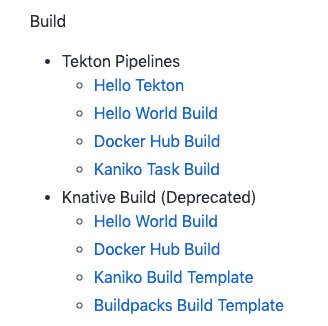

# 从 Knative Build 迁移到 Tekton 管道

> 原文：<https://medium.com/google-cloud/migrating-from-knative-build-to-tekton-pipelines-68fc6de14373?source=collection_archive---------0----------------------->


# Knative 0.8.0 和 Build Deprecation

几周前，Knative 0.8.0 发布了一系列修正和改进。0.8.0 中最大的变化之一是根据[文档](https://knative.dev/docs/build/)，Knative Build 现在被弃用:


Knative 安装文档也只包括 Knative 服务和事件，而没有提到 Build:

```
kubectl apply 
-f https://github.com/knative/serving/releases/download/v0.8.0/serving.yaml \
-f https://github.com/knative/eventing/releases/download/v0.8.0/release.yaml \
-f https://github.com/knative/serving/releases/download/v0.8.0/monitoring.yaml
```

很高兴知道，但没有解释为什么 Knative Build 被弃用，也没有任何关于什么是替代品的指导，如果有的话。经过一点点研究，我有更多关于弃用的信息，也有一个迁移路径，我想在这篇文章中分享。

有一个 Knative 问题( [614](https://github.com/knative/build/issues/614) )有更多的细节，但基本上，它已经决定，建立和推动一个服务的形象不应该是 Knative 的核心职责之一。

相反，Knative 用户可以依靠许多其他更好的工具。其中一个工具叫做 [Tekton 管道](https://github.com/tektoncd/pipeline)。受 Knative Build 的启发，Tekton Pipelines 项目为声明 CI/CD 风格的管道提供了 Kubernetes 风格的资源。它做 Knative Build 做的所有事情，甚至更多。

# 你好泰克顿管道公司

在 [Tekton Pipelines](https://github.com/tektoncd/pipeline) 中，你可以创建简单的一次性任务或更复杂的 CI/CD 管道。Tekton 管道有 4 个主要原语:

*   [任务](https://github.com/tektoncd/pipeline/blob/master/docs/tasks.md)定义了需要执行一个或多个步骤的工作。
*   [PipelineResources](https://github.com/tektoncd/pipeline/blob/master/docs/resources.md) 定义了可以传入和传出任务的工件。
*   [TaskRun](https://github.com/tektoncd/pipeline/blob/master/docs/taskruns.md) 使用提供的资源运行您定义的任务。
*   [流水线](https://github.com/tektoncd/pipeline/blob/master/docs/pipelines.md)定义了要按顺序执行的任务列表。

在使用 Tekton 管道之前，您需要将其安装在您的 Kubernetes 集群中。详细的[说明](https://github.com/tektoncd/pipeline/blob/master/docs/install.md)在这里，但是很简单:

```
kubectl apply -f [https://storage.googleapis.com/tekton-releases/latest/release.yaml](https://storage.googleapis.com/tekton-releases/latest/release.yaml)
```

安装后，您可以检查 Tekton pods:

# Knative Build ==> Tekton 管道

有关于从 Knative Build 迁移到 Tekton 的基本文档。简而言之，这些是 Knative Build 构造的 Tekton 等价物:


此外， [Tekton Catalog](https://github.com/tektoncd/catalog) 旨在提供一个可重用任务的目录，类似于 Knative BuildTemplate repository 以前所做的。

# 使用 Kaniko 任务构建

作为一个例子，让我们看看如何使用 Tekton 管道构建一个图像并将其推送到 Google 容器注册中心(GCR)。

在 Tekton world 中，您要么从定义您的自定义任务([示例](https://github.com/meteatamel/knative-tutorial/blob/master/docs/12-tekton-helloworldbuild.md#design-the-task))开始，要么重用其他人的任务([示例](https://github.com/meteatamel/knative-tutorial/blob/master/docs/14-tekton-kanikotaskbuild.md#install-kaniko-task))。让我们使用 Tekton 目录上已有的 [Kaniko 任务](https://github.com/tektoncd/catalog/tree/master/kaniko)。

首先，安装 Kaniko 任务并确保它已安装:

```
kubectl apply -f https://raw.githubusercontent.com/tektoncd/catalog/master/kaniko/kaniko.yaml

kubectl get task

NAME     AGE
kaniko   45m
```

其次，定义一个 TaskRun 以使用该任务并提供所需的参数:

```
apiVersion: tekton.dev/v1alpha1
kind: TaskRun
metadata:
  name: build-kaniko-helloworld-gcr
spec:
  taskRef:
    name: kaniko
  inputs:
    resources:
    - name: source
      resourceSpec:
        type: git
        params:
        - name: url
          value: https://github.com/meteatamel/knative-tutorial
    params:
    - name: DOCKERFILE
      value: Dockerfile
    - name: CONTEXT
      value: serving/helloworld/csharp
  outputs:
    resources:
    - name: image
      resourceSpec:
        type: image
        params:
        - name: url
          # Replace {PROJECT_ID} with your GCP Project's ID.
          value: gcr.io/{PROJECT_ID}/helloworld:kaniko-tekton
```

最后，启动 TaskRun 并检查它是否成功:

```
kubectl apply -f taskrun-build-kaniko-helloworld-gcr.yaml

kubectl get taskrun

NAME                          SUCCEEDED
build-kaniko-helloworld-gcr   True
```

此时，您应该看到构建了容器映像并将其推送到 GCR。

希望这篇博文为您提供了从 Knative Build 过渡到 Tekton Pipeliens 所需的基础知识。我也为 0.8.0 版本更新了我的教程。查看更多将 Knative Build 转换为 Tekton 管道的示例:



*原载于 2019 年 8 月 28 日*[*http://meteatamel.wordpress.com*](https://meteatamel.wordpress.com/2019/08/28/migrating-from-knative-build-to-tekton-pipelines/)*。*