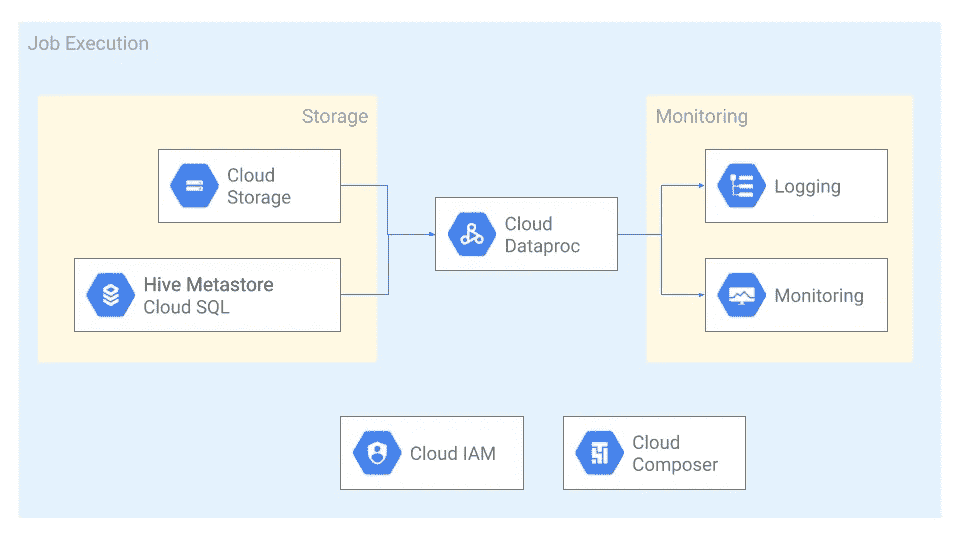

# 将数据处理 Hadoop 工作负载迁移到 GCP

> 原文：<https://medium.com/google-cloud/migrating-hadoop-to-dataproc-43e8da80ba98?source=collection_archive---------1----------------------->

由[阿南特·达姆勒](https://medium.com/u/a6b6f3f74b22?source=post_page-----43e8da80ba98--------------------------------)和[瓦伦·杜莎](https://medium.com/u/928d430b6859?source=post_page-----43e8da80ba98--------------------------------)撰写


花一个不眠之夜让管道在 Hadoop 集群上工作听起来很熟悉，不是吗？数据工程师的角色包括从开发到开发运维的一系列活动。与不断增长的 Hadoop 生态系统一起工作是一项具有挑战性的工作。当你花更多的时间让大象动起来的时候，开发一个管道似乎是比较容易的部分！

现在，您正在考虑将您的基础设施迁移到 Google Cloud，您遇到了 Google Cloud 的托管开源数据和分析处理平台 [Dataproc](https://cloud.google.com/dataproc) 。Dataproc 允许您在云中无缝地运行 Apache Spark 和 Hadoop 作业。这听起来不错，而且你很感兴趣，但是迁移可能是乏味和可怕的…让我们打破它并简化它！

# 创建和配置集群

使用 Dataproc 创建 Hadoop 集群就像发出一个命令一样简单。集群可以使用 Dataproc 提供的[映像版本](https://cloud.google.com/dataproc/docs/concepts/versioning/dataproc-versions)之一，或者基于提供的映像版本之一的[自定义映像](https://cloud.google.com/dataproc/docs/guides/dataproc-images)。一个*镜像版本*是操作系统、大数据组件和谷歌云连接器的一个稳定且受支持的包。

您可以使用最新的映像版本(这是默认版本)，或者[选择一个与您现有平台匹配的映像](https://cloud.google.com/dataproc/docs/concepts/versioning/overview#selecting_versions)。你也可以选择额外的[支持的组件](https://cloud.google.com/dataproc/docs/concepts/components/overview)比如德鲁伊和 Presto。如果您正在使用诸如 [Livy](https://livy.apache.org/) 之类还不可用的组件，您可以利用[初始化操作](https://cloud.google.com/dataproc/docs/concepts/configuring-clusters/init-actions)，它会在集群设置完成后立即在集群的每个节点上运行可执行文件或脚本。

您可以选择创建一个带有一个主节点的标准集群，或者创建一个带有三个主节点的[高可用性](https://cloud.google.com/dataproc/docs/concepts/configuring-clusters/high-availability)集群。高可用性选项非常适合始终在线的长时间运行的集群。如果你想马上开始，启动你的[云外壳](https://console.cloud.google.com/home/dashboard?cloudshell=true)并运行下面的命令:

```
# create a cluster in us-central1
gcloud dataproc clusters create **my-first-cluster** \
--region=**us-central1**
```

# 储存；储备

在您创建了一个集群并向其中添加了任何可选组件之后，您需要解决这个问题。你有很多数据，而且每天都在增加。你如何把它转移到谷歌云？这些[数据传输选项](https://cloud.google.com/solutions/migration-to-google-cloud-transferring-your-large-datasets#what_is_data_transfer)中的一些可以在旅途中指引你。

您可以通过将[持久性磁盘(PD)](https://cloud.google.com/persistent-disk/) 附加到集群中的节点来创建传统的 HDFS 设置。

一个流行和推荐的替代方案是使用 [Google 云存储](https://cloud.google.com/dataproc/docs/concepts/connectors/cloud-storage)作为持久层。因为云存储是一个高度可扩展和持久的存储系统，它提供了非常一致的操作，它减少了 HDFS 中涉及的管理开销。要从 HDFS 切换到云存储，只需将文件路径前缀从 hdfs://更改为 gs://。您还可以使用[表格式](https://cloud.google.com/blog/products/data-analytics/getting-started-with-new-table-formats-on-dataproc)，例如 [Delta Lake](https://delta.io/) 和 [Iceberg](https://iceberg.apache.org/) 用于模式支持、ACID 事务和数据版本控制。[为集群选择合适的存储技术](https://cloud.google.com/blog/products/storage-data-transfer/hdfs-vs-cloud-storage-pros-cons-and-migration-tips)，因为没有一种解决方案适用于所有使用情形。

不管您选择什么样的存储，您都应该通过使用 CloudSQL 上的 [MySQL 作为您的数据库，为您的 Dataproc 集群使用](https://cloud.google.com/sql/docs/mysql) [central Hive Metastore](https://cloud.google.com/solutions/using-apache-hive-on-cloud-dataproc) 。

到时候，考虑迁移到 [BigQuery](https://cloud.google.com/bigquery) ，一个无服务器的 Pb 级数据仓库。为了简化这种迁移，Dataproc 附带了 [BigQuery 连接器](https://cloud.google.com/dataproc/docs/concepts/connectors/bigquery)和 [BigQuery Spark 连接器](https://github.com/GoogleCloudDataproc/spark-bigquery-connector)。

# 数据处理



在 Dataproc 上运行作业的典型架构

在集群准备就绪且数据可访问后，您需要处理和分析数据。您需要运行复杂的管道来连接来自多个来源的数据以生成报告。您可能还需要支持数据分析师，他们使用 Hive、SparkSQL 或 Presto 等组件对数据运行特定的 SQL 查询。

Dataproc 使得使用 [Dataproc API，](https://cloud.google.com/dataproc/docs/guides/submit-job)的 [jobs.submit](https://cloud.google.com/dataproc/docs/reference/rest/v1/projects.regions.jobs/submit) 方法向集群提交作业变得非常简单，而不需要设置 perimeter 实例。它使用中央[身份和访问管理层](https://cloud.google.com/dataproc/docs/concepts/iam/iam)来验证和授权请求，允许您在私有集群上尽可能安全地运行作业。尝试 Cloud Shell 上的命令，在您之前创建的集群上运行一个计算 Pi 值的程序。

```
# Submit a Spark job using Dataproc API
# Outputs: Pi is roughly 3.1419864714198646
gcloud dataproc jobs submit spark \
--cluster **my-first-cluster** --region **us-central1** \
--class org.apache.spark.examples.SparkPi \
--jars file:///usr/lib/spark/examples/jars/spark-examples.jar \
-- 1000
```

对于涉及形成有向无环图(DAG)的多个相互依赖的作业的更复杂的工作负载，您可以使用 [Dataproc 工作流模板](https://cloud.google.com/dataproc/docs/concepts/workflows/overview)。您可以将 Dataproc API 与 [Cloud Composer](https://cloud.google.com/composer) 、Google Cloud 的托管版 [Apache Airflow](https://airflow.apache.org/) 一起使用。

Hive、Presto 和 SparkSQL 引擎通常用于数据分析师的即席查询和提供报告仪表板。[阅读更多关于在您的 Dataproc 集群中使用它们的](/@david.cueva/connecting-your-visualization-software-to-hadoop-on-google-cloud-64b55f536fab)。

# 监控和安全

中央[身份和访问管理层](https://cloud.google.com/dataproc/docs/concepts/iam/iam)支持使用云日志轻松访问作业输出或审计跟踪[。为了管理和监控集群的资源和应用，](https://cloud.google.com/dataproc/docs/guides/logging)[启用 Dataproc 组件网关](https://cloud.google.com/dataproc/docs/concepts/accessing/dataproc-gateways)来帮助安全地访问 Hadoop web 界面。使用[云监控](https://cloud.google.com/dataproc/docs/guides/monitoring)或[云分析](https://cloud.google.com/dataproc/docs/guides/profiling)用于您的高级用例，如健康和性能监控、生成见解或仪表盘。

# 最佳化

既然您已经迁移了数据平台，您希望对其进行优化以降低运营开销和成本。通过使用云存储作为您的存储和外部 Hive Metastore，您已经分离了存储和计算。这使您可以专注于工作负载，而不是集群。再加上 Dataproc、central IAM 和 logging 的 90 秒集群创建时间，您可以按需创建临时集群，一旦您的管道执行完成，这些集群就会被删除。

为了帮助确保安全性和隔离，使用单独的[服务帐户](https://cloud.google.com/dataproc/docs/concepts/configuring-clusters/service-accounts)运行每个集群，并且只能访问作业所需的资源。此服务帐户在监控、审核和调试时也很有帮助。由于工作流之间没有相互依赖关系，因此您可以轻松测试和部署不同版本的 Hadoop 组件和您的服务。由于集群并不总是开启，因此可以节省成本。通过使用[可抢占的实例](https://cloud.google.com/dataproc/docs/concepts/compute/preemptible-vms#how_preemptibles_work_with)来运行您的任务，您可以进一步降低成本，因为它们的价格更低。请记住，不要在与 HDFS 相关的任务中使用它们，因为它们随时可能被抢占。

运行集群时的一个常见开销是调整大小，以处理突发负载，如流处理或即席数据分析查询。Dataproc 提供了[手动缩放](https://cloud.google.com/dataproc/docs/concepts/configuring-clusters/scaling-clusters)和[自动缩放](https://cloud.google.com/dataproc/docs/concepts/configuring-clusters/autoscaling)，使用纱线度量来控制节点的数量。

说够了，我让你自己尝试一下[快速入门](https://cloud.google.com/dataproc/docs/quickstarts)