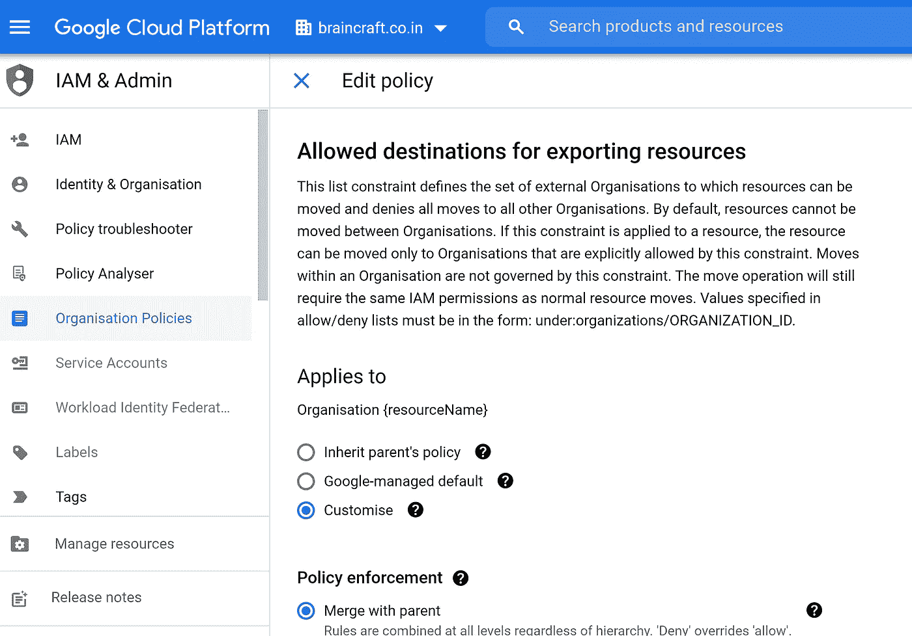
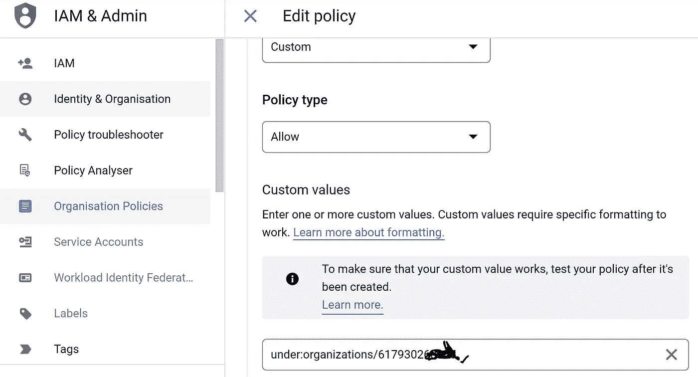
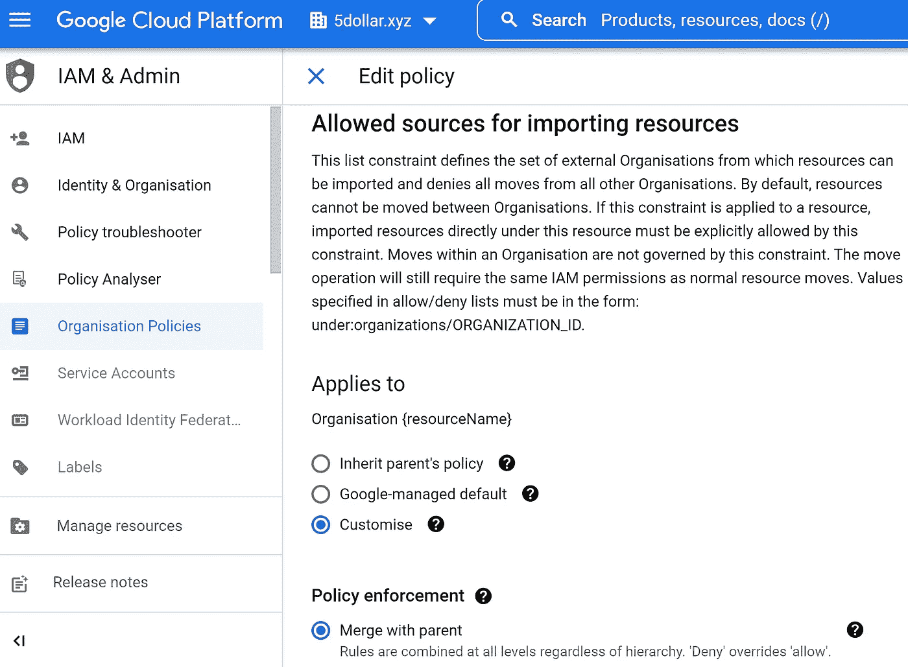
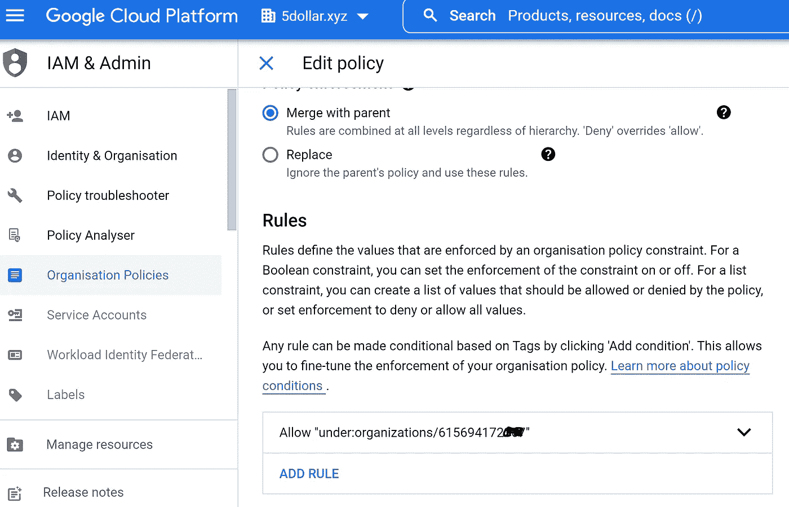
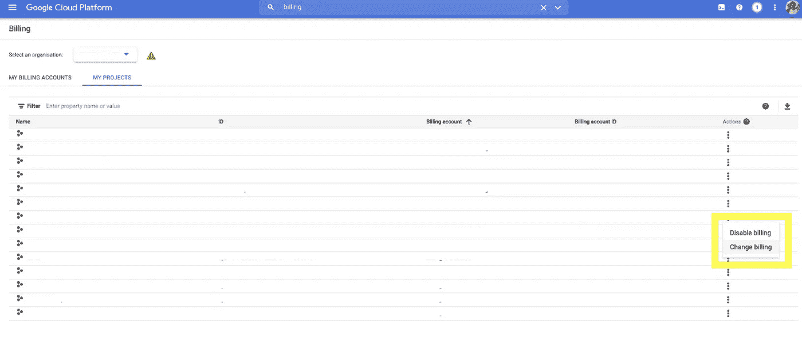
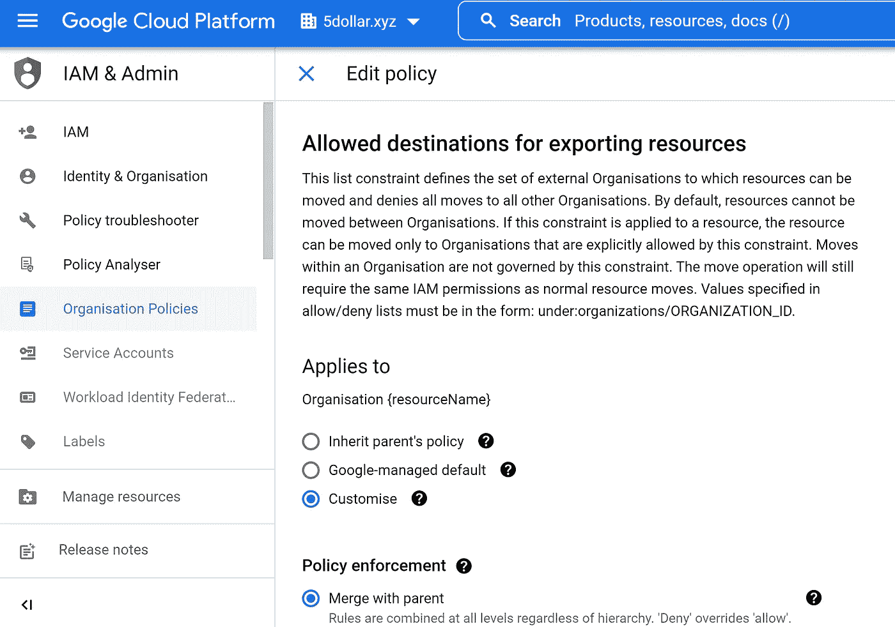
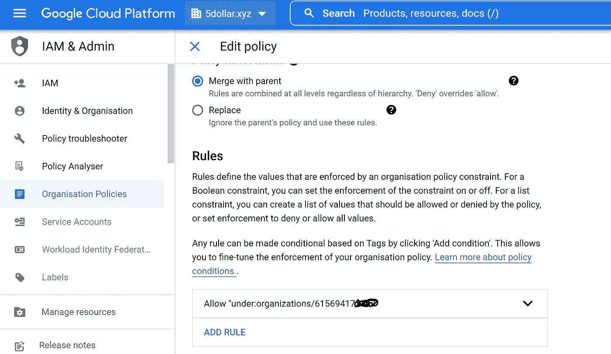
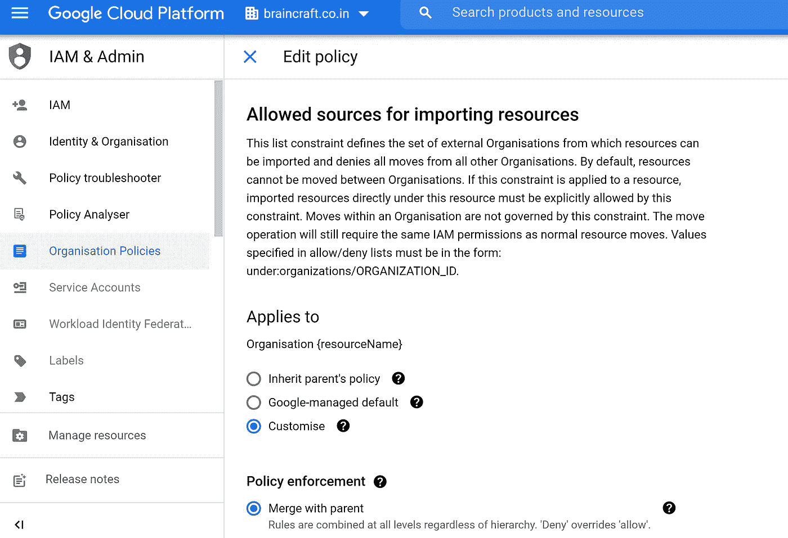
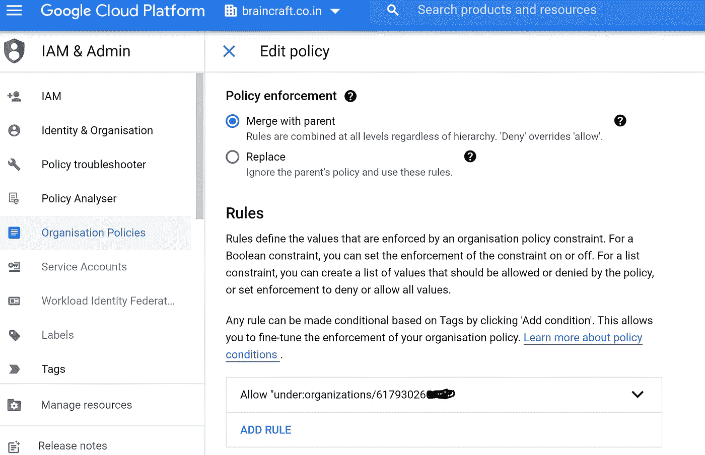

# 在组织之间迁移和回滚 GCP 项目(例如，项目-brain craft-迁移-项目运行组织“brain craft . co . in”&迁移到组织“5Dollar.xyz”)

> 原文：<https://medium.com/google-cloud/migrating-roll-back-gcp-projects-between-organizations-e-g-b68a95537696?source=collection_archive---------3----------------------->

由于收购、法规要求和业务单位之间的分离等原因，您可能需要在组织之间迁移项目:

**在你开始之前，确保你手边有以下东西:**

1.要迁移的项目的项目 ID

2.目标组织的组织标识

3.来源组织的组织标识

【braincraft.co.in】在源组织中分配权限

**1)在源组织的 google 云平台仪表板中，搜索“IAM”。**

**添加委托人或使用现有 IAM(确保您的 Google 帐户被列为贵组织中的委托人),该 IAM 应具有以下权限:**

**1)要移动的项目上的项目 IAM Admin(roles/resource manager . Project IAM Admin)**

**2)项目父资源上的项目移动器(roles/resource manager . Project Mover)**

**3)计费账户管理员**

**4)组织策略管理员**

*****注意:*** *当分配与跨组织迁移相关的权限时，您必须在源组织和目标组织中的同一主电子邮件地址上指定角色。(例如，如果我们在 Source 中使用 Principal 作为“*[*【braincraft@braincraft.co.in*](https://www.blogger.com/blog/post/edit/2647173627063620664/5501854799984928842#)*”，我们需要在指定 ORG-***5 dollar . XYZ***[【braincraft@braincraft.co.in](https://www.blogger.com/blog/post/edit/2647173627063620664/5501854799984928842#)*中使用相同的 IAM principal)。****

*****在目标组织中分配权限(如 5 美元. xyz)*****

***使用与源相同的电子邮件地址(在本例中为[*braincraft@braincraft.co.in*](https://www.blogger.com/blog/post/edit/2647173627063620664/5501854799984928842#)*)创建一个新的委托人，并为他们分配以下角色:****

****1)要移动的项目上的项目 IAM Admin(roles/resource manager . Project IAM Admin)****

****2)项目父资源上的项目移动器(roles/resource manager . Project Mover)****

****3)计费账户管理员****

****4)项目创建者****

****5)组织策略管理员****

****6)如果目标资源是文件夹:目标资源上的项目移动器(roles/resource manager . Project Mover)****

****7)如果目标资源是组织:目标资源上的项目创建者(roles/resource manager . Project Creator)****

****参考 GCP 文档(如未来有变更):[https://cloud . Google . com/resource-manager/docs/project-migration # assign _ permissions](https://www.blogger.com/blog/post/edit/2647173627063620664/5501854799984928842#)****

******在源组织中配置用于导出的组织策略:******

****1)在源组织的云平台仪表板中，搜索“组织策略”。点击标有“组织政策(IAM)”的页面****

****2)在组织策略中，单击'**允许导出资源的目的地'******

********

****单击“自定义”选项，“与父项合并”。然后“添加规则”。对于策略值，选择“自定义”和策略类型“允许”。对于自定义值，请在“组织/ **【目的地 _ 组织标识】'**下输入'**，然后单击“完成”。这将授予将您的项目导出到目标组织的权限。(例如 **5Dollar.xyz 组织 ID)********

********

******在目标组织中配置用于导入的组织策略******

****1)在目标组织的云平台仪表板中，搜索“组织策略”。单击标有“组织政策(IAM)”的页面。****

****2)在目标组织的组织策略中，单击'**允许导入资源的来源**'。****

****3)单击“策略详细信息”旁边的“编辑”按钮****

********

****单击“自定义”选项，“与父项合并”。然后“添加规则”。对于策略值，选择“自定义”和策略类型“允许”。对于自定义值，输入“在:组织/来源 _ 组织 _ID 下”(例如**braincraft.co.in**组织 ID **)******

********

******更改项目的计费账户******

****云计费帐户可以跨组织使用。将项目从一个组织转移到另一个组织不会影响计费，费用将继续从旧的计费帐户支付。但是，组织迁移通常还包括迁移到新的计费帐户的要求。****

****要更改现有项目的计费帐户，您必须拥有项目的`roles/owner`角色和目标计费帐户的`roles/billing.admin`角色。要更改计费帐户:****

****1.进入云控制台的**计费页面**。
[进入计费页面](https://console.cloud.google.com/billing)****

****2.单击您要更改的帐单帐户名称。****

****3.在**链接到该计费账户的项目**下，找到要移动的项目名称，然后点击右侧的菜单按钮。****

****4.点击**更改计费**，然后选择新的计费账户。****

****5.点击**设置账户**。****

****注意:交易历史记录中尚未报告的已发生费用将计入之前的账单账户。这可能包括项目移动前两天的费用****

****如果您被授予相关权限，您应该能够看到目标组织的帐单帐户。选择目标组织的计费帐户，然后单击“设置帐户”****

********

******使用云 SDK 或激活源组织的云外壳，在 IAM 主体下执行迁移，IAM 主体已被提供所需的角色/权限(如上):******

****注:以下说明仅适用于将项目从一个组织迁移到另一个组织。如果要迁移的项目与组织无关，请遵循不同的流程:****

****1) gcloud beta 项目移动 PROJECT _ ID-ORGANIZATION ORGANIZATION _ ID****

****或者****

****2) gcloud beta 项目移动 PROJECT_ID —文件夹 FOLDER_ID****

****运行该命令后，您应该会发现项目现在位于目标组织的资源层次结构中的指定位置(等待 2 分钟)。迁移现已完成****

******注:******

*******其中:*******

****- *PROJECT_ID 是您希望迁移的项目的 ID 或编号。*****

****- *ORGANIZATION_ID 是您要将项目移动到的目标组织的标识。您只能指定一个目标，组织或文件夹。*****

****- *FOLDER_ID 是目标组织的 ID。要将项目移动到的文件夹。您只能指定一个目标，文件夹或组织*****

# ******在移动您的项目之前，您应该考虑创建一个迁移计划，以确定您的组织和您要移动的项目的准备情况:******

****- *在来源项目(非组织层)应用的任何策略也将在目标组织中继承。例如，如果您在源项目级别拒绝外部/公共 IP 地址，则相同的策略将在迁移后应用于目标组织。*****

****- *在源组织级别应用的任何策略(例如，组织策略)在目标组织的迁移后将不适用。*****

******简而言之:**虽然迁移不会对项目进行直接的配置更改，但资源层次结构的更改可能会对项目的功能及其运行服务产生影响。在迁移过程中，继承的策略(如身份和访问管理或组织策略)不会随项目移动，只有直接附加到资源的策略和服务帐户才会移动。这可能会在迁移完成后导致意外行为****

******因此，确保仔细研究源组织策略&IAM&在迁移之前，在目标组织中设计类似的结构。******

*   ****在迁移阶段，最终用户可以继续访问项目，不会出现任何问题。(不需要停机)****
*   ****在我们开始迁移之前拥有项目权限的最终用户，在项目迁移到目标组织后将保持相同的权限****
*   ****项目中已定义的云 IAM 策略和服务帐户将随项目一起迁移****

# ******回滚一次迁移******

****如果您错误地移动了项目，您可以通过再次执行移动来回滚操作，将旧的源作为新的目标，并将旧的目标作为新的源。您必须拥有必要的 IAM 权限和强制实施的组织策略，以允许这种全新的迁移。****

****例如，现在源组织是 5 美元. xyz，目标组织是 braincraft.co.in****

******在源组织中配置用于导出的组织策略:******

****1)在源组织的云平台仪表板中，搜索“组织策略”。点击标有“组织政策(IAM)”的页面****

****2)在组织策略中，单击'**允许导出资源的目的地'******

********

****单击“自定义”选项，“与父项合并”。然后“添加规则”。对于策略值，选择“自定义”和策略类型“允许”。对于自定义值，请在“组织/ **【目的地 _ 组织标识】'**下输入'**，然后单击“完成”。这将授予将您的项目导出到目标组织的权限。(例如**braincraft.co.in 组织 ID)。********

********

******在目标组织中配置用于导入的组织策略******

****1)在目标组织的云平台仪表板中，搜索“组织策略”。单击标有“组织政策(IAM)”的页面。****

****2)在目标组织的组织策略中，单击'**允许导入资源的来源**'。****

****3)单击“策略详细信息”旁边的“编辑”按钮****

********

****单击“自定义”选项，“与父项合并”。然后“添加规则”。对于策略值，选择“自定义”和策略类型“允许”。对于自定义值，输入“在:organizations/SOURCE _ ORGANIZATION _ ID 下”(例如**5 dollar . XYZ**ORGANIZATION ID**)******

********

****迁移成功后，从源组织中删除 IAM 主体文件夹并清理环境****

> ******注意:**您不能迁移与共享 VPC 关联的项目。在这种情况下，您必须将服务项目与宿主项目分离，然后进行迁移。****