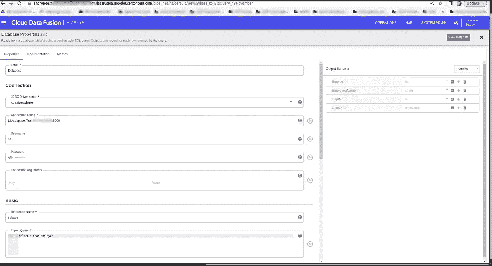

# 使用云数据融合将 Sybase 表迁移到 Google BigQuery

> 原文：<https://medium.com/google-cloud/migrating-sybase-tables-to-google-bigquery-using-cloud-datafusion-41dae3042a35?source=collection_archive---------4----------------------->

Sybase 现在被称为 SAP Adaptive Server Enterprise(ASE ),被认为是流行的、前瞻性的关系数据库管理系统之一。除了高可用性和数据安全性等其他特性之外，它主要得益于其事务处理速度。

在 SAP 收购 Sybase 之后，它的流行似乎注定要失败，因为 SAP 似乎给了它最喜欢的 HANA 数据库更多的推动力，让 Sybase 用户陷入困境。

从 SAP 发布的信息来看，Sybase 似乎偏离了 SAP 未来产品路线图的关键组成部分。

通过云数据融合将 Sybase 表迁移到 GCP BigQuery，企业可以轻松获得 BigQuery 带来的好处，如无服务器架构和可伸缩性。然后可以使用流行的商业智能工具，如 Looker、Tableau 和 Data Studio，提供无缝的数据洞察。

**上下文:**

今天，我们将看看如何使用 Google Cloud 提供的云数据融合数据集成服务将 Sybase 表迁移到 GCP BigQuery。

**先决条件:**

我们在这里考虑，我们已经在 GCP 计算引擎 linux 实例上安装了一个 Sybase 数据库服务器。

转到 Sybase 安装目录并检查服务器名称

通过运行以下命令设置环境:

*。。/SYBASE.sh*

现在，切换到安装目录。在我的例子中,/opt/sap/ASE-16_0/install 是运行文件路径，并在 Linux 中运行以下命令

*startserver -f RUN_TEST*

注意:(在这种情况下，在安装期间，我将服务器名指定为主服务器的 TEST 和备份服务器的 TEST_BS)。

同样，也可以通过以下命令启动备份服务器

*startserver -f RUN_TEST_BS*

之后，运行以下两个命令来连接到 Sybase 服务器

*未设置郎*

*isql64 -U sa -STEST*

这将要求我们输入在 Sybase 安装过程中设置的密码。输入密码以连接到服务器。

我有一个已经创建的员工表，我们可以查看如下

员工表描述

雇员数据库表记录示例

创建相应的 BigQuery 表模式，在 BigQuery 模式定义中使用适当的数据类型映射。

BigQuery 表架构创建

作为创建数据融合管道的下一步，我们将为数据融合添加一个 SYBASE JDBC 驱动程序(假设我们已经创建了一个 GCP 数据融合实例)。

Sybase 驱动程序上载

**数据库插件:**为了建立连接，我们使用数据库作为源插件。

**数据库插件属性:**我们现在需要在数据库插件中给出连接设置属性，这需要 JDBC 连接字符串、Sybase 服务器凭证&我们希望通过此管道导入的表的导入查询。

Sybase 数据库插件属性

**BigQuery 插件:**由于 Sybase 表迁移的目的地是 BigQuery 仓库，我们将从 Sink 菜单栏中选择 BigQuery 插件。

BigQuery 插件

**BigQuery 插件属性:**在 BigQuery 插件属性中，我们需要指定项目 ID，即我们要将表迁移到的数据集。

BigQuery 插件属性

从 Sybase 到 DataFusion 的最终管道如下所示

成功运行后的管道

在本文中，我们简要介绍了如何建立一个低代码管道来将 Sybase 数据库表迁移到无服务器且经济高效的 GCP 数据仓库 BigQuery。