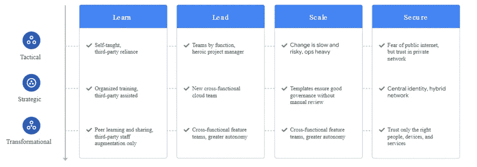

# 将工作负载迁移到 GCP:第一部分:规划迁移

> 原文：<https://medium.com/google-cloud/migrating-workloads-to-gcp-part-i-planning-migrations-ae8e301d207b?source=collection_archive---------0----------------------->

迁移总是充满挑战。我从事过各种迁移工作，从传统到传统，从传统到大数据，从过去几年开始，我一直从事向云平台的迁移工作。基于我过去的经验，我想出了一系列关于迁移的博客。希望这个博客系列将有助于规划、设计和实现将您的应用程序/工作负载迁移到 Google cloud 的过程。

让我们从本系列的第一篇博客开始，了解更多关于“规划迁移”到 Google Cloud 的信息。

将工作负载迁移到 GCP 可能包括以下任何场景

1.GCP 内部

2.GCP 的另一朵云

3.私有云/托管到 GCP

现在，开始规划—了解规划的步骤/阶段，并获取迁移所需的详细信息/输入。

a.定义环境—环境的开始和结束状态

a.在这种情况下，目标/最终状态将是 GCP 环境。

b.定义、开始状态—考虑评估现有的应用程序设置、基础架构、安全性、网络、平台虚拟化(如果有)、支持应用程序/服务器的任何其他资源等。

b.定义应用程序/工作负载或流程的类型

a.在 infra/env 之上运行的不同类型的应用程序有哪些？

b.有多少负载同时运行？

c.这些应用程序之间的相互依赖关系是什么？

d.有哪些用于应用的开源？

e.在其上运行的应用程序处于什么状态？业务关键型？支持？开发中？

c.定义目标–

a.确定要迁移到目标环境(即 GCP)的应用程序

b.根据应用程序之间的相互依赖关系确定应用程序阶段

c.确定要迁移到 GCP 的流程、数据量、用户和操作

d.定义业务目标并与应用程序目标保持一致

一旦收集了开始细节并定义了结束/目标状态，这有助于定义迁移方法和迁移类型。

让我们看看有哪些不同类型的迁移

1.提升和移动

2.提高和移动

3.拆卸和更换

每种迁移类型都定义了一个用例，如下所示

**1。** **升降移动**

将工作负载从源环境移动到目标环境，只需很少或不需要修改或重构。应用于要迁移的工作负载的修改只是工作负载在目标环境中运行所需的最小改变。当工作负载可以在目标环境中按原样运行时，或者当业务很少或不需要更改时，这些是理想的选择。这种迁移是需要时间最少的类型，因为重构的数量保持在最低水平。

如果遇到技术挑战，也可以选择提升和移位迁移。例如，修改工作负载的源代码可能是困难的或者不可能的，或者构建过程并不简单，因此在重构源代码之后产生新的工件可能是不可能的。

提升和转移迁移是最容易执行的，因为团队可以继续使用他们以前使用的工具和技能。这些迁移还支持现成的软件。因为迁移现有工作负载只需最少的重构，所以与改进和移动或删除和替换迁移相比，提升和转移迁移往往是最快的。

提升和转移的唯一缺点是:在目标环境中运行迁移后的非云原生工作负载。这些工作负载没有充分利用云平台的功能，如可扩展性、定价和托管服务。

**1。** **提升和移动**

在改进和移动迁移中，在迁移工作负载的同时实现其现代化。在这种类型的迁移中，修改工作负载以利用云原生功能，不仅是为了让它们在新环境中工作，还为了提高每个工作负载的性能、功能、成本或用户体验。

如果应用程序的当前架构或基础设施在目标环境中不被支持，那么一定程度的重构是克服这些限制所必需的。选择改进和移动方法的另一个原因是，除了迁移所需的更新之外，还需要对工作负载进行重大更新。

改进和移动迁移允许应用程序利用云平台的功能，如可扩展性和高可用性。这些也可以考虑改善架构，以增加应用程序的可移植性。

改进和移动迁移的缺点:这些迁移比提升和移动迁移花费的时间更长，因为为了让应用程序迁移，它们必须被重构。这些都需要评估，导致额外的时间和精力，作为应用程序生命周期的一部分。同样，要求你学习新的技能。

**2。** **拆卸和更换**

在移除和替换迁移中，我们淘汰现有应用，并将其完全重新设计和重写为云原生应用。如果当前的应用程序没有达到目标，例如，我们不想维护它，使用前面提到的方法进行迁移的成本太高，或者 Google Cloud 不支持它，我们可以进行删除和替换迁移。

移除和替换迁移让应用程序可以充分利用 Google Cloud 的功能，如横向可伸缩性、高度托管的服务和高可用性。由于从头开始重写应用程序，它还消除了现有的遗留版本的技术债务。

移除和替换迁移的缺点:它们可能比提升和转移或改进和移动迁移花费更长的时间。此外，这种类型的迁移不适合现成的应用程序，因为它需要重写应用程序。这需要评估额外的时间和精力来重新设计和重写应用程序，作为其生命周期的一部分。

现在，我们知道了 3 种类型的迁移。根据在规划阶段捕获的开始状态和结束状态，我们可以考虑迁移的业务目标，估计迁移的可能路径和时间。

Google 提供了它的采用框架，可以帮助评估 Google cloud 的准备情况，以及需要什么来填补空白以发展新的能力。

该框架评估四个主题:

**学**。我们学习项目的质量和规模。

**引**。我们的 IT 部门在多大程度上受到了领导层要求迁移到 Google Cloud 的支持。

**音阶**。我们使用云原生服务的程度，以及我们目前的运营自动化程度。

**安全**。保护我们当前环境免受未经授权和不当访问的能力。

根据框架，每个主题都有以下三个阶段之一:

**战术**。没有涵盖所有现有单个工作负载的一致计划。我们最感兴趣的是快速的投资回报和对 IT 组织的小干扰。

**战略**。针对未来的扩展需求，制定了开发单个工作负载的计划。我们感兴趣的中期目标是简化运营，使其比现在更高效。

**转型**。云运营顺利进行，我们使用从这些运营中收集的数据来改善我们的 IT 业务。我们对使 IT 部门成为我们组织创新引擎之一的长期目标感兴趣。

当我们根据三个阶段评估这四个主题时，我们得到了云成熟度等级。在每个主题中，我们可以看到当我们从在需要时采用新技术转向在整个组织中更具战略性地使用它们时会发生什么——这自然意味着对团队进行更深入、更全面和更一致的培训。

到目前为止，我们已经获得了足够多的指针，可以列出来帮助我们进行迁移。这不是迁移之旅的唯一必经之路/部分。这才刚刚开始！一旦我们捕获了初始状态、目标状态、迁移类型、与业务目标一致的可能估计值，对照成熟度等级进行评估，下一步就是开始迁移之旅。

让我们在下一篇博客中看看迁移路径和迁移阶段。

> **关于我:**
> 
> 我是 DWBI 和云建筑师！我一直在处理各种遗留数据仓库、大数据实施、云平台/迁移。我是谷歌认证的专业云架构师。如果您在认证、GCP 实施方面需要任何进一步的帮助，可以联系我@ [LinkedIn](https://www.linkedin.com/in/poojakelgaonkar) ！