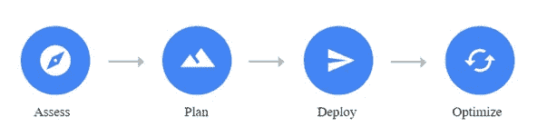
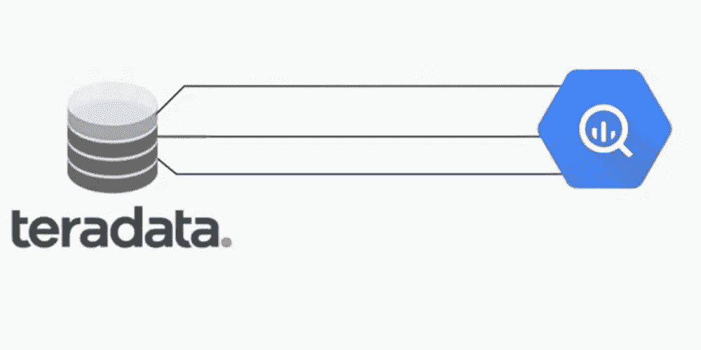

# 将工作负载迁移到 GCP:第二部分:迁移阶段

> 原文：<https://medium.com/google-cloud/migrating-workloads-to-gcp-part-ii-phases-of-migration-e9167a039316?source=collection_archive---------1----------------------->

感谢你阅读我关于 GCP 移民系列的第一篇博客。如果你错过了阅读，那么你可以阅读第一篇博客@[https://poojakelgaonkar . medium . com/migrating-workloads-to-GCP-part-I-planning-migrations-ae8e 301d 207 b](https://poojakelgaonkar.medium.com/migrating-workloads-to-gcp-part-i-planning-migrations-ae8e301d207b)

这个博客是迁移系列的第二章，我们将讨论更多关于迁移路径和迁移阶段的内容。在之前的博客中，我们了解到现有系统的评估、定义目标、定义适用于当前项目/应用的迁移类型。

让我们看一下迁移路径，它将引导我们评估/发现、规划/设计、开发/测试/部署并验证/优化迁移的应用程序。

这是迁移的四个阶段

1.**评估** —这是迁移的关键阶段。此阶段也称为发现阶段，在此阶段，我们重点分析现有应用程序，并获取迁移所需的指标。根据迁移的类型，我们需要收集以下一些指标作为评估阶段的一部分。

a.传统—将数据仓库系统迁移到 GCP —我们需要获取代表系统复杂性的指标，这有助于设计迁移计划。

让我们考虑一个将 Teradata 数据仓库迁移到 GCP 的场景。

二。我们需要获取以下一些分析所需的指标

1.源集成—什么类型的源与现有 TD 系统集成。如何将源数据导入 TD 进行处理？

2.目标集成—有哪些不同类型的集成— BI/Reporting/AI/ML 或任何从 TD 访问数据的下游应用程序

3.负载类型—什么是负载类型—实时、批量负载

4.处理的数据类型—结构化、半结构化等。

5.实施类型— ETL 或 ELT

6.转换的类型——运行在 TD 之上的不同转换是什么——将它们分为简单/中等/复杂

7.用于处理数据的 TD 工具是什么——Bteq/TPT 等。

8.TD 中存储/处理的数据量有多大

9.调度/编排器用于调度加载/转换的是什么

三。分析现有系统需要这些指标。对数据、工作/管道、应用和集成的复杂性进行分类

2.**计划** —在这个阶段，我们设计基础设施、服务选择、网络、项目结构、文件夹、组织设置。基于第一阶段，获取分析指标—实施设计以定义迁移策略。

a.基于 Teradata 数据仓库迁移用例的评估场景，规划阶段包括以下策略

I .组织设置—项目、文件夹设置

二。网络—针对源和目标集成的防火墙、子网、VPC 设置

三。定义数据策略—热数据、温数据和冷数据

四。定义数据加载—历史加载和增量加载

动词 （verb 的缩写）定义数据迁移策略—选择服务、设备和传输服务，将数据拷贝到 GCP 环境

不及物动词定义存储层—定义 GCS 存储桶结构

七。定义管道策略，设计管道来处理和转换数据

八。使用 GCP 本地服务定义编排和调度

九。定义迁移阶段——根据 TD 系统内流程的相互依赖性，迁移应用程序的哪一部分

x.定义运营和维护活动及设置

xi。定义成本策略——成本估算和设置。请参考[https://poojakelgaonkar . medium . com/big query-pricing-model-and-cost-optimization-recommendations-d 57 AE 1 ebea 36](https://poojakelgaonkar.medium.com/bigquery-pricing-model-and-cost-optimization-recommendations-d57ae1ebea36)了解更多关于 BQ 定价模式和成本优化的信息

十二。定义 GCP 的 CI/CD

3.**开发/部署** —在此阶段，我们设计并构建将负载转移到 GCP 的部署策略和流程。根据给定用例的最初两个阶段，我们将执行以下步骤

a.继续相同的场景—让我们假设 GCP BQ 用于替换 Teradata 数据仓库系统

b.假设-现有应用程序负载均使用 Bteq 进行 ELT，TD 数据来源于使用 TD 本地实用程序，BI 报告在 TD 之上运行。

c.数据加载—一次性历史数据迁移

d.用于将历史数据引入 BQ 的 BQ 传输服务

e.所有 ELT Bteq 管线转换为等效 BQ 管线

f.所有转换后的管道都使用 GCP 气流作为指挥器和调度器来触发

g.所有 BI 报告继续在现有 BI 平台上运行，报告要更改的 SQL 和连接，以指向通过 BQ 读取的数据

h.对于实时加载——使用 GCP 服务发布/订阅或数据流将数据导入 BQ，或使用 BQ 本地实用程序从 GCS 存储桶读取数据并近乎实时地推送到 BQ——这取决于应用程序要求。

I .服务的选择完全取决于现有的应用程序设置、业务需求、应用程序要求和数据可用性要考虑的 SLA

j.部署使用 GCP CI/CD 安装程序构建的示例代码

k.设置日志记录和监控—警报、阈值和自动邮件/报告

4.**优化&验证** —在这个阶段，我们验证迁移到 GCP 的应用程序/数据。有多种方法可以验证迁移的数据。我们可以使用任何现有的验证工具或开源工具，也可以根据应用需求开发一个自动化框架。作为此阶段的一部分，我们将执行以下步骤

a.验证迁移的数据—运行验证脚本以确保迁移的历史数据与 TD 系统匹配

b.验证数据管道—在相同的数据集上运行迁移的管道，在相同的数据集上运行现有的传统管道并进行比较。比较管道输出、执行时间、错误处理和捕获的日志等。

c.验证转换后的 SQL —在 TD 和 BQ 上运行相同的 BI 报告并进行比较

d.验证应用程序 SLA

e.验证应用程序性能、灾难恢复、可扩展性和可用性

f.验证 TD 和 BQ 上的操作和维护设置

g.验证 GCP 应用程序的成本支出和实际成本

这里，我们考虑了一个数据仓库迁移用例— Teradata 到 GCP 的迁移。我们可以参考这些阶段和示例指标，以及这里捕获的步骤。这些是基于我在 GCP 迁移方面的专业知识。我们可以在 Google 文档中找到关于这些任务的更多细节—[https://cloud . Google . com/architecture/migration-to-GCP-getting-started](https://cloud.google.com/architecture/migration-to-gcp-getting-started)

在下一篇博客中，我们将了解更多关于 GCP 迁移的一些示例用例和参考架构。

> **关于我:**
> 
> 我是 DWBI 和云建筑师！我一直在处理各种遗留数据仓库、大数据实施、云平台/迁移。我是谷歌认证的专业云架构师。如果您在认证、GCP 实施方面需要任何进一步的帮助，您可以联系我@ [LinkedIn](https://www.linkedin.com/in/poojakelgaonkar) ！