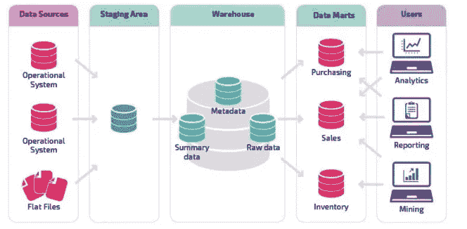
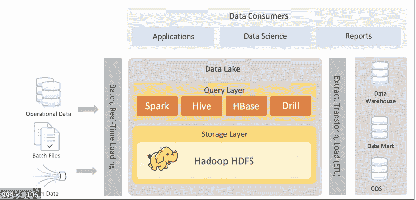
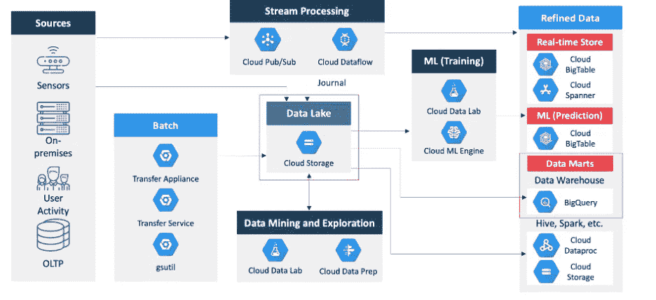

# 将工作负载迁移到 GCP:第三部分:数据仓库和数据湖迁移的参考用例

> 原文：<https://medium.com/google-cloud/migrating-workloads-to-gcp-part-iii-reference-use-cases-of-dw-and-data-lake-migration-6a7f505cb3d1?source=collection_archive---------0----------------------->

感谢你阅读我关于 GCP 移民系列的第一篇博客。如果你错过了阅读，那么你可以阅读第一篇博客@[https://poojakelgaonkar . medium . com/migrating-workloads-to-GCP-part-I-planning-migrations-ae8e 301d 207 b](https://poojakelgaonkar.medium.com/migrating-workloads-to-gcp-part-i-planning-migrations-ae8e301d207b)

你可以读出第二篇博客@[https://poojakelgaonkar . medium . com/migrating-workloads-to-GCP-part-ii-phases-of-migration-e 9167 a 039316](https://poojakelgaonkar.medium.com/migrating-workloads-to-gcp-part-ii-phases-of-migration-e9167a039316)

这个博客是迁移系列的第三章，也是倒数第二章，我们将讨论 GCP 迁移的一些参考架构和用例。在之前的博客中，我们已经了解到评估现有系统、定义目标、定义适用于当前项目/应用的迁移类型。我们还学习了 GCP 迁移的阶段和设计阶段。

让我们考虑两个用例作为参考架构讨论。

Teradata DW 迁移到 Google BigQuery

大数据数据湖迁移到谷歌云平台

评估这些迁移平台的共同点是什么？当我们讨论这些用例时，让我们回顾一下迁移阶段及其迁移结果。

1.  ***规划迁移—***

a. ***定义应用的当前状态—***

一、 ***用例-1 : Teradata 迁移***

1.定义系统的当前状态—EDW 是如何设置的？EDW 系统目前的容量/规模是多少？什么是源集成，什么是目标集成？有多少用户接入 TD 系统？TD 上运行着多少流程/应用？什么是满载、增量负载/增量负载？如何将源数据引入系统？使用了哪些工具/实用程序？

让我们考虑一下-

***来源*** - >平面文件、半结构化文件、其他 RDBMS 来源

-用于将平面文件引入 TD 暂存层的 TD 实用程序

- ETL 工具用于从其他 RDBMS 系统以及半结构化文件中获取数据

***目标*** - >下游应用馈送，上报& BI、AI/ML 应用

表格用于报告和商业智能应用

生成提要并作为文件发送到 FTP 服务器，供下游应用程序使用

AI/ML 团队从数据库层访问数据

大小->考虑 50TB 以上的活动数据和 20TB 以上的归档数据

数量增长->考虑一个月内 5%的数据增长

2.变换图层->数据如何暂存？什么是保留策略？数据如何在保留后归档？源文件保留？定义了哪些层？

让我们考虑一下——

源文件保留 7 天，并归档到归档文件夹

层-暂存、原始数据、汇总数据层

SCD 实现— SCD 类型 II 表，目标表

数据保留—活动数据保留 18 个月，并归档到归档数据库

数据模型、表/视图设计—星型/雪花型模式还是 fsldm？

审计批量控制实施

管道——使用哪种工具？使用的技术？— TD 本机实用程序，如 TPT、用于转换层的 Bteq、用于转换某些复杂作业的 Informatica 作业

错误处理和重启能力—如何配置警报？当要重新运行作业时，要执行哪些步骤来重新运行作业

考虑将 control-m 用作企业调度程序来调度和调用作业

3.考虑以下 EDW 实施的示例参考图—当前架构

***用例— 2 : Hadoop 数据湖迁移***

1.定义当前状态—与 EDW 类似，让我们列出数据湖系统的当前状态指针

-源集成—文件集成—它们是如何通过 FTP 传输到 HDFS 的？

- RDBMS 集成 Sqoop 或其他一些工具/技术，用于将 RDBMS 数据引入 Datalake 系统

—目标集成—如何从 Datalake 系统访问 feed/数据

-什么是个人用户，现有数据湖系统的应用程序用户

-在数据湖之上是否有任何商业智能/分析在运行

—数据湖的大小—活动存储与归档存储

-管道设置-管道如何在数据湖上运行？哪个调度器/指挥器用于设置作业？

-哪些工具/技术用于设置管道-让我们考虑所有作业都是 Spark 作业，并设置为通过 Oozie 工作流运行，并通过 Control-M 进行调度

*   让我们考虑以下典型的数据湖实现架构

***设计未来状态*** —让我们考虑以上两个使用案例，并讨论以下关于 GCP 迁移的可能解决方案—

***一、EDW/TD 迁移- >注意事项- >***

1.Google 上的 Bigquery as DW。使用 BQ 传输服务将现有 TD 系统中的一次性或增量数据导入 BQ

2.GCS 作为源文件的登录/暂存层。创建一个脚本，使用 gsutil 将到达共享位置的文件推送到 GCS

3.ETL 作业将被替换为 BQ 作业，或者继续使用 ETL 将数据加载到 BQ

4.用于 SQL 转换的 TD 本地作业—根据 BQ 标准将它们转换为在 BQ 上运行

5.使用气流来协调工作/管道

6.保持 control-m 调度程序不变，根据现有调度调用 airflow 作业(这不会影响下游调度，依赖关系保持不变)

7.创建与在现有 TD 系统中运行流程所需的应用 id 相同的服务帐户

8.创建个人 id 作为 TD 系统的用户，并在 IAM 中设置他们的角色，与现有的 TD 系统角色相同

9.下游集成继续为 BI 工具/报告提供目标连接开关，并调整 SQL 以引入报告

10.下游馈送—使用 BQ 本地实用程序生成下游馈送/文件，以共享给 FTP 服务器供下游应用程序使用。集成 FTP 连接和推送到服务器，以避免对下游应用程序的任何影响

11.错误处理和警报—考虑通过气流作业实施错误处理和警报

12.审计批处理控制——BQ 在行级操作方面没有那么出色，因为审计批处理更喜欢使用云 sql 本机实用程序来设置审计表和管理审计脚本，以便根据管道状态来输入/更新作业状态

13.日志记录—启用除常规作业日志记录之外的堆栈驱动程序日志记录，以使用 GCP 本地服务构建仪表板

***二世。DataLake Migration*** —让我们考虑下面在目标系统设计中使用的本地服务和实用程序

1.使用 GCS 存储桶作为存储服务来存储源文件、原始文件、暂存文件、中间文件和目标文件

2.使用 Dataproc 集群作为 Hadoop 生态系统，在 GCP 上运行 Hadoop 原生作业

3.在 GCP 上设置 Datalake 时，使用 GCS 作为 HDFS/存储层

4.利用气流来协调 GCP 的工作

5.源集成—对于文件馈送，写下一个快速实用程序，将文件从源服务器或共享驱动器或 NAS 推送到 GCP。使用 gsutil 或 distcp —基于文件大小和群集利用率的推送或拉取

6.源集成—对于 RDBMS feeds，继续通过 Sqoop 使用它，或者根据源系统、数据大小和频率选择一种 GCP 本地服务，如 Datastream、Dataflow 或 Data Fusion，以显示数据

7.源集成—对于实时馈送，继续使用原生 Kafka 将数据推送到 GCS，或者将其配置为与发布/订阅集成，以将实时或接近实时的数据引入 GCP

8.对于下游分析或 BI 应用程序—考虑通过 BQ 探索数据

9.对于作业处理/流水线处理—考虑用临时集群代替静态集群，以避免超额计费并实施成本优化的解决方案

目标系统设计—将下图视为 GCP DW/data lake 系统设置的参考架构。我们可以利用 GCP 本地服务，开源来设计和迁移现有的平台到 GCP

**2*。实施或迁移到 GCP***

a.一旦我们定义了当前状态，设计了目标系统，我们就可以开始实施周期了

b.避免大爆炸方法

c.基于规划阶段和当前系统评估—定义流程之间的依赖关系，并确定要分阶段迁移的应用程序/流程

d.假设我们在现有 TD 系统中运行 4 个不同的流程，我们希望分阶段迁移它们，我们观察到应用程序 1 用于引入源数据，应用程序 3 用于执行转换，应用程序 2 运行汇总流程以整合要与下游应用程序共享的数据，应用程序 4 用于生成提要并推送到下游

e.考虑到这一点，我们可以计划先将应用程序 1 移动到系统中，以获得所有需要的源数据，然后计划应用程序 3，接着是应用程序 2 和应用程序 1

f.分阶段方法总是迁移和测试的最佳方法。一旦经过测试和验证，它很容易集成其他应用程序

验证是迁移最重要的关键之一。验证传输的每一个字节、转换为在 GCP 上运行的每一个代码，验证源和目标对象以及 DW 系统的关键中间对象

b.在签署任何迁移文件之前，定义验证周期，运行 3-10 个周期，以确保测试和验证涵盖的所有场景和各种数据

***3。注销***

a.根据验证周期，结果考虑签署迁移到 GCP 的每个组件

b.在新系统启动并并行运行一段时间之前，不要关闭主系统

c.定义并行执行时间—3 个月到 12 个月，以验证系统性能、集成等。

d.向一组用户推广新系统，使用案例并开始验证它们

e.一旦各利益相关方、数据用户签字同意，新系统就可以进行签字同意并替换旧系统

***4。成本优化***

a.云迁移完成后，大多数人往往会忽略持续的成本和利用率，直到他们收到利用率警告

b.成本优化是一项持续的活动，设置警报、仪表板、监控 GCP 上的新系统设置、监控系统利用率、模式、成本模式、扩展策略、归档策略、存储策略等。

c.一旦应用程序迁移，我们将在一段时间内看到节省，我们无法将新系统的第 1 天与旧系统的第 1000 天进行比较。

d.我们必须设置所有必要的警报，仪表板，并登记到谷歌的承诺使用的好处，以获得更多的美元在一段时间内节省

在下一篇博客中，我将分享一些 GCP 移民面临的共同挑战。这是迁移系列的最后一章。

如果你觉得这些信息有用/有见地，请不要忘记分享或订阅博客。如果您对迁移有任何疑问或需要任何参考资料，可以联系我。

> ***关于我:***
> 
> *我是 DWBI 和云师！我一直在处理各种遗留数据仓库、大数据实施、云平台/迁移。我是谷歌认证的专业云架构师。您可以联系我@*[*LinkedIn*](https://www.linkedin.com/in/poojakelgaonkar)*如果您需要任何认证、GCP 实施方面的帮助！*