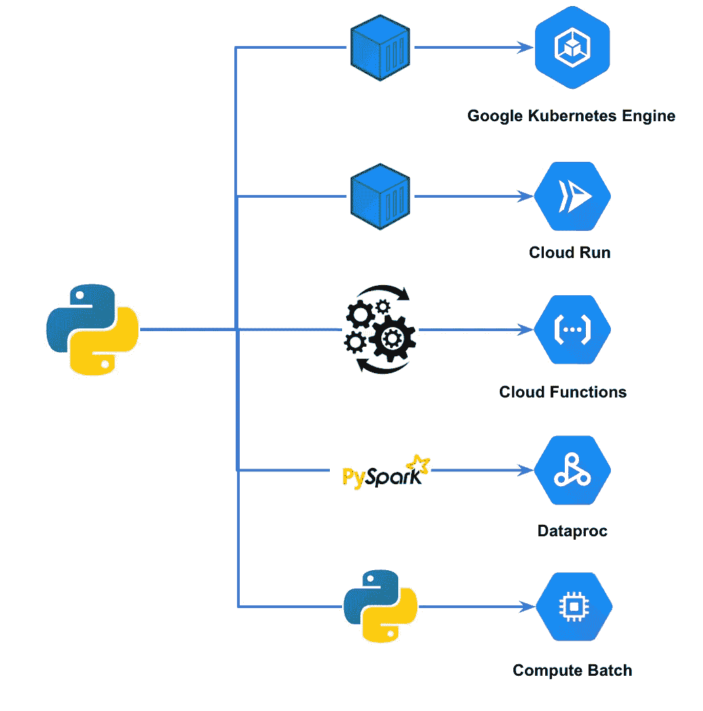
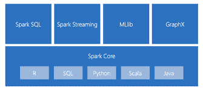

# GCP 平台中基于 python 的应用程序的迁移路径

> 原文：<https://medium.com/google-cloud/migration-path-for-python-based-applications-in-gcp-platform-bac0caf5f7c8?source=collection_archive---------1----------------------->

> 数据迁移项目有两个不同的支柱，一个是**数据**，另一个是运行在数据之上的**应用**。这些应用程序可能具有不同的性质—数据、web、请求-响应模型、微服务..
> 
> 在这篇博客中，我们将关注**基于 python 的作业**和**的不同迁移模式，它们应该在哪里执行**。

在典型的提升-转移迁移中，重点更多的是让事情尽可能在代码变化最小的情况下运行。原因是**减少了迁移所需的时间**。

虽然这是一个合理的理由，因为它会影响迁移的总体成本，但重要的是要理解**选择正确的方法**可以带来**成本节约**和**采用云原生服务的额外好处。**

**方法**应基于诸如**长期成本节约、**可扩展性、**可用性**和**维护简易性**等因素。

python 应用程序的迁移路径

## **微服务模式&请求/响应模型**

通常，这些应用负责执行**业务特定功能**，如**按需生成建议**、**洞察**、生成或**数据修正反馈循环**。

这些应用程序通常以服务的形式运行。

这些应用程序的方法将是检查这些应用程序是否可以与**容器兼容。**

**Google Kubernetes 引擎**或**云运行**可以用来部署这样的应用。另外对于**云运行**，参考[**容器运行时契约模型**](https://cloud.google.com/run/docs/container-contract) 了解云运行服务的前提条件。

**GKE** 提供
1。对基础设施和部署的更多控制。
2。**无超时**界限
3。GKE 还采用**自动驾驶**模式，减少了维护费用
4。**关于可扩展性和弹性的高级配置**选项

**云运行**时可以杠杆
1。**基础设施**维护开销不理想
2。**更快的部署**并利用**无服务器**部署
3。不需要 GKE
4 的**高级功能**。**没有交通 24/7
5。简单应用服务**

有可能使用两种服务的组合来实现期望的结果。

## 运营设施

这些是**轻量级和可重用的**应用程序代码，用于执行操作任务，如**内务处理**、**发送电子邮件通知**、**基于事件的功能**、**报告交付和 FTP 功能。**

这些应用可以部署在**云功能上。**

**云函数第 2 代**利用底层**云运行**并提供
1。与**事件电弧整合触发**和
2。更大的实例支持
3。**更长的超时持续时间**

## py-火花码

星火生态系统

**Spark —数据集成和转换** 基于 Spark 的应用可以是利用 Spark 流功能的**批处理**或**微批处理**应用。
py spark 代码可以在 **Dataproc(托管 hadoop 集群)**或 **Dataproc 无服务器选项**上迁移和执行，对代码的改动很小。代码的编排可以使用 **dataproc 模板**或**作曲家 DAGS** 来执行

**Spark — SQL 分析
Spark SQL 脚本**用于对 Hive 执行分析。
虽然 spark SQL 代码可以在 Dataproc 上轻松执行，但是如果 GCP 的目标数据仓库是大查询，那么还是值得考虑将 **Spark SQL 代码**移到**大查询 SQL** 中。
这带来了额外的优势，在大查询中有转换逻辑，并且**执行 ELT 而不是 ETL**

**Spark 机器学习**
**Spark ML** 用于实现机器学习模型。
Dataproc 为基于 spark 的机器学习库提供支持。

**Jupyter 笔记本** 还有**用例**使用**带有 spark exploration 代码的 Jupyter 笔记本，**需要托管在 GCP 平台上。
**Vertex AI** 提供托管笔记本，可用于托管内部 jupyter 笔记本。

## 基于原生 Python 的功能

应用程序代码库的一部分是 python 原生代码——pandas、numpy、sklearn，这些代码通常用于类似于**数据转换**、**特征工程**、**数据可视化和 excel 报表生成等场景。**

该代码可以在**临时**或**批量**的基础上执行。

这些场景通常不适合 GKE 或云运行的用例。

对于这样的代码部署，有两个选项可以利用

**选项 1** —如果 **cloud composer** 是架构的一部分并用于编排，则 **python 操作符**或 **python 虚拟环境操作符**可用于执行**批处理 python 工作负载**

这个选项带来了一些负面影响。加载 composer 资源以执行程序

仅当代码的资源需求较少且不影响 composer 的调度需求时，才使用此选项。

**选项 2——Google 云计算**批处理(最近推出)提供了执行这种**特别** / **预定**批处理代码的机制。

计算批处理的底层实例可以从安装了所有依赖项的 i **实例模板创建**或作为**容器执行。**

该产品仍处于**预览阶段**

谷歌云计算批量提供
1。完全管理的批处理服务
2。自动缩放容量
3。没有用于执行的专用基础设施
4。现货实例用法
5。容器执行支持/实例模板支持

**选项 3**—**Vertex AI 上的 Jupyter 笔记本**可用于数据探索和可视化代码。这些通常是由执行数据探索的数据分析师和科学家开发的。

**参考资料**
[https://cloud . Google . com/blog/products/containers-kubernetes/when-to-use-Google-kubernetes-engine-vs-cloud-run-for-containers](https://cloud.google.com/blog/products/containers-kubernetes/when-to-use-google-kubernetes-engine-vs-cloud-run-for-containers)
[https://cloud . Google . com/blog/products/server less/cloud-functions-2nd-generally-available](https://cloud.google.com/blog/products/serverless/cloud-functions-2nd-generation-now-generally-available)
[https://kubernetes.io/case-studies/](https://kubernetes.io/case-studies/)
[https://cloud . Google . com/blog/products/data](https://cloud.google.com/blog/products/data-analytics/broadcom-adopts-cloud-based-data-lake-for-security-analytics)

拉手联动—[https://www.linkedin.com/in/murli-krishnan-a1319842/](https://www.linkedin.com/in/murli-krishnan-a1319842/)