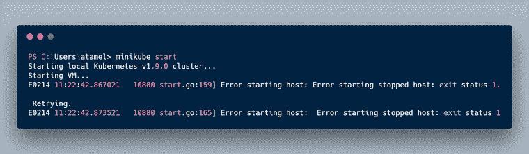
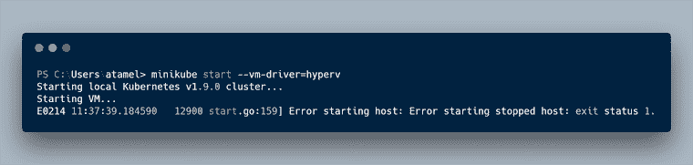
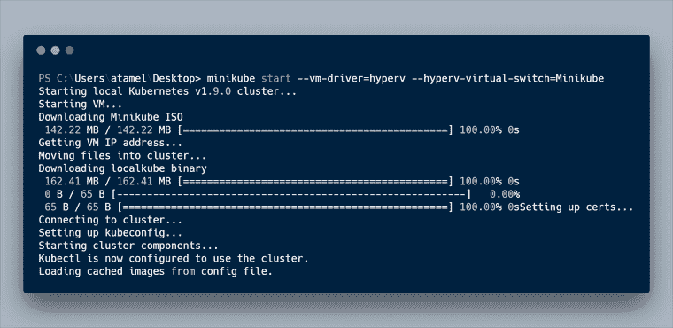
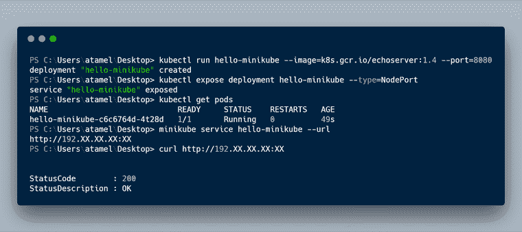

# Windows 上的 Minikube

> 原文：<https://medium.com/google-cloud/minikube-on-windows-3a856ee74efa?source=collection_archive---------0----------------------->

当我玩 Kubernetes 时，我通常会从[谷歌 Kubernetes 引擎](https://cloud.google.com/kubernetes-engine/) (GKE)获得一个集群，因为它实际上是[一个单一的 gcloud 命令](https://cloud.google.com/sdk/gcloud/reference/container/clusters/create)就可以在 GKE 上启动并运行一个 Kubernetes 集群。尽管有时在本地运行 Kubernetes 集群进行测试和调试是有用的。 [Minikube](https://github.com/kubernetes/minikube) 非常适合这个。

Minikube 在笔记本电脑上的虚拟机中运行单节点 Kubernetes 集群。有关于如何在 Linux，Mac 和 Windows 上安装它的说明。不幸的是，[对 Windows](https://github.com/kubernetes/minikube#windows) 的说明有点欠缺，所以我想记录一下我是如何在我的 Windows 10 机器上安装并运行 Minikube 的。

首先，你需要下载 minikube-windows-amd64.exe 文件，将其重命名为 minikube.exe，并将其添加到你的路径中，如 Windows 的[说明中所述。说明听起来好像您已经完成了这一步，但是如果您尝试在 PowerShell 管理模式下启动 minikube，您将得到如下错误:](https://github.com/kubernetes/minikube#windows)

这是因为 Minikube 需要一个 VM，默认情况下，它会尝试使用 VirtualBox。在 Windows 上，你可以使用 Hyper-V(Windows 10 上自带)或者安装 VirtualBox。许多人([这里](https://rominirani.com/tutorial-getting-started-with-kubernetes-on-your-windows-laptop-with-minikube-3269b54a226)和[这里](https://www.ibm.com/support/knowledgecenter/en/SS5PWC/minikube.html))推荐 VirtualBox 来避免问题，但我不想安装像 VirtualBox 这样的额外东西，所以我决定使用 Hyper-V。你可以通过*–VM-driver = Hyper V*标志告诉 Minikube 使用 Hyper-V，但这也失败了，之前出现了相同的错误。

发生什么事了？原来，Minikube 和 Windows 10 上有一个 bug。如果你感兴趣，这个 [GitHub 问题](https://github.com/kubernetes/minikube/issues/754)解释了细节，这个[非常有用的评论](https://github.com/kubernetes/minikube/issues/754#issuecomment-258129252)解释了你需要做什么。您基本上需要在 Hyper-V 中创建一个虚拟交换机，并允许您的实际互联网连接与该虚拟交换机共享其连接。

创建虚拟交换机后，您可以使用 Hyper-V 和附加的*–Hyper-Virtual-Switch*标志启动 minikube。

这第一次需要一段时间，因为它需要下载 ISO 图像等。但是一旦完成，您可以通过创建一个部署并部署一个 echoserver pod 来测试本地集群:

就是这样！希望这对你在 Windows 上安装和运行 Minikube 有用。

*原载于 2018 年 2 月 14 日*[*【meteatamel.wordpress.com*](https://meteatamel.wordpress.com/2018/02/14/minikube-on-windows/)*。*