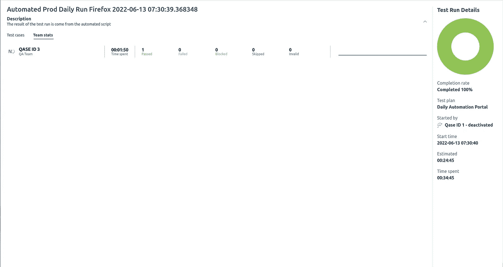

# 生产时从 MariaDB Galera 集群到 CloudSQL for MySQL 的最短停机时间数据库迁移—实施指南

> 原文：<https://medium.com/google-cloud/minimal-downtime-database-migration-from-mariadb-galera-cluster-to-cloudsql-for-mysql-at-production-8f4dd9966731?source=collection_archive---------0----------------------->

# A.概观


用链式副本方法实现数据库迁移服务。

以前，我写了一篇与这篇文章标题相似的文章，但是有更高层次的解释。现在，我想解释一下 MySQL 链副本的实现和配置。你可以看看下面这篇文章:

[](/niceday-dev/minimal-downtime-database-migration-from-mariadb-galera-cluster-to-cloudsql-for-mysql-at-production-4eb472e6774a) [## 从 MariaDB Galera 集群到 CloudSQL for MySQL 的最短停机时间数据库迁移…

### 概观

medium.com](/niceday-dev/minimal-downtime-database-migration-from-mariadb-galera-cluster-to-cloudsql-for-mysql-at-production-4eb472e6774a) 

当你读完那篇文章后，你可以回到这篇文章并进入下一节。希望你能从上一篇文章中了解上下文。

快乐阅读！

# B.配置链复制

假设将用于主节点到链复制的 MariaDB 节点称为 **mariadb-dqs2** ，MySQL 链副本虚拟机的名称为 **mysql-chain-replica-1** 。

让我们进入下一部分。

## B.1 .将其中一个 MariaDB 节点配置为主节点

将这几行添加到/etc/mysql/my.conf 中，以在 **mariadb-dqs2** 中启用主配置。您可以使用文本编辑器，如 VIM 或 Nano。

```
# master node configurationserver-id = 1
log_bin = /var/log/mysql/mysql-bin.log
binlog_do_db = ejabberd
binlog_format = row
bind-address = 10.0.3.47
log_slave_updates=ON
```

从控制台重启 **mariadb-dqs2** 内的 mysql 服务。

```
$ sudo systemctl restart mysql
```

通过 MySQL 控制台在 **mariadb-dqs2** 中为复制创建新的 MariaDB 用户。

```
MariaDB [(none)]> SET SESSION SQL_LOG_BIN=0;
MariaDB [(none)]> CREATE USER 'replica'@'%' IDENTIFIED BY '<< password placeholder >>';
MariaDB [(none)]> GRANT REPLICATION SLAVE ON *.* TO 'replica'@'%';
MariaDB [(none)]> GRANT EXECUTE ON *.* TO 'replica'@'%';
MariaDB [(none)]> GRANT SELECT ON *.* TO 'replica'@'%';
MariaDB [(none)]> GRANT SHOW VIEW ON *.* TO 'replica'@'%';
MariaDB [(none)]> GRANT REPLICATION CLIENT ON *.* TO 'replica'@'%';
MariaDB [(none)]> GRANT RELOAD ON *.* TO 'replica'@'%';
MariaDB [(none)]> SET SESSION SQL_LOG_BIN=1;
MariaDB [(none)]> SHOW GRANTS FOR replica@'%'\G;
*************************** 1\. row ***************************
Grants for replica@%: GRANT SELECT, RELOAD, EXECUTE, REPLICATION SLAVE, REPLICATION CLIENT, SHOW VIEW ON *.* TO 'replica'@'%' IDENTIFIED BY PASSWORD '<< password placeholder >>'
1 row in set (0.00 sec)
```

## B.2 .为从节点创建数据库备份

从 Galera 集群通过 MySQL 控制台进行 Desync **mariadb-dqs2** 。

```
MariaDB [(None)]> SET GLOBAL wsrep_desync = ON;
```

通过 MySQL 控制台检查是否为 **mariadb-dqs2** 启用了去同步。

```
MariaDB [(none)]> SHOW GLOBAL VARIABLES LIKE '%desync%';
+---------------+-------+
| Variable_name | Value |
+---------------+-------+
| wsrep_desync  | ON    |
+---------------+-------+
1 row in set (0.00 sec)MariaDB [(none)]> SHOW GLOBAL STATUS LIKE '%desync%';
+--------------------+-------+
| Variable_name      | Value |
+--------------------+-------+
| wsrep_desync_count | 1     |
+--------------------+-------+
1 row in set (0.01 sec)
```

从控制台转储来自 **mariadb-dqs2** 的聊天数据库。

```
$ time mysqldump -h 10.0.3.47 -u ejabberd -p --master-data=2 --single-transaction --quick --opt ejabberd > latest.sql
```

请通过您的 GCP 管理员创建一个新的服务帐户。服务帐户应该对存储初始备份文件的存储桶具有读写权限。当我无法将备份文件从 **mariadb-dqs2** 虚拟机转移到 **mysql-chain-replica-1** 虚拟机时，我产生了这个想法。

> 如果当时能找到别的方式传输文件就更好了。但是由于时间有限，我无法有效地将文件发送到另一个虚拟机。也许通过允许防火墙使用 **scp 将文件传输到 **mysql-chain-replica-1** 。非常抱歉。**

从控制台将 **mariadb-dqs2** 中的备份文件临时上传到 Google 云存储中。

```
$ [GCP_ACCOUNT_NAME=cloudsql-migration@sense-health.iam.gserviceaccount.com](mailto:GCP_ACCOUNT_NAME=cloudsql-migration@sense-health.iam.gserviceaccount.com)
$ GCP_KEY_FILE=/home/ridwan/cloudsql-migration.json
$ GCP_PROJECT_ID=sense-health
$ gcloud auth activate-service-account $GCP_ACCOUNT_NAME  --key-file=$GCP_KEY_FILE --project=$GCP_PROJECT_ID
$ gsutil -m -o GSUtil:parallel_composite_upload_threshold=150M cp latest.sql "gs://bucket-production/mariadb-dqs2/"
```

## B.3 .在从节点恢复数据库备份

一旦备份文件上传完成，你可以从谷歌云存储下载最新的备份文件到 **mysql-chain-replica-1。**

```
$ [GCP_ACCOUNT_NAME=cloudsql-migration@sense-health.iam.gserviceaccount.com](mailto:GCP_ACCOUNT_NAME=cloudsql-migration@sense-health.iam.gserviceaccount.com)
$ GCP_KEY_FILE=/home/ridwan/cloudsql-migration.json
$ GCP_PROJECT_ID=sense-health
$ gcloud auth activate-service-account $GCP_ACCOUNT_NAME  --key-file=$GCP_KEY_FILE --project=$GCP_PROJECT_ID
$ gsutil cp gs://bucket-production/mariadb-dqs2/latest.sql .
```

将聊天数据库恢复到 **mysql-chain-replica-1** 。

```
$ time mysql -u ejabberd ejabberd -p < latest.sql
```

数据库恢复任务需要一段时间才能完成。

## B.4 .配置从节点

从下载到 **mysql-chain-replica-1 的最新备份文件中获取 master_log_file 和 master_log_pos 值。**

```
$ head -n 50 latest.sql | grep MASTER_LOG_FILE-- CHANGE MASTER TO MASTER_LOG_FILE='mysql-bin.000001', MASTER_LOG_POS=4009680;
```

将这些配置添加到 **mysql-chain-replica-1 中的**/etc/MySQL/MySQL . conf . d/mysqld . CNF**。**

```
server-id = 2
log_bin = /var/log/mysql/mysql-bin.log
binlog_do_db = ejabberd
binlog_format = row
bind-address = 10.0.3.49
relay-log = /var/log/mysql/mysql-relay-bin.log
log_slave_updates = ON
sync_binlog = 1
read_only = 1
```

该配置将使 **mysql-chain-replica-1** 作为 **mariadb-dqs2** (来自 Galera 的主节点)的从节点，并在单个实例中作为 GCP 数据库迁移服务的源数据库(也是主节点)。这就是我们称之为链式复制的原因。

现在，重启 **mysql-chain-replica-1** 中的 mysql 服务。

```
$ sudo systemctl restart mysql
```

根据本节初始步骤中的先前输出设置 MASTER_LOG_FILE 和 MASTER_LOG_POST 的值。然后，通过 mysql 控制台启用 **mysql-chain-replica-1** 的从配置。

```
mysql> SET SESSION SQL_LOG_BIN=0; STOP SLAVE;
mysql> CHANGE MASTER TO
mysql> MASTER_HOST='10.0.3.47',
mysql> MASTER_USER='replica',
mysql> MASTER_PASSWORD='<< password >>’',
mysql> MASTER_LOG_FILE='mysql-bin.000001',
mysql> MASTER_LOG_POS=4009680;
mysql> START SLAVE; SET SESSION SQL_LOG_BIN=1;
```

检查 **mysql-chain-replica-1** 的从状态。如果应用成功，您可能会看到如下输出:

```
mysql> SHOW SLAVE STATUS \G;
*************************** 1\. row ***************************
               Slave_IO_State: Waiting for master to send event
                  Master_Host: 10.0.3.47
                  Master_User: replica
                  Master_Port: 3306
                Connect_Retry: 60
              Master_Log_File: mysql-bin.000001
....Master_Server_Id: 1
                  Master_UUID: 
             Master_Info_File: /var/lib/mysql/master.info
                    SQL_Delay: 0
          SQL_Remaining_Delay: NULL
      Slave_SQL_Running_State: Slave has read all relay log; waiting for more updates
           Master_Retry_Count: 86400
                  Master_Bind: 
      Last_IO_Error_Timestamp: 
     Last_SQL_Error_Timestamp: 
               Master_SSL_Crl: 
           Master_SSL_Crlpath: 
           Retrieved_Gtid_Set: 
            Executed_Gtid_Set: 
                Auto_Position: 0
         Replicate_Rewrite_DB: 
                 Channel_Name: 
           Master_TLS_Version: 
1 row in set (0.00 sec)
```

通过 MySQL 控制台在 **mariadb-dqs2** 检查从机状态。

```
MariaDB [ejabberd]> show master status;
+------------------+----------+------------------+------------------+
| File             | Position | Binlog_Do_DB     | Binlog_Ignore_DB |
+------------------+----------+------------------+------------------+
| mysql-bin.000001 |      4029680 | ejabberd |                  |
+------------------+----------+------------------+------------------+
1 row in set (0.00 sec)MariaDB [(none)]> show slave hosts;
+-----------+------+------+-----------+
| Server_id | Host | Port | Master_id |
+-----------+------+------+-----------+
|         2 |      | 3306 |         1 |
+-----------+------+------+-----------+
1 row in set (0.00 sec)
```

通过 MySQL 控制台禁用 **mariadb-dqs2** 的 desync，因为我们已经完成了从配置，让 **mariadb-dqs2** 再次与其他 Galera 节点同步。

```
MariaDB [(none)]> SET GLOBAL wsrep_desync = OFF;
```

使用 mysql 控制台检查 **mariadb-dqs2** 和 **mysql-chain-replica-1** 之间的聊天数据集行数，以确保复制是否如我们预期的那样应用:

```
mysql> select count(*) from archive;
+----------+
| count(*) |
+----------+
| 48052497 |
+----------+
1 row in set (9.24 sec)__________________________________________________________________MariaDB [ejabberd]> select count(*) from archive;
+----------+
| count(*) |
+----------+
| 48052497 |
+----------+
1 row in set (9.34 sec)
```

恭喜你！我们已经完成了配置 MariaDB 节点和 MySQL 节点之间的链复制。让我们转到下一部分。

## B.5 .将从节点配置为 GCP 数据库迁移服务的源

检查 **mysql-chain-replica-1** 是否充当主节点。

```
mysql> show master status;
+------------------+----------+------------------+------------------+-------------------+
| File             | Position | Binlog_Do_DB     | Binlog_Ignore_DB | Executed_Gtid_Set |
+------------------+----------+------------------+------------------+-------------------+
| mysql-bin.000014 |      154 | ejabberd |                  |                   |
+------------------+----------+------------------+------------------+-------------------+
1 row in set (0.00 sec)
```

从 **mysql-chain-replica-1** 为 GCP DMS 创建 replica_chain 用户。

```
mysql> SET SESSION SQL_LOG_BIN=0;
mysql> CREATE USER 'replica_chain'@'%' IDENTIFIED BY ‘<< password >>’';
mysql> GRANT REPLICATION SLAVE ON *.* TO 'replica_chain'@'%';
mysql> GRANT EXECUTE ON *.* TO 'replica_chain'@'%';
mysql> GRANT SELECT ON *.* TO 'replica_chain'@'%';
mysql> GRANT SHOW VIEW ON *.* TO 'replica_chain'@'%';
mysql> GRANT REPLICATION CLIENT ON *.* TO 'replica_chain'@'%';
mysql> GRANT RELOAD ON *.* TO 'replica_chain'@'%';
mysql> SET SESSION SQL_LOG_BIN=1;
```

我们差不多完成了。让我们转到“配置 GCP 数据库迁移服务”部分。

# C.配置 GCP 数据库迁移服务

## C.1 .创建数据库迁移服务

创建新的数据库迁移服务。只需按照一些表单来创建服务。在**入门**表单中，您需要填写关于迁移作业的信息。


在数据库迁移服务中创建迁移作业表单

在**定义源**表单中，您必须指定源数据库信息，包括 IP 地址、数据库名称、复制用户等等。定义源时使用 replica_chain 用户。

在**创建目的地**表单中，您必须从机器类型、定位目的地数据库的网络中指定目的地数据库规格。为迁移服务的目的地创建 **mysql-production**

在**定义连接方法**表单下，您必须通过“生产”网络下的 VPC 对等连接我们拥有的 CloudSQL 副本节点 **mysql-production** 和源数据库 **mysql-chain-replica-1** 。

在**测试和创建迁移作业**表单下，将立即创建 CloudSQL，我们仍然可以配置数据库迁移服务。测试源和目标之间的连接。您可以测试和创建迁移作业。

有时，您可能会面临由防火墙规则引起网络问题。即使数据库迁移服务能够创建副本节点。您仍然需要允许 CloudSQL 副本节点的 IP 地址访问源数据库。然后，在完成数据库迁移服务作业之前，再次测试连接。


允许从数据库迁移服务创建的 CloudSQL 副本节点到源数据库的网络访问的防火墙规则

创建作业后，您可以检查连接配置文件是否正确。您可以编辑或删除创建数据库迁移服务时指定的连接配置文件。在测试 CloudSQL 副本节点(目标)和源数据库之间的连接时，也可能会由于不正确的连接配置文件而出现错误。


数据库迁移服务创建的连接配置文件示例

## C.2 .运行数据库迁移服务

一旦数据库迁移服务成功连接源和目标。数据库迁移服务将执行完全转储数据库操作。这可能需要一段时间，取决于数据库的大小。由于数据库大小为 50 GB，完整的转储任务需要大约 1 个半小时。

但这并没有因为停机而影响生产服务。它运行起来没有任何问题。


从 MySQL 链副本节点到 CloudSQL MySQL 副本节点的完整转储数据库正在进行中

完整转储操作完成后，数据库迁移服务会将操作状态转换为 CDC，使源数据库与 CloudSQL 副本同步，只要我们没有将 CloudSQL 副本提升为主节点。

发送到 MariaDB 集群的每个新聊天消息都将被同步到 CloudSQL 副本节点。


CDC 正在运行从 MySQL 链副本到 CloudSQL MySQL 副本节点的数据库迁移服务

# D.转换

## D.1 .逐步切换

要进一步了解这一部分，您可以阅读我以前的一篇文章，该文章概述了最小停机时间数据库迁移，并附有插图 gudie:

[](/niceday-dev/minimal-downtime-database-migration-from-mariadb-galera-cluster-to-cloudsql-for-mysql-at-production-4eb472e6774a) [## 从 MariaDB Galera 集群到 CloudSQL for MySQL 的最短停机时间数据库迁移…

### 概观

medium.com](/niceday-dev/minimal-downtime-database-migration-from-mariadb-galera-cluster-to-cloudsql-for-mysql-at-production-4eb472e6774a) 

读完那篇文章后，你可以继续阅读下一节。

## D.2 .负载测试结果

切换后，我们的后端和生产环境中的聊天服务指向 CloudSQL MySQL 中的新聊天数据库。在切换之前，我们对后端和聊天服务进行了负载测试。结果如下:

*   **时间**:2022 年 6 月 12 日星期日 08:09 GMT+7
*   **活跃用户** : 100
*   **总请求数** : 31773 次请求
*   **速率** : 56.41 个请求/秒
*   **总错误数** : 1515 个请求(预期，负载测试脚本中有错误)
*   **错误率** : 0.05 个请求/秒
*   **最小持续时间** : 0.79 毫秒
*   **最大持续时间** : 3084.96 毫秒
*   **平均持续时间** : 29.89 毫秒
*   **中值** **持续时间** : 6.04 毫秒
*   **第 90 百分位持续时间** : 91.93 毫秒
*   第 95 百分位持续时间 : 155.03 毫秒

切换后，我们还进行了负载测试，结果如下:

*   时间:2022 年 6 月 12 日星期日 10:39 GMT+7
*   活跃用户数 : 100
*   T30 请求总数:31773 个请求
*   **速率** : 55.62 请求/秒
*   **总错误数** : 1494 个请求(预期，负载测试脚本中有错误)
*   **错误率** : 0.05 请求/秒
*   **最小持续时间** : 0.71 毫秒
*   **最大持续时间** : 535.71 毫秒
*   **平均持续时间** : 47.27 毫秒
*   **中值** **持续时间** : 5.95 毫秒
*   **第 90 百分位持续时间** : 161.32 毫秒
*   第 95 百分位持续时间 : 182.59 毫秒

从上面的结果，我们可以得出结论，我们没有异常切换后。我们可以认为迁移是安全的，不会导致我们的后端和聊天服务停机或失败。

自 6 月 12 日我们进行转换以来，我们还每天早上进行连续测试。我们看到根本没有异常现象。

## d . 3 . QA 团队的烟雾测试结果

在 2022 年 6 月 13 日的下一个星期一，我们得到了 QA 团队的大量帮助。无论是手动测试还是自动化测试。我们从 Khalid (QA 自动化工程师)那里得到报告，使用他们的自动化测试套件解决方案测试门户网站和移动应用程序。以下是报告:

*   **环境**:生产
*   **iOS 测试案例** : 100%通过


在 Khalid 的监督下，我们在 iOS 平台上的移动应用获得了自动烟雾测试结果

*   **安卓测试案例** : 100%通过


在 Khalid 的监督下，我们在 Android 上的移动应用程序的自动烟雾测试结果

*   火狐浏览器测试案例 : 100%通过



由 Khalid 监督的 Firefox 门户网站的自动烟雾测试结果

*   **Chrome(网页浏览器)测试案例:** 100%通过


由 Khalid 监督的 Chrome 门户网站的自动烟雾测试结果

Kiky 和 Harry 还按照他们的手动测试程序在门户网站和移动应用程序上进行冒烟测试后向我们报告:

*   **环境**:生产
*   **iOS 测试案例** : 100%通过


Harry 在 iOS 平台上对我们的移动应用进行手动烟雾测试的结果

*   **Chrome(网页浏览器)测试案例** : 100%通过


Kiky 对我们的 Chrome 门户网站进行的手动冒烟测试结果

# E.迁移结果

在 2022 年 6 月 12 日，我们通过将 CloudSQL 副本提升为主节点来执行切换。升级后，数据库迁移服务状态变为“完成”。然后，升级、重启、停止和恢复按钮在升级操作后变为禁用状态。


迁移完成时数据库迁移服务的状态

这是将副本节点提升为主节点的最终结果。主节点具有:

*   MySQL v5.7.x
*   自动调整磁盘大小已启用
*   自动备份已启用
*   PITR 已启用
*   区域高可用性已启用。备用节点位于不同的区域。主节点的区域是欧洲-西方 4-c
*   添加了一些数据库标志，用于优化 80%缓存数据集的 RAM 使用( **innodb_log_buffer_size** 、 **innodb_buffer_pool_size** 、 **innodb_log_file_size** 、**innodb _ write _ io _ threads**)
*   CPU (8 核)、RAM (32 GB)和 SSD 存储(100 GB 作为初始容量)的指定类似于 MariaDB 节点规格

主节点也有它的副本节点。以下是副本节点的规范:

*   MySQL v5.7.x
*   自动调整磁盘大小已启用
*   自动备份已启用
*   PITR 已启用
*   区域高可用性已启用
*   添加了一些数据库标志，用于优化 80%缓存数据集的 RAM 使用( **innodb_log_buffer_size** 、**innodb _ buffer _ pool _ size**、 **innodb_log_file_size** 、**innodb _ write _ io _ threads**)
*   CPU (8 核)、RAM (32 GB)和 SSD 存储(100 GB 作为初始容量)的指定类似于 MariaDB 节点规格

# F.结论

通过在 MariaDB 节点和 MySQL 节点之间使用 MySQL 标准复制，我们可以使用数据库迁移服务来执行从 MariaDB Galera 集群到 CloudSQL for MySQL 的零停机数据库迁移。

从 **mysql-chain-replica-1** 到 CloudSQL 副本节点的数据库迁移耗时 0 分钟或零停机时间。但是切换持续时间大约需要 12 分钟，因为我们需要重新配置后端配置，启用 HA 需要停机时间。但是我们在 SLA 时间之外(周末、周六早上)执行了这个切换。

这真让我高兴。感谢基础设施团队！

# 参考

*   [在生产时将数据库从 MariaDB Galera 集群迁移到 CloudSQL for MySQL 的最短停机时间——谷歌云数据库迁移服务概述](https://ridwanfajar.medium.com/minimal-downtime-database-migration-from-mariadb-galera-cluster-to-cloudsql-for-mysql-at-production-4eb472e6774a)
*   [GCP 数据库迁移服务快速入门](https://cloud.google.com/database-migration/docs/mysql/quickstart)
*   [通过 MariaDB Galera 集群使用 MariaDB 复制](https://mariadb.com/kb/en/using-mariadb-replication-with-mariadb-galera-cluster-using-mariadb-replica/#configuring-a-cluster-node-as-a-replication-master)
*   [设置 MySQL 5.1 到 5.7 到 8.0 菊花链复制的 7 个步骤](https://hpmtechinc.com/daisy-chain-mysql-replication/)
*   [如何从 MySQL 主节点获取最后一个日志位置](https://serverfault.com/questions/332339/way-to-avoid-server-downtime-when-creating-master-slave-relationship/332354#332354)

> 特别感谢基础架构团队的 Ricky(团队负责人)和 William，他们在讨论中为我提供了很多帮助，使这次迁移成为可能。他们也在周末的转换期间帮助我。他们真的是好人。
> 
> 还要感谢 NiceDay 的利益相关方，如 Umar(首席技术官)、Merel(产品负责人)、Alison(产品支持团队)、Jorge(数据工程师领导)、Pambo(后端工程师领导)、Syahmia(质量保证领导)、Kiky(质量保证)、Harry(质量保证实习)和 Khalid(质量保证自动化工程师)，他们参与了此次迁移，在迁移期间进行了协调，并将迁移风险降至最低。太棒了！