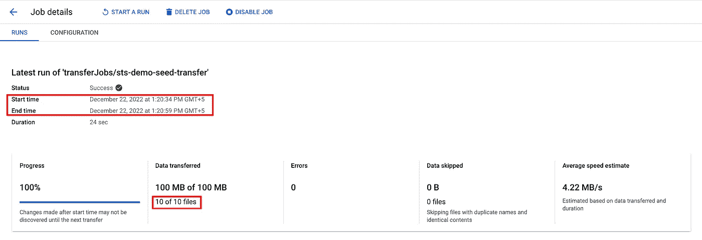
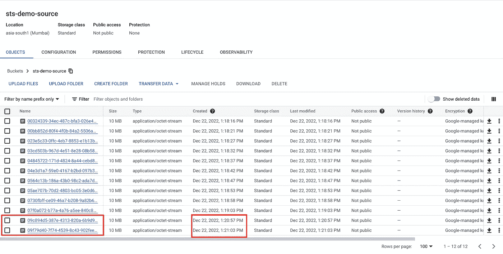
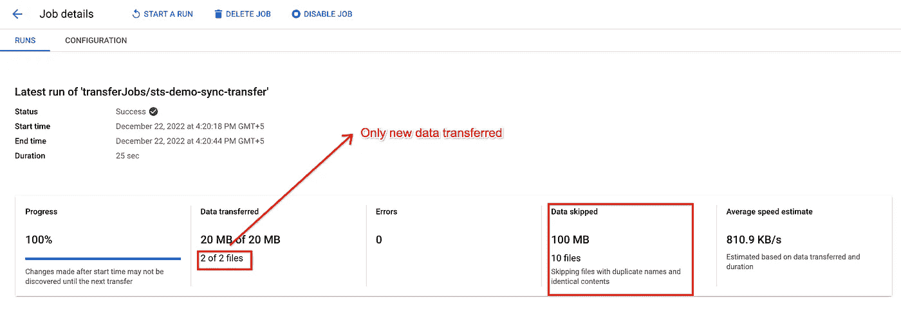

# 通过传输服务在存储桶之间迁移时，最大限度地减少云存储的停机时间

> 原文：<https://medium.com/google-cloud/minimize-downtime-of-cloud-storage-when-migrating-between-buckets-via-transfer-service-d28d2cdd4a21?source=collection_archive---------4----------------------->

泰勒·维克在 [Unsplash](https://unsplash.com?utm_source=medium&utm_medium=referral) 上的照片

传输服务(以前称为存储传输服务或 STS)是 GCP 的一项服务，允许将数据从本地或其他云提供商或 POSIX 文件系统传输到云存储。

从 TB/PB 大小的活动云存储桶中传输数据可能需要数天时间，并导致应用程序在桶上读取或写入数据时出现大量停机时间。如果在传输数据时存储桶上的写入未被阻止，传输服务将不会考虑在作业开始后添加的任何要传输的数据。

在本帖中，我们将探讨通过传输服务在云存储桶之间传输数据的方法，减少 GCS 桶停机时间，而不使传输过程复杂化。我们开始吧！

# 先决条件

*   源云存储桶需要 [*IAM 权限*](https://cloud.google.com/storage-transfer/docs/source-cloud-storage#required_permissions) 。
*   具有所需 [*IAM 权限*](https://cloud.google.com/storage-transfer/docs/sink-cloud-storage#required_permissions) 的目的云存储桶。

# 设置传输服务

> **步骤 1:种子转移**

在此步骤中，我们将 [*创建一个传输服务作业*](https://cloud.google.com/storage-transfer/docs/create-transfers#create_a_transfer) ，用于将数据从源桶传输到目的桶。 ***在此传输期间，我们不会阻止对原始源存储桶的任何读/写操作。***

传输作业开始后添加到源存储桶的任何数据都不会被考虑传输。

种子转移服务作业

在传输过程中向存储桶添加了新文件

如上所示，添加到源存储桶的 2 个新文件不考虑传输，因为它们是在传输服务作业已经启动之后创建的。

作业完成后，在作业开始时间之前创建的源存储桶中的所有可用数据都将传输到目标存储桶。

> **步骤 2:同步传输**

在此步骤中，我们将对种子传输作业开始后更改/添加的数据执行增量加载。**默认情况下，存储转移服务转移是增量的。**由于大部分数据已经作为*步骤 1(种子传输)*的一部分进行了传输，根据添加的数据量，此传输将花费较少的时间。

**在此传输期间，我们将阻止对源存储桶的所有写入。根据需要，也可以阻止读取操作。**

在这里，列出对象可能是一个瓶颈，如果有很多文件，会导致额外的时间。

同步传输服务作业

> **第三步:更新上下游应用**

更新对源存储桶进行读/写的所有应用程序，以指向新的存储桶(在这种情况下，目标存储桶用于传输作业)。

# 影响传输速度的因素

*   如果有许多小对象(大小为 KiB)，则传输作业受 QPS 限制，即每个传输作业每秒最多传输 1000 个任务(对象)，这会增加传输时间。
*   如果对象太大，带宽就会成为瓶颈。
    *带宽限制在地区级别设定，并在项目间公平分配。*
*   对于 GCS 到 GCS 的传输，如果源和目标的位置、存储类别和加密密钥相同，则不会重写数据，只会重写元数据。因此，它将非常快，只到 QPS。

# 结论

在本文中，我们讨论了如何通过传输服务在传输过程中保持数据完整和同步，从而最大限度地减少云存储的停机时间。我们看到，云存储桶上的写入将仅在*同步传输(步骤 2)* 时被阻止。稍后，我们还讨论了影响传输速度的因素以及应该预先考虑的因素。

# 参考

*   [https://cloud . Google . com/storage-transfer/docs/云存储到云存储](https://cloud.google.com/storage-transfer/docs/cloud-storage-to-cloud-storage)
*   [https://cloud . Google . com/storage-transfer/docs/transfer-differences](https://cloud.google.com/storage-transfer/docs/transfer-differences)
*   [https://cloud . Google . com/storage-transfer/docs/create-transfers](https://cloud.google.com/storage-transfer/docs/create-transfers)

希望你喜欢这篇文章，并发现它有用。你可以在 LinkedIn 上找到我。