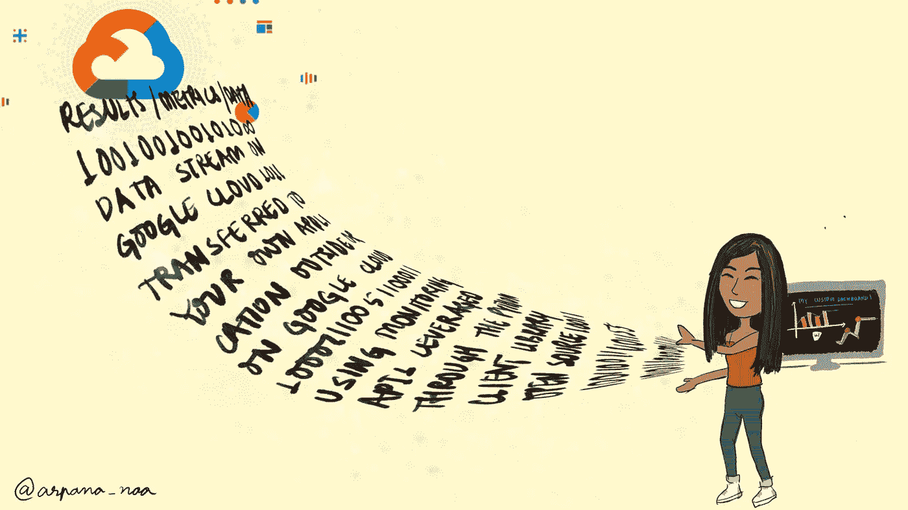

# Google 云监控 API 入门—第 3 部分

> 原文：<https://medium.com/google-cloud/missing-data-points-in-your-monitoring-api-response-use-page-iterators-81d27e954c70?source=collection_archive---------0----------------------->

## 迭代器简化了通过 API 响应分页的过程。学习使用页面迭代器从“list_time_series”调用中获取所有数据点。


缺少一些数据？[图片由 [Franki Chamaki](https://unsplash.com/@franki?utm_source=unsplash&utm_medium=referral&utm_content=creditCopyText) 在 [Unsplash](https://unsplash.com/s/photos/data?utm_source=unsplash&utm_medium=referral&utm_content=creditCopyText) 上拍摄]

在 GCP 上运行的企业通常在不同的地区/区域拥有多个资源实例，以实现 HA(高可用性),即在较长时间内提供一致的正常运行时间。

> 我合作过的一个 GCP 客户在其云环境中安装了 9 台路由器。这些路由器每分钟生成一个值为 0 或 1 的数据点，其中“1”表示路由器停机。你能想象你脑子里有多少数据点吗？

> 9 * 30 * 24 * 60 =什么！唷。

我的上一篇博客文章讨论了如何获取这些度量数据点。当 API 响应返回超过 100，000 个数据点时，就像上面的 388800 个数据点一样，响应只包含前 100，000 个数据点和一个可用于获取下一组数据点的`nextPageToken`。这可能有点令人困惑。怎么用`nextPageToken`？这篇博客建议了两种方法，你可以用它们来获得你所有的数据点。

# 我的数据点都在哪里？

作为一个使用监控 API 的初学者，很难理解为什么响应没有包含所有的数据点，特别是当您没有在请求中传递一个`pageSize`以及像`filter`或`interval`这样的参数时。
答案是，如果请求中传递的`pageSize`为空(未传递)或者超过 10 万个结果，则有效的`pageSize`为 10 万个结果。如果`view`设置为`FULL`，这是返回的`Points`的最大数量。

# 如何获得剩余的数据点？

在这里详细参考 API 响应[。](https://cloud.google.com/monitoring/api/ref_v3/rest/v3/ListTimeSeriesResponse)

```
{
  "timeSeries": [
    {
      object ([**TimeSeries**](https://cloud.google.com/monitoring/api/ref_v3/rest/v3/TimeSeries))
    }
  ],
  "nextPageToken": string,
  "executionErrors": [
    {
      object ([**Status**](https://cloud.google.com/monitoring/api/ref_v3/rest/Shared.Types/Status))
    }
  ],
  "unit": string
}
```

## 直接使用 nextPageToken

如文档所述，如果返回的结果多于返回的结果，那么`nextPageToken`被设置为非空值。

要查看额外的结果，请在对该方法的下一次调用请求中将`nextPageToken`作为`pageToken`传递。响应是一个结果/数据点的**列表，带有一个用于下一页的令牌**，直到您到达一个调用，其中`nextPageToken`为空，这意味着所有的值都被返回。

你想知道这不是一个很长的过程吗？是的，自己打电话，自己在每个值中添加代币值。这就是我们使用`pages`的原因。

## 使用页面迭代器

迭代器简化了通过 API 响应分页的过程。具有遵循列表分页模式的方法的 API 客户端可以返回一个`[**Iterator**](https://googleapis.dev/python/google-api-core/latest/page_iterator.html#google.api_core.page_iterator.Iterator)`。您可以使用这个迭代器获得所有页面的所有结果。

```
results = client.list_time_series(request={ ... })
```

假设`results`包含来自上一个 API 调用的响应，请求中有适当的参数。现在，我们知道如果响应包含超过 100，000 个点，那么响应将被分页。只需使用下面的代码片段遍历页面，并将您的所有观点存储在一个单独的`list`中。这个`list`留在内存里。稍后，我们可以使用列表中的`points`,而不是为每个页面调用 API。

```
all_points = []
for page in results.pages:
    for series in page.time_series:
        for point in series.points:
             all_points.append(point)
```

因为我们没有改变任何`points`或者将它们改为列表对象，所以我们仍然可以使用本地方法`points`来获得时间和相应的时间值(度量值)。

## 一些直接来自监控 API 开发者的建议—

我们可以想象，分页是每页进行一次服务器调用，因此非常慢。当您有大量点数时，更好的方法是更好地组织您的`filters`,使响应中的点数少于 100，000。用博客开头的路由器例子来解释—


现在取回所有数据:)[图片由[弗兰基·查马基](https://unsplash.com/@franki?utm_source=unsplash&utm_medium=referral&utm_content=creditCopyText)在 [Unsplash](https://unsplash.com/s/photos/data?utm_source=unsplash&utm_medium=referral&utm_content=creditCopyText) 上拍摄]

如果所有路由器都有大约相同数量的点，您可以尝试发送 9 个查询，每个查询都有一个带有“router = x”的过滤器，以便单独获得每个路由器的数据。然后，每个响应可以有适合一个页面的值。您可以在 view 设置为`HEADERS`的情况下使用`list_time_series`来获得 x 的值(headers 只给出哪些时间序列存在，而没有任何实际数据)。

# 详细了解“列表分页”

由于这些方法遵循所有具有分页响应的 API 的通用方案，您可以查看 Google API 风格指南中的[列表分页](https://cloud.google.com/apis/design/design_patterns#list_pagination)以了解更多细节。
我实际上是通过参考 google APIs for calendar 上的大量答案找到了监控 API 问题的解决方案，因为，是的，它们遵循相同的风格指南。这也说明了在编写代码时遵循最佳实践是多么重要。模式让人们更容易吸收信息，并进一步使用它。

希望你觉得这有用！



【作者图片——在这里用我尝试过的一点数字艺术结束监控系列！👋🏼]