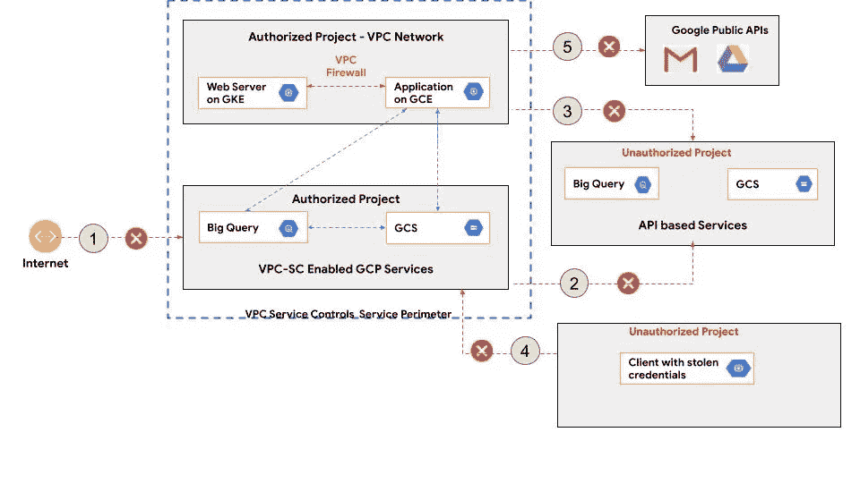
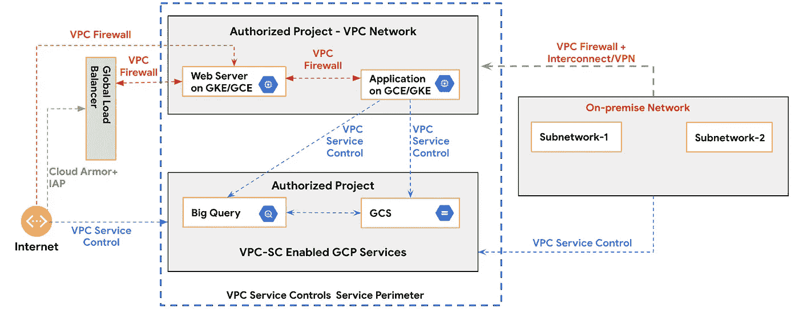

# 使用 VPC 服务控制降低 GCP 的数据泄露风险(第 1 部分)

> 原文：<https://medium.com/google-cloud/mitigating-data-exfiltration-risks-in-gcp-using-vpc-service-controls-part-1-82e2b440197?source=collection_archive---------0----------------------->

这是关于使用 GCP 服务:VPC 服务控制在谷歌云平台(GCP)保护你的敏感数据资产的系列文章的第一篇。在本帖中，我们将介绍 VPC 服务控制的基础知识，以及我们如何使用它来降低谷歌云平台中的数据泄露风险。在下一部分中，我们将深入探讨高级概念并回顾数据泄漏用例，以说明我们如何使用此服务来避免数据泄露风险。

# 介绍

[VPC 服务控制](https://cloud.google.com/vpc-service-controls/) 使安全管理员能够围绕存储在 Google 云存储(GCS)、BigTable 实例和 BigQuery 数据集等 Google 云平台资源中的敏感数据建立安全边界(以下简称“边界”)。当我们实施边界时，只要 IAM 策略和 VPC 防火墙策略允许，资源可以在边界内自由交换数据。但是，默认情况下，任何外部访问都会被阻止。

概括地说，我们可以使用以下步骤来配置边界:

1.  确定您想要保护的 GCP 项目。
2.  确定您希望保护的 GCP 服务。
3.  如果您打算允许来自外围的合法流量访问受保护的服务，请创建[访问级别](https://docs.google.com/document/d/17lMrALK7B2FhxvppYfqHAZgcMFSgaPTwyWMnLnq31yM/edit#heading=h.wjz3ar6hg5ak)。
4.  通过包括您在上面确定的项目、GCP 服务和访问级别来配置边界。

最后，您可以使用自己喜欢的方法来配置边界— [控制台、gcloud 或 API](https://cloud.google.com/vpc-service-controls/docs/create-service-perimeters) 。

就是这样！现在，我们来了解一下威胁模型，以强调您可以使用此服务来降低的风险。

# 威胁模型

VPC 服务控制有助于降低以下攻击媒介的数据泄露风险。



使用 VPC 服务控制的威胁模型和风险缓解

## 1.从 GCS 存储桶中泄漏的数据无意中暴露给公众

让我们想象一下，由于自动化或人为错误，IAM 策略在受保护的服务(例如 GCS 或 BigQuery)上设置不正确；这些资产变得可以公开访问，可能会导致数据泄露。VPC 服务控制边界(如果已配置)将阻止对此类资源的任何访问，即使 IAM 策略允许也是如此。

## **2。使用服务到服务拷贝的批量数据渗透**

根据最新的研究结果，特权用户给组织带来的安全风险最大。大多数组织特别关注批量窃取数据。拥有广泛 IAM 访问权限的恶意用户可以将整个数据从 GCS 存储桶复制到个人项目中的存储桶。基于日志记录和监控的检测能力可能能够检测到这样的动作；但是，它们可能不足以立即停止数据移动。VPC 服务控制将阻止数据跨越边界。

## **3。使用虚拟机服务副本的数据渗透**

VPC 服务控制将阻止在虚拟机上运行的恶意内部人员或受损/不可信代码试图将数据从 GCS 存储桶复制到虚拟机并随后复制到对手控制下的项目中的 GCS 存储桶的任何操作。

## 4.使用窃取的凭据访问 GCP 服务中的敏感数据

VPC 服务控制将阻止攻击者试图使用窃取的凭据(例如，OAuth 或服务帐户凭据)从互联网访问受保护服务中的敏感数据的任何操作。

## **5。阻止访问谷歌公共 API**

VPC 服务控制将阻止在边界内运行的应用程序/服务试图向 Google 公共 API(如 Gmail、Google Drive 等)发送数据的任何连接。).

# 使用 VPC 服务控制并不能缓解所有威胁

一般而言，VPC 服务控制仅在通信路径的目的地是 VPC 服务控制支持的 GCP 服务时适用。下面列出了几个例子。在这种情况下，其他安全控制措施，如 IAM、防火墙规则、WAF 等。必须实施以减轻这些威胁。

## **1。对您面向互联网的网络应用和服务的攻击**

您在 GCE 实例和 GKE 集群上运行的面向互联网的应用程序和服务面临着各种威胁，如未经授权的访问、应用程序漏洞(如 XSS、SQLi 和 CSRF)。这些威胁可以通过使用 GCP 服务来实施各种安全控制来缓解，例如[身份感知代理](https://cloud.google.com/iap)、 [Apigee](https://cloud.google.com/apigee) 、[云盔甲](https://cloud.google.com/armor)等。

## **2。数据通过虚拟机泄漏到外部恶意端点**

VPC 服务控制无法降低恶意内部人员将数据从 GCS 存储桶复制到边界内的虚拟机，然后将其发送到边界外托管的恶意外部端点的风险。为了减轻这种威胁，需要使用 VPC 防火墙来确保出口流量只允许进入白名单中的主机/IP 范围和端口。

## **3。通过虚拟机-虚拟机调用和不支持的 API 进行数据渗透**

VPC 服务控制也无法降低恶意内部人员将数据从 GCS 存储桶复制到虚拟机，然后将其发送到虚拟机或未经授权项目中不受支持的 API/服务的风险。同样，可以利用 VPC 防火墙规则来阻止这种类型的流量。

现在，我们已经对如何使用 VPC 服务控件来保护敏感数据资产有了相当好的了解，在下一节中，我们将介绍一些在使用 VPC 服务控件时要记住的最佳实践和注意事项。

# VPC 服务控制最佳实践

以下部分提供了启用 VPC 服务控制的一些最佳实践。

## **1。不要在外围启用不受支持的 GCP 服务。**

VPC 服务控制不支持所有 GCP 服务。更多详情请参考此[列表](https://cloud.google.com/vpc-service-controls/docs/supported-products#supported_products)。如果您需要使用 VPC 服务控制不支持的服务，请在外围项目中启用此服务。

## **2。使用服务帐户允许来自外部 GCP 项目的流量进入外围**

如果在外围的 GCP 项目中托管的服务需要与外围内的 GCP 服务通信，请使用以下步骤:

*   创建一个服务帐户，并为其分配在外围环境中访问 GCP 服务所需的最低权限
*   将服务配置为使用服务帐户。
*   将与外围配置关联的访问级别中的服务帐户列入白名单。

## **3。配置专用 Google 访问，允许内部主机的流量进入外围**

如果需要允许来自内部网络的流量通过专用/合作伙伴互连/VPN 到达边界，这里需要考虑两种情况:

*   如果本地主机仅访问 VPC 服务控制支持的 Google APIs 和服务，请使用 VIP-restricted . Google API . com(199 . 36 . 153 . 4/30)为本地主机配置专用 Google 访问。此[链接](https://cloud.google.com/vpc/docs/private-access-options#example_2)处的图表说明了这种连接性。
*   当本地主机需要访问 VPC 服务控制不支持的 GCP 服务时，请使用 private . Google APIs . com(199 . 36 . 153 . 8/30)

## **4。使用授权的 IP 范围或设备属性，允许从互联网进入安全边界**

如果最终用户需要从互联网访问受保护的 GCP 服务，不建议在访问级别中将他们的用户 id 列入白名单。基于身份授予进入外围环境的权限通常与服务帐户结合使用非常有用。此外，在撰写本文时，每个访问级别最多只能添加 100 个成员。最新详情见[配额](https://cloud.google.com/access-context-manager/quotas?hl=en)。因此，即使受保护的服务(例如 GCS)确实会基于终端用户身份实施 IAM 策略，也可以考虑使用以下方法之一来验证终端用户，以便在访问受保护的服务时进入外围环境:

1.  如果用户总是从受信任的网络(VPN 连接上的公司网络)连接，则将受信任的 IP 范围列入访问级别的白名单
2.  在定义访问级别时使用设备属性，如“公司拥有的设备”。基于设备属性实施访问级别将要求客户端设备配置端点验证。更多详情请参考[访问级别](https://cloud.google.com/access-context-manager/docs/create-basic-access-level#device-example)中的设备属性部分。

## **5。用**在模拟运行模式下配置周界

配置边界提供了两个选项:模拟运行模式和强制模式。开始时，不应将边界设置为强制模式，以避免阻止任何合法访问:

1.  首先，在非生产环境中以模拟运行模式创建一个服务边界。
2.  在更高的环境中配置外围设备之前，测试您的应用程序和控制。
3.  分析模拟日志中的违规情况。包括任何服务帐户、IP 范围、设备属性等。根据需要访问级别。*请注意，作为周界一部分的项目中会出现模拟运行违规。*
4.  一旦模拟运行分析显示没有违规，就在强制模式下配置边界。

## **6。在将 GCP 服务纳入边界之前，检查已知的限制**

使用 VPC 服务控件时，某些谷歌云服务、产品和界面存在已知的限制。详见此[链接](https://cloud.google.com/vpc-service-controls/docs/supported-products#service-limitations)。

## **7。使用 IAM 和 VPC 防火墙规则限制周界内的访问**

只要 IAM 策略和 VPC 防火墙策略允许，VPC 服务控制允许虚拟机(VM)/GKE 节点和外围内的 GCP 服务之间的自由通信。要限制边界内的通信，请使用 IAM 策略、VPC 防火墙规则和其他安全控制进行深度防御。

## **8。查看有权配置周界的用户列表**

查看拥有 [IAM 权限](https://cloud.google.com/vpc-service-controls/docs/access-control)来修改边界的身份列表。

## **9。为 GKE 私人集群建立集装箱注册中心**

如果使用 GKE 专用集群和容器注册表，则适用此步骤。它需要配置您的 DNS 服务器，以便对容器注册地址的请求解析到 restricted.googleapis.com。如果不使用受限 VIP，数据可以从支持的服务渗透到不支持的服务。更多信息见此[链接](https://cloud.google.com/vpc-service-controls/docs/set-up-gke)。

## **10。利用条件逻辑创建访问级别**

使用以下属性的组合(和/或)创建访问级别-

1.  [IP 范围](https://cloud.google.com/access-context-manager/docs/create-basic-access-level#corporate-network-example) —该属性可用于允许来自指定 IP 地址范围的访问(例如，企业网络内的访问)。
2.  [服务帐户](https://cloud.google.com/access-context-manager/docs/create-access-level#members-example) —该属性可用于允许来自指定服务帐户或用户帐户的访问。
3.  [设备属性](https://cloud.google.com/access-context-manager/docs/create-basic-access-level#device-example) —可以使用的设备属性有-

```
a. Corp Owned device.
b. Screen lock is enabled.
c. Storage encryption is enabled.
d. Operating Systems of specific kinds and versions.
```

上述属性的任何一个或组合都可以用来创建访问级别。例如，如果您想要确保允许用户来自受信任的 IP 范围或公司管理的设备，请使用授权的 IP 范围和设备属性(“公司拥有的设备”)创建访问级别)使用 OR 条件。

## **11。使用设备属性时，使用“公司拥有的设备”以获得更强大的安全性。**

使用“公司拥有的设备”可以确保流量来自公司管理的设备。为了成功验证对配置了此设备属性的 GCP 资源的客户端请求，需要在客户端设备上启用端点验证。有两个选项允许端点验证:

***a . chrome book 用户的端点验证***

要从 Chromebook 设备收集设备属性，必须完成注册。当用户首次登录设备时，会自动注册。一旦注册，不需要任何其他操作，设备信息会在每次请求时发送到 GCP。此[链接](https://support.google.com/chrome/a/answer/1360534?hl=en)提供了注册 Chromebooks 的详细信息。

***b .非 Chromebook 用户的端点验证***

非 Chromebook 用户的设备属性可以使用[端点验证](https://chrome.google.com/webstore/detail/endpoint-verification/callobklhcbilhphinckomhgkigmfocg?hl=en) Chrome 浏览器扩展来收集。要使用此选项，必须执行以下步骤。

*   在管理控制台中打开端点验证。
*   在授权设备上安装端点验证扩展。

这篇[文章](https://support.google.com/a/answer/9007320?hl=en)提供了关于打开端点验证和安装扩展的三个选项的详细信息。

# 把它放在一起

下图说明了如何将 VPC 安全控制与其他安全控制结合使用，以实现纵深防御。



将 VPC 服务控制与 GCP 的其它安全控制结合使用

# 敬请关注

在下一篇帖子中，我们将深入探讨 VPC 服务控制的高级功能，并浏览更多数据泄漏用例，以展示如何使用 VPC 服务控制来降低风险。

# 进一步阅读

1.  [VPC 服务控制概述](https://cloud.google.com/vpc-service-controls/docs/overview)
2.  [服务边界配置](https://cloud.google.com/vpc-service-controls/docs/service-perimeters)
3.  [VPC 服务控制—支持的产品和限制](https://cloud.google.com/vpc-service-controls/docs/supported-products)
4.  [带有 VPC 服务控制的谷歌私人访问](https://cloud.google.com/vpc-service-controls/docs/private-connectivity)

# 信用

非常感谢[萨姆拉特·雷](https://medium.com/u/ffb2a23f03d8?source=post_page-----82e2b440197--------------------------------)和[迈克·阿尔塔雷斯](https://medium.com/u/e2414e002073?source=post_page-----82e2b440197--------------------------------)在这个话题上提供了他们的专业知识。

# 放弃

Mukesh Khattar 是谷歌公司(Google Cloud)的安全顾问。这里陈述的观点是我自己的，而不是谷歌公司的。