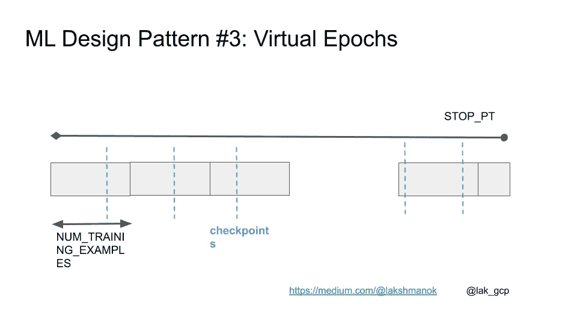

# ML 设计模式#3:虚拟时代

> 原文：<https://medium.com/google-cloud/ml-design-pattern-3-virtual-epochs-f842296de730?source=collection_archive---------0----------------------->

## 将机器学习模型训练和评估建立在样本总数的基础上，而不是建立在时期或步骤的基础上

*偶尔为 ML 工程师设计的一系列设计模式。* [*完整列表在此。*](/@lakshmanok/machine-learning-design-patterns-58e6ecb013d7)

机器学习教程经常会有类似[这种](https://www.kdnuggets.com/2018/06/keras-4-step-workflow.html)的代码:

```
model.fit(X_train, y_train, 
          batch_size=100, 
          epochs=15)
```

这段代码假设您有一个适合内存的数据集，并且可以迭代`epochs`次，而不会有机器故障的风险。这两种假设都是不合理的——ML 数据集的范围达到万亿字节，当训练可能持续数小时时，机器故障的几率高得令人不安。


TensorFlow 刚出来的时候，它的卖点之一就是不做这种不合理的假设。但是构建生产就绪的 ML 模型所需的代码很难编写。在 TensorFlow 2.0 中，API 更加直观。为了使上面的代码更有弹性，提供一个 tf.dataset(不仅仅是一个 numpy 数组),它提供了迭代功能和延迟加载。Keras 支持提供检查点能力的回调(参见 [ML 设计模式#2](https://towardsdatascience.com/ml-design-pattern-2-checkpoints-e6ca25a4c5fe) )。现在的代码是:

```
cp_callback = tf.keras.callbacks.ModelCheckpoint(...)
history = model.fit(trainds, 
                    validation_data=evalds,
                    epochs=15, 
                    batch_size=128,
                    callbacks=[cp_callback])
```

## 时代是有问题的

然而，使用`epochs`是一个坏主意。纪元可能很容易理解，但是在现实世界的 ML 模型中使用纪元会导致不好的效果。想象一下，你有一个包含 100 万个例子的训练数据集。例如，通过将历元数设置为 15，可以简单地遍历该数据集 15 次。但是，这有几个问题:

*   历元的数量是整数，但是处理数据集 14.3 次和 15 次之间的训练时间差异可以是小时。如果模型在看到 1430 万个示例后已经收敛，您可能希望退出，而不是浪费处理 70 万个示例所需的计算资源。
*   每个时期检查一次，在检查点之间等待一百万个样本可能太长了。为了恢复能力，您可能希望更频繁地检查点。
*   数据集随着时间的推移而增长。如果您获得了 100，000 个以上的示例，并且您训练了模型，并且获得了更高的错误，这是因为您需要提前停止还是新数据在某种程度上被破坏了？你不能说，因为以前的训练是在 1500 万个例子上，而新的训练是在 1650 万个例子上。

## 固定步骤的数量不是答案

如果固定步数呢？

```
NUM_STEPS = 143000
BATCH_SIZE = 100
NUM_CHECKPOINTS = 15cp_callback = tf.keras.callbacks.ModelCheckpoint(...)
history = model.fit(trainds, 
                    validation_data=evalds,
                    epochs=NUM_CHECKPOINTS,
                    steps_per_epoch=NUM_STEPS // NUM_CHECKPOINTS, 
                    batch_size=BATCH_SIZE,
                    callbacks=[cp_callback])
```

假设批量大小为 100，我们现在对 143，000 个步骤进行训练，而不是对原始数据集的 15 个时期进行训练。这给了我们更多的粒度，但是我们必须将一个“时期”定义为步骤总数的 1/15，这样我们才能得到正确的检查点数量。只要我们确保无限地重复`trainds`,这就会起作用:

```
trainds = trainds.repeat()
```

当我们再得到 10 万个例子时会发生什么？轻松点。我们将它添加到我们的数据仓库中，但是不更新代码。因此，我们的代码仍然需要处理 143，000 个步骤，它将处理这么多数据。除了 10%的例子是新的。如果模型收敛，太好了。如果没有，我们知道这些新的数据点是问题所在，因为我们没有比以前训练的时间更长！通过保持步数不变，我们已经能够区分新数据的影响和对更多数据的训练。

一旦我们训练了 143，000 步，我们就重新开始训练，并运行更长的时间(比如 10，000 步)，只要模型继续收敛，我们就继续训练更长的时间。然后，我们更新上面代码中的数字 143，000(实际上，它将是代码的一个参数)来反映新的步骤数。

这一切都很好，直到你想做超参数调整。当您进行超参数调整时，您会想要更改批量大小。当您更改批处理大小时，您看到上面的代码发生了什么变化吗？没错——如果你把批量改为 50，你会发现自己训练的时间减少了一半！显然，这是不行的。

## 虚拟时代

答案是保持向模型显示的训练示例总数(而不是步骤数)不变:

```
NUM_TRAINING_EXAMPLES = 1000 * 1000
STOP_POINT = 14.3
**TOTAL_TRAINING_EXAMPLES** = int(STOP_POINT * NUM_TRAINING_EXAMPLES)
BATCH_SIZE = 100
NUM_CHECKPOINTS = 15steps_per_epoch = (TOTAL_TRAINING_EXAMPLES // 
                   (BATCH_SIZE*NUM_CHECKPOINTS))cp_callback = tf.keras.callbacks.ModelCheckpoint(...)
history = model.fit(trainds, 
                    validation_data=evalds,
                    epochs=NUM_CHECKPOINTS,
                    steps_per_epoch=steps_per_epoch, 
                    batch_size=BATCH_SIZE,
                    callbacks=[cp_callback])
```

当您获得更多数据时，首先使用旧设置对其进行训练，然后增加示例的数量以反映新数据，然后更改 STOP_POINT 以反映您必须遍历数据以达到收敛的次数。



现在，这对于超参数调整是安全的，并且保留了保持步数不变的所有优点。

尽情享受吧！