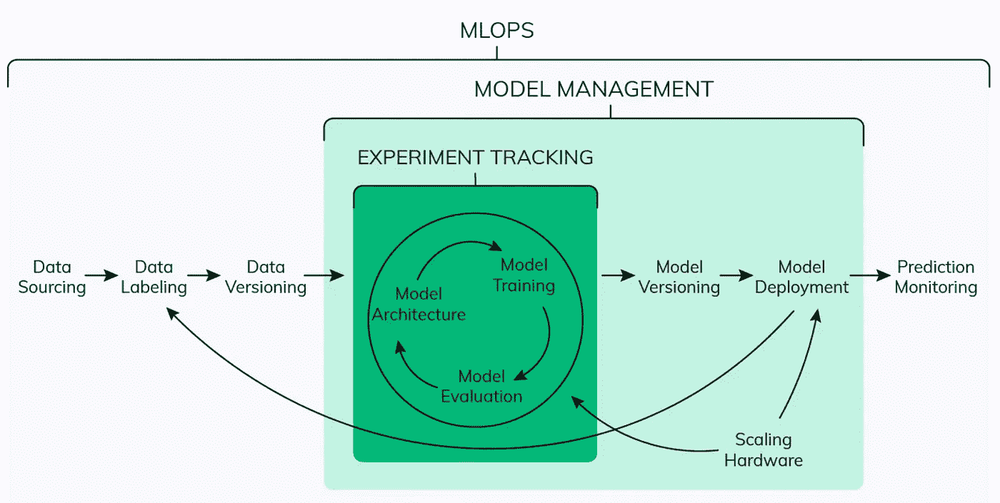

# MLOps——以谷歌的规模生产 ML 模型

> 原文：<https://medium.com/google-cloud/mlops-productionising-ml-models-at-google-scale-e78949c20e0a?source=collection_archive---------4----------------------->

我们现在已经在常规软件开发中使用 DevOps 有一段时间了，但我们也可以将它用于机器学习和人工智能。

我们为什么需要 DevOps？在 DevOps 之上分层机器学习和人工智能背后的原因是什么？ML Ops 和 AI Ops 有什么区别？继续阅读这篇博客找出答案。

# 什么是 MLOps？

许多行业将机器学习系统集成到他们现有的产品和服务中，因为 ML 对底线有好处，它可以增强你的竞争优势。

MLOps 是数据科学家和运营专业人员之间进行协作和沟通的一套实践。应用这些实践可以提高质量，简化管理流程，并在大规模生产环境中自动部署机器学习和深度学习模型。更容易将模型与业务需求以及法规要求结合起来。

MLOps 的关键阶段是:

*   数据采集
*   数据分析
*   数据转换/准备
*   模型培训和开发
*   模型验证
*   模型服务
*   模型监控
*   模型再训练

# DevOps 与 MLOps

DevOps 和 MLOps 有基本的相似之处，因为 MLOps 是从 DevOps 原理派生出来的。但是它们在执行上有很大的不同:

1.  与 DevOps 不同， **MLOps 本质上更具实验性**。数据科学家和 ML/DL 工程师必须调整各种功能，包括超参数、参数和模型，同时还要跟踪和管理数据和代码库，以获得可重现的结果。
2.  **混合团队组成:**在产品中构建和部署模型所需的团队将不会只由软件工程师组成。在 ML 项目中，团队通常包括数据科学家或 ML 研究人员，他们专注于探索性数据分析、模型开发和实验。他们可能不是有经验的软件工程师，无法构建产品级的服务。
3.  测试:测试一个 ML 系统包括模型验证、模型训练等等——除了传统的代码测试，比如单元测试和集成测试。
4.  **自动化部署**:你不能仅仅将离线训练的 ML 模型作为预测服务来部署。您将需要一个多步骤的管道来自动重新训练和部署模型。这种管道增加了复杂性，因为您需要在部署之前自动执行数据科学家手动执行的步骤，以训练和验证新模型。
5.  **由于不断发展的数据配置文件或简单的培训服务偏差导致的系统生产性能下降**:生产中的 ML 模型可能会降低性能，这不仅是因为次优编码，还因为不断**发展的数据配置文件**。与传统的软件系统相比，模型会以更多的方式衰退，您需要为此做好计划。
6.  **监控**:生产中的机型需要监控。类似地，需要监控构建模型的数据的汇总统计，以便您可以在需要时刷新模型。这些统计数据会随着时间的推移而改变，当值偏离您的预期时，您需要通知或回滚过程。

MLOps 和 DevOps 在持续集成源代码控制、单元测试、集成测试以及持续交付软件模块或软件包方面是相似的。

然而，在 ML 中有一些显著的区别:

*   **持续集成** (CI)不再仅仅是测试和验证代码和组件，还包括测试和验证数据、数据模式和模型。
*   **持续部署** (CD)不再是关于一个单独的软件包或服务，而是一个系统(一个 ML 训练管道)，它应该自动部署另一个服务(模型预测服务)或从一个模型回滚变更。
*   **连续测试** (CT)是一个新的特性，是 ML 系统独有的，它涉及自动重新训练和服务模型。

# 如何实现 MLOps

有三种方法可以实现 MLOps。本节描述了 MLOps 的三个级别，从最常见的级别(不涉及自动化)开始，一直到 ML 和 CI/CD 管道的自动化。

# MLOps 级别 0:手动流程

在第 0 级，构建和部署 ML 模型的过程完全是手工的。这对于刚刚开始 ML 的公司来说是典型的。

**特性**

*   **手动、脚本驱动、交互流程:**每一步都是手动的，包括数据分析、数据准备、模型训练、验证。它需要手动执行每个步骤，并从一个步骤手动转换到另一个步骤**。**
*   **ML 和运营之间的脱节:**这个过程把创建模型的数据科学家和为模型提供预测服务的工程师分开了。数据科学家将一个经过训练的模型作为工件交给工程团队部署到他们的 API 基础设施上。
*   **不频繁的发布迭代:**假设您的数据科学团队管理一些不经常更改的模型，要么更改模型实现，要么用新数据重新训练模型。新的模型版本每年只部署几次。
*   **没有持续集成(CI):** 因为很少假设实现变化，所以您忽略了 CI。通常，测试代码是笔记本或脚本执行的一部分。
*   **无持续部署(CD):** 因为没有频繁的模型版本部署，所以不考虑 CD。
*   **部署是指预测服务**(即带有 REST API 的微服务)
*   **缺乏主动的性能监控:**流程没有跟踪或记录模型预测和行动。

工程团队可能有自己复杂的 API 配置、测试和部署设置，包括安全性、回归和 load + canary 测试。

**挑战**

实际上，模型在现实世界中部署时经常会崩溃。模型无法适应环境动态的变化或描述环境的数据的变化。

为了应对这一手动流程的挑战，最好对 CI/CD 和 CT 使用 MLOps 实践。通过部署 ML 培训管道，您可以启用 CT，并且可以设置 CI/CD 系统来快速测试、构建和部署 ML 管道的新实现

# MLOps 一级:ML 管道自动化

MLOps 级的目标是通过自动化 ML 管道来执行模型的连续训练(CT)。为了自动化使用新数据在生产中重新训练模型的过程，您需要向管道中引入自动化的数据和模型验证步骤，以及管道触发器和元数据管理。

**特性**

*   **快速实验** : ML 实验步骤被编排并自动完成。
*   **生产中模型的 CT**:模型在生产中自动训练，使用基于实时管道触发器的新数据。
*   **实验-操作对称**:在开发或实验环境中使用的流水线实现在预生产和生产环境中使用，这是统一开发运维的 MLOps 实践的一个关键方面。
*   **组件和管道的模块化代码:**为了构建 ML 管道，组件需要可重用、可组合，并且可以跨 ML 管道共享(即使用容器)。
*   **模型的连续交付**:模型部署步骤是自动化的，该步骤将经过训练和验证的模型作为在线预测的预测服务。
*   **管道部署:**在第 0 级中，您将一个经过训练的模型作为预测服务部署到生产中。对于级别 1，您将部署一个完整的训练管道，该管道会自动循环运行，以作为预测服务为已训练的模型提供服务。

# 挑战

假设不经常部署管道的新实现，并且您只管理几个管道，那么您通常手工测试管道及其组件。此外，您需要手动部署新的管道实现。您还将管道的测试源代码提交给 it 团队，以便部署到目标环境中。当您基于新数据而不是基于新的 ML 思想部署新模型时，这种设置是合适的。

然而，您需要尝试新的 ML 思想，并快速部署 ML 组件的新实现。如果您在生产中管理许多 ML 管道，那么您需要一个 CI/CD 设置来自动化 ML 管道的构建、测试和部署。

# MLOps 第 2 级:CI/CD 管道自动化

为了快速可靠地更新生产中的管道，您需要一个强大的自动化 CI/CD 系统。这个自动化的 CI/CD 系统使您的数据科学家能够快速探索关于特征工程、模型架构和超参数的新想法。他们可以实现这些想法，并自动构建、测试和部署新的管道组件到目标环境中。

该 MLOps 设置包括以下组件:

*   源代码控制
*   测试和构建服务
*   部署服务
*   模型注册表
*   功能存储
*   ML 元数据存储
*   ML 管道编排器

# 特征

下图显示了 ML CI/CD 自动化流程的各个阶段:

*   **开发和实验:**你迭代地尝试新的 ML 算法和新的建模，其中实验步骤被编排。这个阶段的输出是 ML 管道步骤的源代码，然后这些源代码被推送到源存储库。
*   **流水线持续集成**:你构建源代码并运行各种测试。这个阶段的输出是将在后面阶段部署的管道组件(包、可执行文件和工件)。
*   **管道连续交付:**您将 CI 阶段产生的工件部署到目标环境中。这个阶段的输出是一个部署了模型的新实现的管道。
*   **自动触发:**流水线在生产中根据时间表或响应触发自动执行。这一阶段的输出是新训练的模型，该模型被推送到[模型注册表](https://neptune.ai/blog/ml-model-registry)。
*   **模型连续交付:**您将训练好的模型作为预测的预测服务。此阶段的输出是一个已部署的模型预测服务。
*   **监控**:您基于实时数据收集模型性能的统计数据。这个阶段的输出是执行流水线或执行新的实验周期的触发器。

# 结论

总而言之，在生产环境中实现 ML 并不仅仅意味着将您的模型部署为预测的 API。相反，这意味着部署一个 ML 管道，它可以自动化新模型的再训练和部署。设置 CI/CD 系统使您能够自动测试和部署新的管道实现。该系统让您能够应对数据和业务环境的快速变化。