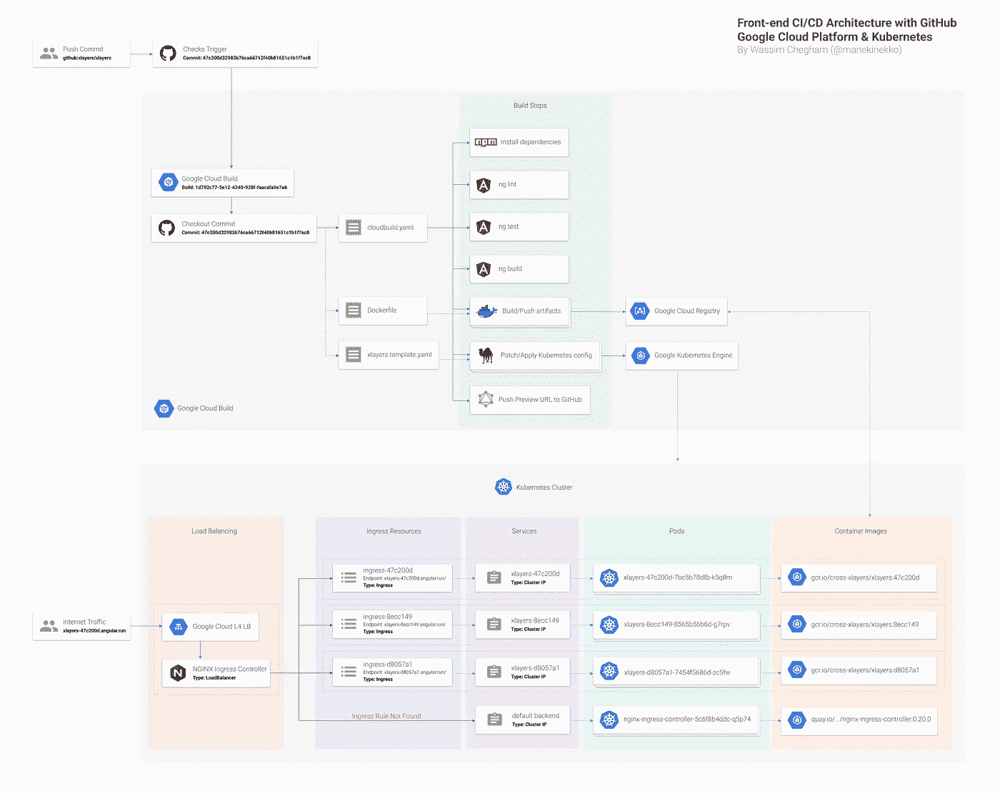
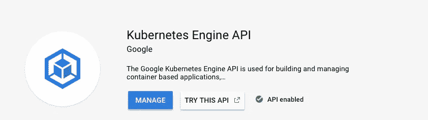
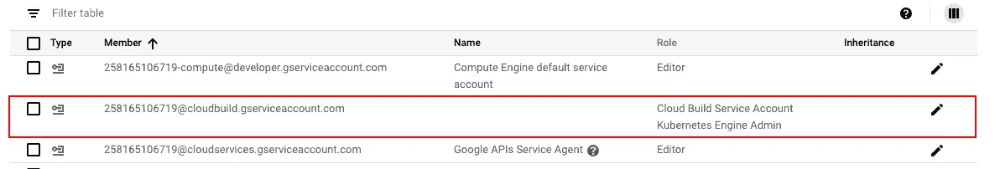
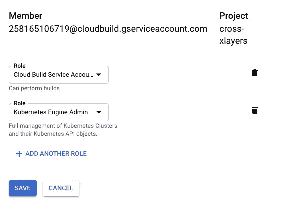
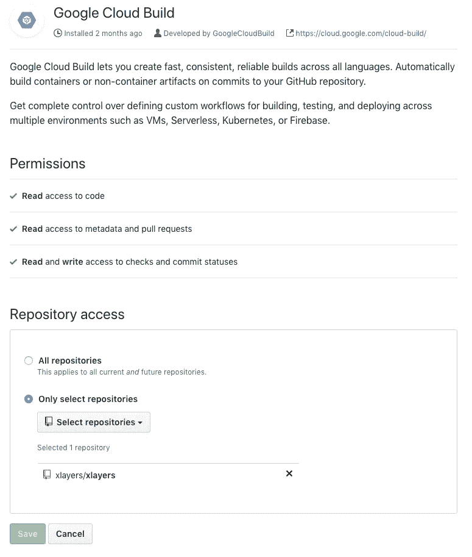
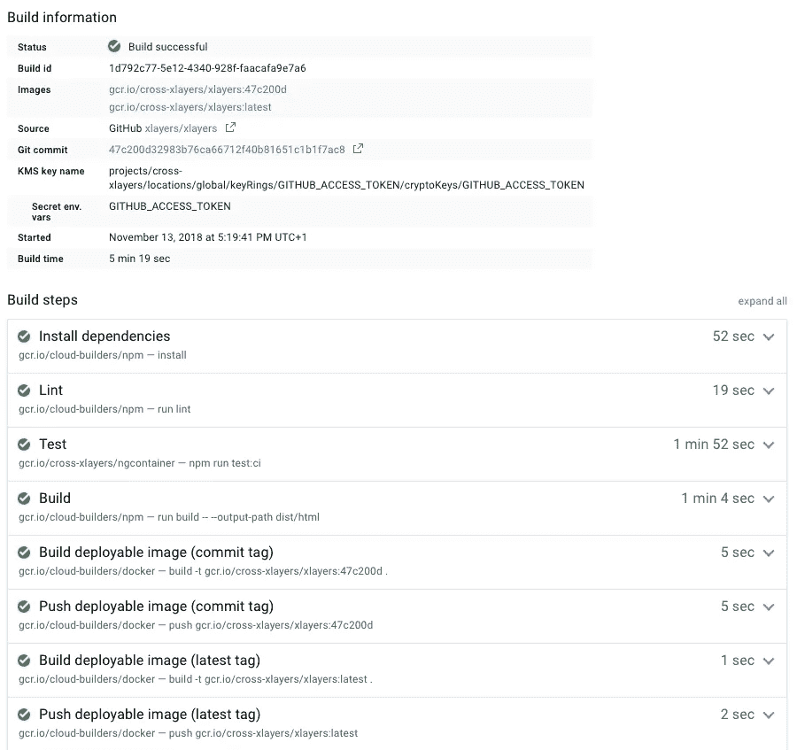
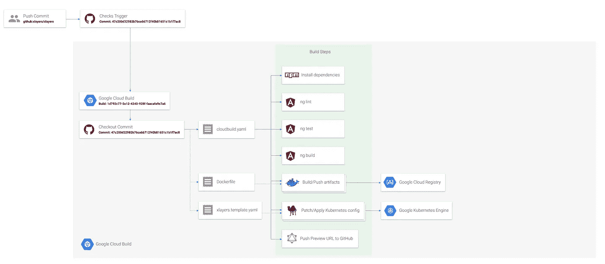

# 现代前端 CI/CD 架构—缺失的指南(部分。1):CI。

> 原文：<https://medium.com/google-cloud/modern-frontend-ci-cd-architecture-the-missing-guide-part-1-8444001fadc?source=collection_archive---------0----------------------->

TL；dr:前端 CI/CD 架构流水线的完整图。

当构建涉及大型团队和[“git flow”分支](https://nvie.com/posts/a-successful-git-branching-model/)模型(或类似的工作流)的现代前端 Web 应用程序时，能够在合并它们之前预览由特定拉请求引入的更改是一项巨大的资产，可以很好地提高生产率。为此，您需要建立一个完整的 CI/CD —一个持续集成和持续部署—管道。

在本帖中，我们将解决这一挑战，并使用以下工具建立一个完整的 CI/CD:

1.  GitHub 作为我们的主要源代码库；
2.  Google Cloud Build 作为我们的 CI 渠道；
3.  Kubernetes 是我们的 CD 渠道。

我们将这篇文章分成三篇独立的子文章:

1.  第一部分将致力于建立 CI 渠道；
2.  [第二部分将解决 CD 管道](/@wassimchegham/modern-frontend-ci-cd-architecture-the-missing-guide-part-2-d51875bd0e65)；
3.  [第三部分将为我们的 CI/CD 渠道增加一些额外功能](/@wassimchegham/modern-frontend-ci-cd-architecture-the-missing-guide-part-3-9a6be231d14)；

# GCP 设置

首先，[在 GCP 创建一个新项目](https://console.cloud.google.com/projectcreate)(或者使用一个已有的项目)。我们将使用 [xLayers.app](https://xlayers.app) 作为我们的示例项目。

然后，您需要启用 [Kubernetes 引擎 API](https://console.cloud.google.com/apis/library/container.googleapis.com) 和[云构建 API](https://console.cloud.google.com/apis/library/cloudbuild.googleapis.com) :

云构建 API

Kubernetes 引擎 API

还要确保编辑类似于**PROJECT_ID@cloudbuild.gserviceaccount.com、**的云构建服务帐户，然后添加 **Kubernetes 引擎管理**角色，以便您可以从云构建步骤运行`kubectl`命令:

编辑[PROJECT_ID@cloudbuild.gserviceaccount.com](mailto:PROJECT_ID@cloudbuild.gserviceaccount.com)服务账户

这里是需要添加的 **Kubernetes 引擎管理员**角色:

添加 **Kubernetes 引擎管理员**角色

这应该是 GCP 的部分。让我们来配置 GitHub 项目。

# GitHub 设置

接下来，创建你的 GitHub 项目或者使用一个现有的项目，并添加 [Google Cloud Build GitHub 应用](https://github.com/marketplace/google-cloud-build):

就是这样！您的 GitHub 项目现在使用 Google Cloud Build 作为 CI 管道。现在让我们为我们项目配置 CI 管道。

# Google Cloud 构建为我们的 CI 渠道

为了使用云构建 CI 构建和测试我们的代码，我们将在 GitHub 项目的根目录下创建一个 cloudbuild.yaml 配置文件，包含以下步骤:

该文件描述了云构建将在 GitHub 上每个打开的 PR 上运行的所有构建步骤。它将(按顺序):

1.  使用`npm install`命令安装 NPM 依赖项；
2.  使用`npm run test:ci`命令测试项目；
3.  使用`npm run build -- --output-path dist/html`命令构建项目。

> 您可以根据需要添加其他步骤。

除了测试和构建我们的项目之外，我们还将动态构建和推送两个新的容器，我们将在 CD 部分使用它们(阅读下一部分):

1.  用当前提交 SHA ( [$SHORT_SHA](https://cloud.google.com/cloud-build/docs/configuring-builds/substitute-variable-values) )标记的第一容器；
2.  用标签`latest`标记的第二个容器，它将总是指向由我们的 CI 构建的“最新”工件。

这些容器是使用这个最小化的 *Dockerfile* 构建的，可以在我们项目的根目录下找到:

我们基本上运行一个简单的 nginx 服务器，它将为我们的应用程序提供内容。此外，我们给它一个定制的 *nginx.conf* 文件(见下文),并将输出构建复制到 nginx 默认的 html 根目录(在容器中):

这样，我们就有了一个测试、构建和存储每次执行的快照的工作 CI:

CI 部分到此为止！以下是我们迄今为止所取得的成就…

持续集成管道。

# 要阅读更多关于 CD 管道的内容，请阅读本文的第 2 部分。

*关注*[*@ manekinekko*](https://twitter.com/manekinekko)*了解更多关于 Web 和云技术的更新。*