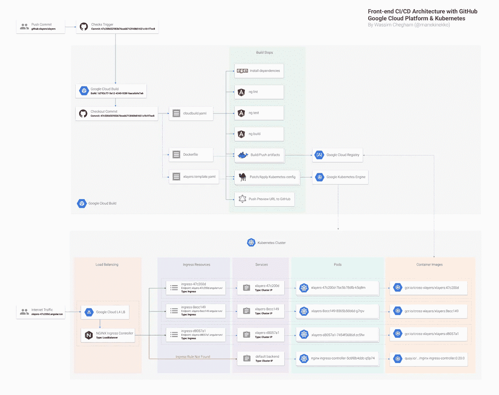

# 现代前端 CI/CD 架构—缺失的指南(部分。2):裁谈会。

> 原文：<https://medium.com/google-cloud/modern-frontend-ci-cd-architecture-the-missing-guide-part-2-d51875bd0e65?source=collection_archive---------1----------------------->

> 这是“现代前端 CI/CD 架构——缺失的指南”的第二部分。我们建议您阅读关于如何建立持续集成管道的第一部分。

TL；dr:前端 CI/CD 架构流水线的完整图。

# Kubernetes 是我们的 CD 渠道

既然我们已经有了一个有效的持续集成，那么让我们使用 Kubernetes 作为部署协调器来配置持续部署。

> 我们假设你熟悉 Kubernetes 的基础知识。如果没有，前往官方网站了解[更多信息](https://kubernetes.io/docs/home/)。

首先，让我们创建一个 Kubernetes 集群(如果您还没有准备好的话)。出于这篇博文的目的，我们将使用 GCP 最近推出的新模板菜单创建一个 **g1-small** 实例:

Kubernetes 集群的 GCP 默认模板配置

> 注意:请确保您为此集群设置了至少 3 个节点，否则 GKE 可能会在升级您的 pod 时遇到一些问题。

接下来，为了让 Kubernetes 部署我们的容器——我们之前通过 CI 管道构建的快照——在每次构建之后，我们将必须创建三个组件(**这些都是我们实现目的所需要的**):

1.  一个[部署控制器](https://kubernetes.io/docs/concepts/workloads/controllers/deployment/)；
2.  一个[服务](https://kubernetes.io/docs/concepts/services-networking/service/)；
3.  一个[入口资源](https://kubernetes.io/docs/concepts/services-networking/ingress/)。

## 部署控制器

这个部署将创建一个 Kubernetes Pod，我们将按照这个定制模式命名它: **xlayers-_SHORT_SHA_。最终的名字看起来会像这样: **xlayers-47c200d。****

> 注意 1:在应用此配置之前，我们将用云构建提供的正确值替换 **_SHORT_SHA_** 。
> 
> 注 2:我们没有为部署指定**副本**。所以这将默认为 1。你可能想要增加[副本](https://kubernetes.io/docs/concepts/workloads/controllers/replicaset/)来满足你的需求。

最重要的是，这个吊舱将被连接到一个名为 **xlayers** 的容器上，位于端口 80。创建的容器基于云构建配置项推送的特定快照映像(参见上述步骤)。

## 服务

该服务指定如何访问由部署创建的 pod 集。目标 pod 由 **spec.selector.app** 字段定义。这里，我们需要在端口 80 上访问这些 pod。

## 入口资源

最后，这个入口资源包含一组允许入站连接到达集群服务的规则。在我们的场景中，我们希望像 https://xlayers-47c200d.angular.run/**T2 这样的 URL 被转发到后端，也就是一个名为 **xlayers-47c200d** 的服务。**

## DNS 配置

为了能够映射子域 ***.angular.run** ，我们需要通过在 DNS 提供程序中添加以下规则来更新 **angular.run** DNS 记录:

这里使用的 IPV4 地址是与您的 Kubernetes 集群的负载平衡器相关联的地址。

> 请注意，这个 IP 地址是短暂的！您可能想要为您的项目保留一个静态 IP 地址。

## 应用所有的东西

我们现在准备尝试我们的 CD 配置。为此，我们将相应地更新 cloudbuild.yaml:

我们使用简单的 Perl search and replace 命令，在构建步骤中简单而自豪地为我们的 Kubernetes 配置(部署、服务、入口)打补丁，该命令用云构建环境 **$SHORT_SHA** 提供的实际值替换我们配置文件中的 **_SHORT_SHA_** 模式。

瞧！

以下是我们迄今为止在裁谈会部分取得的成果:

持续部署管道。

# 要阅读更多关于奖励特性的内容，请阅读本文的第 3 部分。

*关注*[*@ manekinekko*](https://twitter.com/manekinekko)*了解更多关于网络和云技术的更新。*