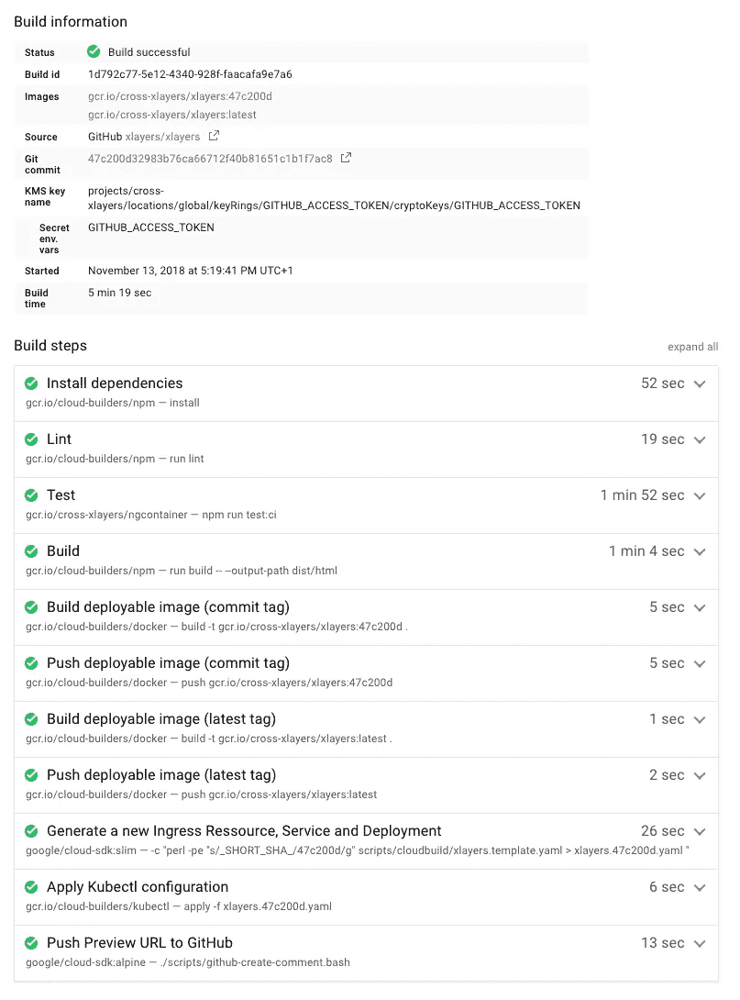

# 现代前端 CI/CD 架构—缺失的指南(部分。3)

> 原文：<https://medium.com/google-cloud/modern-frontend-ci-cd-architecture-the-missing-guide-part-3-9a6be231d14?source=collection_archive---------3----------------------->

> 这是“现代前端 CI/CD 架构——缺失指南”系列的第三部分。我们建议您阅读关于如何建立持续集成管道的[第一部分和关于持续部署](/@wassimchegham/modern-frontend-ci-cd-architecture-the-missing-guide-part-1-8444001fadc)的[第二部分。](/@wassimchegham/modern-frontend-ci-cd-architecture-the-missing-guide-part-3-9a6be231d14)

TL；dr:前端 CI/CD 架构流水线的完整图。

# 奖金…

既然我们已经有了持续集成和部署工作，让我们添加一些有用而重要的特性。

## 评论 GitHub 上相应 PR 上的预览链接

## 1.a 创建 GitHub 访问令牌

为了在 GitHub PR 上创建评论，我们需要从 GitHub 获得一个个人访问令牌(PAT ),以便与 GitHub API 进行对话。

确保为这个令牌选择了`public_repo`范围。这就是我们所需要的:

重要提示:记下这个令牌，我们下一步会用到它。

> 注意:如果您正在您的组织中设置 CI/CD 管道，我们建议您为此创建一个 GitHub 应用程序。为了这篇文章，我们将保持这个过程简单易懂。所以一个基本的 PAT 就足够了。

## 1.b 使用谷歌 KMS 服务存储 GitHub PAT

根据定义，访问令牌是私有令牌，不能公开共享，也不能在 Git 中进行版本控制。因此，为了在 CI/CD 管道中使用 PAT，而不必在 *cloudbuild.yaml* 文件中硬编码令牌，我们需要将 PAT 存储在云密钥管理服务(KMS)中。

像 GCP 上的任何 API 一样，在我们的项目中使用 KMS 之前，我们需要启用它:

KMS 空气污染指数

接下来，我们需要创建一个密匙环(或加密密钥)来保存我们的私有令牌。从菜单侧栏中，转到安全条目，并选择加密密钥选项:

在那里，我们将创建一个**全局**密匙环，为简单起见，将其命名为 **GITHUB_ACCESS_TOKEN** :

现在，让我们加密并存储我们在 KMS 的 GitHub PAT:

**重要提示:记下 base64 输出，我们将在下一步中用到它。**

在我们继续之前，我们只需要授予云构建服务帐户权限来解密我们的加密访问令牌。这将是下一步需要的:

## 1.c 评论 GitHub 上的预览链接

现在我们已经安全地存储了 GitHub 个人访问令牌，我们现在可以在云构建配置文件中添加一个额外的步骤，该步骤将在 PR 上推送一个新的评论，提供新创建的预览链接。

对于这一步，我们将使用 **google/cloud-sdk:alpine** ，因为它为我们提供了定制**github-create-comment . Bash**脚本所需的 Bash、cURL 和 Python 命令。

运行定制脚本时，我们需要为它提供几个环境变量:

*   **PREVIEW_BUILD_URL** :包含新创建的预览链接；
*   **COMMIT_SHA** :包含触发该构建的提交的 SHA。**我们将使用这个特定的 SHA 来确定我们将要评论的 GitHub PR(阅读下文)。**

因为定制脚本将需要 GitHub 访问令牌来创建评论，并且因为我们的 GitHub 令牌现在被安全地加密并存储在 KMS 服务中，所以我们需要告诉云构建服务使用来自 KMS 的 **GITHUB_ACCESS_TOKEN** 密钥。我们通过在 cloudbuild.yaml 文件中配置 **secrets.kmsKeyName** 和**secrets . secret env . github _ ACCESS _ TOKEN**条目来实现这一点。[阅读更多关于在云构建中使用加密资源的信息](https://cloud.google.com/cloud-build/docs/securing-builds/use-encrypted-secrets-credentials)。

现在让我们来看看**github-create-comment . bash**脚本。它的基本功能是:

1.  使用 commit SHA 来查询 GitHub 的 GraphQL API，以获得包含该特定提交的 PR。以下是 GraphQL 查询:

其中:

*   **REPO_NAME** 是 xlayers/xlayers；
*   **COMMIT_SHA** 是来自云构建环境的$COMMIT_SHA。

使用主题 ID——它代表 GitHub 问题 ID——我们现在可以为该问题创建一个新的评论。我们将使用 GraphQL 突变操作来插入新的注释:

其中:

*   **ISSUE_ID** 是上一次查询请求得到的主题 ID；
*   **BODY_CONTENT** 为发布内容。

下面是完整的 BASH 脚本:

> 注意:GraphQL 请求是为 cURL 命令格式化的。

瞧啊。！！

这个特定构建的预览 URL 已经正确生成，并指向正确的容器，我们甚至可以检查我们在应用程序的 index.html(在页脚)中标记的构建 ID:

最后，预览 URL 也被正确地推送到正确的 Github PR:

# 注释和优化

> 这些注释适用于本系列的 3 个部分。

1.  安全:部署(以及预览链接)将在每个 PR 上运行——针对任何人推送的任何提交！出于安全和性能的原因，您可能希望为核心团队成员或特定贡献者启用这个特性。
2.  **构建优化:**在构建容器快照时，我们没有应用任何优化。您可能希望使用一些缓存来加速这个过程。阅读更多关于如何[加速你的构建](https://cloud.google.com/cloud-build/docs/speeding-up-builds)的信息。
3.  **工具:**我们在这篇文章中没有使用 Helm 或者其他 K8s 软件包管理器。我们希望专注于核心功能。使用这样的工具来帮助您管理 K8s 集群取决于您自己。
4.  您可能还希望清理与 GitHub PRs 相关的、已经合并或关闭的、或者具有无效状态的 pod、服务和容器映像(快照)。
5.  这是我们刚刚构建的体系结构的完整示意图(单击可放大):

恭喜你！现在，您拥有了一个完整的完全定制的 CI/CD 管道，可以根据自己的需求进行调整。玩得开心！🎊

特别感谢 [David Gageot](https://twitter.com/dgageot) 对 k8s 入口配置的帮助！

*关注*[*@ manekinekko*](https://twitter.com/manekinekko)*了解更多关于 Web 和云技术的更新。*