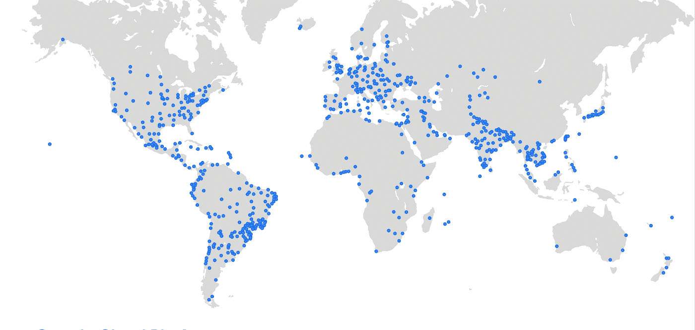
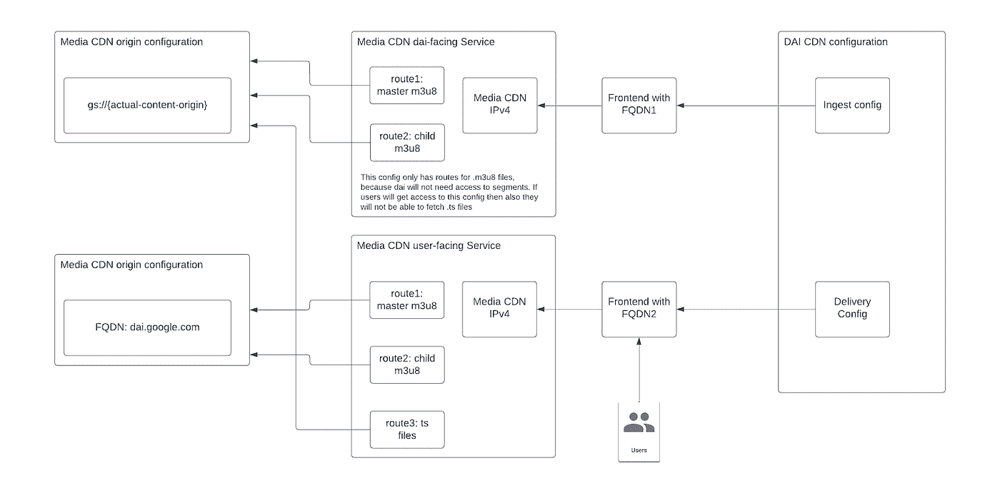
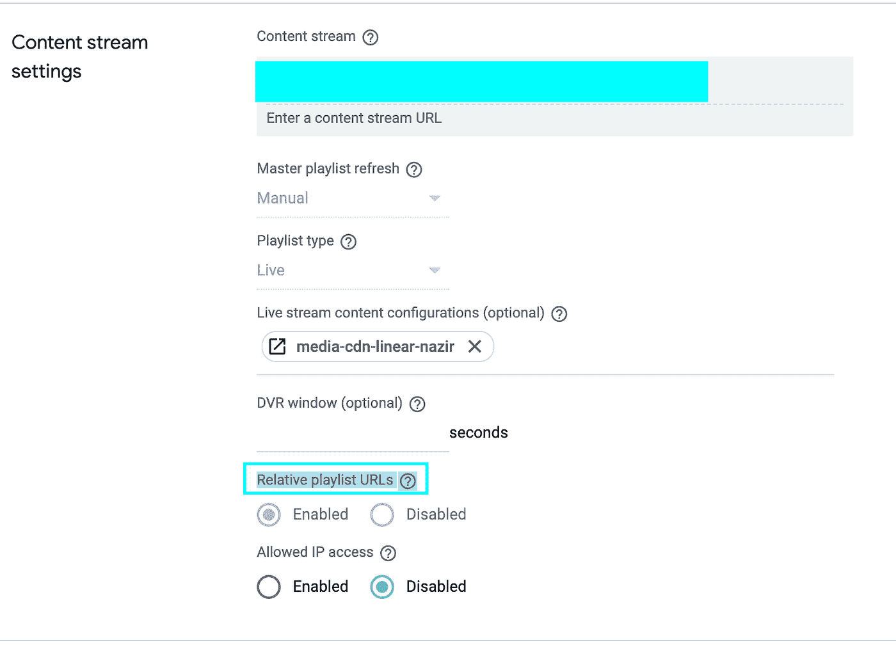

# 通过个性化的用户体验使您的视频流现代化

> 原文：<https://medium.com/google-cloud/modernize-your-video-streaming-with-personalized-user-experience-8dded23d86b2?source=collection_archive---------2----------------------->

希望你在 NEXT22 上有一个很好的体验，在 NEXT 22 期间，我们宣布了对媒体 CDN 上直播流的支持，以及与 T2 谷歌广告管理器 360 和 T4 媒体 CDN 的集成。

在这篇文章中，我将介绍 Media CDN 与 Google Ad Manager 360 之间的集成，以及使用双令牌认证来保护面向客户的 URL。在我们开始技术细节之前，让我们先了解一下媒体 CDN 和谷歌广告管理器。

# 关于媒体 CDN

媒体 CDN 是谷歌云的媒体交付 CDN 平台，专为流媒体视频和大型对象下载而设计。媒体 CDN 补充云 CDN，我们的 web 加速 CDN 平台。

媒体 CDN 的独特之处在于，它利用了我们用来向客户提供内容的基础设施——基于谷歌私有的光纤网络。

非谷歌客户将首次能够访问这个平台，在全球超过 206 个国家/地区和 1300 多个城市提供大规模覆盖和存在。



> 这张地图是我们网络呼吸的图形表示，而不是特定缓存位置的精确指示器。

# 关于谷歌广告经理(GAM)

谷歌广告管理器是一个面向大型出版商的广告管理平台。Ad Manager 提供精细控制，支持多种广告交换和网络，包括 AdSense、广告交换、第三方网络和第三方交换。

广告管理器适合您，如果您需要:

*   一个将所有库存类型(网站、移动应用、视频或游戏)货币化的中心
*   使用第三方网络来竞争广告库存
*   更复杂的报告，以获得更精细的见解

# 将媒体 CDN 与 GAM 集成

如今，越来越多的观众通过各种设备观看电视和视频。在这些设备之间无缝投放相关广告，同时提供出色的体验，已经变得难以实现。

通过媒体 CDN 和 GAM 的集成，我们将通过媒体 CDN 提供现代化的流媒体体验，通过服务器端广告插入(SSAI)提供个性化的用户体验，从而实现两者的完美结合。

通过媒体 CDN 和 GAM 之间的集成，我们将客户端广告集成的复杂性从播放器转移到云，并将广告缝合到流级别的内容中。你得到的是

*   广告和内容之间的无缝观看体验，无需重新缓冲
*   跨任意数量的设备
*   直播、线性和视频点播内容的内容和广告投放
*   针对每个用户的针对性和相关性广告

在我们开始集成之前，我想向您展示一个最终状态架构，以便您很好地了解我们的整体解决方案在部署后的外观。



# 先决条件:

**Media-CDN 先决条件:**

*   两个媒体 CDN 密钥集(一个用于短令牌，一个用于长令牌)
*   两个媒体 CDN 来源(一个指向 dai.google.com，一个指向您的实际来源)
*   启用 SSL 证书的两个媒体 CDN 配置(这是 DAI 的必备功能)。

**GAM 先决条件:**

*   在您的网络中启用了相对播放列表 URL 字段的情况下访问 GAM 360，这是默认情况下在您的 UI 上不可用的预发布功能(您可以在实时流配置的内容流设置中找到此功能。

看下面的截图，并检查您的网络是否支持相对播放列表的网址。如果它没有显示此选项，请联系您的 GAM 团队为您启用它。



# 媒体 CDN 配置

# 用于双令牌认证的短令牌密钥集创建。

DAI 只支持 HMAC，所以您必须为短期令牌创建 HMAC 密钥集。

遵循[https://cloud . Google . com/media-cdn/docs/use-dual-token-authentic ation # setup-short-duration-tokens](https://cloud.google.com/media-cdn/docs/use-dual-token-authentication#set-up-short-duration-tokens)中提到的步骤

为 HMAC 钥匙集创作。

要生成密码，您可以使用以下命令

```
python3.9 -c "import secrets;open('py-shared.secret','wb').write(secrets.token_bytes(32))"
```

将 shared.secret 文件上传到 secret manager 后，它将为您提供 64 个字符的密钥(删除空格后，它将类似于 d 7258 f 90 D2 f 4049 e 14 B1 C5 ecfbc 698 fbcb 925111 ABC 808 DD 17 f 22153 C1 FCC 71d，请记下来，因为这在 DAI 配置中是必需的)

# 用于双令牌认证的长令牌密钥集创建。

遵循[https://cloud . Google . com/Media-cdn/docs/use-dual-token-authentic ation # create-long-duration-keyset](https://cloud.google.com/media-cdn/docs/use-dual-token-authentication#create-long-duration-keyset)中提到的步骤对于媒体 CDN 管理的长令牌，这是 CDN 管理的长令牌，因为媒体 CDN 使用 ED25519 签名来生成和验证长令牌。ED25519 是一种非对称歌唱算法，需要一个私钥用于令牌生成，一个公钥用于令牌验证。

由于 CDN 必须进行生成和验证，因此需要对长密钥集进行 CDN 管理。

# 两个起源的创造

# 傣源

对于主和子清单请求，该起点将指向 dai.google.com。我们将在 Media-CDN 服务中配置路由规则。

作为参考的 YAML 样本。

在您使用 YAML 之前，请在下面的< >之间更改 **<变量>** ，例如，您的项目 ID、项目编号等..，带花括号的变量— {variables}是媒体 CDN 变量，如果不需要，请不要更改它们。

```
name: projects/<your-project-Id>/locations/global/edgeCacheOrigins/dai-origin
updateTime: '2022-09-30T10:25:44.195099638Z'
originAddress: dai.google.com
protocol: HTTP2
timeout:
 connectTimeout: 5s
 maxAttemptsTimeout: 15s
 responseTimeout: 30s
 readTimeout: 15s
createTime: '2022-09-27T05:20:23.011190947Z'
```

# 实际内容来源

这个原点将指向您的实际内容所在的 GCS 存储桶。我们将在面向最终用户的服务和面向 dai 的服务中使用此来源(从 DAI 到媒体 CDN 的异步获取，用于主清单和子清单)。

作为参考的 YAML 样本。

```
name: projects/<your-project-Id>/locations/global/edgeCacheOrigins/content-origin
updateTime: '2022-09-26T06:36:53.721017008Z'
originAddress: gs://<your-GCS-bucket-name>
protocol: HTTP2
port: 443
timeout:
 connectTimeout: 5s
 maxAttemptsTimeout: 15s
 responseTimeout: 30s
 readTimeout: 15s
createTime: '2022-09-26T06:35:44.718831043Z'
```

# 创建两个服务

创建两个服务来获取 IP 地址和配置 SSL 证书。我们将更新服务，一旦我们有游戏流创建。

*   创建服务 yaml — dai-facing.yaml，上传到云壳。

```
name: dai-facing
routing:
  hostRules:
  - hosts:
    - "*"
    pathMatcher: routes
  pathMatchers:
  - name: routes
    routeRules:
    - priority: 1
      matchRules:
      - prefixMatch: "/"
      origin: dai-origin
```

*   使用 yaml 导入服务。

```
gcloud edge-cache services import dai-facing \
  --source={path-to-the-yaml-file}
```

*   通过检查 ipv4Addresses 字段，检索并记录响应中返回的 IP。
*   类似地，创建服务 yaml — customer-facing.yaml 并上传到云外壳。

```
name: customer-facing
routing:
  hostRules:
  - hosts:
    - "*"
    pathMatcher: routes
  pathMatchers:
  - name: routes
    routeRules:
    - priority: 1
      matchRules:
      - prefixMatch: "/"
      origin: content-origin
```

*   使用 yaml 导入服务。

```
gcloud edge-cache services import customer-facing \
  --source=<path-to-the-yaml-file>
```

*   通过检查 ipv4Addresses 字段，检索并记录响应中返回的 IP。

# 配置域以指向 CDN 服务 IP

*   按照[https://cloud . Google . com/DNS/docs/set-up-DNS-records-domain-name # create _ A _ record _ to _ point _ the _ domain _ to _ an _ external _ ip _ address](https://cloud.google.com/dns/docs/set-up-dns-records-domain-name#create_a_record_to_point_the_domain_to_an_external_ip_address)中的步骤创建一条记录，将域指向**面向戴的服务**的 CDN 服务 IP
*   同样，按照[https://cloud . Google . com/DNS/docs/set-up-DNS-records-domain-name # create _ A _ record _ to _ point _ the _ domain _ to _ an _ external _ ip _ address](https://cloud.google.com/dns/docs/set-up-dns-records-domain-name#create_a_record_to_point_the_domain_to_an_external_ip_address)中的步骤，创建一条记录，将域指向**面向客户服务**的 CDN 服务 IP
*   按照[https://cloud . Google . com/media-cdn/docs/configure-SSL-certificates](https://cloud.google.com/media-cdn/docs/configure-ssl-certificates)中的步骤，为**面向 dai 的服务**和**面向客户的服务**创建 SSL 证书

现在我们将在 GAM 中进行 CDN 配置和线性配置

# 游戏配置

# GAM 中的线性 CDN 配置

*   点击**新配置**

**一般设置**

*   **名称** : <给出您的首选 CDN 配置名称>
*   **类型**:直播流内容
*   **摄取设置**
*   **摄取 URL 前缀** : <面向服务的 FQDN>/<前缀 1 > /

#prefix1 是您选择的前缀，对于后续配置，我们将其称为前缀 1

*   **CDN 认证** : Akamai
*   **令牌认证:**启用
*   **令牌认证密钥:** <我们之前创建的 64 个字符长的 HMAC 密钥>

**默认交付设置**

*   **交付 URL 前缀** : <面向客户服务的 FQDN>
*   **安全设置**:勾选“使用摄取安全设置”
*   **主播放列表原点转发类型**:常规
*   **主播放列表原点路径前缀** : / <前缀 1 >
*   点击**保存**

# GAM 中的线性流配置

*   点击**新建直播**

**通用设置**

*   **名称** : <给出你的首选线性流配置名称>
*   **结束时间**:无限制

**内容流设置**

*   **内容流**:https://<FQDN-of-Dai-facing-service>/<prefix 1>/<path-to-master-manifest-file>/index . m3u 8(检查您的主清单文件名是否正确)

#主清单 url，在 FQDN/后带有{前缀 1}

*   **直播流内容配置** : <选择-cdn-配置-名称-我们之前创建的>
*   **相对播放列表网址**:已启用

**广告中断设置**

*   **主广告标签** : <根据您的业务需求选择或添加广告标签 URL>

点击**保存**和找到创建的实时流并记下资产键

**资产关键字** : ABCDEFGHIJKLMNOPQRS

# 更新媒体 CDN 服务:

此时，SSL 证书应该处于活动状态。使用以下命令检查 SSL 证书状态

```
gcloud certificate-manager certificates describe <certificate-name>
```

# 更新面向 dai 的服务:

*   使用 cloud shell 和 import 按照下面的修改更新 dai-facing.yaml 文件。

> 注意:我们只为 m3u8 文件创建路由规则，因为 DAI 只希望从您的源获得 m3u8 文件，而不需要从您的实际源下载实际段。如果有人将访问此 FQDN 和清单文件路径，则媒体 CDN 也不会向请求者提供段，因为没有路由规则。ts 文件。

```
name: projects/<your-project-Id>/locations/global/edgeCacheServices/dai-facing
updateTime: '2022-09-29T07:28:09.450208839Z'
requireTls: true
edgeSslCertificates:
- projects/<your-project-number>/locations/global/certificates/<certificate-name-of-your-dai-facing-service>
routing:
 hostRules:
 - hosts:
   - <FQDN-of-your-dai-facing-service>
   pathMatcher: path-matcher-0
 pathMatchers:
 - name: path-matcher-0
   routeRules:
   - priority: '1'
     matchRules:
     - prefixMatch: /<prefix1>/<path-to-master-manifest-file>/<master-manifest-file-name>.m3u8 #this will point to your master manifest file
     origin: projects/<your-project-number>/locations/global/edgeCacheOrigins/content-origin
     headerAction: {}
     routeAction:
       cdnPolicy:
         cacheMode: FORCE_CACHE_ALL
         defaultTtl: 3600s
         cacheKeyPolicy:
           excludeHost: true
           excludeQueryString: true
         signedRequestMode: DISABLED
       urlRewrite:
         pathPrefixRewrite: /<path-to-master-manifest-file>/<master-manifest-file-name>.m3u8 #Please note - this is without prefix1
   - priority: '2'
     matchRules:
     - pathTemplateMatch: /<prefix1>/<path-to-master-manifest-file>/{variant}/{file}.m3u8 #{variant} and {file} are media cdn supported variables here, if you don’t have folders underneath your master manifest file, please remove {variant}/ from pathTemplateMatch, do not remove curly braces from variables.
     origin: projects/<your-project-number>/locations/global/edgeCacheOrigins/content-origin
     headerAction: {}
     routeAction:
       cdnPolicy:
         cacheMode: FORCE_CACHE_ALL
         defaultTtl: 2s
         cacheKeyPolicy:
           excludeHost: true
           excludeQueryString: true
         signedRequestMode: DISABLED
       urlRewrite:
         pathTemplateRewrite: /<path-to-master-manifest-file>/{variant}/{file}.m3u8 #{variant} and {file} are media cdn supported variables here, if you don’t have folders underneath your master manifest file, please remove {variant}/ from pathTemplateMatch, do not remove curly braces from variables.
logConfig:
 enable: true
 sampleRate: 1.0
createTime: '2022-09-28T12:49:55.392769608Z'
```

*   使用 yaml 导入服务。

```
gcloud edge-cache services import dai-facing \
  --source={path-to-the-yaml-file}
```

# 更新面向用户的服务:

*   按照下面的修改，使用云外壳和导入更新面向客户的. yaml 文件。

```
name: projects/<your-project-Id>/locations/global/edgeCacheServices/customer-facing
updateTime: '2022-09-30T12:31:44.574157874Z'
requireTls: true
edgeSslCertificates:
- projects/<your-project-number>/locations/global/certificates/<certificate-name-of-your-customer-facing-service>
routing:
 hostRules:
 - hosts:
   - <FQDN-of-your-customer-facing-service>
   pathMatcher: path-matcher-0
 pathMatchers:
 - name: path-matcher-0
   routeRules:
   - priority: '1'
     matchRules:
     - pathTemplateMatch: /linear/*/*/*/*/*/*/master.m3u8
     origin: projects/<your-project-number>/locations/global/edgeCacheOrigins/dai-origin
     headerAction:
       responseHeadersToAdd:
       - headerName: x-cdn-status
         headerValue: '{cdn_cache_status}'
     routeAction:
       cdnPolicy:
         cacheMode: CACHE_ALL_STATIC
         defaultTtl: 3600s
         maxTtl: 86400s
         cacheKeyPolicy:
           excludeHost: true
           excludeQueryString: true
         signedRequestMode: REQUIRE_TOKENS
         signedRequestKeyset: <your-short-token-keyset-name> #This is to validate urls and tokens generated by DAI
         signedTokenOptions:
           tokenQueryParameter: hdnea
           allowedSignatureAlgorithms:
           - HMAC_SHA_256
           - ED25519
           - HMAC_SHA1
         addSignatures:
           actions:
           - GENERATE_TOKEN_HLS_COOKIELESS
           keyset: <your-long-token-keyset-name> #This is to add long tokens in query parameters by media CDN
           tokenTtl: 86400s
           tokenQueryParameter: hdntl
           copiedParameters:
           - PathGlobs
           - URLPrefix
           - acl
       urlRewrite:
         hostRewrite: dai.google.com
   - priority: '3'
     matchRules:
     - pathTemplateMatch: /**.ts
     origin: projects/<your-project-number>/locations/global/edgeCacheOrigins/content-origin
     headerAction:
       responseHeadersToAdd:
       - headerName: x-cache-status
         headerValue: '{cdn_cache_status}'
     routeAction:
       cdnPolicy:
         cacheMode: FORCE_CACHE_ALL
         defaultTtl: 31536000s
         cacheKeyPolicy:
           excludeHost: true
           excludeQueryString: true
         negativeCaching: true
         negativeCachingPolicy:
           '403': 120s
           '404': 120s
           '502': 120s
         signedRequestMode: REQUIRE_TOKENS
         signedRequestKeyset: <your-long-token-keyset-name> #This is to validate urls and tokens generated media CDN in response to child manifest
         signedTokenOptions:
           tokenQueryParameter: hdntl
   - priority: '2'
     matchRules:
     - pathTemplateMatch: /**.m3u8
     origin: projects/<your-project-number>/locations/global/edgeCacheOrigins/dai-origin
     headerAction:
       responseHeadersToAdd:
       - headerName: x-cache-status
         headerValue: '{cdn_cache_status}'
     routeAction:
       cdnPolicy:
         cacheMode: CACHE_ALL_STATIC
         defaultTtl: 3600s
         maxTtl: 86400s
         cacheKeyPolicy:
           excludeHost: true
           excludeQueryString: true
         signedRequestMode: REQUIRE_TOKENS
         signedRequestKeyset: <your-long-token-keyset-name> #This is to validate urls and tokens generated by media CDN in response to master manifest file
         signedTokenOptions:
           tokenQueryParameter: hdntl
           allowedSignatureAlgorithms:
           - HMAC_SHA_256
           - ED25519
           - HMAC_SHA1
         addSignatures:
           actions:
           - PROPAGATE_TOKEN_HLS_COOKIELESS #Media CDN can also generate token option for segments, you can also use the GENERATE_TOKEN_HLS_COOKIELESS option here.
           keyset: <your-long-token-keyset-name> #This is to add long tokens in query parameters by media CDN 
           tokenTtl: 86400s
           tokenQueryParameter: hdntl
           copiedParameters:
           - PathGlobs
           - URLPrefix
           - acl
       urlRewrite:
         hostRewrite: dai.google.com
logConfig:
 enable: true
 sampleRate: 1.0
createTime: '2022-09-26T06:58:15.925641821Z'
```

*   使用 yaml 导入服务。

```
gcloud edge-cache services import customer-facing \
 - source=<path-to-the-yaml-file>
```

完成后，尝试玩游戏的网址和插入 SCTE 标记来测试你的集成。

# 庆祝🥳的时间到了

希望你一直陪着我，直到旅程结束，给自己一个应有的奖励，使用**媒体 CDN** 构建现代化的流媒体方法，使用**谷歌**规模的谷歌广告管理器构建个性化的用户体验。

请与我分享您的反馈，并建议我应该在下一篇关于 GCP 媒体产品的博客中包含哪些内容。

**免责声明:**这是为了告知读者，文中表达的观点、想法和意见仅属于作者，不一定属于作者的雇主、组织、委员会或其他团体或个人。