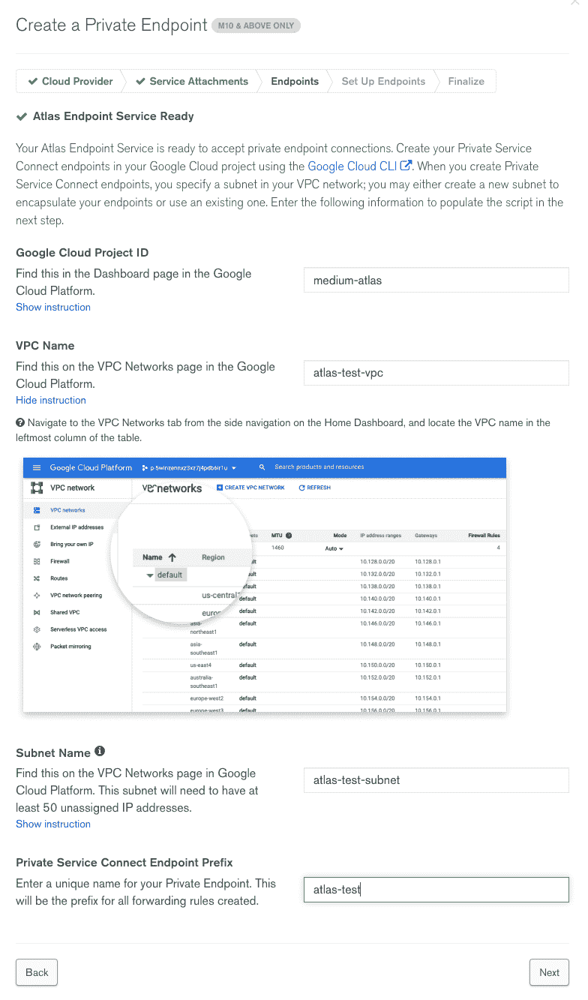
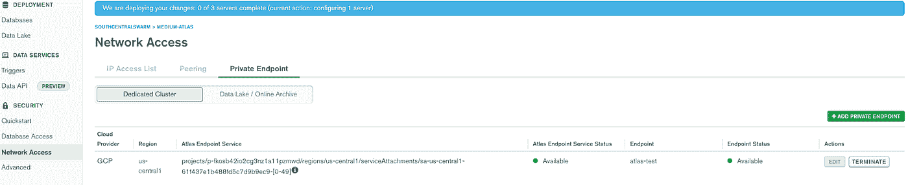
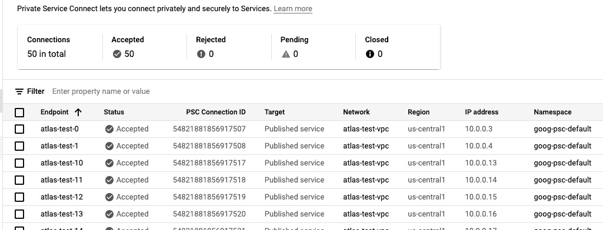
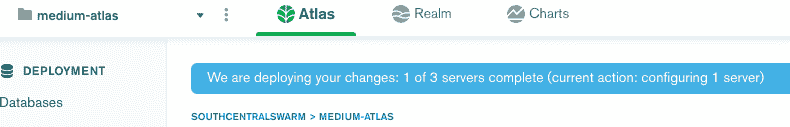
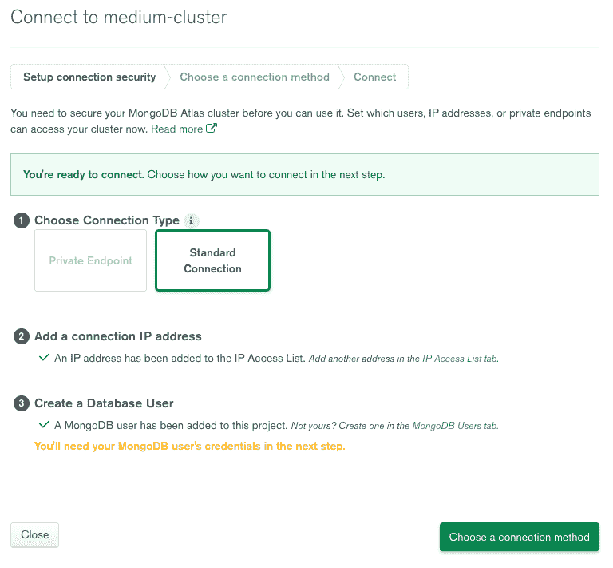
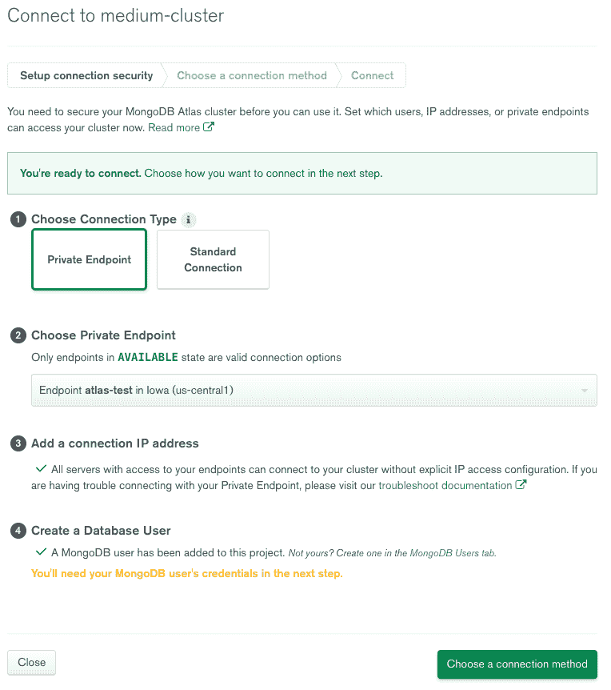

# 通过私有服务连接访问 Google Cloud 中的 MongoDB Atlas

> 原文：<https://medium.com/google-cloud/mongodb-atlas-in-google-cloud-accessed-by-private-service-connect-a4996bf6cfb4?source=collection_archive---------2----------------------->

# 介绍

MongoDB 是一个 NoSQL 数据库，自 2009 年推出以来已经聚集了大量的追随者，因为人们已经认识到需要存储所有数据，而不必理解它的每一个细微差别。community edition 随处可见，由于其相对较低的管理开销和较低的设计门槛，开发人员已经将它集成到应用程序中，这通常超出了普通 IT 管理人员的权限。

MongoDB 在 2016 年推出了他们的云产品 Atlas。这提供了一个带有“全局集群”的 MongoDB 托管服务。这使您能够使用云服务提供商(CSP)的底层基础设施，让您的数据更接近消费者，以最低的运营开销提供高可用性和灾难恢复。

最初，如果您需要从 Google Cloud 项目外部访问数据库，MongoDB 集群的 IP 地址是公开的，您可以将入站流量限制在特定的、允许的 IP 地址。然后是对网络对等的支持，这需要将您的网络对等到托管的 MongoDB 服务数据库所在的网络，但这意味着可能会暴露一系列 IP 地址。

接下来也是本指南的主题，是私有服务连接(PSC ),它允许您通过 VPC 上的 RFC1918 IP 地址连接到 Google Cloud 中的 MongoDB 集群。在 MongoDB Atlas“producer”项目中，没有流量通过互联网传输，您也不会接触到 IP 地址。

# 重要术语词汇表:

生产者项目—生产托管服务的项目。

消费者项目—消费托管服务的项目。

RFC1918 地址—通常的私有范围(10.x.x.x，192.168.x.x，172.16.x.x)

服务附件—服务生产者通过服务附件公开 thor 服务，该服务附件从内部负载平衡器([链接](https://cloud.google.com/vpc/docs/private-service-connect#service-attachments))获取流量路由

共享 VPC —在“主机项目”中创建和管理的 VPC，但由不同“服务项目”中的基础架构使用。

# 从哪里开始？

*   我正在一台苹果电脑上工作，我将从这台电脑上访问谷歌云和 Atlas 网络控制台。
*   我将创建一个名为 test/dev 的 Debian Linux 实例，通过本地 IP 地址测试 MongoDB 服务的可访问性。因为我们将不得不允许从一个地址访问 API，这可能比我们访问控制台的机器更短暂。由于这个原因，我将允许这个实例的外部 ip 地址用于 API 访问，因为在这个过程中我必须运行一个特权脚本。

## 在 Atlas 项目中配置 Atlas 端

*   在[https://cloud.mongodb.com/](https://cloud.mongodb.com/)的一个组织下设立一个项目。我不会对 MongoDB Atlas 本身做太多的描述，但我更愿意把重点放在连接上。
*   在项目中创建一个集群——我们至少需要一个 M10 来支持网络对等/PSC 功能([链接](https://docs.atlas.mongodb.com/cluster-tier/#free--shared--and-dedicated-cluster-comparison)
*   现在在左边的菜单上你会发现一个“网络访问”标签。您可以在这里设置可以从哪些 IP 地址访问集群中的数据。我将用子网为 10.0.0.0/23 的谷歌云 VPC 对此进行测试。请注意，这是一个专用 RFC1918 范围，Atlas 现在将向其打开防火墙。

## 在你的谷歌云项目中

*   创建一个名为 atlas-test-vpc 的 VPC，子网为 10.0.0.0/23，名为 atlas-test-subnet，与 MongoDB Atlas 集群位于同一区域。
*   在 atlas-test-subnet 上创建一个名为 atlas-test-vm 的测试/开发虚拟机。
*   允许完全访问云 API
*   给虚拟机一个网络标签 dev，这样就可以通过标签将流量转发到防火墙。
*   在刚刚创建的子网上，为虚拟机分配一个临时外部 ip 地址和一个临时内部 IP 地址。
*   在 atlas-test-vpc 上，添加一个防火墙规则，将所有来自您访问 web 接口的机器(【www.whatismyip.com】)的流量转发到标记为 dev 的实例(您的测试/开发实例)。
*   您的测试/开发实例现在可以连接到。

运行以下命令以连接到您的测试实例:

> g cloud beta compute ssh—zone“us-central 1-a”“atlas-test-VM”—项目“medium-atlas”

## 在 VPC 上的测试/开发实例上

*   一旦连接
*   按照下面的步骤安装 mongo CLI:[https://docs.mongodb.com/mongocli/stable/install/](https://docs.mongodb.com/mongocli/stable/install/)
*   安装 Mongo Shell

> sudo apt-get install-y MongoDB-mongosh

## 设置专用端点组

*   在 Atlas 项目中，单击左侧的“网络访问”
*   “私有端点”→“添加私有端点”
*   选择您的子网所在的地区，将会创建一个服务附件。
*   接下来，填写您的 Google Cloud 项目特定信息。

*   单击“下一步”，将为您生成一个脚本，其中包含您的项目规范。
*   将脚本复制到安装了 Google Cloud SDK 的测试/开发机器上名为 setup_psc.sh 的文件中。通过运行 chmod +x setup_psc.sh 使其可执行。
*   现在运行它，它将保留必要的 ip 地址，即使它们不连续，并创建从您的 Google Cloud VPC 上的 50 个 IP 地址到 Atlas producer 项目中为您的端点服务保留的 50 个端点的转发规则。
*   运行该脚本需要几分钟时间。
*   这个脚本完全在 Google Cloud 上运行，因此不需要 Atlas API 密钥。

在我的环境中，该脚本如下所示(atlas-test 是我的自定义 PSC 端点前缀):

> #!/bin/bash
> 
> gcloud 配置集项目中等-图册
> 
> 对于{ 0 }中的 I..49}
> 
> 做
> 
> gcloud 计算地址创建 atlas-test-IP-$ I-region = us-central 1-subnet = atlas-test-subnet
> 
> 完成的
> 
> 对于{ 0 }中的 I..49}
> 
> 做
> 
> 如果[$(g cloud compute addresses describe atlas-test-IP-$ I-region = us-central 1-format = " value(status)")！= "保留"]；然后
> 
> echo“atlas-test-IP-$ I 不保留”；
> 
> 出口 1；
> 
> 船方不负担装货费用
> 
> 完成的
> 
> 对于{ 0 }中的 I..49}
> 
> 做
> 
> g cloud compute forwarding-rules create atlas-test-$ I-region = us-central 1-network = atlas-test-VPC-address = atlas-test-IP-$ I-target-service-attachment = projects/p-fkosb 42 io 2c G3 NZ 1a 11 pzmwd/regions/us-central 1/service attachments/sa-us-central 1–61f 437 E1 b 488 FD 5 c 7d 9 b 9 EC 9-$ I
> 
> 完成的
> 
> if[$(g cloud compute forwarding-rules list-regions = us-central 1-format = " CSV[no-heading](name)"-filter = " name:atlas-test " | WC-l)-gt 50]；然后
> 
> echo "项目有太多与前缀 atlas-test 匹配的转发规则。请删除竞争资源或选择另一个终结点前缀。
> 
> 出口 2；
> 
> 船方不负担装货费用
> 
> g cloud compute forwarding-rules list—regions = us-central 1—format = " JSON(IP address，name)"—filter = " name:atlas-test " > atlasEndpoints-atlas-test . JSON

*   该脚本将在名为 atlasEndpoints-atlas-test.json 的文件中返回端点列表。
*   我将它上传到一个 Google 云存储桶，如下所示，并从那里下载到我正在逐步完成连接向导的实例，但是我将让您来决定通过 web 控制台上传文件的最佳方式。

> # vim 创建文件并粘贴内容
> 
> vim setup_spc.sh
> 
> #将脚本粘贴到文件中，并使其可执行
> 
> chmod +x setup_psc.sh
> 
> #运行安装文件
> 
> 。/setup_psc.sh
> 
> #返回以下文件的 ip 地址到服务附件映射
> 
> 卡特彼勒 atlasEndpoints-atlas-test.json
> 
> #为文件制作一个存储桶
> 
> gsutil mb gs://medium-atlas
> 
> #将文件复制到桶中
> 
> gsutil CP atlas endpoints-atlas-test . JSON GS://medium-atlas
> 
> #现在在您浏览 Atlas 控制台的计算机上
> 
> #现在复制文件，准备上传到安装向导中
> 
> gsutil cp gs://medium-atlas/*。
> 
> #现在删除桶以减少混乱
> 
> gsutil rm -r gs://medium-atlas

*   上传文件后，Atlas 将遍历每个转发规则，将其映射到端点。这可能需要很长时间(30 分钟创建服务附件，另外 30 分钟应用到集群)。

一旦端点状态为“可用”，我们就可以开始连接了。

*   在“网络服务”→“私人服务连接”下，您会发现一个转发规则列表，描述了 IP 地址如何被转发到生产者项目中的服务附件。

以下是一个示例:

*   即使服务附件映射已经完成，服务器更新也需要一段时间，所以请等待顶部的蓝色横幅消失。

*   此时，您可以转到左侧的“数据库”→“连接”
*   在配置更改部署到群集中的所有服务器之前，“专用端点”将呈灰色显示。

*   耐心点，很多管道工程正在为你做！
*   大约花了一个小时，我的 3 个服务器才可用，在我刷新页面之前，单击 connect 按钮并没有产生一个可点击的“私有端点”连接方法。但是在页面刷新之后:

*   单击“选择连接方法”
*   点击“用 MongoDB Shell 连接”
*   单击“我已经安装了 MongoDB Shell ”,因为我们已经在测试实例中安装了它。
*   选择您的 shell 版本，并复制连接字符串。

> mongosh " MongoDB+SRV://medium-cluster-pl-0 . oqryx . MongoDB . net/myFirstDatabase "-username { user }

*   将其复制到测试实例的命令行中。
*   在命令行中运行它，您将得到如下内容:

> mongosh " MongoDB+SRV://medium-cluster-pl-0 . oqryx . MongoDB . net/myFirstDatabase "-用户名{name}
> 
> 输入密码:*****
> 
> 当前 Mongosh 日志 ID: 61f475f5ef14ae5b8d86301c
> 
> 连接到:MongoDB+SRV://medium-cluster-pl-0 . oqryx . MongoDB . net/myFirstDatabase？appName=mongosh+1.1.9
> 
> 使用 MongoDB: 4.4.12
> 
> 使用 Mongosh: 1.1.9
> 
> 关于蒙哥语的信息，请看:[https://docs.mongodb.com/mongodb-shell/](https://docs.mongodb.com/mongodb-shell/)
> 
> 为了帮助改进我们的产品，我们会定期收集匿名使用数据并发送给 MongoDB(https://www . MongoDB . com/legal/privacy-policy)。
> 
> 您可以通过运行 disableTelemetry()命令退出。
> 
> atlas atlas-2g cksc-shard-0[primary]my first database >

## 结论:

现在，您已经配置了从您的 Google Cloud 项目和 VPC 到托管 Atlas MongoDB 服务的访问，并且它在您的 VPC 本地的 IP 地址上可用。

您可以将集群扩展到 50 个 MongoDB 节点，并且可以使用控制台中提供的一个简单的连接字符串进行连接。

如果您将服务端点映射到的 VPC 是主机项目中的共享 VPC，那么您将能够从任何附加的服务项目访问 MongoDB。