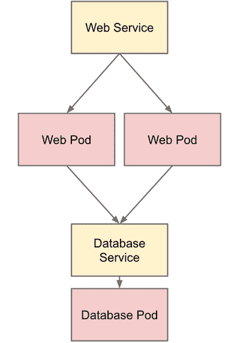

# 带有 Kubernetes 的 MongoDB 副本集

> 原文：<https://medium.com/google-cloud/mongodb-replica-sets-with-kubernetes-d96606bd9474?source=collection_archive---------0----------------------->

> **这篇博文现在已经过时了！请查看更新版本**
> 
> [**http://blog . kubernetes . io/2017/01/running-MongoDB-on-kubernetes-with-stateful sets . html**](http://blog.kubernetes.io/2017/01/running-mongodb-on-kubernetes-with-statefulsets.html)

如果你关注了我的前两篇文章( [1](http://blog.sandeepdinesh.com/2015/07/running-mean-web-application-in-docker.html) ， [2](/google-cloud/running-a-mean-stack-on-google-cloud-platform-with-kubernetes-149ca81c2b5d#.bjsnequp5) )，你就成功地用 Docker 容器建立并运行了一个 MEAN stack，并用 Kubernetes 使它可扩展。最终，我们得到了如下所示的服务堆栈:



今天，我想把重点放在栈的 MongoDB 数据库层。我假设你熟悉 Kubernetes 的核心概念；如果没有，你应该看看我以前的博客帖子。

使用 Kubernetes，数据库系统比标准的单实例 MongoDB 设置更加健壮。如果 MongoDB 实例死亡，Kubernetes 将自动构建一个新的实例。

然而，这意味着我们将有几秒到几分钟的停机时间，而一个新的吊舱旋转起来。此外，如果数据遭到破坏(这不太可能，但有可能)，就没有备份。

您可以通过运行一个 [MongoDB 副本集](https://docs.mongodb.org/manual/core/replication-introduction/)来解决这个问题。但是在 Kubernetes 上怎么做呢？

只需一个简单的命令，就可以轻松扩展 web pods:

```
$ kubectl scale rc web — replicas=5
```

然而，扩展数据库要复杂得多。

*注意:如果你对 MySQL 感兴趣，可以看看 YouTube 上的一个 OSS 项目*[*Vitess*](http://vitess.io/)*，它可以让你在 Kubernetes 上运行一个自动分片的 MySQL 集群。*

# 为什么扩展数据库很困难？

如果你只是想学习如何做，跳过这一节。

与 web 窗格不同，数据库窗格附加了一个 gcePersistentDisk。如果您尝试扩展复制控制器，所有的 pod 将尝试装载同一个磁盘，这是不可能的。即使这是可能的(使用网络驱动器)，这也不是一件好事，因为一个实例中的数据损坏会破坏整个集合，并且 I/O 速度会非常慢。

每个 MongoDB pod 都需要自己的 gcePersistentDisk，这意味着每个 pod 都需要自己的复制控制器。每个 pod 还需要找到副本集的其他成员并注册自己。所有这些都需要自动化。

# 步骤 0:清理(可选)

如果前一篇博客文章中的复制控制器和服务仍在运行，要么创建一个新的集群，要么删除它们。

# 步骤 1:创建副本集

通常，你可以按照这些文档来创建一个副本集。这包括登录每个实例、运行几个命令和硬编码 IP 地址，这些在 Kubernetes 集群中都不好。

**幸运的是，你不需要做任何事情。**

我们将使用一个“边车”来自动配置我们的副本集。如您所知，一个 pod 可以包含多个容器。边车是帮助“主”容器的容器。在这种情况下，我们的 sidecar 将自动发现和配置我们的副本集，并配置主 MongoDB 容器。

副本集将被称为:

```
rs0
```

首先下载代码:

```
$ git clone [https://github.com/leportlabs/mongo-k8s-sidecar.git](https://github.com/leportlabs/mongo-k8s-sidecar.git)
```

现在转到示例目录:

```
$ cd mongo-k8s-sidecar/example/
```

在那里，您将找到一个 Makefile，它将管理 MongoDB 副本集。

要了解集群中当前有多少 MongoDB 副本，请运行:

```
$ make count
```

您应该会看到以下输出:

```
Current Number of MongoDB Replicas: 0
```

如果您没有看到这一点，请确保您的 kubectl 工具正在工作。

现在，让我们添加一个副本:

```
$ make add-replica DISK_SIZE=200GB ZONE=us-central1-f
```

**用集群的区域替换 us-central1-f。**

这将创建一个新磁盘来存储您的数据，然后启动一个复制控制器，该控制器将启动一个 MongoDB 实例和一个映射到这个新实例的服务。

现在，运行:

```
$ make count
```

您应该会看到以下内容:

```
$ Current Number of MongoDB Replicas: 1
```

太棒了。现在再创建两个实例(只需再次运行相同的 make add-replica 命令)。最佳做法要求奇数个副本，标准数量是三个。

现在，您已经设置并运行了一个三实例复制副本！

要删除复制副本，只需运行:

```
$ make delete-replica
```

> 除非你确切地知道你在做什么，否则总是使用这个 Makefile 来创建和销毁副本。

# 步骤 2:连接到副本集

*要连接到副本集，请确保您设置了“slaveOk: true”和“replicaSet: 'rs0 '”。更多细节见下面要点中的选项变量(第 51 行)。*

在我们有一个 MongoDB 实例的情况下，我们创建了一个名为“mongo”的服务，它映射到 pod，并在我们的连接字符串中使用该服务，例如:

```
var url = ‘mongodb://mongo:27017/dbname_?’;
```

如果我们再次尝试同样的事情，它不会工作。Kubernetes 服务只会给我们一个随机的 MongoDB pod 的 IP 地址，而不是所有的。根据 MongoDB 文档，给定一个 IP 地址，应该可以自动找到副本集的其他成员，但不幸的是，情况似乎并非如此。

有两种方法可以解决这个问题。

## 选项 1(简单):

默认情况下，Makefile 将为每个 MongoDB 实例创建一个服务。如果我们有三个实例，只需将连接字符串的主机部分更改为包含所有三个服务。

例如:

```
$ var url = ‘mongodb://mongo-1,mongo-2,mongo-3:27017/dbname_?’;
```

这是做这件事最简单的方法。

## 选项 2(复杂):

选项一的问题是，您必须为每个 MongoDB 实例创建一个新的服务，并且每当您向副本集添加更多副本时，您都需要进行代码更改！对于 90%的用例来说，这可能不是问题，因为你不会经常添加副本。

这感觉不像 Kubernetes 或微服务的做事方式。您不必事先知道您正在运行多少个副本；那应该被抽象掉。

因此，我们可以 ping Kubernetes API 来获取所有 MongoDB 实例的实际 pod IP 地址，而不是使用服务。为此，我编写了一个简单的微服务:

```
$ git clone [https://github.com/thesandlord/kubernetes-pod-ip-finder.git](https://github.com/thesandlord/kubernetes-pod-ip-finder.git)
$ cd [kubernetes-pod-ip-finder](https://github.com/thesandlord/kubernetes-pod-ip-finder.git)
```

要启动微服务:

```
$ kubectl create -f service.yaml
$ kubectl create -f controller.yaml
```

这创建了一个简单的 REST 端点，您可以查询 pod IP 地址。

> O **选项一是静态的，不太灵活，但是选项二有性能开销，需要定制代码。你总是可以从选项一开始，如果你需要更大的灵活性，可以转到选项二。**

这是一个使用此服务获取 IP 地址的示例应用程序，查看第 66–72 行，了解我如何使用此微服务获取 IP 地址:

# 结束语

这样，与以前相比，您现在有了一个更适合生产的 MongoDB 设置！在我的测试中，即使关闭一个虚拟机也不会有任何影响；Kubernetes 只是将 pod 和卷重新安排到另一台机器上！如果主副本宕机，MongoDB 副本集需要 [10 秒来选举新的主副本](https://docs.mongodb.org/manual/core/replica-set-elections/#heartbeats)，但这是您可能经历的最糟糕的宕机时间。

还有，我的大部分样本代码只在 Google 云平台上工作。我希望 PRs 增加对其他云和本地部署的支持。感谢[cvalance](https://github.com/cvallance)合并我的边车 PR。特别感谢 [Stephen](https://github.com/stephenitis) 的所有帮助——我真的希望看到类似的关于使用 [Flocker](https://clusterhq.com/flocker/introduction/) 而不是 gcePersistentDisks 来管理 MongoDB 卷的博客帖子，这样它甚至可以在本地工作！

如果有任何问题，发推文@ sandeepdinesh 给我。