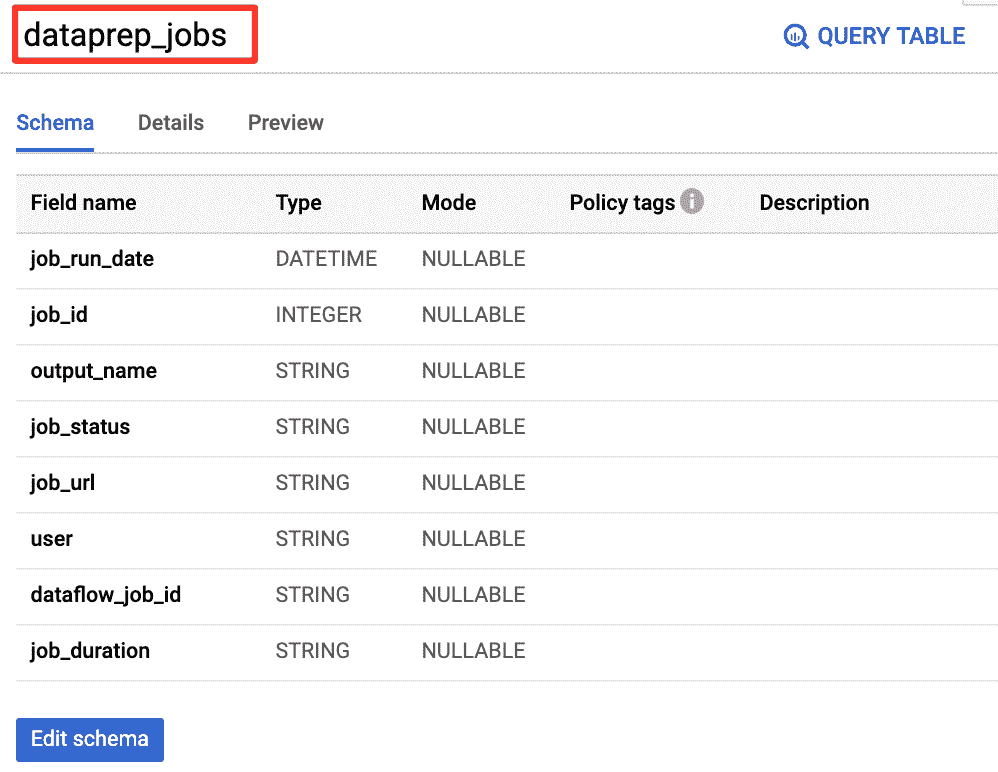

# 使用 Data Studio 监控您的 BigQuery 数据仓库 Dataprep 管道

> 原文：<https://medium.com/google-cloud/monitor-your-bigquery-data-warehouse-dataprep-pipeline-with-data-studio-8e46b2beda1?source=collection_archive---------3----------------------->

如果您在现代数据堆栈(如 Google Cloud)上管理 BigQuery 数据仓库或数据湖的数据分析管道，您可能希望对其进行监控，并获得端到端分析流程的全面视图，以便在出现问题时快速做出反应，或者在一切正常工作时高枕无忧。

在上一篇文章中，我已经演示了如何使用简单的 Google Sheet 来[监控您的 Dataprep 作业，但是为什么不在 Data Studio 中使用一个漂亮且可操作的仪表板来将它提升到下一个级别呢？](https://www.trifacta.com/blog/monitor-jobs-google-sheet/)

本文解释了如何通过利用云函数的 API 来捕获云数据准备作业的状态和细节。然后，我们将这些信息输入到 Google BigQuery 表中，以监控连接到该表的 Data Studio 报告中的作业。

为了说明这个概念，我们将假设您想要监控一个每日调度的 Dataprep 作业，并通过快速查看 Data Studio 仪表板来了解潜在故障的概况。您将能够检查输出数据集名称、作业持续时间、用户名、数据流作业 id，并直接在 Cloud Dataprep 控制台中钻取到 Dataprep 作业详细信息和配置文件结果。

本文一步一步地介绍了当一个[云数据准备](https://cloud.google.com/dataprep)任务完成时触发一个[云函数](https://cloud.google.com/functions)并将任务结果、状态和直接链接发布到一个 [Google BigQuery](https://cloud.google.com/bigquery) 表中，以便在 [Google Data Studio](https://marketingplatform.google.com/about/data-studio/) 中进行报告的过程。

这是一个带有云数据准备工作结果监控的 Google Data Studio 报告的例子。

图 1 — [带有 Dataprep 作业结果的 Google Data Studio 报告](https://datastudio.google.com/s/uAmjiPmyB1Q)

这里是整个解决方案的概述，该解决方案用于捕获 Dataprep 作业结果并将它们加载到 BigQuery，这要感谢用于自动化和 Data Studio for reporting 的云函数和 API。

图 2 —基于云数据准备作业执行触发云功能的高级流程。

## 1.入门指南

为了让这个指南实用，我们在 Github 这里分享了云功能的 Python 代码，在[这里分享了 Data Studio dashboard](https://datastudio.google.com/s/uAmjiPmyB1Q) 。

你需要一个有效的谷歌帐户，并访问云数据准备，云功能和谷歌大查询来尝试它。你可以从 https://console.cloud.google.com/的谷歌控制台[开始激活各种服务。](https://console.cloud.google.com/)

**备注**:要调用 API，需要一个访问令牌，您可以从您的首选项页面生成它。

图 3 —从设置菜单中获取访问令牌

## 2.创建 BigQuery 表来存储作业状态和详细信息

在 BigQuery 数据集中，创建以下表模式来存储所有作业信息:

创建表` default . data prep _ jobs`
(
job _ run _ date DATETIME，
job_id INT64，
output_name 字符串，
job_status 字符串，
job_url 字符串，
user 字符串，
dataflow_job_id 字符串，
duration 字符串

图 Dataprep 作业的 BigQuery 表模式

## 3.创建 HTTP 云函数以在 Google BigQuery 表中发布

首先，我们需要创建 HTTP Cloud 函数，当 Dataprep 作业完成时，它将作为 Webhook 被触发。

从谷歌云控制台[这里](https://console.cloud.google.com/functions/)创建一个云功能。

触发类型必须是“ **HTTP** ”。

给它起个名字，得到一个类似[https://us-central 1-data prep-premium-demo . cloud functions . net/Job-Result-Google-big query](https://us-central1-dataprep-premium-demo.cloudfunctions.net/Job-Result-Google-BigQuery)的 URL。

稍后，在 Dataprep 中创建 Webhook 时，我们将需要这个 URL。

在我们的例子中，我们将使用上面提供的 **Python** 代码，作为源代码部分下的运行时。

图 5 创建从 Dataprep 调用的云函数

如果你需要探索更多关于云函数的知识，我推荐你看看这篇[教程](https://cloud.google.com/functions/docs/tutorials/storage)。

云函数代码遵循以下逻辑:

1.  检索由 Dataprep 提供的作业 id 和状态(失败或完成)。
2.  在 API 调用中利用 Dataprep 用户访问令牌，以便由云 Dataprep 进行身份验证。
3.  使用*getJobGroup***data prep API 调用获取有关作业的更多信息(输出数据集名称、用户名、持续时间、数据流作业 id)。关于这个 Dataprep API 端点的文档可以在这里找到[https://clouddataprep . com/documentation/API/# operation/getJobGroup](https://clouddataprep.com/documentation/api/#operation/getJobGroup)**
4.  **在 Google BigQuery 表中插入工作细节(工作结果页面 url 是[https://clouddataprep.com/jobs/<jobID>)。](https://clouddataprep.com/jobs/%3CjobID%3E)**

****

**图 6 —获取作业详细信息并将作业结果状态插入 Google BigQuery 表的 Python 代码**

**完整的 Python 代码在 Github 中的[。](https://github.com/victorcouste/google-cloudfunctions-dataprep/blob/master/job-result-google-bigquery.py)**

**您需要编辑粗体突出显示的值，并将其替换为从您的 Cloud Dataprep 项目中检索到的正确值。**

*   **调用 Dataprep API 的访问令牌:**

**data prep _ auth _ token = "**eyjhdgkghd……ezhjkdfsghk**"**

*   **Google BigQuery 数据集和表名:**

**#准备对数据集
dataset _ ref = big query _ client . dataset(**default**')
table _ ref = dataset _ ref . table(**data prep _ jobs**')的引用**

**您还需要将以下依赖项添加到您的 Python 云函数中(参见 requirements.txt 选项卡，如下图所示) :**

**requests = = 2 . 24 . 0
Google-cloud-big query
日期时间**

****

**图 7 — Python 依赖包**

**然后，您需要部署云功能。部署之后，云函数启动并运行，等待在执行作业时从 Cloud Dataprep 调用。你可以在这里了解更多关于部署和执行云功能的信息。**

## **4.创建一个云数据准备流并配置一个 Webhook**

**接下来，您需要创建 Cloud Dataprep 流，该流将调用 HTTP Cloud 函数将作业结果和细节发布到您的 Google BigQuery 表中。**

**并且您需要在您的流中创建和配置一个 Webhook 任务，它将调用您的 HTTP Cloud 函数。**

****

**图 8——创建云数据准备流程并在流程上配置 Webhook 任务**

**Webhook 任务需要配置以下信息:**

*   ****URL** :是您之前创建的 HTTP 云功能的 URL。例如[https://us-central 1-data prep-premium-demo . cloud functions . net/data prep-web hook-Function](https://us-central1-dataprep-premium-demo.cloudfunctions.net/Dataprep-Webhook-Function)**
*   ****标题**如下图所示，内容类型和应用/json**
*   ****值为{"jobid":"$jobId "，" job status ":" $ job status " }**的正文，如下图所示******
*   ******触发事件**，您可以决定触发任何状态的 Webhook，或者只触发失败或完成的作业。****
*   ******触发对象**，您可以决定只为流程中的特定输出，或者为流程中执行的任何作业触发 Webhook。****

****输入这些信息后，您就可以测试您的 Webhook 任务了。****

********

****图 9 —调用云函数的 Webhook 任务参数****

****保存 Webhook 任务后，就可以在执行作业时调用它了。****

********

****图 10 —创建的 Webhook 任务****

## ****5.测试端到端流程****

****现在，您已经准备好通过运行 Dataprep 作业中的作业来测试端到端流程，并查看添加到 BigQuery 表中的作业状态和细节。****

********

****图 11 —运行一个数据准备作业****

********

****图 12 — Dataprep 作业结果和 Webhook 任务完成****

********

****图 13—Google big query 表中发布的作业结果状态和详细信息****

********

****图 13—Google Data Studio 仪表板中显示的作业结果状态和详细信息****

****最后，您还可以通过查看位于[此处](https://console.cloud.google.com/logs/viewer?resource=cloud_function)的 Google Cloud Functions 日志来检查正确的执行细节(带参数的 API 调用和 Cloud Dataprep 作业状态)。****

********

****图 14 —云函数日志****

## ****结论****

****通过完成这个逐步指南，您已经完成了在 Google BigQuery 表中自动发布 Dataprep 作业结果的基本原则，因此您可以通过一个有吸引力的 Data Studio 仪表板轻松地监控和向更广泛的团队共享摘要信息。****

****您已经了解了:****

*   ****[云数据准备 API](https://api.trifacta.com/dataprep-premium)****
*   ****[Cloud Dataprep Webhook](https://docs.trifacta.com/display/DP/Overview+of+Operationalization#OverviewofOperationalization-Webhooks)****
*   ****HTTP 云函数调用 API****

****您还可以扩展该解决方案，以监控额外的 Google 云服务，实现端到端的数据管道监控。****

****现在，您可以自动监控您的工作状态了。****

****您还可以利用另一个云功能或外部调度程序来自动化云数据准备。看看这些文章，它们解释了[如何使用 Cloud Composer](https://cloud.google.com/blog/products/data-analytics/how-to-orchestrate-cloud-dataprep-jobs-using-cloud-composer) 编排云数据准备作业，以及[如何在文件到达云存储](/google-cloud/how-to-automate-a-cloud-dataprep-pipeline-when-a-file-arrives-9b85f2745a09)时自动化云数据准备管道。****