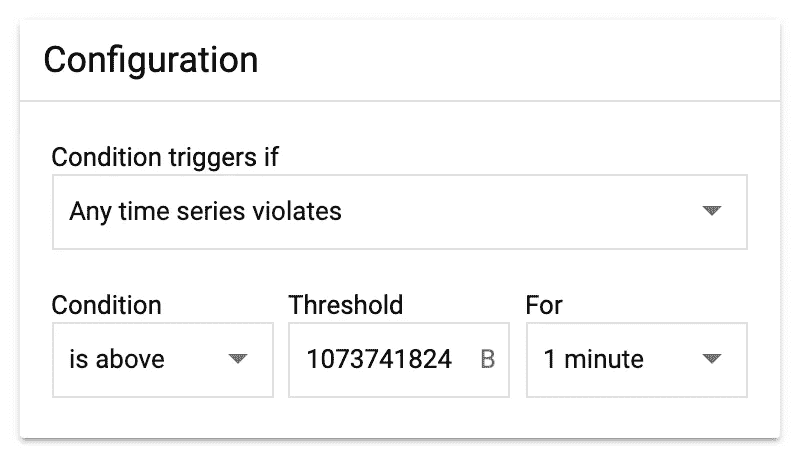

# 对从 Google 云存储桶发送的字节进行监控和警报

> 原文：<https://medium.com/google-cloud/monitoring-bytes-sent-from-google-cloud-storage-buckets-e5324660111c?source=collection_archive---------0----------------------->

# 放弃

我是一名谷歌人，具体在谷歌云工作。这里陈述的所有观点都是我自己的，而不是谷歌公司的。

# 介绍

我经常与客户讨论如何留意他们从谷歌云存储桶的出口。您可能会关心这一指标有几个原因:

*   您的存储桶是公开可用的，并且您想要监控从中传输数据的速率。
*   你的桶是 CDN 的来源，在那里你会有缓存填充的费用，要么来自 CDN，要么只是互联网出口费用。
*   您的存储桶的默认和/或主要存储类别是近线或冷线，您希望监控读取以控制检索成本。

幸运的是，使用 GCP 内置的 Stackdriver 很容易监控这一点。它被表示为度量`storage.googleapis.com/network/sent_bytes_count`。在本文中，我将向您展示如何在 Google Cloud web UI 中为这个指标设置监控和警报。

# 如何设置 Stackdriver 指标

您需要做的第一件事是捕捉和可视化指标。首先，转到 Stackdriver 监控。你可以在 GCP 控制台的汉堡菜单中找到这个。图标看起来像这样:

Stackdriver 监视按钮的外观。

在 Stackdriver Monitoring 页面中，单击 Metrics explorer。

现在，您应该可以选择“查找资源类型和指标”在这里输入`storage.googleapis.com/network`,您应该会看到发送和接收的字节的度量。

一开始不知道自己想要哪一个可能会很困惑。容易记住的是，度量是从桶的角度来看的，所以**发送的**字节是对象读取，而**接收的**字节是对象写入。

点击`sent_bytes_count`指标将其选中。然后，您将能够设置过滤器和其他设置。

对于**过滤器**，思考一下什么是可以查看的有用范围。你只关心一个桶吗？一个位置的所有桶？都在一个项目里？选择任何适合您的用例。请记住，在过滤之后，您可以执行**分组**，因此如果您想单独查看一个项目中的所有存储桶，您可以通过`project_id`进行过滤，然后通过`bucket_name`进行分组。

还要记住，您可以将**通配符**放到过滤器中。例如，要过滤到一个 bucket 名称前缀，您可以添加一个类似于`=~"prefix-.*"`的过滤器。

最后，确保您使用了 **sum** 聚合器。`sent_bytes_count`是一个“增量”指标，意味着它是自上次采样以来发送的新字节数。例如，如果您在第 0 分钟发送 1MB，然后在第 1 分钟发送 1MB，则两个样本都将读取 1MB(与第 1 分钟读取 2MB 相反，此时发送的字节数)。因此，如果将这些数据汇总到前五分钟，您可能需要对样本求和，以准确了解这五分钟内发送的字节数。

现在，您应该有一个从存储桶发送的**字节**的漂亮图形，如下所示:

典型的 GCS 铲斗出口图。

点击保存图表，将图表放在仪表板上以便于查看。

注意:以每秒*位*来讨论网络吞吐量是很常见的。**这个图形既不是位的，也不是由第二个**组成的。这是每分钟字节数。请确保在此数量和与您的工作相关的任何网络吞吐量之间进行适当的转换(例如: [1GB/min 为 133Mib/s](https://www.wolframalpha.com/input/?i=1GB+per+minute+in+Mbps) 。

# 如何在指标上设置预警

除非您*真的*喜欢看图表，否则您接下来要做的事情就是在指标上设置一个警报，这样您就可以知道它何时超过了指定的阈值。

值得一提的是，根据我的经验，这个指标是准确的，但略有延迟。样本大小是 60 秒，所以即使样本是即时发送的，您也总是会看到过去大约 30 秒的时间。实际上，我发现我的数据比当前时间落后几分钟。因此，我希望在达到阈值后的 5 分钟左右，我会收到警报。我认为这已经够快了，但还是值得理解。

首先，转到 Stackdriver UI 的**报警**部分。找到`CREATE POLICY`按钮并点击它。

给你的警报策略起一个相关的名字，比如“带宽警报”

接下来，您需要添加一个条件。添加条件很像创建图表。选择`storage.googleapis.com/network/sent_bytes_count`指标，并根据您的情况调整过滤器和分组。然后，您将添加一个**配置**来指定警报条件。

一个警报配置示例，一分钟内从存储桶中读取超过 1gb 的数据。

上面显示的警报配置在您从**目标**设置中获得的时间序列中，对于出口警报会很好地工作。请注意，您设置“分组依据”值的方式会对此警报的工作方式产生很大影响。例如:

*   如果您筛选了项目…
*   并按存储桶名称分组…
*   只有当单个铲斗超过每分钟 1gb 时，才会触发此警报。

另一方面…

*   如果你过滤了多个项目，比如`project_id ~= project1|project2` …
*   如果这些项目的总量*超过每分钟 1gb，将触发此警报。*

*接下来，您需要添加一个通知通道。[有很多方法可以配置这些](https://cloud.google.com/monitoring/support/notification-options)，文档中有详细说明。*

*说到文档，最后一个选项是在通知中为警报提供一些文档。用待命人员或队友容易理解的术语解释警报的意义是一个好主意。*

*下面是我的警报的配置方式:*

**

*从我的项目的任何 GCS 存储桶以 1GB/分钟的速度流出的警报配置。*

*我强烈建议设置几个带有分级警报阈值的条件，接近您所关心的任何限制。换句话说，如果您认为 1TB/min 是一个需要人工关注的阈值，则为 750GB/min 设置一个条件，为 875GB/min 设置另一个条件。这样，尽管度量延迟、通知延迟、反应时间等引入了延迟，人类也能够在超出真实目标之前查看。*

*我希望这篇文章能够帮助您，并祝您在云中度过愉快的一天！*