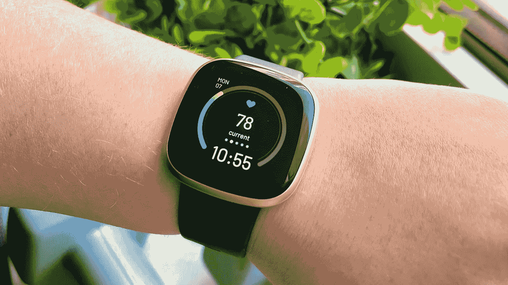
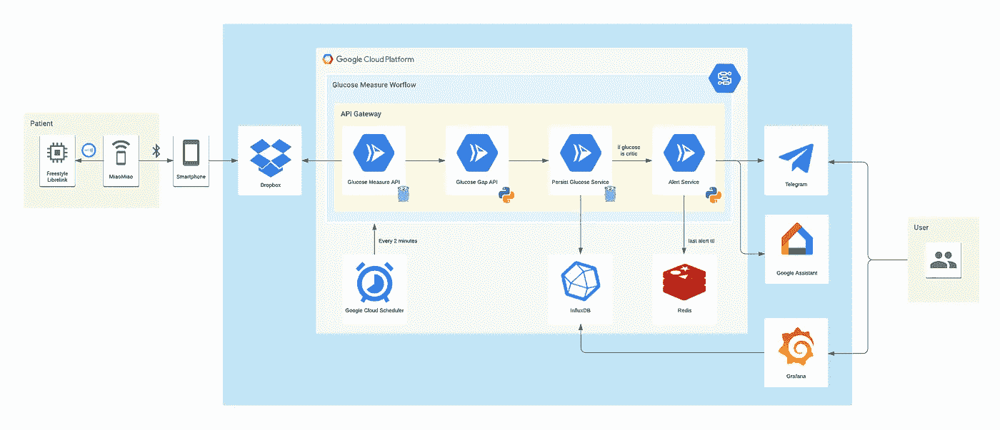
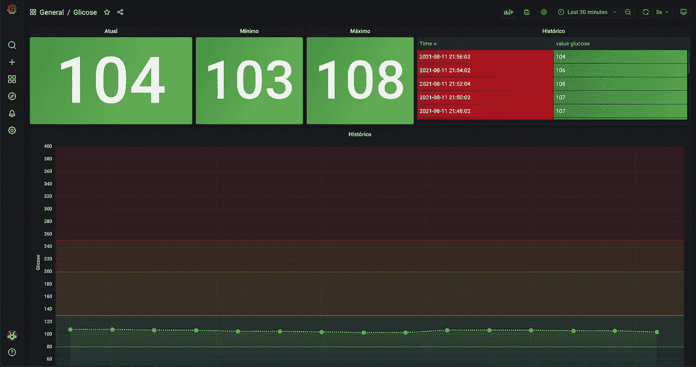
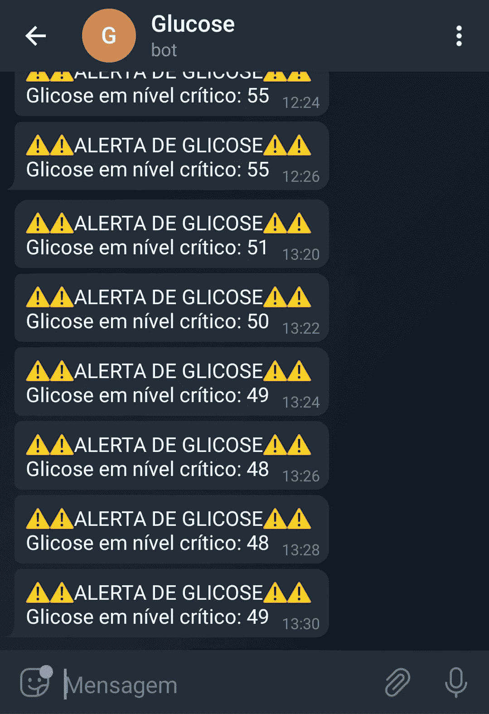
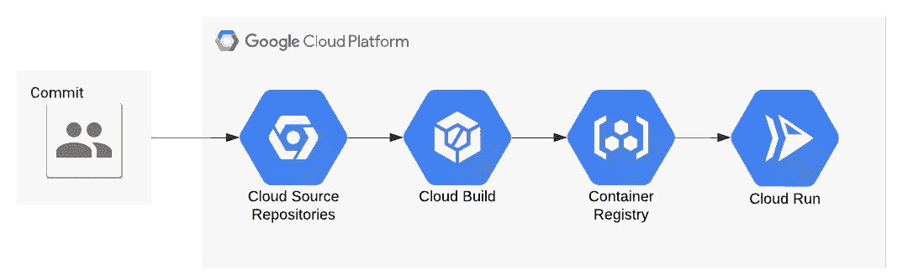
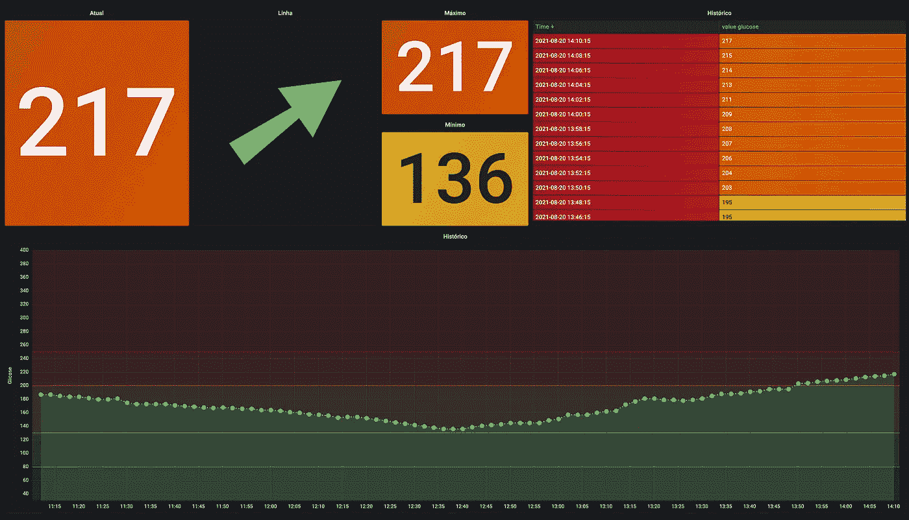

# 利用谷歌云平台监测糖尿病

> 原文：<https://medium.com/google-cloud/monitoring-diabetes-with-google-cloud-platform-877243ac382a?source=collection_archive---------1----------------------->

## 使用谷歌云服务监测血糖水平、生成图表和创建警报。

我从四岁起就是一型糖尿病患者。监控我的血糖和记录我的考试成绩对我来说一直是个问题，主要是因为我不得不在每顿饭前和一天多次这样做。今天我 22 岁，接受胰岛素和血糖测试一直是我日常工作的一部分。我从来没有糖尿病相关的问题，但上周我去了重症监护室，因为一例酮症酸中毒。

由于这一事件以及血糖监测和普通糖尿病护理的所有手动工作，我决定建立一个监控血糖的仪表板，其中包括实时值、我的糖尿病历史、紧急情况下的 Telegram 和 Google Assistant 警报，以及我和内分泌学家的轻松监控。

对于葡萄糖测量，我使用**自由式自由臂**加上**苗苗**装置。FreeStyle Libre 在我的手臂上有一个收集血糖值的探头，苗苗通过 NFC 从 Libre 中读取这些值，并通过蓝牙发送到我的手机上。在我的手机上，我有 **Glimp** 应用程序(由苗苗公司推荐)，它与苗苗连接，并将所有测量值保存到 **Dropbox** 。我可以在智能手表上实时查看一切，智能手表接收来自 Glimp 的数据。

因为所有值都存储在 Dropbox 中，所以我创建了一个系统来读取数据、处理数据、保存在时间序列数据库中，并在必要时生成警报，使数据可视化工具可以使用登录系统。

该系统分为四种服务，即:

*   **葡萄糖测量 API** :获取包含所有葡萄糖测量值的 Dropbox 文件，解析其信息，并通过 API 公开它们。
*   **葡萄糖差距 API** :获取最后一个和倒数第二个测量值，并确定血糖水平上升或下降的速度。
*   **持续葡萄糖服务**:在 InfluxDB 上保存最后一次测量和差距。
*   **警报服务**:通过 Telegram 向我房间的 Google Home 发送警报，然后在 Redis 上保存最后一个警报时间戳。

谷歌工作流程定义了服务执行的顺序。通过使用 **Google Cloud Scheduler** 的 cron 作业，它们每两分钟被激活一次。

**Workflows** 从服务获取响应，并将其作为调用下一个服务的参数，并负责决定是否必须触发警报。所有的 API 都在 **API 网关**下，它们需要一个令牌才能被访问。每个服务都运行在 Docker 上，托管在 **Clod Run** 上。为了熟悉和易用，我选择了 **Golang** 和 **Python** 。

一旦我们有了最新的血糖值和差距，这些数据就会作为时间序列格式保存在 **InfluxDB** 中。 **Grafana** 使用 InfluxDB 作为数据源，并以图表格式显示实际血糖、时间戳范围、历史记录等指标。

数据存储后，**工作流**分析血糖水平是否在安全范围内，如果不在，它会通过**电报**向我和我的父母发送消息，并激活我房间里的**谷歌巢**中的语音警报(以防我正在睡觉)。我可以问我的谷歌助手:“好的谷歌，我现在的血糖是多少？”而且她会查阅葡萄糖 API，给我最后的结果。

所有的代码库都被单元和集成测试覆盖，在**云构建**的管道上运行。在主分支上进行合并，并且所有测试都通过之后，一个新的容器版本被推送到**容器寄存器**，更新服务的生产版本。

此时，我的父母、女朋友和医生可以访问 Grafana 仪表板。我的医生可以随时轻松地分析我的血糖历史，并更精确地调整我的胰岛素单位。

这就是我如何开发一个糖尿病监测系统，使用谷歌云服务来托管我的想法。我使用的一些工具是我打算用来测试、整合和学习的。