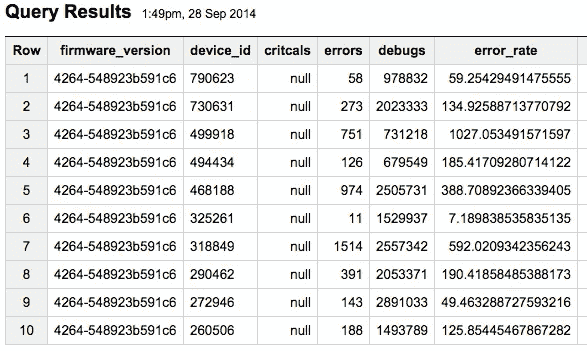

# 用 Google Big Query 和 R 监控分布式系统

> 原文：<https://medium.com/google-cloud/monitoring-distributed-systems-with-google-big-query-and-r-6fa3a17a81e8?source=collection_archive---------0----------------------->

在这篇博文中，我将解释我们如何使用[谷歌的大查询](https://cloud.google.com/bigquery/)来存储和挖掘日志数据，然后使用开源统计编程语言 [R](http://www.r-project.org/) 来运行统计测试，以确定新代码是否行为正确。

在 [Nomanini](http://www.nomanini.com/) 我们相信持续交付是一项关键的业务优势，在过去三年中，它让我们赶上并超过了一些更成熟的竞争对手。

今年，我们将交付率从 1 月份的每月 10 个生产版本提高到 9 月份的 50 多个版本，而没有增加我们的工程人员。我们也从几百台设备扩展到了近一千台。手动升级和监控每个设备现在是不可能的。

即使有成千上万的单元和自动化验收测试在 CI 中运行，当在现场向销售点设备推出新代码时，总会有一些担忧。破损的代码会阻碍销售，甚至更糟，把一个设备变成一块昂贵的砖头。

# 向现场设备推出固件

在新版本的固件通过自动化测试后，它将从 CI 升级到 Alpha，然后升级到 Beta。我们的用户和他们的设备默认订阅我们的稳定升级频道，但我们已经说服他们中的一些人成为测试版测试者，他们的终端订阅了测试版升级频道。(感谢， [Chromium Project](http://www.chromium.org/getting-involved/dev-channel) 这个伟大的想法。)一旦代码升级到测试版，测试频道上的设备就开始升级到新的固件。

为了限制任何潜在的影响，我们通过每两分钟仅升级一个设备来限制我们的部署。一旦设备被告知升级，它就登录到服务器，下载新的二进制文件，当商家不使用终端时，无缝启动新版本的固件。

这里我们有两个版本的主代码(我们内部对固件的称呼)，一个是测试版，另一个是稳定版。


我们如何能确定新的测试版固件没有以自动化测试中没有检测到的微妙方式被破坏？我们如何知道何时可以将测试版升级到稳定版，以便所有终端都可以获得升级？

我们使用的流程是:

1.  在现场运行时，监控稳定版和测试版嵌入式固件的指标。
2.  将指标从设备上传到我们的服务器( [Google App Engine](https://cloud.google.com/appengine/) )并保存到数据库。([谷歌大查询](https://cloud.google.com/bigquery/))
3.  将指标提取到统计分析工具中。( [R](http://www.r-project.org/) 或 [RStudio](http://www.rstudio.com/) )
4.  运行统计测试，以确定稳定版和测试版之间是否有任何差异。
5.  如果没有区别，那么就没有理由不将测试版代码升级为稳定版。

# 现场监控

与大多数嵌入式产品一样，现场监控也极具挑战性。终端由电池供电，并使用通常不可靠的 GSM/GPRS 网络连接回我们的服务器。我们只有几百 kB 的闪存可用于日志。在一些国家，通过 GSM 传输数据的费用超过每兆 1 美元，有时高达每兆 10 美元。所以我们不能像在数据中心那样上传原始日志文件或发送 UDP 数据包。

苹果的 iPad 和 iPhone 使用统计(设置—通用—关于—诊断&使用—诊断&使用数据)聚合键:全天的价值指标。看起来他们有直方图类型计数(像背光亮度，有 10%桶)；以及事件数、秒数、毫安功率的计数器。

摘自我的一个日常 iPad 日志文件:

```
 com.apple.power.backlight.values.000_010  
 5387  
 com.apple.power.backlight.values.010_020  
 162  
 com.apple.power.backlight.values.020_030  
 11898  
 com.apple.power.backlight.values.030_040  
 52714  
 com.apple.power.backlight.values.040_050  
 0  
 com.apple.power.backlight.values.050_060  
 0  
 com.apple.power.backlight.values.060_070  
 0  
 com.apple.power.backlight.values.070_080  
 0  
 com.apple.power.backlight.values.080_090  
 0  
 com.apple.power.backlight.values.090_100  
 0  

 com.apple.power.state.charging.count  
 1  
 com.apple.power.state.charging.duration  
 18898  
 com.apple.power.state.charging.energy  
 -20573  
 com.apple.power.state.overall.average_length  
 33698  
 com.apple.power.state.overall.average_power  
 49
```

以此为灵感，我们编写了一个小的 C++库，它可以被想要被检测的应用程序代码调用。计数保存在 C++ key:value 映射中。在世界协调时午夜，地图被序列化为 JSON 并上传到我们的服务器。

JSON 数据包看起来像这样:

```
{
  "counts": {
    "ERROR": 7,
    "WARNING": 1475,
    "INFO": 19622,
    "DEBUG": 362754,
    "[E].EventsManager.423": 2,
    "[E].GPSManager.259": 1,
    "[E].SlaveCommsDispatcher.158": 2,
    "[E].SlaveCommsDispatcher.311": 1,
    "[E].SlaveCommsDispatcher.395": 1,
    "CSQ.BitErrors.0": 42,
    "CSQ.BitErrors.1": 1,
    "CSQ.BitErrors.3": 2,
    "CSQ.BitErrors.5": 1,
    "CSQ.SignalStrength.6-11": 18,
    "CSQ.SignalStrength.12-17": 12,
    "CSQ.SignalStrength.18-23": 15,
    "CSQ.SignalStrength.24-29": 1,
    "GPRS.TimeToConnect.0-20": 2
  },
  "firmwareVersion": "4264-548923b591c6",
  "startTime": "2014-09-22 00:00:01.152",
  "endTime": "2014-09-23 00:00:06.574"
}
```

这里发生了几件事:

错误、警告、信息和调试计数是代码运行时终端记录的调试行的总数。

对于记录的每个错误或关键行，库以[loglevel].filename.linenumber 的格式生成一个键，如[E].GPSManager.259，并增加该键的计数。我们还增加了全局错误计数器。

记录文件名和行号可以告诉我们导致错误的代码区域。即使没有堆栈跟踪，我们也很清楚是什么导致了问题。此外，这并不意味着检测特定设备上的详细错误，而是检测许多设备上的类似错误，以便我们可以检测错误版本。

我们还使用日志库来构建有趣的直方图:一个例子是 CSQ，或信号强度，一个范围从 0 (0%)到 32 (100%)的值。每次我们读取 CSQ，我们增加正确的桶。这用于测试不同硬件版本上天线放置的变化是否提高了这些设备的信号质量。

直方图也用于定时事件:GPRS。time to connect . 0–20:2 表示调制解调器连接到 GPRS 网络需要 0 到 20 秒的时间。由于没有其他桶，这意味着所有 GPRS 连接都短于 20 秒。

默认情况下，在午夜(UTC ),设备在 JSON 数据包中发送它们的计数，并且计数器被重置回 0。服务器将这些数据与它来自的设备的唯一 ID 一起传输到 Google Big Query 的一个表中。

为了更早地发现问题，测试版设备会更频繁地上传统计数据(每 2、4、8 或 12 小时一次)，以便我们在新的测试版开始推出后更快地获得诊断信息。

# 将诊断数据流式传输到 Google Big Query

在正常连接到我们的服务器的过程中，终端将 JSON 诊断包上传到运行在 [Google App Engine](https://cloud.google.com/appengine/) 上的应用程序。一旦数据到达服务器，它就被打包到一个[推送任务](https://cloud.google.com/appengine/docs/python/taskqueue/overview-push)中，该任务连接到 Google Big Query 的[流插入 API](https://cloud.google.com/bigquery/streaming-data-into-bigquery) ，在那里它被插入到我们的诊断事件日志表中。


# 在大查询中创建视图

因为所有的诊断事件(不仅仅是计数器)都流入这个表，所以我创建了一个视图，只提取诊断计数器数据，简化了下游处理。

要通过大查询 [web UI](https://bigquery.cloud.google.com/) 创建视图，像往常一样编写一个查询，然后单击 Save View。它将要求项目、保存视图的数据集和表 ID，即视图的表名。保存后，该视图可以像任何其他表查询一样进行查询。

我使用以下 SQL 来创建我的视图:

```
SELECT  
   JSON_EXTRACT_SCALAR(event_data, '$.firmwareVersion') AS firmware_version,
   device_id,  
   SUM(INTEGER(JSON_EXTRACT_SCALAR(event_data, '$.counts.CRITICAL'))) AS critcals,  
   SUM(INTEGER(JSON_EXTRACT_SCALAR(event_data, '$.counts.ERROR'))) AS errors,  
   SUM(INTEGER(JSON_EXTRACT_SCALAR(event_data, '$.counts.DEBUG'))) AS debugs,  
   1e6 * SUM(INTEGER(JSON_EXTRACT_SCALAR(event_data,'$.counts.ERROR'))) / SUM(INTEGER(JSON_EXTRACT_SCALAR(event_data, '$.counts.DEBUG'))) AS error_rate  
 FROM [nomanini.event_log]  
 WHERE event = 'Counters'  
 GROUP BY firmware_version, device_id  
 ORDER BY firmware_version DESC, device_id DESC;
```

在 event_log 表中，计数器作为 JSON 对象存储在 event_data 列中。大查询 SQL 的另一个伟大特性是 [JSON_EXTRACT_SCALAR](https://cloud.google.com/bigquery/query-reference?hl=de#jsonfunctions) ，它允许您通过指定键路径从 JSON 对象中提取数据。

从 event_log 表中，我得到了 device_id，这是每个终端的唯一标识符，从 JSON 的 event_data 列中，我得到了固件版本、关键、错误和调试计数。

我使用 GROUP BY firmware_version，device_id 对计数求和，因此我得到了每个设备在每个固件版本上产生的错误总数。我还计算了 error_rate，它被定义为每百万个调试行中的错误数，或者 error/debug * 1e6。(稍后将详细介绍原因。)

查询此视图:

```
SELECT * FROM [nomanini.firmware_error_rates] LIMIT 10;
```

给出:



# 从 Google Big Query 获取数据到 R

在 R 广泛的 CRAN 资源库中有一个奇妙的 [bigrquery](https://github.com/hadley/bigrquery) 包，它允许您在 R 内部运行 SQL 查询，并在 R 数据框架中获得结果。

r 将启动 OAuth 进程并打开您的浏览器进行身份验证。查询运行，结果保存在结果数据框中。

为了从 R 内部查询 Big Query 中的 firmware_error_rates 视图，我运行了以下代码:

```
library(bigrquery)  

 # The two versions that we want to compare: Beta and Stable   
 firmware_version_beta = "4264-548923b591c6"  
 firmware_version_stable = "4252-c2b7961f0a5b"  

 # The base SQL statement  
 sql_query_a = "SELECT firmware_version, device_id, critcals, errors, debugs, error_rate FROM [nomanini-dashboard:nomanini.firmware_error_rates] WHERE firmware_version = '"  
 sql_query_b = "' ORDER BY device_id LIMIT 100;"  

 # Create the SQL strings, concatenate using paste  
 sql_beta &lt;- paste(sql_query_a, firmware_version_beta, sql_query_b, sep="")  
 sql_stable &lt;- paste(sql_query_a, firmware_version_stable, sql_query_b, sep="")  

 # Run the queries for both the old and new versions  
 v_beta &lt;- query_exec("nomanini-dashboard", "nomanini", sql_beta)  
 v_stable &lt;- query_exec("nomanini-dashboard", "nomanini", sql_stable)  

 # Fill NA's (null's) with 1 so can log transform the data  
 v_beta[is.na(v_beta)] &lt;- 1  
 v_stable[is.na(v_stable)] &lt;- 1  

 # Join two data frames by the common key variable device_id  
 # only device_id’s that are in both v_stable and v_beta will be in the merged data frame  
 merged &lt;- merge(v_beta, v_stable, by="device_id", suffixes = c(".beta",".stable"))
```

代码在视图上运行两个查询，一个用于测试版，一个用于稳定版；用 1 替换任何空值(这样我们就可以对数据进行日志转换，稍后会详细介绍)；然后合并两个结果集，使得只有同时处于稳定版本和测试版本的设备被包括在合并的数据帧中。

# 使用 Student t-test 和 Wilcoxon 符号等级测试检测错误的代码版本

我们想检测一个测试版是否是“坏的”,这样我们就可以尽早阻止这种新的、有缺陷的代码的推出。目前，如果平均来说，一个版本比当前的稳定版本记录了更多的错误，我们就把它定义为“坏”版本。

在下图中，两个版本(蓝色和绿色版本)被认为具有相似的质量，因为这两个版本上的设备具有相似的错误数量。(每个方块代表一个设备，x 轴是设备在该版本中出现的错误数。)

红色版本的设备有更多的错误，这意味着该版本有问题。


为了进行统计测试，我们使用[学生的成对样本 t 检验](http://en.wikipedia.org/wiki/Student's_t-test#Paired_samples)，因为我们正在比较两个版本的代码，版本 _ 旧和版本 _ 新，相同的设备在版本 _ 旧和版本 _ 新组中，因为每个设备都在版本 _ 旧上，几天后升级到版本 _ 新。这构建了两个数据集，但是在两个样本中具有相同的群体(装置)。

我们正在测试的假设是:

*   H0:零假设:“两个版本的错误率分布没有区别。”
*   哈:替代假设:“新版本与旧版本的错误率分布不同。”(注意，错误率可能更好或更坏，因此是双面测试。)

我在这里做了一些假设:

1.  劣质版本比优质版本记录了更多的错误。
2.  一个差的发布(一个有问题的发布)的错误与调试日志行的比率(E/D 比率)比好的发布要高。
3.  一个版本上所有设备的 E/D 比率都是相似的。或者至少是正态分布的。
4.  E/D 比率变化的唯一原因是由于代码变化。没有任何外部因素影响错误的数量。(我们知道这是错误的，因为像连接性差、电池没电等等。导致记录错误，但希望这些异常值相对较少。)
5.  E/D 比值的平均值会随着不良释放而显著变化，而在类似质量的释放之间不会显著变化。
6.  在两个版本之间进行配对 t 检验将检测 E/D 比值样本均值的变化。

但首先，我们需要进行一些数据转换，使数据“表现更好”，这样我们的测试就有更大的机会在噪音中找到信号。

# 从绝对错误数变为错误率，以说明不同的使用模式

如果你一直在关注，你会发现我从谈论错误变成了谈论错误率。这是因为我们需要标准化错误的绝对数量，以说明终端的使用量。经常使用的终端往往会出现更多由环境引起的错误，例如 GSM 和 GPRS 连接不良、纸张用完、电池没电导致子系统关闭，以及现场发生的许多其他与固件无关但无论如何都应该记录的问题。

通过将记录的错误行数除以记录的调试行数，再乘以 100 万，我们可以得到每 100 万个调试行的错误数，这个数字允许在设备之间进行比较，无论它们在一个版本上运行了一个小时还是一个星期。

# 对 t 检验中的异常值进行对数归一化处理

因为我们的测试人员相对较少，所以我决定不删除离群值并丢弃数据。但这意味着有一个带有一些远距离异常值的长尾，因此数据不再是正态分布的，这违反了 t 检验的一个[假设](http://en.wikipedia.org/wiki/Student's_t-test#Assumptions)。


为了抓住这个尾巴，一个常见的转换是对数据进行对数转换。[ [1](http://stats.stackexchange.com/questions/18844/when-and-why-to-take-the-log-of-a-distribution-of-numbers) ， [2](http://www.r-statistics.com/2013/05/log-transformations-for-skewed-and-wide-distributions-from-practical-data-science-with-r/) ]在下图中你可以清楚地看到对数变换是如何使分布更加正常的。


我选择了以 10 为底的对数(而不是自然对数，或以 2 为底)，这样 x 轴上的每个单位都是误差率增加的一个数量级。

您将在上面的代码片段中看到，我将有 0 个错误(NA 或 nulls)的设备设置为有 1 个错误，这样记录日志仍然有效。(就我而言，百万分之 0 的调试错误与百万分之 1 的调试错误是相等的。)

# 在 R 中运行 t 测试

```
&gt; t.test(log10(merged$error_rate.beta), log10(merged$error_rate.stable), paired=TRUE)

 Paired t-testdata:  log10(merged$error_rate.beta) and log10(merged$error_rate.stable)
t = -1.7194, df = 13, p-value = 0.1092
alternative hypothesis: true difference in means is not equal to 0
95 percent confidence interval:
 -0.9404635  0.1068907
sample estimates:
mean of the differences 
             -0.4167864 Geometric mean of the differences (base 10): 0.3830131
```

(注意，由于对数变换，测试中引用的平均值实际上是几何平均值，而不是算术平均值。[ [1](http://onlinestatbook.com/2/transformations/log.html) ])

# 使用 Wilcoxon 符号秩检验

或许更正确的是，我运行了 [Wilcoxon 符号秩检验](http://en.wikipedia.org/wiki/Wilcoxon_signed-rank_test)，因为与 t 检验不同，[没有假设错误率的正态分布](http://en.wikipedia.org/wiki/Wilcoxon_signed-rank_test#Assumptions)，这使得它对异常值更加稳健。对于这个测试，那么，我不需要记录标准化数据。这也使得结果的解释变得稍微容易一些。

```
&gt; wilcox.test(merged$error_rate.beta, merged$error_rate.stable, paired=TRUE, conf.int=TRUE)  

 Wilcoxon signed rank testdata:  merged$error_rate.beta and merged$error_rate.stable
V = 30, p-value = 0.1726
alternative hypothesis: true location shift is not equal to 0
95 percent confidence interval:
 -505.36438   55.72701
sample estimates:
(pseudo)median 
     -121.2072
```

中位数是两个版本之间错误率的变化。这里，-121 意味着新的测试版比当前的稳定版每百万调试行少 121 个错误。我们有 95%的把握，测试版中每百万调试行的错误数比稳定版少 505 到多 56 个。

因为我们两个测试中的 p 值都大于 [0.05 显著性水平](http://en.wikipedia.org/wiki/P-value)，所以我们不能拒绝零假设，并且必须接受“两个版本的错误率分布之间没有差异”，因此**版本之间的代码质量是相似的**。

基于此，我们将把测试版代码升级为稳定版。

注意，我们不能说代码是好是坏，只能说如果我们满意旧的稳定版本，那么我们应该满意新的测试版本。

# 显示数据

或许比统计测试更容易解释的是[箱线图](https://stat.ethz.ch/R-manual/R-devel/library/graphics/html/boxplot.html)和[带状图](https://stat.ethz.ch/R-manual/R-devel/library/graphics/html/stripchart.html)。条形图表中的每个彩色方块代表单个设备的错误率。方框图显示了最小值和最大值，第一个和第三个四分位数，深色带是中间值。它还将所有异常值显示为圆圈。(蓝色版本右边有两个异常值。)为了可读性，我将这些图垂直分开。


在这里，您可以看到在两个版本中，带状图和箱形图在很大程度上相互重叠，因此两个版本具有相似的错误率，直观地支持了上面的统计测试。

# 好的，那么这真的能发现问题吗？

几个月前，我们在一个子系统中完成了主要的代码重构。我们开始推出新的测试版固件，虽然大多数设备在升级后表现正常，但在一些设备上，代码会中断，因为它没有正确处理只在现场出现的角落情况，然后只在少数设备上出现。

这些错误被设备记录下来，上传到服务器，并在我们运行这些测试时被检测到。出现错误的设备在下图中清晰可见，聚集在右边的红色异常值处。


t 检验和 Wilcoxon 检验的 p 值都低于 0.05 显著性水平，有力地证明了两个版本之间存在差异。

```
&gt; t.test(log10(merged$error_rate.beta), log10(merged$error_rate.stable), paired=TRUE)

     Paired t-testdata:  log10(merged$error_rate.beta) and log10(merged$error_rate.stable)
t = 2.8624, df = 28, p-value = 0.007872
alternative hypothesis: true difference in means is not equal to 0
95 percent confidence interval:
0.1131325 0.6825117
sample estimates:
mean of the differences
              0.3978221Geometric mean of the differences (base 10): 2.499321&gt; wilcox.test(merged$error_rate.beta, merged$error_rate.stable, paired=TRUE, conf.int=TRUE)  

     Wilcoxon signed rank testdata:  merged$error_rate.beta and merged$error_rate.stable
V = 318, p-value = 0.02906
alternative hypothesis: true location shift is not equal to 0
95 percent confidence interval:
     7.075123 14546.761849
sample estimates:
(pseudo)median
      183.0312
```

基于这个证据，我们停止了代码的推广。在[E].filename.linenumber couters 的帮助下，我们能够确定是什么导致了问题，编写了一个单元测试，重现了错误，修复了代码并推出了新版本。

# 今后

我想做的事情有很多，主要是让检测过程更加自动化，并向 devops 团队提供一个关于新固件推出情况的良好概览仪表板。

为此，我可能会在[计算引擎](https://cloud.google.com/compute/)的一个实例上运行 [OpenCPU](https://www.opencpu.org/) ，一个 R 的 RESTful API，这样 R 函数就可以被运行在 AppEngine 上的生产应用调用。

其他一些想法:

1.  每小时自动运行测试，并标记异常值以供支持人员调查。
2.  如果统计测试检测到重大变化，则自动暂停推广。
3.  监视[E].filename.linenumber，它们是特定类型问题的有力指示，而不仅仅是全局错误计数。
4.  随着我们将发布数量提高到每天一个以上的固件版本，我们将需要增加测试人员的数量，以便我们可以在开始推出后更快地获得测试结果。

# 参考

互联网上充斥着关于学习和统计学的信息。我读过的最好的统计学教科书之一是[用 R 学习统计学:心理学学生和其他初学者教程](http://health.adelaide.edu.au/psychology/ccs/teaching/lsr/)，作者提供了免费的 pdf 下载。每当我感到困惑的时候，这就是我的教科书。

*原载于 2014 年 10 月 4 日 www.dalehumby.com**[*。*](http://www.dalehumby.com)*