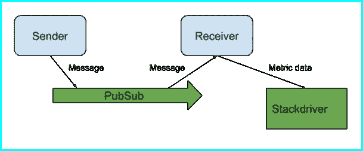

# 使用 Stackdriver 监控端到端消息延迟

> 原文：<https://medium.com/google-cloud/monitoring-end-to-end-message-latency-with-stackdriver-7f81c56e739d?source=collection_archive---------1----------------------->

# 摘要

本文描述了一个使用 Stackdriver 监控异步消息端到端延迟的简单系统。这些消息是通过谷歌云[发布/订阅](https://cloud.google.com/pubsub/)发送的。使用通过 Stackdriver monitoring Python 客户端 API 库收集的 [Stackdriver](https://cloud.google.com/stackdriver/) 自定义指标来监控延迟。在[这个 Github Gist](https://gist.github.com/alexamies/9592ccba1860f3db852919e789c007e1) 中提供了附随代码。

# 背景

优化用户体验的最佳实践是最小化用户等待的同步请求的延迟。实现这一点的常用模式是异步通信。例如，如果用户向朋友发送自拍，那么服务器可以将消息卸载到交付服务，如 Google Pub/Sub，然后立即向用户返回确认。通过这种方式，用户不会被阻止等待后端完成最终交付自拍所需的所有不同事情。

这很好，但是端到端的交付时间可能仍然很重要。例如，假设有人正在等待接收图像。这促使我们监控交货时间。使用 Stackdriver [自定义指标](https://cloud.google.com/monitoring/custom-metrics/)和 Stackdriver monitoring Python 客户端 API，Gist 中的示例和代码可以很容易地适用于其他需要特定应用计时测量的用例。

作为一个比发送自拍更现实的场景，这可能还需要 ApplePush 和 [Firebase 云消息](https://firebase.google.com/docs/cloud-messaging/)(适用于 Android 和 iOS)，考虑通过发布/订阅来批量处理大量数据，例如，使用云存储的[云发布/订阅通知](https://cloud.google.com/storage/docs/pubsub-notifications)。这里描述的探测器可以为您提供一个性能基线。

# 解决办法

该解决方案将发送时间与收到消息的时间进行比较，将两者之差(即端到端延迟)写入 Stackdriver。要设置它，在控制台中有几个简单的步骤，如要点中提供的 README.md 文件中所解释的。您需要启用 Stackdriver API，为监视探测器创建一个服务帐户，并启用 Stackdriver premium。自述文件中提供了所需的详细命令。

gist 中有三个简短的 Python 程序:设置脚本、发送方和接收方。每个程序都有一个相应的 Dockerfile 在容器中运行。设置脚本定义了自定义指标。发送方每分钟发送 PubSub 消息，并在消息中添加一个时间戳作为属性。接收方读取并确认消息，计算端到端延迟，然后将其写入 Stackdriver 自定义度量时间序列。如下图所示。

按照 gist README.md 文件中的命令，使用 Docker 在本地或在 Kubernetes 集群中运行程序。Kubernetes 集群是长时间运行探测的最方便的方式。要点中提供了 Kubenetes 命令。

要查看数据，请在 Stackdriver 控制台中添加一个自定义仪表板。Stackdriver 中显示“custom . googleapis . com/pubsube2e”指标的详细信息如下所示。

**图:为自定义指标添加 Stackdriver 图表**

请注意，在 Stackdriver Monitoring v3 API 中不再需要“global”资源，正如上面对话框中所提示的那样。有关设置仪表板和图表的详细信息，请参见 [Stackdriver 文档](https://cloud.google.com/monitoring/charts/)。

# 使用监控数据检查问题

如果您有设置问题，请按照要点中的步骤对程序的正确操作进行故障排除。

假设在成功设置后，您发现延迟的变化影响了最终用户体验。你如何调查原因？您可以使用 stack driver[Consumed API](https://cloud.google.com/monitoring/api/resources#tag_consumed_api)指标来查看平台是否有相应的变化。为此，在 Stackdriver 用户界面中创建一个自定义仪表板。在“度量”下，选择具有度量“请求延迟”的资源类型“消耗的 API”。然后按服务= pubsub.googleapis.com 进行筛选，并按第 50、95 或 99 个百分点进行聚合。这在下面的截图中显示。

除了平台之外，延迟变化的其他原因可能是负载大小、系统处理大规模工作负载的能力以及应用程序的总体健康状况。您应该能够找到现有的[支持的指标](https://cloud.google.com/monitoring/api/metrics)或者定义新的自定义指标来确定速度变慢的原因。

# 使得解决方案更加健壮

该代码不包括主题或订阅管理。当接收器启动时，它创建一个对主题的订阅，并附加一个随机数，这样它就不会在重启时失败。但是，如果您重新启动多次，您将拥有一个订阅者集合，其中一些订阅者没有做任何事情。更强大的解决方案将包括更强大的管理。

# 限制

您可以使用平台提供的 Pub/Sub Message.publish_time 字段，而不是将您的时间戳作为属性添加到 Pub/Sub 消息中。然而，这样做的一个潜在问题是漂移。gist 中使用的方法的优点是，如果发送方和接收方在同一台机器上，并且使用相同的 python 调用 time.time()来获得时间戳的秒表示，则生成的时间戳将是一致的。当您使用来自多台机器的时间戳时，您需要更加小心地测量时间，以避免由于时钟漂移造成的系统差异。

# 资源

1.  栈驱动监控客户端库:[Python 和其他语言的 GCP 文档](https://cloud.google.com/monitoring/docs/reference/libraries)
2.  Publisher Guide: [多语言的 GCP 文档](https://cloud.google.com/pubsub/docs/publisher)
3.  PubSub Pull 订阅指南: [GCP 多语言文档](https://cloud.google.com/pubsub/docs/pull)
4.  Stackdriver consumed_api 度量: [Stackdriver 支持的度量列表](https://cloud.google.com/monitoring/api/resources#tag_consumed_api)
5.  GCP API 认证— [GCP 应用默认凭证](https://developers.google.com/accounts/docs/application-default-credentials)
6.  PubSub gcloud 命令— [gcloud 参考](https://cloud.google.com/sdk/gcloud/reference/beta/pubsub/)
7.  监控 API Python 客户端库实现— [GitHub 项目](https://github.com/googleapis/googleapis/tree/master/google/api)