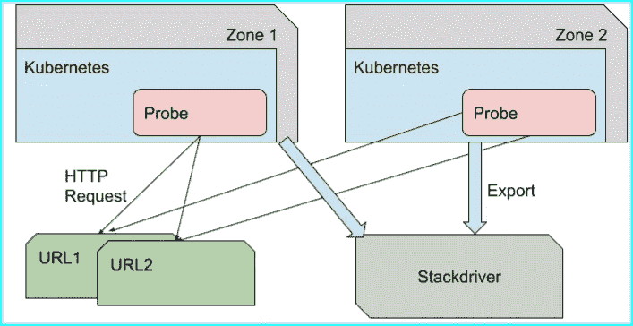
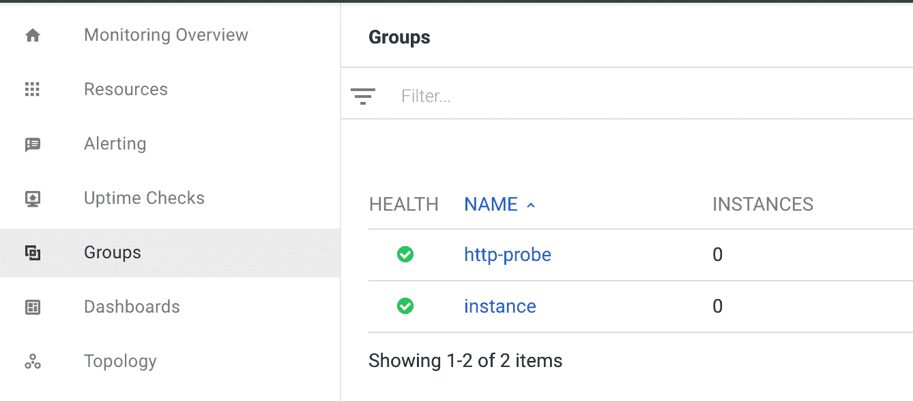
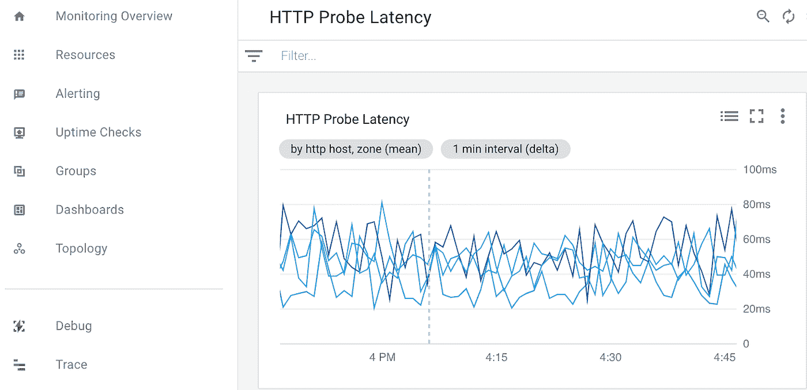

# 用 OpenCensus 和 Stackdriver 监控 HTTP 延迟

> 原文：<https://medium.com/google-cloud/monitoring-http-latency-with-opencensus-and-stackdriver-bf561608e81a?source=collection_archive---------0----------------------->

这篇文章将描述如何编写你自己的监控探针，在功能上类似于谷歌云上的 Stackdriver 正常运行时间检查。代码、配置文件、命令和详细说明在本随附的[要点](https://gist.github.com/alexamies/b183e36b1f7019ba4d98e80e5b16cc80)中提供。

# 背景

Stackdriver [uptime checks](https://cloud.google.com/monitoring/uptime-checks/) 特性是一个非常棒的特性，它让监控 web 应用程序可用性变得非常简单。它探测成功的 HTTP 响应的给定 URL，并具有丰富的选项和功能，例如在您的网站关闭时配置警报。但是，如果您想做一些不具备开箱即用正常运行时间检查的独特工作，该怎么办呢？这篇文章将解释如何通过在 Go 中编写代码来用 [OpenCensus](https://opencensus.io/) 实现你自己的探测器。该代码将被部署到位于不同地区的 Kubernetes 集群网络中，并被导出到 Stackdriver 以在仪表板上查看。

OpenCensus 是一个用于分布式追踪和监控的开源库。OpenCensus APIs 和 stack driver API 之间存在重叠，因此一种替代方法是使用 stack driver API 开发探测器。但是，使用 OpenCensus 有几个优点:

1.  您避免了对专有 API 的显式依赖。这对开发开源项目的人和希望独立于供应商的公司来说非常重要。代码见 [GitHub 库](https://github.com/census-instrumentation)。
2.  OpenCensus 具有额外的指标聚合功能，可以智能地帮助减少监控数据量和控制监控成本。有关如何定制的详细信息，请参见[聚合](https://godoc.org/go.opencensus.io/stats/view#Aggregation)类型。
3.  OpenCensus 支持多个后端的出口商。这使得 it 部门能够为收集器开发代码，将监控统计数据导出到多个云中。这篇文章使用 [Stackdriver exporter](https://godoc.org/go.opencensus.io/exporter/stackdriver) 将数据发送到 Google Cloud。其他出口商见 [OpenCensus 文档](https://godoc.org/go.opencensus.io)。
4.  OpenCensus supports 为本地库特性(如 HTTP 和 gRPC)预建了工具。这篇文章的代码使用了 OpenCensus [HTTP 插件](https://godoc.org/go.opencensus.io/plugin/ochttp)，减少了需要编写的代码量。

# 体系结构

为了方便起见，示例代码被部署到 Kubernetes 集群，但是也可以直接部署到虚拟机。如果您对部署到 Android 移动客户端感兴趣，那么您可能想要查看 OpenCensus Java API。架构图如下所示。



**图:探头架构**

# 代码走查

代码基于 OpenCensus Github 项目中的[示例](https://github.com/census-instrumentation/opencensus-go/tree/master/examples/http) net/http 服务器和客户端。首先，注册一个 Stackdriver 导出程序:

```
prefix := "http-probe"
se, err := stackdriver.NewExporter(stackdriver.Options{
  MetricPrefix: prefix,
})
view.RegisterExporter(se)
view.SetReportingPeriod(10 * time.Second)
```

这里定义的前缀将在以后构建 Stackdriver 仪表板时使用。OpenCensus HTTP 传输为主机、路径和其他参数提供标签。请注意 SetReportingPeriod()调用，这是一个控制指标聚合的函数。OpenCensus HTTP 传输包含许多标签，如主机和路径。该代码还定义了一个自定义标签来表示代码部署到的区域。

```
zoneKey, err = tag.NewKey("zone")
```

这是因为地理位置对于我们理解延迟非常重要，因为路由距离会随着地理位置的变化而变化。

创建一个使用 OpenCensus HTTP 传输的 HTTP 客户端客户端:

```
client := &http.Client{Transport: &ochttp.Transport{}}
```

然后使用本地 Go 代码进行 HTTP 调用。注意，不需要计时语句，因为 OpenCensus HTTP 传输内置了计时。与带有定制指标的[stack driver API 相比，这是一个优势](https://cloud.google.com/monitoring/custom-metrics/creating-metrics#monitoring_create_metric-go)，有助于保持您的产品代码整洁。

# 运行代码

按照自述文件中的说明构建代码并创建 Docker 容器。提供了命令和 docker 文件以及代码。Stackdriver 的设置说明也包含在 Gist README 中。编辑 config.yaml 文件以添加您希望监控的 URL。在命令行上，将 ZONE 环境变量的值设置为要将第一个探测器部署到的区域。然后创建 Kubernetes 集群。举个例子，

```
ZONE=us-west1
CLUSTER_NAME=probes-$ZONE
gcloud container clusters create $CLUSTER_NAME \
 — zone $ZONE \
 — num-nodes 1 \
 — enable-cloud-logging
```

然后将探测器作为工作负载部署到集群。对其他区域重复此操作，以建立一个探针网络。

# 查看数据

如果我们使用探针代码中定义的前缀“http-probe”来创建一个组，将有助于创建一个漂亮的仪表板。下面显示了一个截图。



**图:用探针的前缀**定义一个 Stackdriver 组

最后，创建一个仪表板来查看结果。下面显示了从探头收集的数据的屏幕截图。



**图:OpenCensus 导出的 Stats 数据的 Stackdriver 监控图**