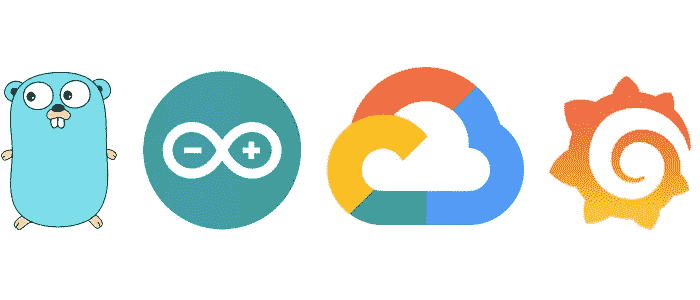

# 使用 Golang、谷歌云平台和 Grafana 监控物联网设备的数据

> 原文：<https://medium.com/google-cloud/monitoring-iot-devices-with-golang-google-cloud-platform-and-grafana-eb99cc36db4b?source=collection_archive---------0----------------------->

## 如何在 Google 云平台上为物联网设备搭建一个无服务的监控环境？

在本文中，我们将使用基于 **Arduino** 的板( [**ESP32**](https://www.espressif.com/en/products/socs/esp32) )、 [**Grafana**](https://grafana.com/) 和 [**谷歌云平台**](https://cloud.google.com/) 工具，逐步建立物联网设备的监控环境。我们会…