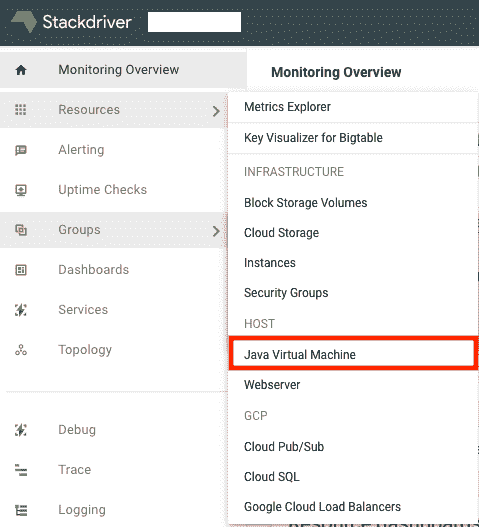
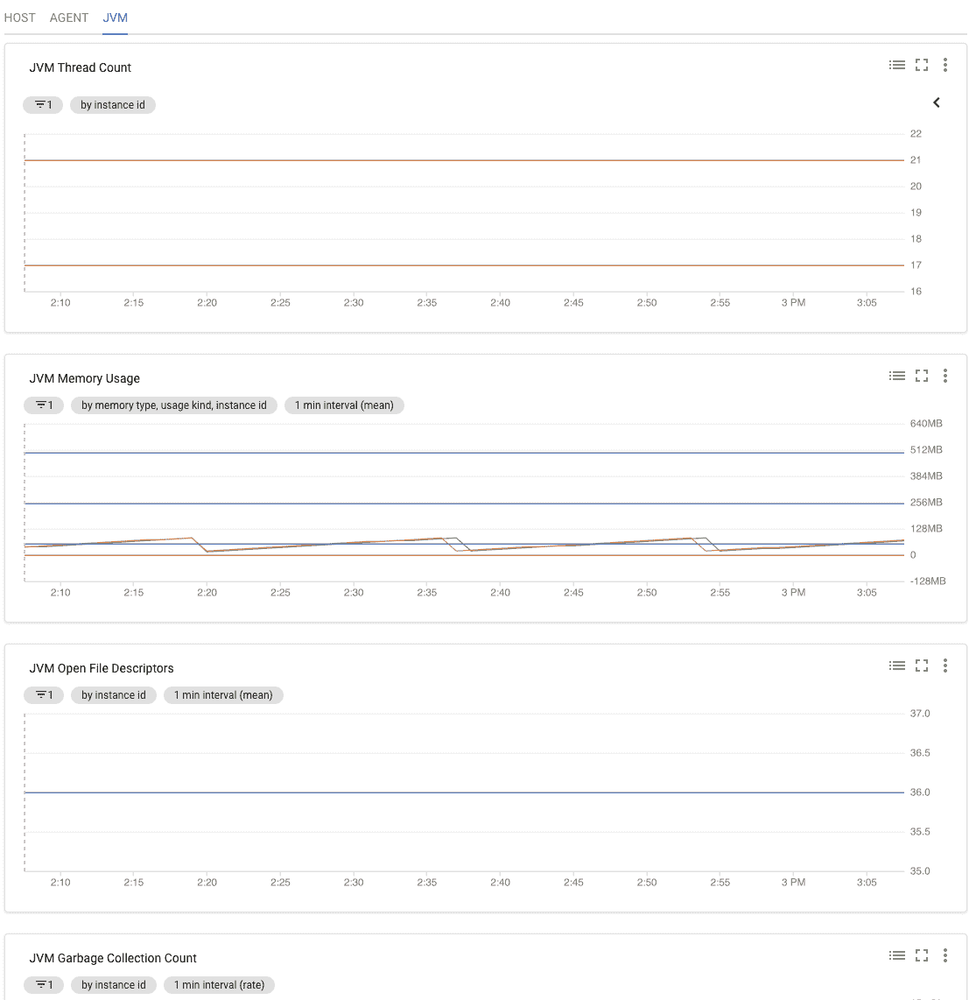

# 使用 Stackdriver 监控 Docker 容器中的 JVM

> 原文：<https://medium.com/google-cloud/monitoring-jvm-within-a-docker-container-using-stackdriver-e53f53e4f5d6?source=collection_archive---------0----------------------->

# 介绍

既然您已经登陆了这篇文章，那么您一定正在 Google Compute Engine (GCE) VM 实例中运行您的 Dockerized Java 应用程序，并且显然想要监视它。这篇文章将向你展示如何使用 Stackdriver 监控代理和 JVM 插件来监控 JVM。虽然网上有许多其他方法可以利用不同的监控工具，但为什么不使用 GCP 本地工具来完成同样的任务呢？毕竟这确实让事情变得简单了。

## 您可能已经知道…

Java 应用程序运行在名为 Java 虚拟机(JVM)的虚拟机中。Java 为 Java 应用程序的管理和联网提供了一套工具，称为 Java 管理扩展(JMX)。因此，JMX 基本上支持即时监控 JVM，我们需要做的只是在特定端口上启用它，这样我们的代理就可以读取并获得所有有用的信息，如线程数、内存使用、垃圾收集、打开的文件描述符等。

# 部署 Java 应用程序

如果你已经在你的集装箱应用程序上启用了 JMX 遥控器，那么你可以进入下一部分，否则请继续阅读…

## 1.构建 Docker 映像

在 dockerfile 文件中，确保运行应用程序的 Java 命令包含启用 JMX 远程处理的系统属性。

例如，如果启动应用程序的 java 命令是:

```
java -jar /.app.jar
```

然后修改它，如下所示:

```
java -Dcom.sun.management.jmxremote \
     -Dcom.sun.management.jmxremote.port=<**JMX_PORT**> \-Dcom.sun.management.jmxremote.ssl=false \
     -Dcom.sun.management.jmxremote.authenticate=false \
     -jar /.app.jar
```

***有些事情要注意:***

*   *选择您选择的有效端口，而不是 JMX 端口(例如:9001)。*
*   *在本例中，我们禁用了对 JMX 的 SSL 和身份验证。如果您的用例需要，请启用并配置它们。*

## 2.在 GCE VM 实例中部署容器

创建一个运行 linux 的 GCE VM 实例，确保在创建时将一个服务帐户连接到 VM 实例。一旦创建了实例，就在其上安装 Docker。使用`docker run`命令部署容器，确保 JMX 端口监听容器。

```
$ docker run *... <app specific options> ...* **--publish=<JMX_LOCAL_PORT>:<JMX_PORT>**
```

*   JMX 本地端口是在 GCE 虚拟机上映射的端口。
*   JMX 端口与之前创建映像时在 Dockerfile 中设置的端口相同。

# 启用堆栈驱动程序监控

现在容器已经启动并运行，启用了 JMX 监听器，我们将安装 Stackdriver 监控代理和 JVM 插件，该插件将从容器中查询指标并转发到 Stackdriver 监控服务。

## 1.在 GCP 上设置正确的 IAM 访问

为了使代理能够将指标上传到 Stackdriver Monitoring，必须在项目级别为其分配必要的 IAM 角色。在项目级别向 GCE 实例服务帐户授予`roles/monitoring.metricWriter` 。

点击 可以了解更多关于设置堆栈驱动监控 [**的访问控制。**](https://cloud.google.com/monitoring/access-control)

## 2.安装监控代理

安装 linux 的 Stackdriver 监控代理。

```
$ curl -sSO https://dl.google.com/cloudagents/install-monitoring-agent.sh$ sudo bash install-monitoring-agent.sh
```

你可以在这里 阅读更多关于安装 Stackdriver 监控代理 [**的内容。**](https://cloud.google.com/monitoring/agent/install-agent)

## 3.添加 JVM 插件

通过下载配置文件并将其添加到代理配置中，启用 [Stackdriver JVM 监控插件](https://cloud.google.com/monitoring/agent/plugins/jvm#enabling_the_jvm_monitoring_plugin)。

```
$ (cd /opt/stackdriver/collectd/etc/collectd.d/ && sudo curl -O https://raw.githubusercontent.com/Stackdriver/stackdriver-agent-service-configs/master/etc/collectd.d/jvm-sun-hotspot.conf)
```

## 4.更新 JMX 插件配置

编辑下载的 JMX 插件配置文件(jvm-sun-hotspot.conf ),将 JMX 端口替换为之前在运行 docker 容器时设置的 JMX 本地端口端口号。

## 5.重新启动监控代理

重新启动监控代理，让它获取 JVM 插件配置。

```
$ sudo service stackdriver-agent restart
```

# 在 Stackdriver 监控控制台上验证

既然已经设置了代理来收集和导出 JVM 指标，那么是时候在 Stackdriver 监控控制台上验证这一点了。

## 1.选择项目工作环境

转到 Stackdriver 监控控制台，选择项目的工作区。如果它是一个新项目，那么默认情况下将为此项目创建一个新的工作区，或者您可以将您的项目添加到现有的工作区。


点击阅读更多关于 Stackdriver 工作区[的信息。](https://cloud.google.com/monitoring/workspaces/)

## 2.选择 Java 虚拟机度量资源

在左侧面板中，浏览资源> Java 虚拟机



显示 JVM 资源选择器的 Stackdriver 监控控制台。

## 3.查看不同的指标

单击 *Java 虚拟机*后，如果一切都配置正确，您应该会看到 GCE 实例名和 JVM 指标图表。



显示不同收集指标的 Stackdriver JVM 监视窗口。

## 看不到您的 GCE 实例的指标？

如果在 JVM 监控控制台上看不到 GCE VM 实例名，那么请遵循 Stackdriver Monitoring agent [故障排除指南](https://cloud.google.com/monitoring/agent/troubleshooting)中的不同建议。