# 用顶点人工智能监控 ML 模型

> 原文：<https://medium.com/google-cloud/monitoring-ml-models-with-vertex-ai-5865131de353?source=collection_archive---------0----------------------->

你看过 SpaceX 的火箭发射吗？我看了很多次，每次我都觉得自己在参与一些令人惊奇的事情。那些火箭似乎是真正的技术杰作。

然而，这篇文章不是关于火箭的。它是关于机器学习模型，你已经训练并推出或你即将推出。我从火箭开始，因为没有更多的技术发展像机器学习的最新成就一样引起人们的兴趣。你可能听说过以下几款:PaLM、 [GLaM](https://ai.googleblog.com/2021/12/more-efficient-in-context-learning-with.html) 、 [LaMDA](https://ai.googleblog.com/2022/01/lamda-towards-safe-grounded-and-high.html) 、 [Gopher](https://arxiv.org/abs/2112.11446) 、Stable Diffusion、Dall-e2 等。这些只是例子。但它不一定是谷歌或 OpenAI。我很确定，每次你的模型进入所谓的生产阶段，你都会有类似于观看火箭发射时的感受。但是有更多的相似之处。在这两种情况下，拿起火箭/模型飞行只是其旅程的第一步。说到这个:**你有没有注意到，SpaceX 的工程师们是如何仔细监控这段旅程的？**

有太多的事情可能会出错，因此这样的监控是绝对必要的，尽管 SpaceX 非常重视在与火箭飞行期间将面临的条件非常相似的条件下单独和成套测试每个组件。

这类似于许多 ML 训练过程，ML 工程师使用训练数据训练他们的模型，假设这个训练数据集类似于模型在生产启动后在其输入上看到的数据。我指的不是生产发射后的最初几分钟——飞行条件可能随时变化，我们需要能帮助我们发现这种变化的机制。

我完全不知道从哪里开始为火箭建立监控机制，但是正如已经提到的，这篇文章不是关于火箭的。相反，我们希望展示如何对已推出的 ML 模型进行监控，为此，我们将使用**Vertex AI——谷歌云**上提供的谷歌机器学习服务。

**顶点人工智能模型监控**有助于检测模型飞行条件的以下变化类型:

1/ **训练服务偏差** —当生产启动后的输入数据分布与用于训练模型的输入数据分布不同时发生。Vertex AI 将要求我们提供我们使用的原始训练数据集，以便模型监控作业可以使用它作为参考。

2/ **预测漂移**发生在投产后输入数据分布随时间发生显著变化时。这里顶点 AI 不需要知道任何关于训练数据集的信息。相反，它将从以前的监视窗口期间发送的预测请求中收集有关输入数据的统计信息。

# 语境

为了向您展示如何在 Vertex AI 中启用模型监控，我们首先需要 ML 模型。我们不会深入培训过程，但您将获得所有必要的细节，以便在您这边进行这项练习。

我们的模型将试图预测电信客户的流失。训练数据来自其中一个 Kaggle 比赛:[https://www . ka ggle . com/datasets/yean ZC/telco-customer-churn-IBM-dataset](https://www.kaggle.com/datasets/yeanzc/telco-customer-churn-ibm-dataset)

我们将很快达到这一点，但当启用模型监控时，Vertex AI 将要求您提供**预测输入模式。如果你使用 TensorFlow 来训练你的模型，那么你是幸运的。SavedModel 是**tensor flow**框架使用的格式，用于打包使用模型所需的所有内容，包括所谓的签名。**签名**可以理解为模型对输入的期望和我们对其输出的期望的规范。因为该规范是模型的组成部分，所以 Vertex AI 能够使用它来理解预测输入模式。当我们的模型用其他框架训练时，例如 Sklearn，Vertex AI 将需要我们的帮助，因此会要求预测输入模式。您可能会有一个问题，即预测输入模式的预期格式和结构是什么。所有细节都可以在官方文档([https://cloud . Google . com/vertex-ai/docs/model-monitoring/overview # custom-input-schemas](https://cloud.google.com/vertex-ai/docs/model-monitoring/overview#custom-input-schemas))中找到，但是为了帮助您更好地理解这个概念，我们将使用 Sklearn 训练我们的模型，并构建相应的预测输入模式文件。**

# 模特培训

为了训练我们的 ML 模型，我们将使用顶点人工智能工作台。从 Python3 工作台映像创建新的笔记本。

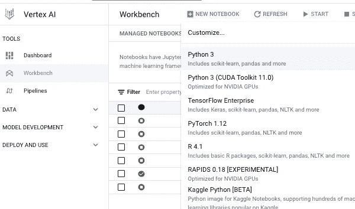

登录 Kaggle 并下载训练数据集:

[https://www . ka ggle . com/datasets/yean ZC/telco-customer-churn-IBM-dataset](https://www.kaggle.com/datasets/yeanzc/telco-customer-churn-ibm-dataset)

从 csv 文件实例化 dataframe 将帮助我们更好地了解什么样的数据可供我们使用。

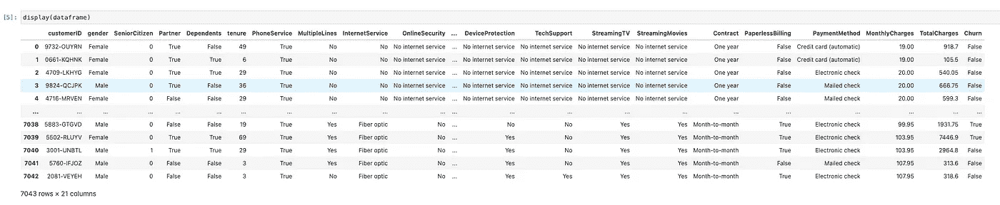

该数据集的每一行都对应于一个不同的客户，每个客户都由一组属性描述，如性别、是否是老人、支付方式、他们订阅的服务类型(流媒体电视、互联网)等。我们将尝试预测给定可用属性组合的流失概率。

一些属性已经是数字的了(老年人，任期，..)有些是布尔值(Dependents，PhoneService)，但大多数表示分类数据(例如，支付方式:信用卡、电子支票、邮寄支票等)。

在我们继续之前，我们需要将非数字属性转换成数字属性。

虽然您通常会使用一种称为“一键编码”的技术来将分类属性转换为数字属性，但是这里我们将使用标签编码。其工作方式是首先构建该属性的唯一值的字典，然后用 0 到唯一类别数之间的相应数值索引每个唯一值-1:

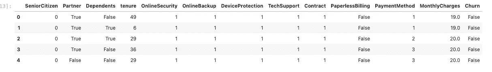

当我们所有的属性都是数字时，我们可以验证它们之间是否有任何关联。

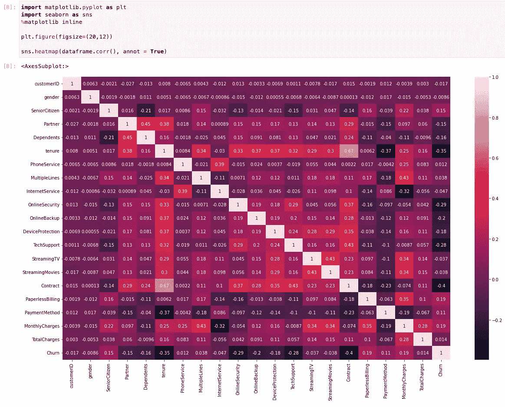

正值表示当一个属性增加时，相关属性的值也会增加，相应的数值表示这种关系有多强。例如，客户流失与合同之间的相关系数为-0.4，这意味着合同越长，客户流失的可能性越小。

事实上，我们最感兴趣的是不同的属性如何与我们的目标属性相关联:客户流失。

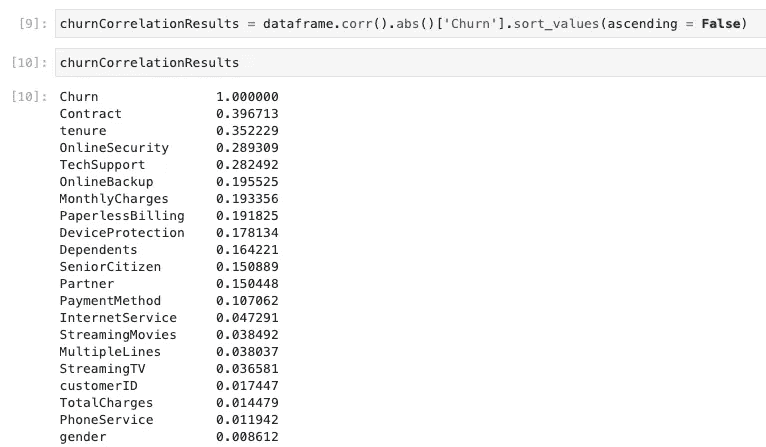

我们希望只处理属性的子集，选择将基于相关因素。具体来说，我们希望使用相关因子大于某个阈值(在我们的例子中阈值是 0.05)的属性。

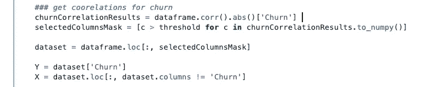

我们实现的最后一步是标准化所有数值，使它们在 0 和 1 之间。这里我们使用 MinMaxScalar Sklearn 类。

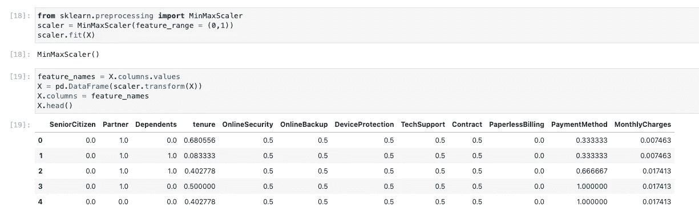

我们准备将转换后的属性与目标属性(流失)连接起来，以获得训练数据集:

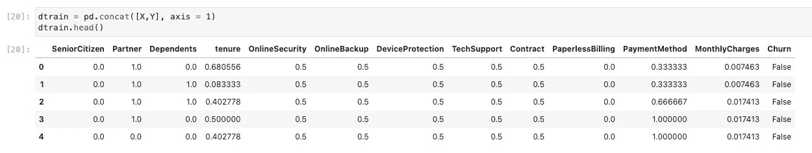

让我们将这个数据集分成实际的训练集和测试集:

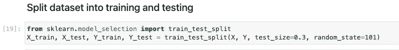

我们还将定义辅助函数来打印 ML 模型评估指标:

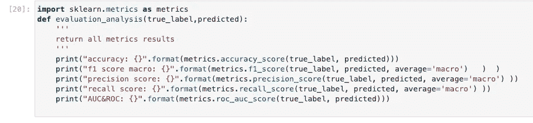

我们现在准备好进行训练了。让我们使用决策树分类器:

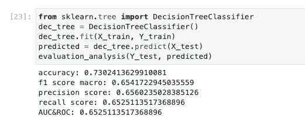

考虑到准确度、精确度和 ROC 曲线下的面积，我们看到我们的模型最多是平均水平——但是对于本指南，我们没有动力去构建任何更好的东西。对我们来说重要的是，我们已经有了可以开始监控的 ML 模型。

让我们将模型保存到 Google 云存储中(saved_model_path 变量代表 GCS 位置):

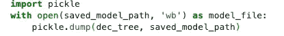

我们准备将模型导入到 Vertex AI 模型注册表中:

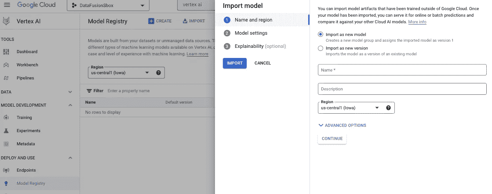

这里有一点我们想提一下:我们不需要手动完成所有这些步骤。恰恰相反，我们强烈建议利用 Vertex AI 功能的全部潜力作为无服务器 MLOps 平台，并自动化模型训练和部署的所有步骤。

一旦模型在 Vertex AI 模型注册表中，我们就可以将其部署为 REST 端点:

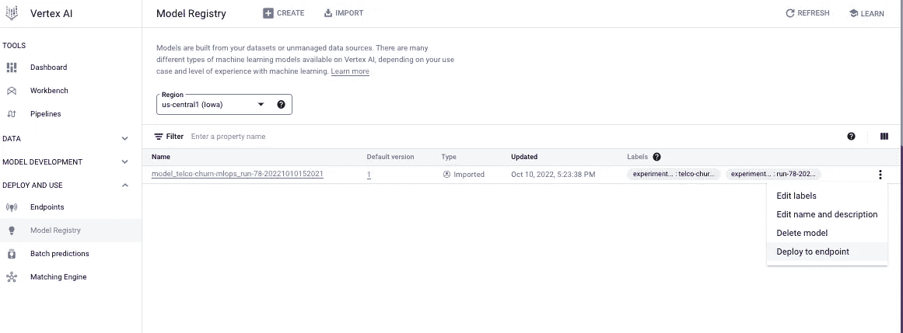

# 模型监控配置

当您在 Vertex AI 模型注册表中注册您的模型时，您可以将其部署为 REST 微服务来处理在线预测。你需要做的就是创建顶点 AI 端点。创建这样的端点时，Vertex AI 会询问你是否要启用模型监控。以下是步骤:

1.  **在您的顶点 AI 端点上启用模型监控:**

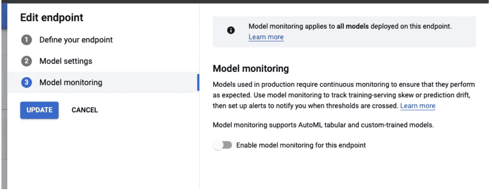

## 2.**指定*监控窗口长度*、*采样率*和*邮件提醒。***

**监控窗口长度**描述监控任务的执行频率。在我们的示例中，我们希望每小时执行一次监控作业。默认值为 24 小时。

**提醒电子邮件**是电子邮件地址，每当输入数据分布发生变化时，Vertex AI 将向其发送通知

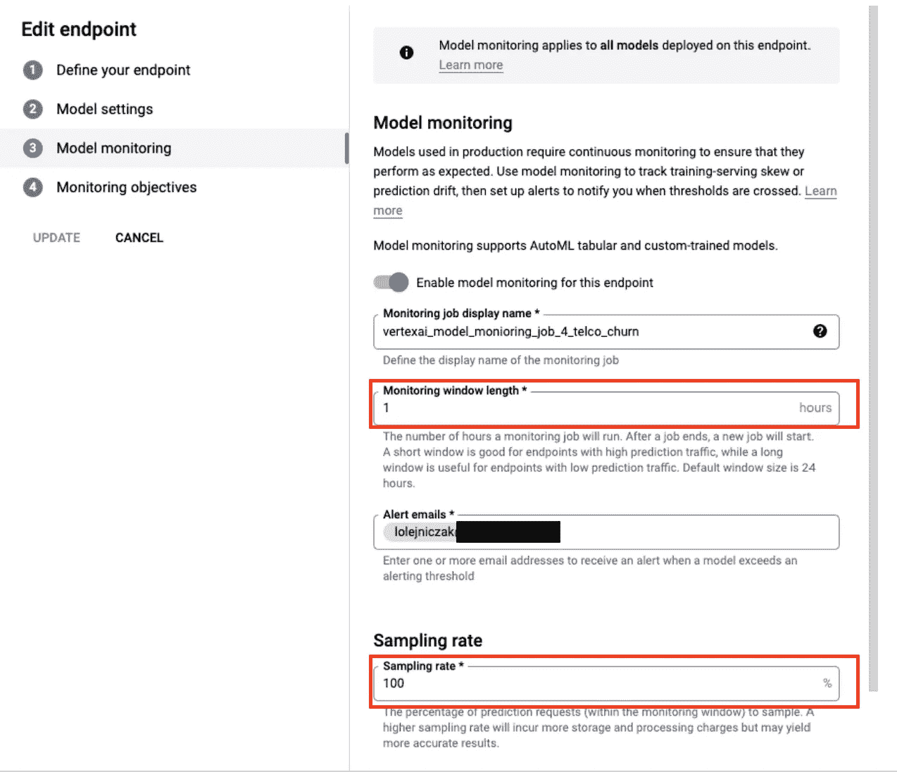

## 3.准备预测输入架构。

将其保存为 YAML 文件，并上传到谷歌云存储桶。属性部分列出了模型输入中预期的所有属性。您定义属性名称和相应的数据类型。这里非常重要的是，这些属性的顺序确实很重要，并且应该与我们的模型所期望的属性顺序保持一致。

保存该文件并上传到 Google 云存储中。您将被要求指定该文件的位置:

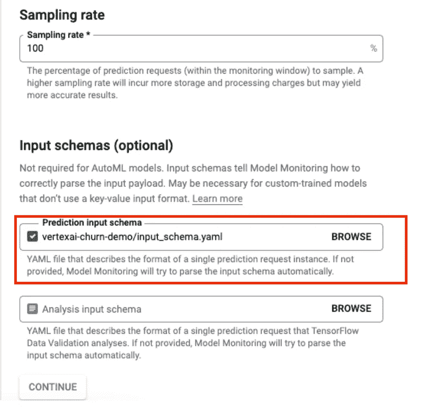

## 4.选择监控目标。

在我们的例子中，它是*预测漂移检测。*默认情况下，会监控预测输入模式中列出的所有输入要素。默认情况下，当为每个要素计算的距离度量所表示的距离超过设置为 0.3 的阈值时，将触发警报。但是，在 Model Monitoring configuration view 上有一个名为 **Options** 的部分，名为**Alert thresholds***，它允许我们修改两者:要监控哪些特性，以及每个被监控特性的阈值应该是多少。在我们的演示中，我们将只监控*每月费用*并将阈值设置为 0.03。*

*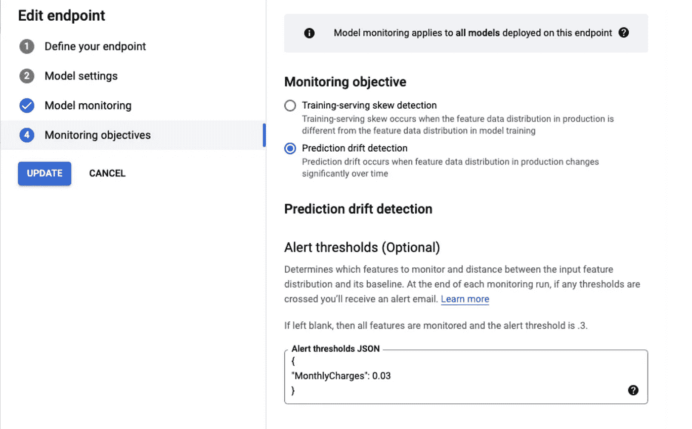*

*Vertex AI 希望我们的配置是一个有效的 JSON 字符串，对于需要监控的每个特性都有 key:value 对。*

*当你点击**创建**按钮时，你会在邮箱中收到一封新邮件:*

*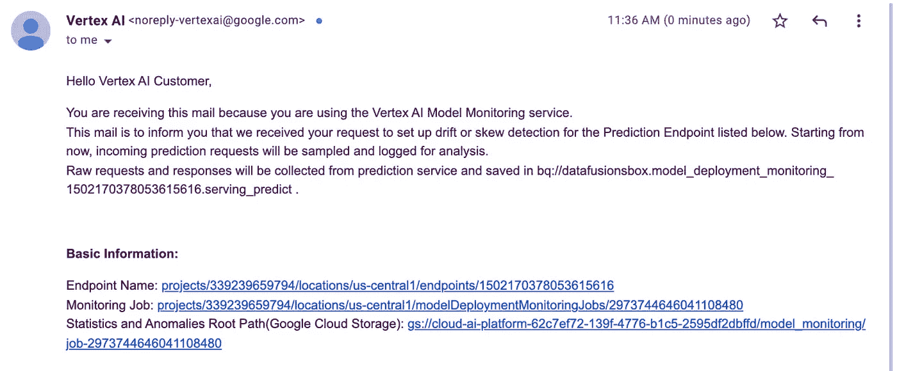**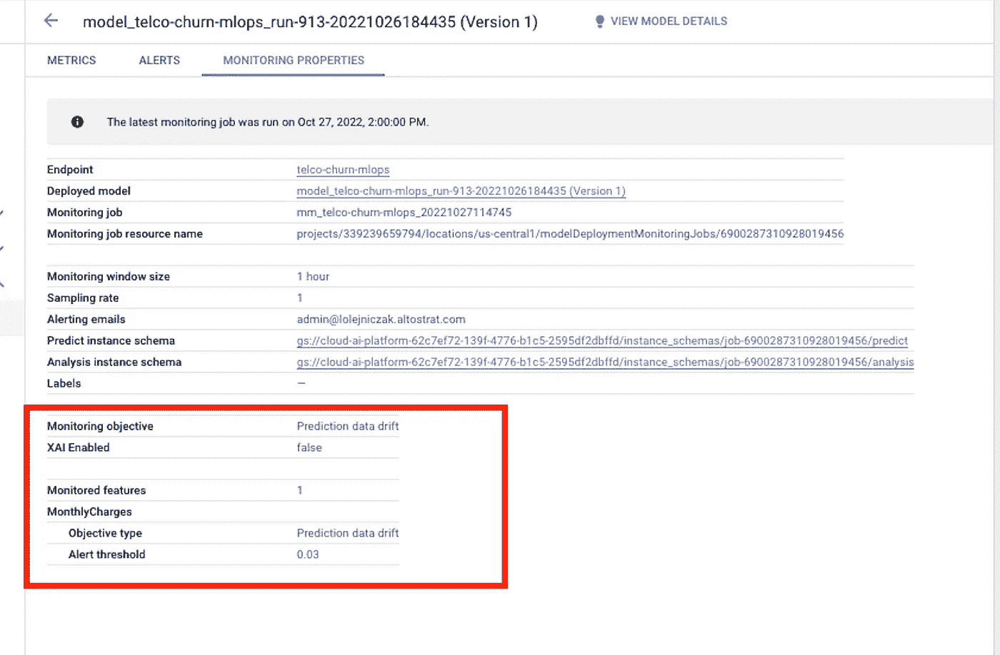*

*为了证明它的工作，我们需要发送预测请求到我们的顶点人工智能端点。当然，我们将模拟这些数据，方法如下:我们将使用我们的训练数据集，并替换该数据集中的一列中的数据:MonthlyCharges。通过替换，我们意味着**我们将注入服从正态分布的随机值，其平均值与参考数据集中的平均值相差甚远。这里的目标是模拟漂移**。*

*我们将创建预测数据集作为训练数据集的子集，并对其进行一些修改，而不是为预测生成随机数据。od 预测数据集的单个记录将以不同的 HTTP 请求发送到 Vertex AI 端点:ML 微服务托管我们的模型:*

*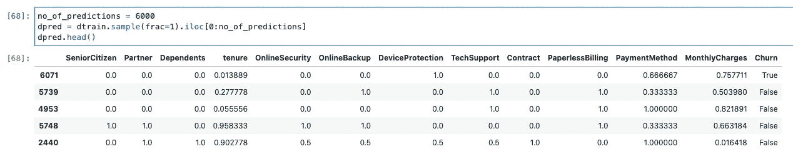**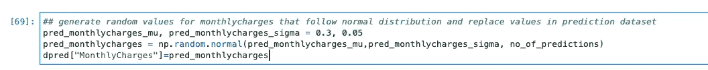*

*然后，我们将使用 **np.random.normal** 函数生成服从正态分布的随机值，平均值为 0.3，标准偏差为 0.05。生成的值将替换 MonthlyCharges 列中的值。*

*这是新分布(橙色)与我们训练数据集中的分布(蓝色)的对比:*

*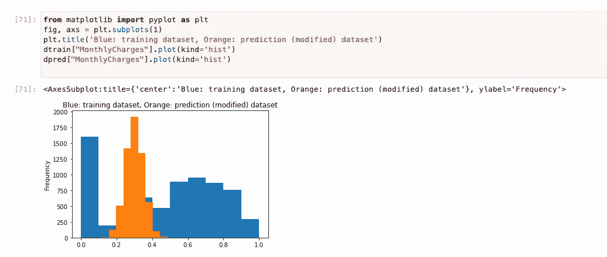*

*我们准备向我们的模型发送预测请求。它被部署为 REST API 端点，所以我们需要做的就是向我们的 vertex AI 端点发送 HTTP 请求。*

*为了进行身份验证，我们需要访问令牌，下面是我们如何生成它(我们从 Vertex AI Workbench 执行此代码，它由服务帐户表示。分配给此服务帐户的角色将决定我们可以访问哪些 GCP 服务以及我们可以在这些服务中执行哪些操作)*

*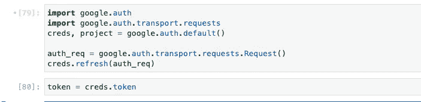*

*然后我们将把这个令牌注入到 HTTP 请求的**授权头**中。我们将每 10 分钟循环发送一个大约 6000 个请求的序列。该循环是无限的，但 1 小时后访问令牌将超时，我们的顶点 AI 端点将开始发送认证错误。*

*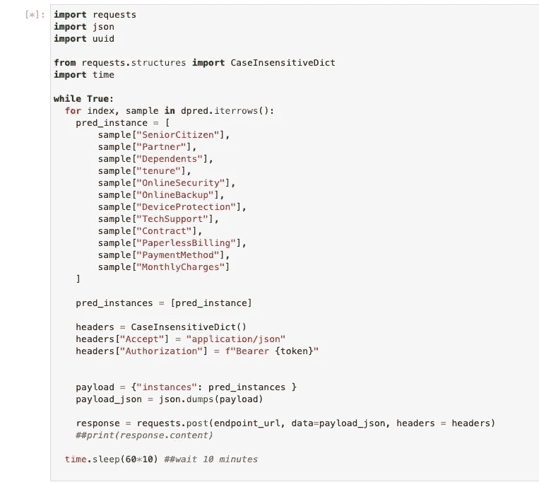*

*还有一件事值得一提。当我们启用模型监控时，我们被要求提供采样率——这是我们希望捕捉和保持的预测请求和相应响应的百分比。*

*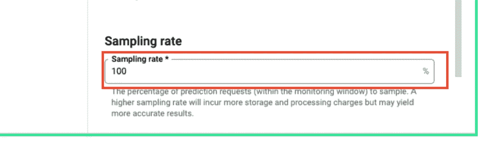*

*因为我们指定了 100%，所以我们的所有请求和响应都记录在 BigQuery 表中:*

*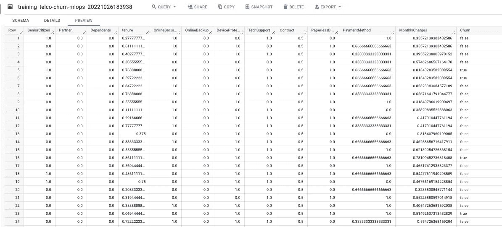*

*根据定义的时间表，Vertex AI 将每小时触发一次监控作业。这些是在后台执行的无服务器作业。*

*你可能有的第一个问题是，我们应该在哪里寻找由我们的模型监控作业检测到的潜在特征分布漂移的信息。答案是:**模型监控视图**是顶点 AI 端点细节视图的一部分:*

*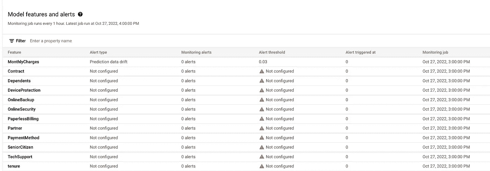*

*当我们单击“MonthlyCharges”功能时，我们会获得到目前为止执行的监控作业所捕获的分布情况(此处仅显示最近执行的 50 个作业):*

*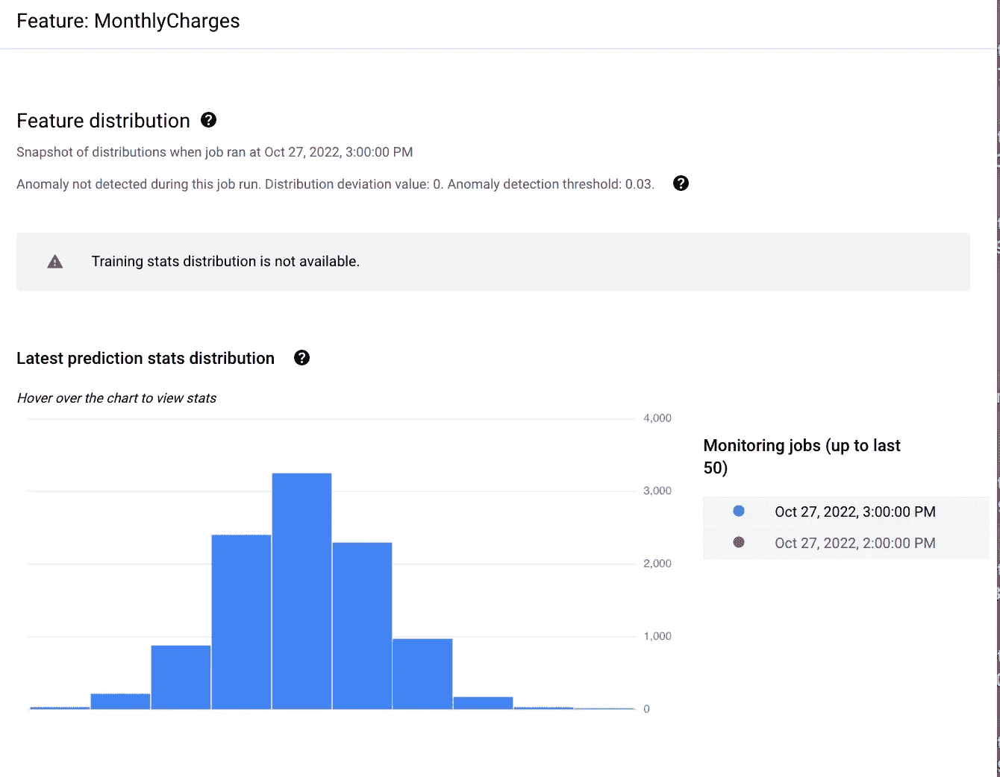*

*您可能想知道为什么我们的监控工作没有检测到预测漂移。答案相当简单-在我们选择的预测漂移模式中，预测漂移监控作业会比较在两个相邻监控窗口中作为输入发送到顶点 AI 端点的要素上计算的分布。特征在训练集中的分布在这里并不重要。如果我们选择监控培训服务的偏差，它会的。*

*现在让我们停止发送预测请求的循环，再次更改 MonthlyCharges 特性的分布。这一次，我们将为每月费用生成随机值，这些值遵循平均值为 0.7 的正态分布(上一组为 0.3)。*

*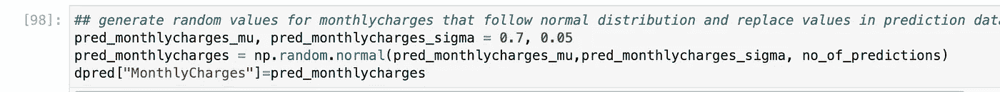*

*这是新分布(橙色)与我们训练数据集中的分布(蓝色)的对比:*

*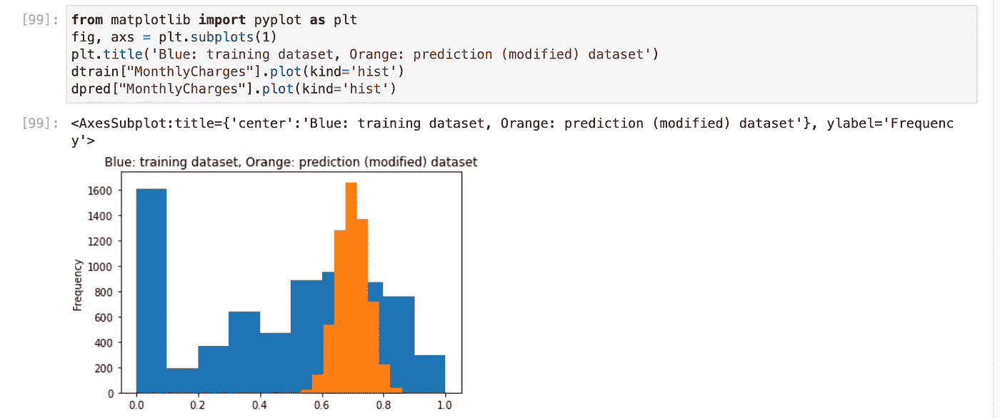*

*我们准备再次发送预测请求:*

**

*新的监控作业应该检测到每月费用的分布转移到 0.7，这远远超过 0.03(我们在启用监控时指定的阈值)，因此我们可以预期会收到警报。*

*我们现在需要耐心等待下一次监控作业运行。完成后，如果我们转到顶点 AI 端点的列表，我们会看到一个新的端点托管我们的模型的警告:*

*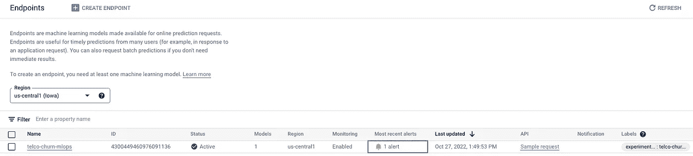*

*当我们向下钻取并点击监控栏中的**启用**链接时:*

*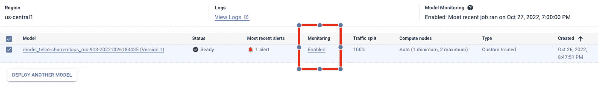*

*我们将进入包含功能和警报列表的视图:*

*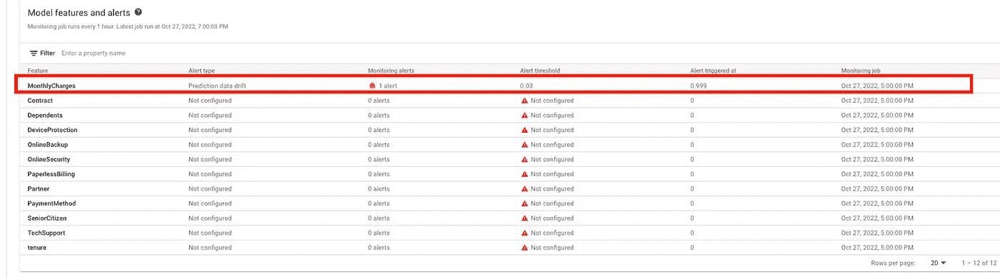*

*在**监控警报**栏中，我们为每月收费功能提供了新的警报通知！*

*我们可以进一步深入查看到目前为止执行的监控作业列表。不同的执行由右边的执行时间戳表示。您可以单击此处查看根据不同作业处理的数据计算的分布是如何变化的。最后，对于最近的执行，我们看到这条消息:**在这个作业运行期间检测到异常。***

*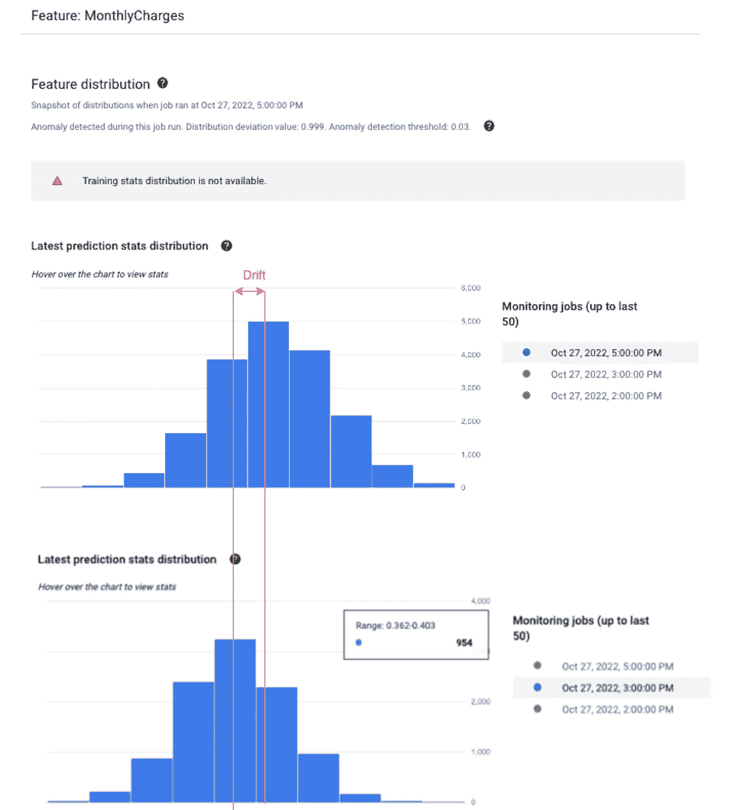*

*你也可以期待电子邮件通知。*

*这正是我们想要的:本地机制，它将帮助我们检测模型工作条件的变化，并在这些变化大于定义的阈值时通知我们。*

> ****本文仅代表作者个人观点，不代表谷歌观点。感谢***[***Ewa Gruszka***](https://www.linkedin.com/in/ewa-gruszka-0b292976/)***的认真回顾和周到点评。****

*如果你喜欢这篇文章，请为它鼓掌。更多 google 云端数据科学、数据工程、AI/ML 关注我[***LinkedIn***](https://www.linkedin.com/in/lukasz-olejniczak-1a75a613/)***。****