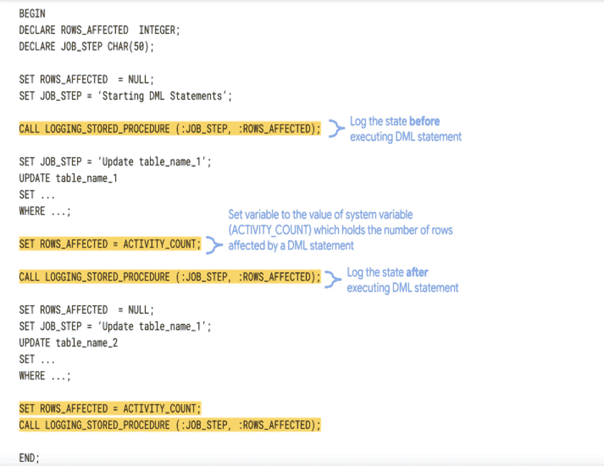
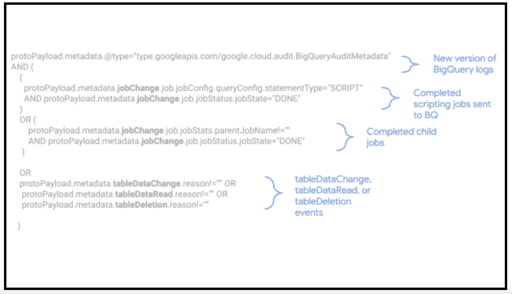
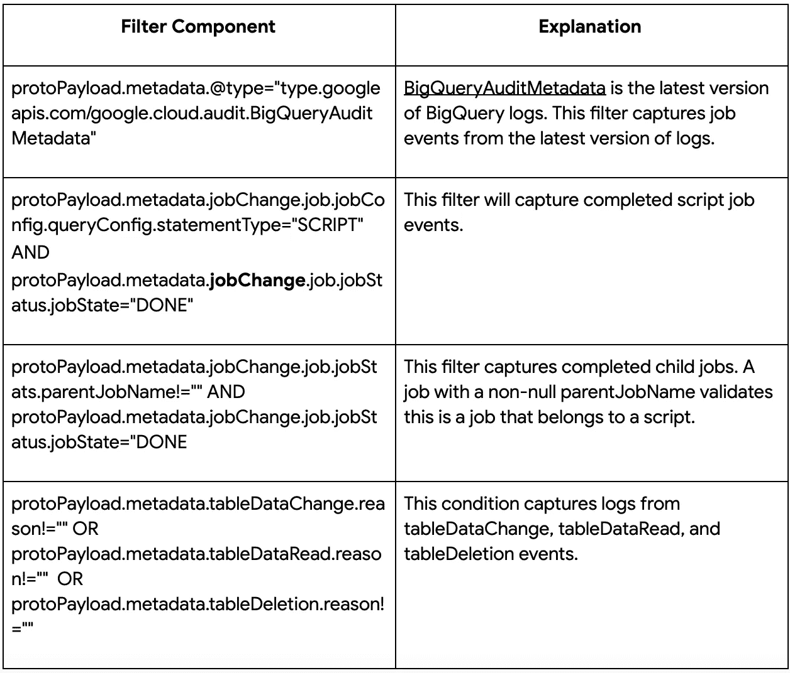
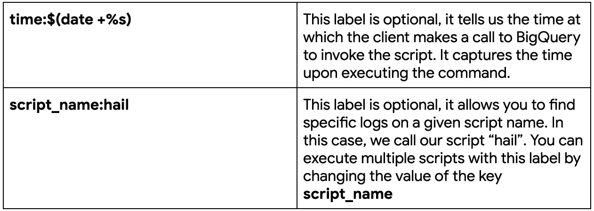

# 使用 BigQuery 监控 SQL 脚本

> 原文：<https://medium.com/google-cloud/monitoring-sql-scripts-with-bigquery-a26102628256?source=collection_archive---------0----------------------->

随着 BigQuery 中的[脚本现在可用，有了新的方法来分析与脚本相关的作业事件。例如，您可以跟踪作业度量，如与脚本关联的数据操作语言(DML)查询所受影响的行数，以获得有关脚本执行情况的更多详细信息。](https://cloud.google.com/blog/products/data-analytics/command-and-control-now-easier-in-bigquery-with-scripting-and-stored-procedures)

BigQuery 日志的新版本， [BigQueryAuditMetadata](https://cloud.google.com/bigquery/docs/reference/auditlogs/rest/Shared.Types/BigQueryAuditMetadata) ，提供了对脚本执行的丰富见解。通过在 BigQuery 中结合云日志和脚本，您可以跳过手动记录作业事件数据，直接对其进行分析。这些数据可以让您深入了解脚本性能、数据修改等。

这篇文章是关于如何通过以下步骤监控 ELT BigQuery 作业的分步指南:

1.  为 BigQuery 设置一个云日志接收器，它将导出 BigQuery 脚本事件。
2.  运行预先编写的 SQL 视图，将导出的数据转换为可查询的字段。
3.  运行在视图顶部运行的查询，以分析导出的作业事件。

跟踪 DML 语句的结果通常是通过在每个 DML 语句结束后读取系统变量，然后将它们的值写入单独的日志记录表来实现的。然而，这种方法并不总是最佳的。以下面的脚本为例:

您可以看到，您必须设置系统变量并编写一个日志调用来存储脚本中每个 DML 语句后的状态。如果您一天要运行数千个(如果不是更多的话)脚本，这会变得非常乏味。

有了 BigQuery，您不再需要记录 SQL 语句结果，因为云日志允许您存储、搜索、分析、监控和警告所有 BigQuery 脚本活动。

# 1.提取和加载:导出云日志记录日志

您还可以使用 INFORMATION_SCHEMA 来获取作业元数据，但是保留期是 180 天。云日志中数据访问日志的保留期为 30 天。导出日志的好处是它们的保留时间比保留期更长。

# 创建云日志过滤器

首先，导航到日志浏览器和[切换到一个高级过滤器](https://cloud.google.com/logging/docs/view/advanced-queries#getting-started)。现在，您可以创建一个仅捕获 BigQuery 脚本事件的过滤器。

这是我们将使用的过滤器——将[过滤器](https://github.com/GoogleCloudPlatform/bigquery-utils/tree/master/views/audit#protopayloadmetadatatypetypegoogleapiscomgooglecloudauditbigqueryauditmetadata-and--protopayloadmetadatajobchangejobjobconfigqueryconfigstatementtypescript-and-protopayloadmetadatajobchangejobjobstatusjobstatedone--or--protopayloadmetadatajobchangejobjobstatsparentjobname-and-protopayloadmetadatajobchangejobjobstatusjobstatedone-or-protopayloadmetadatatabledatachangereason-or-protopayloadmetadatatabledatareadreason--or-protopayloadmetadatatabledeletionreason-)粘贴到高级过滤器字段。

这些都是什么意思？！

下面是该过滤器的这些组件的简要概述:

# 创建大查询接收器

通过该筛选器，您可以使用 BigQuery 接收器为匹配该筛选器的作业事件设置一个目标。按照[这个指南](https://cloud.google.com/logging/docs/export/configure_export_v2#dest-create)来设置一个 sink，并确保选择 BigQuery 作为 sink 服务。还强烈建议启用[分区](https://cloud.google.com/bigquery/docs/partitioned-tables)选项，因为它将根据事件的时间戳对您的数据进行分区，从而在您对导出的数据运行查询时提高查询性能。

**注意**:每当创建或更新接收器过滤器时，在过滤器创建或更新之前由 BigQuery 事件生成的任何日志都不会被接收器捕获。只有在应用过滤器后生成的日志才会被捕获。

# 创建您的 BigQuery 脚本

现在，您可以创建自己的 BigQuery 脚本了。一种方法是用 BigQuery 编写一个存储过程，如下例所示。

___________________________________________________________________

创建或替换过程`**project _ id . dataset _ id . script _ name**`()

开始

…

结束；

___________________________________________________________________

2.执行脚本以生成作业事件数据

# 在云壳中调用脚本

执行示例脚本的一种方式是通过[云外壳](https://cloud.google.com/shell/docs/using-cloud-shell)中的 [gcloud 命令行](https://cloud.google.com/sdk/docs)。

一旦**云外壳**打开，创建一个 SQL 文件。打开文件，粘贴下面的行，并用在 BigQuery 中创建脚本的路径替换**dataset _ name . script _ name**。

调用**dataset _ name . script _ name()**

保存并退出文件。现在，您可以通过执行该文件来执行脚本。将下面的命令复制并粘贴到云壳中。

bq 查询— nouse_legacy_sql

这是对标签的解释。

当您运行这个命令时，您会看到 BigQuery 接收器中填充了来自云日志记录的作业事件。

转换:使用视图将作业事件数据解析为可查询的字段

# 使用新视图查询您的职务数据

现在 BigQuery 中有了日志数据，您可以更容易地查询这些日志。如果仔细观察表模式，可以看到日志是以 JSON 格式表示的。查询 BigQueryAuditMetadata 字段需要取消导出日志条目的嵌套。我们可以在 BigQuery 中使用 [JSON 函数](https://cloud.google.com/bigquery/docs/reference/standard-sql/json_functions)来实现这一点，但是这会变得很复杂。相反，这个视图——[bigquery _ script _ logs _ v2 . SQL](https://github.com/GoogleCloudPlatform/bigquery-utils/blob/master/views/audit/bigquery_script_logs_v2.sql)，它充当云日志记录和 big query 之间的接口——可以用来转换导出的日志数据，并允许您在视图之上编写简单的查询。按照[这些说明](https://github.com/GoogleCloudPlatform/bigquery-utils/blob/master/views/audit/big_query_elt_script_logging.sql)使用视图。

有了新版本的云日志和 BigQuery 支持的脚本，就有了监视脚本查询性能的新机会。像我们在这里所做的那样设置管道使您能够以更简单的方式查看脚本作业数据。

**接下来的步骤**

既然日志字段是可查询的，那么您可以在视图的顶部编写查询来获得对 BigQuery 脚本事件的洞察。首先，查看本自述文件[中的示例查询。](https://github.com/GoogleCloudPlatform/bigquery-utils/tree/master/views/audit)

您甚至可以更进一步，使用诸如 [DataStudio](https://datastudio.google.com/) 之类的 BI 工具来可视化您的工作数据和绩效。

*要了解关于 BigQuery 的更多信息，请访问我们的网站* *。*