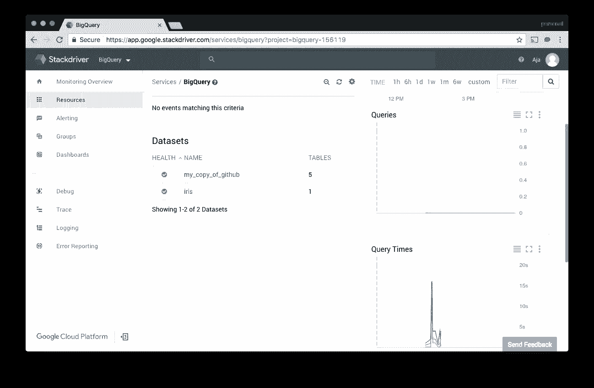
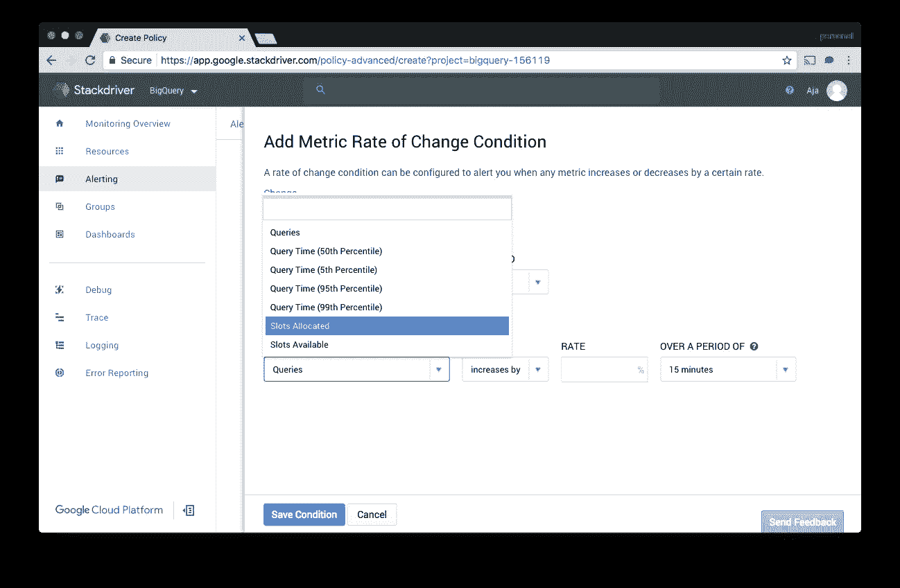

# 使用 Stackdriver 监控 BigQuery

> 原文：<https://medium.com/google-cloud/monitoring-stackdriver-with-bigquery-9a49331f7aaf?source=collection_archive---------1----------------------->

在过去的两年里，我做了几次关于 BigQuery 的演讲。那是我第一个爱上的谷歌云平台产品。它既易于使用(每个人都知道 SQL)，又非常强大(在< 30 secs?!?!?). One thing I have wondered is how I would monitor BigQuery to ensure that everything was working as expected. In the past, I ran data warehouse and log analysis tools on their own VMs and then monitored them the same way I would monitor any VM. However, I cannot do that when I am using a managed service like BigQuery. Managed services have so many advantages over running my own VMs that this week I sat down to learn the tools that were available for monitoring BigQuery using Stackdriver.

# Setup and Basics

You can access Stackdriver Monitoring from Cloud Console. If you have not used Stackdriver before you will need to link Stackdriver to your Cloud Platform account. The UI walks you through the process; it just takes a minute or two. Once you are on the Stackdriver dashboard, you should see BigQuery under the resources menu. If BigQuery is not a listed resource, you may need to wait a bit. There can be a bit of a delay between creating new resource types and having them appear in the Stackdriver UI. I connected Stackdriver to my GCP account before I created my dataset and it took about an hour for it to appear in the UI.

I used the GitHub dataset I used in [这篇博客文章](http://www.thagomizer.com/blog/2016/07/13/ruby-meets-bigquery-part-one.html)和机器学习教科书中流行的 Iris 数据集中有聚合的多个 TB)。如果没有任何负载，监控工具就很无聊，所以我写了一个快速的 Ruby 脚本，在我探索的时候对这两个数据集运行查询。一旦我确认 BigQuery 和 Stackdriver 看到了流量，我就一头扎了进去。

# 韵律学

默认仪表板显示实时查询计数、查询次数和槽利用率。如果切换到数据集指标，您可以看到一段时间内的表数、存储的字节数和上传的字节数。您也可以通过单击数据集名称来查看这些数据。

我使用静态数据集，所以数据集指标对我的项目来说很无聊。然而，当我改变脚本使用的查询时，我可以看到查询时间是如何变化的。此外，随着我的脚本实例越来越多，我发现查询数量也在增加。

# 发信号

对于大多数人来说，监控和警报是一回事。为了查看 BigQuery 可以使用哪种警报指标，我在“Alerting”->“Create Policy”下创建了一些警报策略。对于虚拟机，我最常用的指标类型是指标阈值和指标变化率。BigQuery 也支持这两种类型。

我设置了一个阈值指标，即我的任何查询都不应该超过 30 秒，另一个是 50%不应该超过 5 秒。我根据我过去在数据仓库和定制报告生成方面遇到的问题发出这些警报。没有从数据库中获取实时指标的能力，我不得不在页面呈现时间上发出警报，然后遍历管道，找出问题是在 HTML 视图、业务逻辑还是缓慢的查询中。

我还设置了一些度量变化率警报。我设置了一个工具来检测原始查询数是否随着时间的推移而显著减少。如果有更多的用户对我的数据集进行即席查询，我会设置一个关于已分配片段的变化率的警报。这样，我就可以在达到槽配额之前跟踪导致增加的查询。

# 仪表板

Stackdriver 还允许您创建自定义仪表板。当我为一个网站设置监控时，我喜欢看到 95%、50%和 5%的响应时间重叠。我觉得这让我对整体系统健康和用户体验有了更好的感觉，而不仅仅是看到平均值。我为我的 BigQuery 数据集创建了一个类似的仪表板。

您还可以在同一个仪表板上混合 BigQuery 图表和计算引擎、应用引擎和其他资源类型的图表，以便您可以在一个地方看到整个系统。

# 资源

有关为 BigQuery 设置 Stackdriver 和可用度量类型的更多信息，请查看[文档](https://cloud.google.com/bigquery/docs/monitoring)。

02/23/17

*原载于 2017 年 2 月 23 日*[*【www.thagomizer.com*](http://www.thagomizer.com/blog/2017/02/23/monitoring-bigquery-with-stackdriver.html)*。*