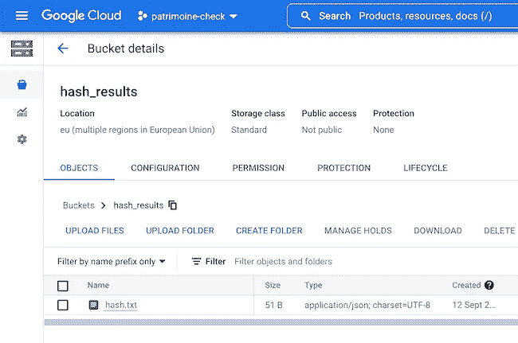
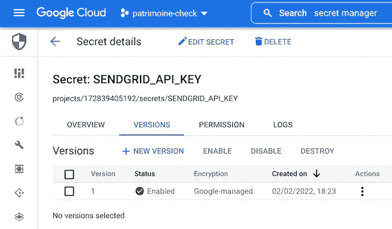
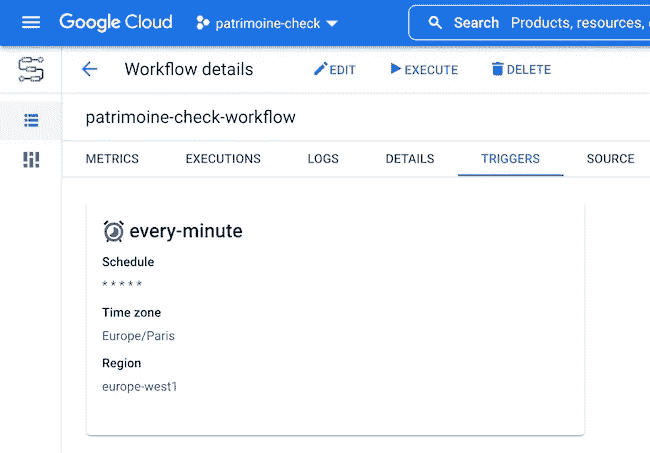

# 通过工作流、云功能和 SendGrid 监控网站变化

> 原文：<https://medium.com/google-cloud/monitoring-website-changes-with-workflows-cloud-functions-and-sendgrid-8f6dfa8d6485?source=collection_archive---------0----------------------->

每年在法国，大约在九月中旬，有一个特殊的周末，每个人都可以参观一些著名的地方，通常在一年的其余时间关闭。那是“[渡厄·帕特莫因](https://journeesdupatrimoine.culture.gouv.fr/)”。例如，如果你想看看法国总统或总理工作的地方，你可以去参观像[爱丽舍宫](https://www.elysee.fr/)或[马蒂尼翁宫](https://www.gouvernement.fr/le-patrimoine-de-l-hotel-de-matignon)这样的地方。然而，对于其中一些地方来说，在线注册预订一个位置是很棘手的，因为对它们的需求总是很高。此外，你必须在正确的时间到那里注册，通常，你甚至不知道那天或时间是什么时候！所以我想我可以通过跟踪爱丽舍宫网站上的变化来监控爱丽舍宫的网站，看看注册何时开放。

为了监控网页或网站的变化，有大量的在线服务可用。自由请求的数量或者变更检查的频率通常有一些限制。作为 Google Cloud 的开发人员，我决定编写一个简单的解决方案，利用各种 Google Cloud 服务，即:

让我们先来看一个计算网页哈希的函数。由于工作流标准库中没有哈希函数，我决定使用一个函数来完成这项工作。我使用 Node.js 运行时和 crypto 模块，它包含一个 sha1 实现:

```
const crypto = require('crypto'); exports.checksum = (req, res) => { 
    const shasum = crypto.createHash('sha1'); 
    res.status(200).send({sha1: sha1}); const webpageBody = req.body.webpage; 
    shasum.update(webpageBody); const sha1 = shasum.digest('hex'); 
};
```

该函数从工作流接收网页内容。然后，我用该内容创建 sha1 散列，并以十六进制形式在一个小的 JSON 有效负载中返回它。

我创建了一个 Google 云存储桶来存放我的网页哈希:



因为我使用 SendGrid 通过电子邮件通知我更改，所以我将 API 密钥安全地存储在 Secret Manager 中:



现在让我们一点一点地放大我们的工作流程。

首先，我定义了一些变量，比如我的 bucket 的名称、我的 hashes 文本文件的名称，并且我检索了我的 SendGrid API 密钥(参见上一篇关于在工作流中使用 Secret Manager 的文章):

```
main:
    params: [input]
    steps:
    - assignment:
        assign:
            - bucket: hash_results
            - file_name: hash.txt
    - get_email_api_key:
        call: googleapis.secretmanager.v1.projects.secrets.versions.accessString
        args:
            secret_id: SENDGRID_API_KEY
        result: EMAIL_API_KEY
```

然后我在 GCS 中读取前面 hash 的内容(你也可以查看这篇关于如何从一个工作流的 bucket 中读写 JSON 数据到一个文件的文章):

```
- read_hash_from_gcs:
        call: http.get
        args:
            url: ${"[https://storage.googleapis.com/download/storage/v1/b/](https://storage.googleapis.com/download/storage/v1/b/)" + bucket + "/o/" + file_name}
            auth:
                type: OAuth2
            query:
                alt: media
        result: hash_from_gcs
```

是时候对网站进行简单的 HTTP GET 调用了。目前，URL 是硬编码的，但是我们可以将工作流参数化，以从工作流执行输入参数中获取该 URL。

```
- retrieve_web_page:
        call: http.get
        args:
           url: [https://evenements.elysee.fr/](https://evenements.elysee.fr/)
        result: web_page
```

一旦我检索到 URL 的内容(请求的结果存储在 web_page 变量中)，我就可以通过调用我的云函数来计算我的散列值:

```
- compute_hash:
        call: http.post
        args:
            url: [https://europe-west1-patrimoine-check.cloudfunctions.net/checksum](https://europe-west1-patrimoine-check.cloudfunctions.net/checksum)
            body:
                webpage: ${web_page.body}
        result: hash_result
```

这就是我们在工作流程中引入一些分支的地方。如果网页没有改变，我们就提前结束，但是如果它改变了，我们就把新的散列存储在 GCS 中:

```
- assign_hashes:
        assign:
            - old_hash: ${hash_from_gcs.body.sha1}
            - new_hash: ${hash_result.body.sha1}
            - hash_msg: ${"Old hash = " + old_hash + " / New hash = " + new_hash}
    - conditionalSwitch:
        switch:
        - condition: ${new_hash != old_hash}
          next: write_hash_to_gcs
        next: returnOutput
    - write_hash_to_gcs:
        call: http.post
        args:
            url: ${"[https://storage.googleapis.com/upload/storage/v1/b/](https://storage.googleapis.com/upload/storage/v1/b/)" + bucket + "/o"}
            auth:
                type: OAuth2
            query:
                name: ${file_name}
            body:
                sha1: ${hash_result.body.sha1}
```

我记录了网站已经更改的事实，并且我正在调用 SendGrid API(就像本文中关于使用 SendGrid 从工作流发送电子邮件的内容一样):

```
- site_changed_log:
        call: sys.log
        args:
            text: Website has changed
    - notify_by_email:
        call: http.post
        args:
            url: [https://api.sendgrid.com/v3/mail/send](https://api.sendgrid.com/v3/mail/send)
            headers:
                Content-Type: "application/json"
                Authorization: ${"Bearer " + EMAIL_API_KEY}
            body:
                personalizations:
                    - to:
                        - email: [me@gmail.com](mailto:me@gmail.com)
                from:
                    email: [you@gmail.com](mailto:you@gmail.com)
                subject: "Elysée, page mise à jour"
                content:
                    - type: text/plain
                      value: "La page de l'Élysée a été mise à jour"
    - log_hashes:
        call: sys.log
        args:
            text: ${hash_msg}
    - returnOutput:
            return: ${hash_msg} 
```

需要定期调用工作流。工作流可以配置为通过 Cloud Scheduler 按计划调用(同样，查看这篇关于计划工作流执行的文章)。我用* * * * * cron 模式将我的工作流配置为每分钟触发一次。



瞧啊。我让我的小工作流每分钟都被调用来检查网页是否有变化，如果有，就给我发一封电子邮件！

老实说，这个工作流程非常完美…但事实是我没有监控正确的 URL，我应该监控首页。此外，我监控的页面包含一些动态 JavaScript 代码，但是获取的 HTML 并没有真正改变。我错过了登记窗口，在我甚至有时间登记我的家人来参观之前，所有的位置都被超级迅速地填满了！真为我感到羞耻，下次最好检查一下我的网址，或者用运行在 Cloud Run 或 Cloud Functions 中的无头 Chrome 创建网页截图！或者，当然，使用在线服务已经解决了这些问题与他们多年的经验！希望明年，我不会错过报名！但是把谷歌云上所有有用的服务粘在一起，解决一个具体的问题是很有趣的。

*最初发表于*[*【https://glaforge.appspot.com】*](https://glaforge.appspot.com/article/monitoring-website-changes-with-workflows-cloud-functions-and-sendgrid)*。*