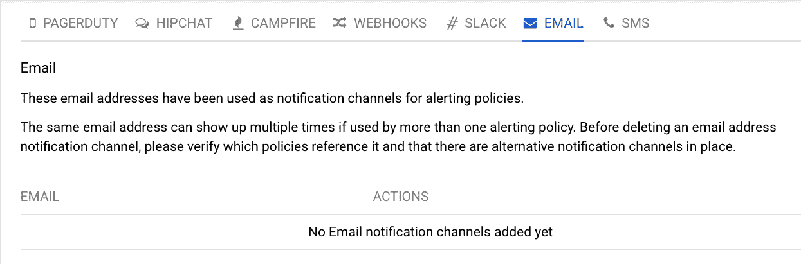
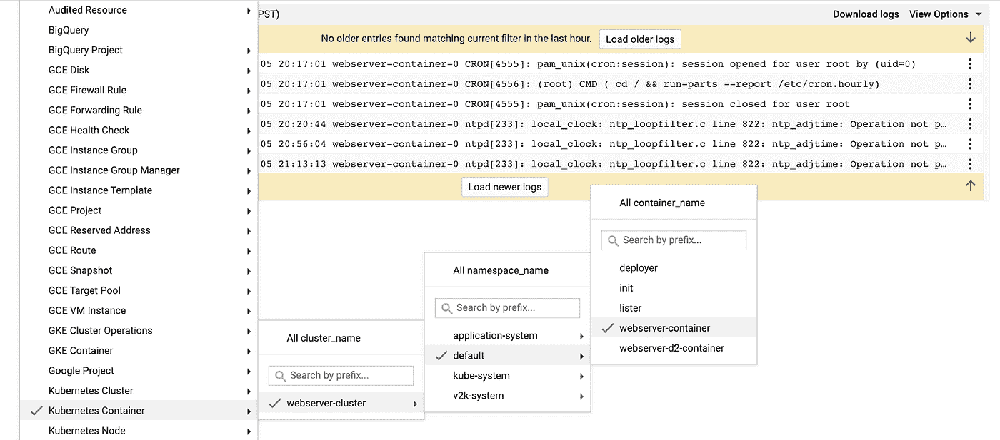

# 使用 Migrate for Anthos 监控迁移的工作负载

> 原文：<https://medium.com/google-cloud/monitoring-workloads-migrated-with-migrate-for-anthos-4c5542573767?source=collection_archive---------0----------------------->

这是前一篇文章的后续文章，前一篇文章介绍了如何使用 Migrate for Anthos 将计算引擎实例迁移到 Kubernetes 引擎。我想特别关注一下在云上的 Kubernetes 中工作负载发生了什么，以帮助您适当地维护和监控它。

作为一个受管理的 Kubernetes 服务，Kubernetes 引擎会自动使用 Stackdriver 进行日志记录和监控。如果您正在混合云环境中运行，[请查看这个解决方案](https://cloud.google.com/solutions/hybrid-and-multi-cloud-monitoring-and-logging-patterns)，它将介绍使用哪些日志记录和监控工具的一些注意事项，并提供基本的架构指导。

对于我们的 web 服务器示例，让我们看看如何设置一些基本的监控和日志记录。

# 监控基础设施

[Stackdriver Kubernetes 引擎监控](https://cloud.google.com/kubernetes-engine-monitoring/)提供了现成的仪表盘，允许我们选择所需的视图，我们可以专注于基础架构、工作负载或服务。首先，我们需要在项目中设置 Stackdriver。我们可以从[转到仪表盘](https://app.google.stackdriver.com/kubernetes)开始，或者转到谷歌云控制台，点击产品菜单中的监控链接。这将把我们直接带到监控概述，我们可以从资源菜单中选择 Kubernetes 引擎。


Kubernetes 发动机仪表板

生成的仪表板中的每一行都是可选择的，并显示有关该特定条目的更多详细信息。我们可以单击我们的容器来查看 CPU 和内存使用等指标，并查看该容器生成的日志。


容器详细信息和指标

自动创建这种“开箱即用”的基础设施监控固然很好，但更重要的是监控我们的应用程序以确保其正常工作。确保我们的容器启动并运行的一个简单方法是在 Kubernetes 指标上使用 **count** 聚合器，比如过滤到我们的容器名称的容器正常运行时间:


图表中的正常运行时间指标

我们可以将此图表添加到控制面板中，并保存在那里，以便随时可以轻松访问，还可以为我们想要衡量的指标添加任何其他图表！


仪表板中的容器数量

关于使用 Stackdriver 监控 Kubernetes 引擎基础设施和工作负载的更多信息，您可以阅读这篇[博客文章](/google-cloud/new-stackdriver-monitoring-for-kubernetes-part-1-a296fa164694)，其中有更多的细节。

# 监控应用程序

虽然监控容器本身是有价值的，但它并没有真正告诉我们应用程序是否真正在为用户流量服务。为了验证这一点，我们将创建一个[运行时间检查](https://cloud.google.com/monitoring/uptime-checks/)，它将通过我们在将应用程序迁移到 GKE 后创建的负载平衡器来访问应用程序的前端。


设置正常运行时间检查

在那里，我们可以创建一个警报策略，以便在正常运行时间检查失败时通知我们:


正常运行时间检查的警报策略

最后，我们可以创建一个[通知通道](https://cloud.google.com/monitoring/support/notification-options)，如果正常运行时间检查检测到我们的应用程序没有响应请求，警报策略将使用这个通道:



添加通知渠道

现在，我们可以确定我们正在监控应用程序本身及其运行的基础架构。

# 为您的应用程序记录

日志记录用于表示特定事件的详细信息，如果我们收到应用程序没有响应的警报，它可能会特别有用。首先，我们可以直接连接到我们的集群，并使用 kubectl 命令查看日志:

```
kubectl logs [POD NAME]
```

你可以在 Kubernetes [文档](https://kubernetes.io/docs/reference/kubectl/cheatsheet/#interacting-with-running-pods)中读到更多关于如何做到这一点的信息。f 标志允许我们在需要时连续地流式传输日志。

在 Kubernetes 引擎中，由我们的容器写入 stdout 或 stderr 的日志消息会被集群中运行的 fluentd daemonset 自动接收到 Stackdriver 日志中。要查看这些日志，我们可以在日志查看器中选择我们的集群、运行我们的应用程序的名称空间(默认)和容器名称(webserver-container ):



集装箱日志

> *我们也可以通过点击 Kubernetes 引擎下特定工作负载页面上的 Stackdriver 日志链接来访问这些日志。*

日志查看器还使我们能够在收到日志时对其进行流式处理，因此我们不需要使用启动流式日志功能来刷新页面:


流式日志

如果我们需要从 Stackdriver 中导出日志，比如基于事件的处理管道或分析，我们可以使用本[指南](https://cloud.google.com/solutions/design-patterns-for-exporting-stackdriver-logging)进行设置。这涉及到

*   将日志过滤为您需要导出的条目
*   创建到您选择的目的地的导出
*   (可选)如果需要规范化日志，例如在使用之前，设置处理管道

您可能希望基于作为日志条目发出的特定消息发出警报——如果是这种情况，请阅读这篇关于在 Stackdriver 中使用基于日志的指标的博客文章。

# 后续步骤

随着我们的应用程序迁移到 Kubernetes 并使用 Stackdriver，我们拥有了确保工作负载健康所需的监控和日志记录！如果你想了解更多关于修改日志获取方式的信息，比如过滤掉潜在的 PII，看看这篇关于定制日志的[帖子](/google-cloud/customizing-kubernetes-logging-part-1-a1e5791dcda8?source=---------8------------------)。

稍后，我们将对迁移后的 web 服务器采取下一步措施，并为其提供一个专用的持久卷。现在——在外面保持健康！