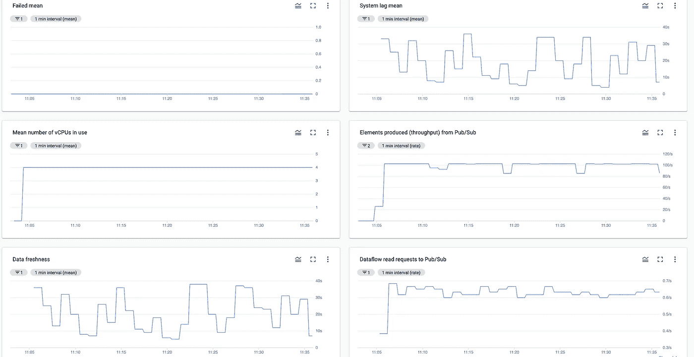
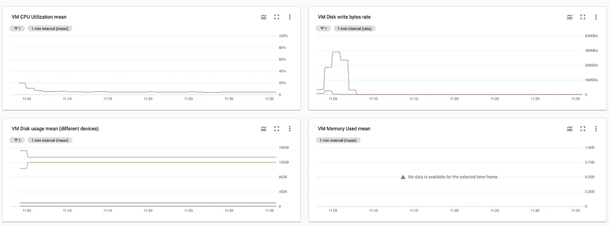
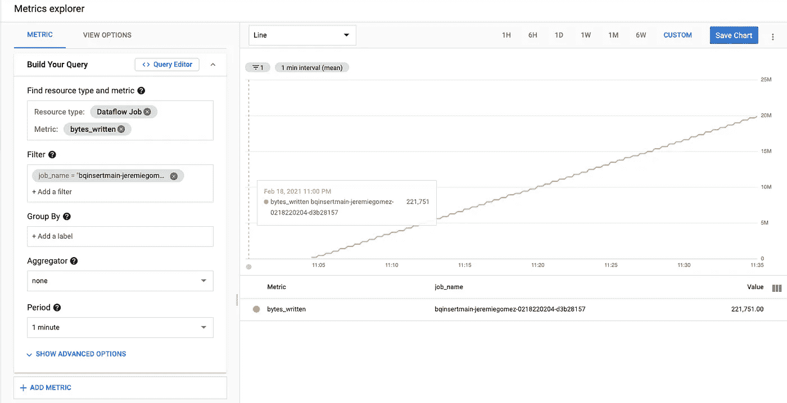
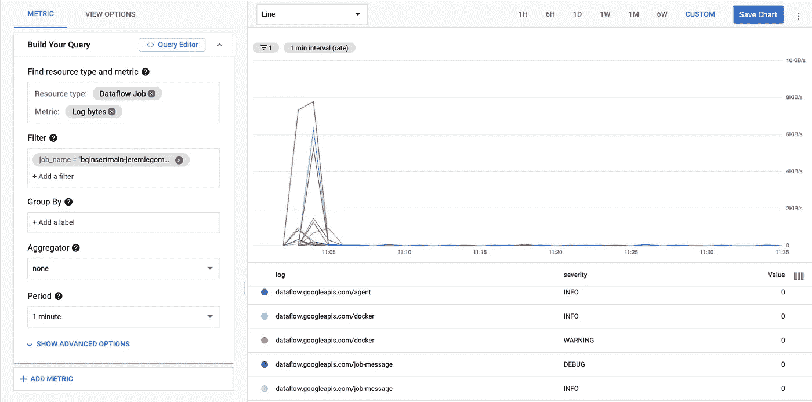
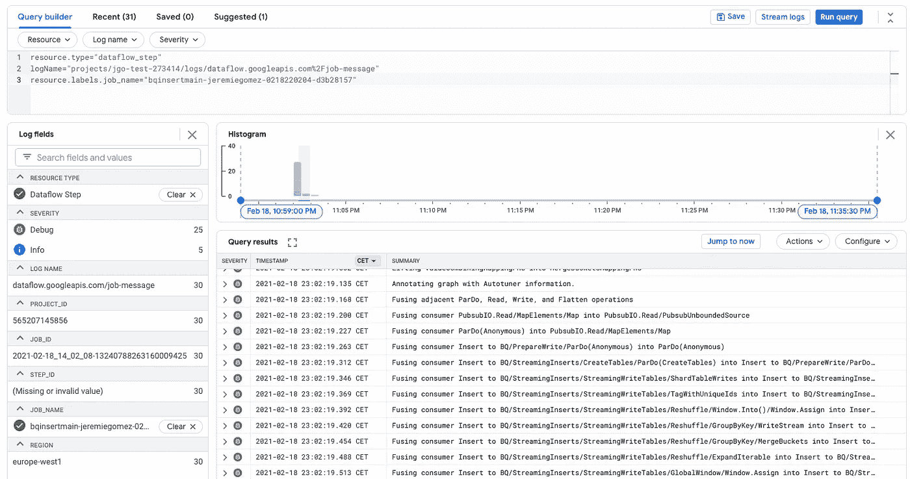
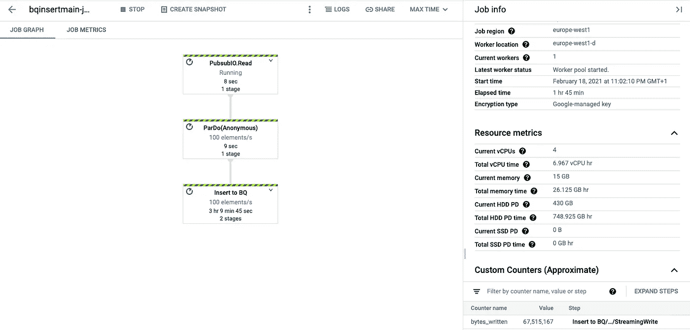
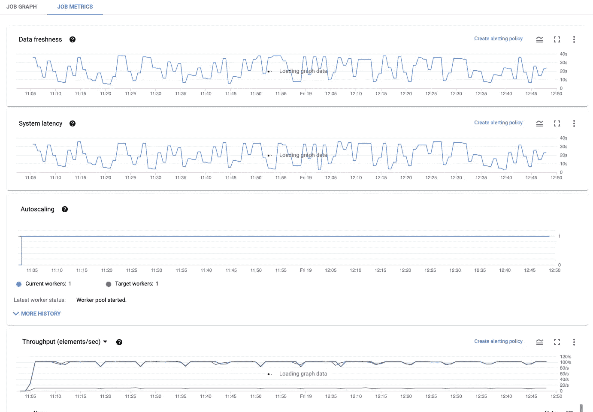
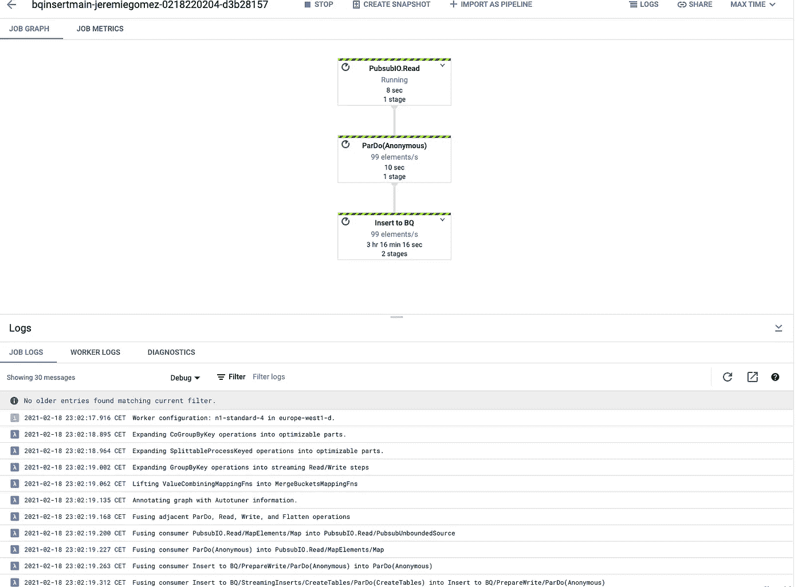
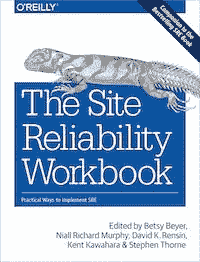

# 监控您的数据流管道:概述

> 原文：<https://medium.com/google-cloud/monitoring-your-dataflow-pipelines-80b9a2849f7a?source=collection_archive---------0----------------------->

[Apache Beam](https://beam.apache.org/) 是一个编程模型，可以让你实现批处理和流数据处理作业，这些作业可以在多个执行引擎上运行，包括[数据流](https://cloud.google.com/dataflow)，这个执行引擎由谷歌创建，可以在谷歌云平台上使用。

你已经决定使用数据流来运行你的光束管道，伟大的选择！您需要知道您的管道是否正常运行，尤其是如果您选择了流式管道。由于这些作业是连续运行的，因此应该对它们进行连续监控。

如果您在选择您的监控策略时感到有点迷茫，因为数据流可以利用多种类型的指标和日志，不要担心！本文概述了您可以在 Google 云平台上使用的不同指标和日志来监控您的数据流作业。**这篇文章的目标不是深入每个指标的细节，而是让你对可用的指标日志有一个大致的了解。**

在本文中，我将监控一个流数据流作业，该作业从发布/订阅订阅中读取数据，并使用流插入向 BigQuery 表中写入数据。通过使用[流数据生成器模板](https://cloud.google.com/blog/products/data-analytics/dataflow-flex-template-streaming-data-generator)和[发布/订阅 BigQuery 模板](https://cloud.google.com/dataflow/docs/guides/templates/provided-streaming#running-the-pubsub-subscription-to-bigquery-template)，您可以轻松运行相同的作业，而无需编写任何代码。

# 选择您的云监控指标

[云监控](https://cloud.google.com/monitoring)是 GCP 上针对所有指标和警报的原生解决方案。它与 GCP 的大多数产品集成在一起，Dataflow 当然也不例外。

在数据流环境中，云监控提供多种类型的指标:

*   标准度量
*   虚拟机(GCE)指标
*   监控代理度量
*   自定义指标
*   其他指标

## 标准度量

标准指标会给你很多关于你工作的信息。他们从"dataflow.googleapis.com/job/"开始。

可以通过标准指标回答的一些常见监控问题包括:

*   我的工作失败了吗？`dataflow.googleapis.com/job/is_failed`
*   我的工作处理邮件需要多长时间？`dataflow.googleapis.com/job/system_lag`
*   处理过程中是否会突然出现峰值？`dataflow.googleapis.com/job/current_num_vcpus`了解你的工作规模是否很大，`dataflow.googleapis.com/job/element_count`，`dataflow.googleapis.com/job/elements_produced_count`(吞吐量)等。
*   处理的数据是否新鲜？`dataflow.googleapis.com/job/per_stage_data_watermark_age`或`dataflow.googleapis.com/job/data_watermark_age`(又名数据新鲜度)

一些指标是时间的函数，可用于估计实时成本，例如:

*   `dataflow.googleapis.com/job/total_memory_usage_time`
*   `dataflow.googleapis.com/job/total_vcpu_time`

如果您的作业从发布/订阅中读取数据，则可以使用额外的指标，例如`dataflow.googleapis.com/job/pubsub/read_latencies`

你可以看看[标准指标的完整列表](https://cloud.google.com/monitoring/api/metrics_gcp#gcp-dataflow)。

下面是我的发布/订阅 BigQuery 作业在云监控的仪表板中设置的一些指标。

云监控仪表板，包含一些有趣的标准指标。

该控制面板仅由几个标准指标组成，您已经可以看到如下内容:

*   作业尚未失败(尽管对于流式作业，此指标仍将保持为 0，因为它们会不断重试)
*   性能:系统滞后大约 20 秒，数据新鲜度大致相同。该作业不需要自动扩展(仅 1 个 vCPU)。
*   发布/订阅行为:通过选择在 p collection“PubsubIO . Read/pubsuboundedsource . out 0”上过滤 elements_produced 指标，我们可以看到从发布/订阅读取的吞吐量。它大约是 100 条消息/秒，即与发布的速率相同。

## GCE 指标

Dataflow 将其工作机创建为 Google 计算引擎虚拟机。因此，您可以使用所有的 GCE 指标来更多地了解您的工作机的状态。他们从"compute.googleapis.com/"开始。

> Dataflow 将在其创建的虚拟机上自动创建两个标签:dataflow_job_id 和 dataflow_job_name。因此，您可以像处理标准指标一样，通过作业 ID 或作业名称轻松过滤 GCE 指标。

可以通过 GCE 指标回答的一些常见监控案例有:

*   我的 CPU 被利用了多少？`compute.googleapis.com/instance/cpu/utilization`
*   发生了多少磁盘写入？`compute.googleapis.com/instance/disk/write_bytes_count`
*   我的磁盘使用情况如何？
    `compute.googleapis.com/guest/disk/bytes_used`
*   我的内存使用了多少？`compute.googleapis.com/instance/memory/balloon/ram_used`(仅适用于 E2 系列的机器)

你可以看看[GCE 指标](https://cloud.google.com/monitoring/api/metrics_gcp#gcp-compute)的完整列表。

下面是我的发布/订阅 BigQuery 作业的云监控中的仪表板中设置的一些 GCE 指标。

具有 GCE 指标的云监控仪表板

我们可以看到 CPU 利用率非常低，我们还可以看到，当作业开始从发布/订阅中读取时，磁盘 IO 会激增，之后磁盘 IO 会恢复到较低的值。因为我使用 n1-standard-4 机器，所以您可以看到使用的 VM 内存是空白的，因为这个指标目前只针对 E2 系列的机器。

## 监控代理度量

如果 GCE 指标不够，您可以在虚拟机上安装监控代理。监控代理从虚拟机实例收集系统和应用指标，并将它们发送到云监控。他们从"agent.googleapis.com/"开始。

> 在数据流上，为了在您的 workers 上安装代理，您只需要在运行作业时使用这个管道参数:
> `--experiments=enable_stakdriver_agent_metrics`

如果您使用的不是 E2 机器，您可能对代理的一个度量感兴趣的是 RAM 使用的百分比:`agent.googleapis.com/memory/percent_used`。

您可以查看[监控代理指标的完整列表](https://cloud.google.com/monitoring/api/metrics_agent)。

## 自定义指标

Beam 允许您从代码中创建自己的度量。有三种类型的度量:

*   计数器:可以递增和递减。
*   Distribution:接受多个值，并将公开这些值的分布统计信息。
*   量规:一种标量度量，通过采用最后报告的值来聚合。

关于如何在您的代码中实现它的更多信息，请查看 Beam 编程指南中关于指标的[部分。一旦您对指标进行了编码，它们就可以在云监控中使用，并且从"custom.googleapis.com/dataflow"开始。](https://beam.apache.org/documentation/programming-guide/#metrics)

> 数据流不支持仪表；您可以使用计数器和分布自定义指标。

BigQueryIO 接收器已经实现了一个名为“bytes_written”的计数器类型的自定义指标。下面是它的样子，这一次是在 Metrics Explorer 中。

云监控度量浏览器:bytes_written 自定义度量

由于我的工作是对 BigQuery 进行流插入，我们看到了一个很好的字节线性函数。

## 其他指标

GCP 的一些指标将适用于大多数资源。一个例子是记录度量。

你的数据流作业会自动写日志，你也可以写自己的定制日志(见下面的云日志一节)。您可以使用日志记录指标来监控作业生成的日志数量，等等。它们以“logging.googleapis.com/”开头

例如，`logging.googleapis.com/byte_count`将帮助您了解已经写入的日志量。

云监视度量浏览器:字节计数日志记录度量

我们可以看到，许多日志只是在作业开始时生成的。为了避免不可预测的成本，在运行期间监控日志量是很重要的。

# 针对这些指标设置警报

我们已经看到，您可以想到至少 5 种数据流指标，每种都有自己的用途。

> 在设置警报之前，也考虑一下您的依赖项。您的数据流作业可能会从 Memorystore 中的 Redis 数据库读取一些数据。在这种情况下，你需要找到正确的指标来监控你的内存库。这样，如果数据流作业和内存中都出现了两个警报，您可以立即开始调查这种相关性。

一旦您选择了感兴趣的指标，甚至创建了自己的指标，云监控使您能够[创建警报](https://cloud.google.com/monitoring/alerts)。

警报由基于指标的策略组成(例如，当我的 CPU 利用率超过 95%超过 5 分钟时)，它们被传播到[通知渠道](https://cloud.google.com/monitoring/support/notification-options)，如电子邮件、Slack 渠道、SMS 等。

选择发布/订阅作为您的通知渠道有助于您与第三方警报工具集成。它还可以让您触发云功能，以便自动执行操作(例如，更改您的最大允许工作人数，重新启动服务)来响应警报。

> 尽管您可以在云控制台 UI 中设置警报，但当然建议您在基础架构中将警报设置为代码管道，例如使用 [Terraform](https://registry.terraform.io/providers/hashicorp/google/latest/docs/resources/monitoring_alert_policy) 。

一旦设置了警报，您还可以设置仪表板和组来改进指标的可视化表示。Dataflow UI(见下文)也将以一种漂亮的视觉方式向您展示最重要的指标。

# 使用云日志记录和基于日志的指标

云监控完全是关于指标的，而云日志记录完全是关于…日志的。云日志是了解您的工作的重要工具。

## 本地日志

默认情况下，数据流将生成流向云日志的日志。您可以控制数据流的日志的[级别。](https://cloud.google.com/dataflow/docs/guides/logging#SettingLevels)

数据流日志可以通过以下方式过滤:

*   对于键 *resource.type* ，使用`dataflow_step`值。
*   或者对于键*日志名，*使用`projects/{project-id}/logs/dataflow.googleapis.com%2F**X**`值*，*和 **X** 其中任何一个:代理、docker、job-message、jvm-gc、kubelet、resource、shuffler、shuffler-startup、system、vm-health、vm-monitor、worker、worker-startup。

> 这表明数据流的多个组件生成日志；大多数时候，您会对*作业消息*和*工人*日志感兴趣，但是其他日志可能会派上用场。

## 自定义日志

通过使用波束代码中的记录器，生成您自己的日志[非常简单。在 Java 中，推荐的方式是使用](https://cloud.google.com/dataflow/docs/guides/logging) [SLF4J](http://www.slf4j.org) 。您的自定义日志将作为数据流工作日志出现在云日志中。

定制日志对于了解您的工作正在执行的业务逻辑非常重要，并且有助于您进行调试。明智地选择代码中的日志级别( *LOG.info* 、 *LOG.debug* 等)。)以便日志存在，但在正常情况下不会生成太多日志。

在云日志资源管理器中包含特定作业名称的作业消息日志

## 基于日志的指标

这就是云监控和云日志的结合点。在云日志中，您可以设置基于日志的指标(计数器或分布指标)。该指标将像云监控中的任何其他指标一样出现，您可以在其上设置警报。这将从"logging.googleapis.com/user"开始。

敏锐的读者可能会认为自定义指标和基于自定义日志的指标看起来解决了相同的问题。假设您的工作是从 Pub/Sub 读取消息，并且您希望在一分钟内有超过 10 条消息格式错误时得到提醒。您可以:

*   使用波束计数器自定义度量，每次遇到格式错误的消息时都会增加该度量。
*   为每个日志生成一个自定义日志“格式错误的消息”，并在该日志上设置一个基于日志的度量。

两者都是可行的解决方案。这些约束可能有助于您选择:

*   数据流大约每 30 秒向监控报告一次自定义指标。这些指标的报告值是近似值。
*   日志摄取时间通常很短，但是您可能会发现它比指标摄取时间变化更大，因此使您的警报时间不太容易预测。最好是在您的用例上自己测量它。基于日志的度量也稍微简单一些，因为您不必修改您的 Beam 代码。

# 利用数据流用户界面

设置指标警报对于监控您的作业非常重要。然而，如果你试图调查你的工作做得怎么样呢？或者，您可能刚刚收到一个警报，希望更好地了解正在发生的事情。您可以直接利用 Dataflow UI 查看您的日志，并查看您的管道的重要指标，所有这些都在一个单一的 UI 中。

“作业图表”选项卡显示了图表的结构以及一些指标。单击每个阶段以获取该阶段的更多指标，尤其是:

*   为输入和输出集合添加的元素(与 element_count 度量相同)
*   输入和输出集合的吞吐量(与 element_produced_count 指标相同)
*   输出数据新鲜度(与 per_stage_data_watermark 指标相同)

作业图表选项卡:DAG 和指标

“jobs metrics”选项卡将向您显示我们已经提到的整个作业(而不是每个阶段)的一些指标。

这里一个有用的功能是“创建警报策略”链接。为用于显示特定图表的指标创建警报是一个很好的捷径。

作业指标选项卡

最后，从底部打开日志面板将显示您的数据流日志。此处仅显示作业日志和工人日志。如果您需要查看其他日志类型，您需要使用云日志记录接口。

确保您注意到下拉菜单选择您想要显示的日志级别。这里，我显示了调试级别的所有日志。

日志显示在数据流用户界面的底部。

# 下一步是什么

谷歌的 SRE(网站可靠性工程)工作手册中有一章是关于[数据处理管道](https://sre.google/workbook/data-processing/)的，它将帮助你:

*   有一个框架来思考您的管道可能如何失败(延迟的数据、损坏的数据)，以及它可能失败的原因(管道依赖性、应用程序和配置、意外的资源增长、中断)。
*   定义对监控应用程序至关重要的服务级别目标。
*   更广泛地考虑如何运营这些管道。

监控有时可能会被忽略，只在事情开始出错时才被关注，但它实际上对于确保数据处理管道的可用性和可靠性是必不可少的。将监控视为开发管道的一个组成部分非常重要，本文展示了设置这一点是多么容易。