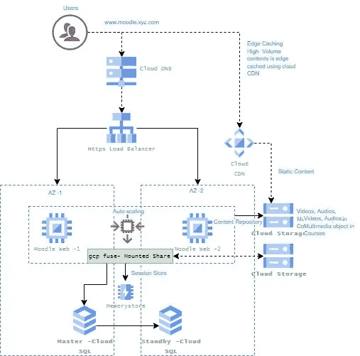

# GCP 上的 Moodle 可扩展解决方案

> 原文：<https://medium.com/google-cloud/moodle-scalable-solution-on-gcp-476256d14931?source=collection_archive---------1----------------------->

Moodle LMS 是一个开源的学习管理系统，可以为你选择的任何课程或教学方法定制。

GCP 的 Moodle 建筑

高级 Moodle 架构

**关键注意事项:**

1. **Moodle Web:** Linux 操作系统比如安装了 LAMP 的 Ubuntu/Debian。我们还需要所有的支持设置来运行 GCP 计算自动缩放组。Web 服务器将放置在不同的 az 中以实现高可用性，自动扩展将考虑峰值/激增或计算需求

2.**会话缓存:** Moodle 需要存储用户会话数据，以在他们工作时维护应用程序状态，这意味着用户可以连接到您的任何服务器，而不会丢失他们的进度。这可以在数据库中完成，使用 Redis/Memcache 服务器或使用负载平衡器粘性会话。

3.**共享存储:** Moodle 需要一个共享文件系统，用于用户上传、学生课程数据或其他相关内容。这里我们有几个选择:GCP 云存储、GCP 文件存储和 NFS 服务器。GCPFuse 将用于将云存储安装到 Web 服务器上。如果性能是云存储的瓶颈，GCP 文件存储可以提供更好的 IOPS。

4.**数据库**:可扩展的解决方案需要使用独立于 Moodle Web 服务器的专用数据库服务器。这提供了更好的性能，但也允许应用服务器轻松扩展。可以为 Moodle DB 部署云 SQL PostgreSQL 或 MySQL。数据库将是主数据库和备用数据库(多 AZ 数据库用于冗余，自动快照用于备份)。这消除了管理数据库的许多麻烦，时间点恢复让您真正放心。

5. **HTTPS 负载平衡器**:外部 HTTP(S)负载平衡是一种基于代理的第 7 层负载平衡器，使您能够在单个外部 IP 地址后运行和扩展您的服务。为安全网站整合 SSL/TLS 认证。

6.**云 CDN:** 在全球范围内提供快速、可靠的 web 和视频内容交付，并通过丰富的用户体验访问静态内容。

7.**代码管理:**虽然不完全是 Moodle 的问题，但我们确实需要考虑管理自动化部署的源代码，因为所有服务器都需要相同，以提供一致的用户体验。GCP 本地 CI/CD 工具可用于发布和部署