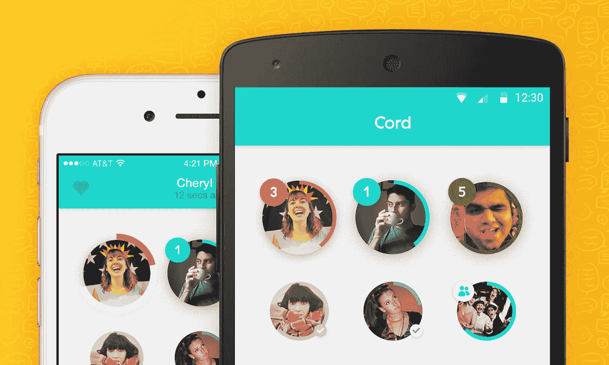

# 多开发，少运营。

> 原文：<https://medium.com/google-cloud/more-development-less-operations-1ec4ab2d6cff?source=collection_archive---------2----------------------->

用 Go 建立[线](https://cord.im)

在 [Cord 项目](http://cordproject.co)，我们相信声音的力量。我们相信简单。这一信条也指导着我们的工程实践。我们专注于运输产品和避免技术债务。我们尽可能地自动化来关注有趣的东西。

杰夫·巴克斯特(Jeff Baxter)和托马斯·盖诺(Thomas Gayno)在 2014 年 5 月创立了 Cord Project，目标是打造下一代消息应用。他们用 Parse 后端构建了一个 iOS 原型，并于 2014 年 9 月发布。我于 2014 年 8 月加入，构建我们自己的服务器应用程序并迁移解析数据。我们的目标是在 2014 年圣诞节前使用我们自己的基础设施发布一款更新的 iOS 应用和一款新的 Android 应用。我很高兴地说我们达到了目标。我们是这样做的。

我在八月和九月花了大约三周时间思考语言和架构。我在 Python、Postgres 和 nginx 之间就亚马逊 Web 服务上的原始虚拟机和谷歌云平台上的 Go 进行了辩论。我之前的公司在 AWS 上使用了 Perl/Python/Postgres 栈，所以我很想“用你知道的东西”我决定尝试一些新的东西，说实话，我大多选择了反对我以前的经验。我不想管理虚拟机、数据库、负载平衡器、安全性和日志记录基础架构。我讨厌手术。在发布之前，我需要并且想把 100%的时间花在编写应用程序代码上。

我不得不在大约 3 个月内从头开始构建一切。这实际上意味着我只有一半的时间来开发，以便交付给客户端团队。主要的应用功能有:

*   用电话号码、脸书和谷歌注册、登录和授权
*   用户帐户管理
*   用户社交图
*   媒体(音频和图像)存储
*   消息发送和接收
*   移动推送通知
*   消息和用户的社交活动
*   分析用户事件的数据管道和数据仓库
*   消息的 Web 界面
*   行政申请

我需要快速构建和部署。因此，我决定使用[谷歌应用引擎](https://cloud.google.com/appengine/) Classic 和应用引擎管理的虚拟机来编写 Go 代码。在构建应用程序之前，我对 Go 了解甚少，这是我第一次用编译语言编写一个重要的应用程序。我们没有遗憾。

我没有立即意识到编译器是如何提高生产率和效率的。作为唯一的后端工程师，如果没有编译器检查我的工作，我会推送不运行的代码。它提醒我注意打字错误和其他小错误。Go 编译器，以及像 [Go vet](https://golang.org/cmd/vet/) 和 [Gofmt](https://golang.org/cmd/gofmt/) 这样的 Go 工具，就像自动化代码审查工具，所以我可以快速部署正确的代码。

官方的 [Go 网站](https://golang.org/)有关于[语法、类型和功能](https://golang.org/pkg/)的清晰文档，还有许多[文章、最佳实践和指南](https://golang.org/doc/)。Go 中的代码组织、包管理和版本控制比 Python 更容易。Go 团队建议“导入路径应该是全局唯一的，所以使用您的源存储库的路径作为它的基础。”出售第三方软件包也是一个给你的应用程序稳定性的好主意。

围棋哲学也提高了我的效率。通过关注数据结构、经过充分测试的算法、RFC 规范和组合，我可以用 JSON 编写清晰的代码来响应 HTTPS 的请求。服务器和客户端错误也很容易处理。

好的 Go 代码可以事半功倍，尽管不算太少。比如围棋里就没有三元运算符。你需要写一个 5 行的 if-else 语句。快写该死的代码！Go 风格有助于代码的可读性，甚至是简略性。例如，在 [Effective Go 文章](https://golang.org/doc/effective_go.html)中，作者写道，“如果成功的控制流沿着页面向下运行，消除了出现的错误，代码读起来就很好。由于错误案例往往以 return 语句结束，因此生成的代码不需要 else 语句。”程序员执行一系列步骤(有时是并发的)，如果其中一个步骤失败，那么函数可以返回，程序员不必担心其余的步骤。因此，很容易将 API 请求的成功和错误案例可视化。

此外，我不需要复杂的类层次结构或 web 框架来制作 JSON API。net/http 包实际上拥有服务器所需的一切。一般来说，移动后端接收传入的请求，有时带有一些数据，对它们进行授权，进行一些计算和数据库调用，并用 JSON 进行响应。您可以使用并发 RPC 和缓存来提高性能。在高层次上，Go 帮助程序员按照以下指导方针编写快速代码:

1.  少干活。Go 使得删除代码变得容易，因为你通常没有紧密耦合的复杂代码。:-)
2.  做更聪明的工作。标准库有许多排序、搜索和其他标准算法，还有一个强大的开源社区。
3.  做同样多的工作，但同时进行。Go 提供了 goroutines、channels 和 [WaitGroups](https://golang.org/pkg/sync/) ，以及其他基本的同步原语。
4.  少干点活，剩下的随意干。Go 使得控制超时的变化变得容易。
5.  现在少做点工作，剩下的以后再做。Go on Google Cloud Platform 使用[任务队列](https://cloud.google.com/appengine/docs/go/taskqueue/)轻松推迟工作。

不出意外，Go 在谷歌云平台上运行得非常好。App Engine Classic 和 App Engine 托管虚拟机提供了 Cord 团队所需的所有功能:

*   操作系统、安全更新、访问控制和私钥管理
*   简单的工具，如部署脚本、缓慢推出、回滚、A/B 测试
*   日志聚合和搜索
*   用于请求跟踪、监控和警报的控制台
*   自动扩展前端和后端实例(当你出现在应用商店中并且每秒请求数增加 10 倍时，这非常方便)
*   自动缩放数据库
*   数据库导出到分析引擎(BigQuery)

在我从事 Cord 工作的整个过程中，我只使用过一个原始虚拟机，那是在我将数据从 Parse 迁移到 GCP 的时候。我可以在大约 15 秒内部署新代码，并以同样快的速度回滚。我可以在 web 控制台中搜索和监控应用程序请求。我可以将我的请求日志导出到 BigQuery，并执行 SQL 查询来查找瓶颈或模式。我不需要担心实例，因为应用引擎的自动缩放。由于[数据存储](https://cloud.google.com/appengine/docs/go/datastore/)的优势，我不需要担心数据库分片、性能和备份。最后，团队可以使用 BigQuery 进行即席查询，并做出数据驱动的产品决策。对于端到端的应用程序开发，Go on GCP 让 Cord 团队能够以[成倍减少的](http://commandcenter.blogspot.com/2012/06/less-is-exponentially-more.html)完成更多工作。

我们谈谈吧！