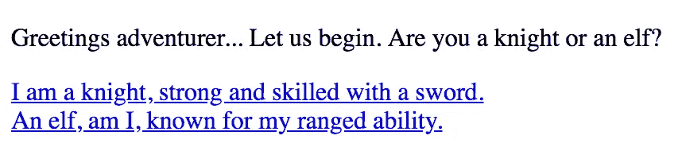
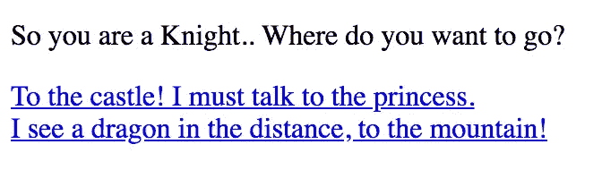

# 谷歌云上的更多功能

> 原文：<https://medium.com/google-cloud/more-functions-on-google-cloud-69c44a514661?source=collection_archive---------2----------------------->


谷歌云

如果你还没有读过我的上一篇文章[在 Google Cloud](/google-cloud/deploying-a-functions-serverless-app-on-google-cloud-e8f0e3011b2b) 上部署一个功能(无服务器)应用，你应该看看这篇文章的背景。

# 我们将假设:

*   您已经安装了`gcloud`工具
*   你在 GCP 有一个项目

> 注意:您必须安装`*gcloud*`测试版

要安装`gcloud`测试版使用:

```
gcloud components update && gcloud components install beta
```

# 概述

上次，我们做了一个功能应用程序，看起来像这样:

```
exports.helloFunctions = (req, res) => {
  res.send('Hello Functions!');
};
```

当你到达终点时，它简单地发送回`Hello Functions!`。现在让我们继续下去，展开这一点。我们要做一个基于文本的冒险游戏(想想 [Zork](https://en.wikipedia.org/wiki/Zork) )。

# 我们想要什么？

我们可以把冒险中的每个*步骤*想象成一个函数。所以，当你开始游戏时，*那是一个函数*，当你选择走一条路*，那是一个函数*，或者当你选择走另一条路，*那是一个函数*。

## 那么，我们如何才能做到这一点呢？

让我们从一个 HTML 模板开始，它将显示一条消息和两个链接:

```
let template = ({ message, opt1, opt2, opt1Label, opt2Label }) => {
  return `
    <!DOCTYPE html>
    <html>
      <head>
      </head>
      <body>
        <p>${message}</p>
        <div><a href='${opt1}'>${opt1Label}</a></div>
        <div><a href='${opt2}'>${opt2Label}</a></div>
      </body>
    </html>
  `
```

正如我们在这里看到的，模板接受了一条消息、几个链接以及这些链接的几个标签。

## 现在，让我们开始我们的冒险吧！

我们将创建一个名为`startAdventure`的新功能，它将欢迎我们的玩家加入游戏，并给他们两个选项:

```
exports.startAdventure = (req, res) => {
  res.status(200).send(template({
  message: `Greetings adventurer... Let us begin.
  Are you a knight or an elf?
  `,
  opt1: req.url + "Knight",
  opt2: req.url + "Elf",
  opt1Label: "I am a knight, strong and skilled with a sword.",
  opt2Label: "An elf, am I, known for my ranged ability."
  }));
};
```

现在让我们开始部署我们的冒险:

`gcloud beta functions deploy startAdventure --trigger-http`

这是我们冒险的开始。它应该输出 URL，但是如果您错过了，格式是:

`https://[GCP-REGION]-[PROJECT_ID].cloudfunctions.net/startAdventure`

你可以打开那个网页，看到这样的内容:



`[https://[GCP-REGION]-[PROJECT_ID].cloudfunctions.net/startAdventure](/[GCP-REGION]-[PROJECT_ID].cloudfunctions.net/startAdventure)`

但是，这些链接还不行。让我们为骑士写一首:

```
exports.Knight = (req, res) => {
  res.status(200).send(template({
    message: `So you are a Knight..
    Where do you want to go?
    `,
    opt1: req.url + "Castle",
    opt2: req.url + "Mountain",
    opt1Label: "To the castle! I might talk to the princess.",
    opt2Label: "I see a dragon in the distance, to the mountain!"
  }));
};
```

现在让我们来部署它:

`gcloud beta functions deploy Knight --trigger-http`

所以现在当你点击第一个链接时，你应该在这里结束:



[https://[GCP 地区]-[项目 ID]. cloud functions . net/Knight](/[GCP-REGION]-[PROJECT_ID].cloudfunctions.net/Knight)

# 那么这是如何工作的呢？

好吧，当我们制作我们的`startAdventure`函数时，我们告诉它提供一个带有`req.url + Knight`和`req.url + Elf`链接的 HTML 页面(如上图)。你会注意到，当你点击骑士链接时，网址改变了，现在以`Knight`而不是`startAdventure`结尾。我们可以看到我们的`Knight`页面链接到`Castle`和`Mountain`。

# 下一步是什么？

往前走，继续走！可能性是无限的

我鼓励你继续发展你的冒险！如果你想用更多的选项甚至一个图像来定制它，你可以改变模板。

最棒的是。

> 功能有💲🆓。⁹⁹(免费)！

这里是[定价](https://cloud.google.com/functions/pricing)如果你不相信我。

# 感谢阅读！如有疑问，在下方评论！👋