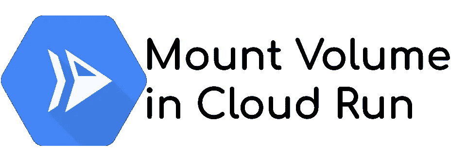

# 在云运行中将文件装载为卷

> 原文：<https://medium.com/google-cloud/mount-a-file-as-a-volume-in-cloud-run-facc74c02cc6?source=collection_archive---------0----------------------->



几年前，云运行**重新定义了无服务器模式**。Cloud Run 还**做出了承诺:在任何安装了** [**Knative**](https://knative.dev/docs/) 的 Kubernetes 集群**上的可移植性**。*我* [*演示了一下这个便携性*](/google-cloud/knative-and-cloud-run-portability-in-action-1a655c914318) *哪个厉害！*

Knative 和 Cloud Run **实现了相同的 API 和相同的原则**:你创建一个容器，你部署它，它会根据你的流量自动伸缩。

为了确保和实现这种可伸缩性，Cloud Run 和 Knative 在容器范例中有一个主要的约束

> 容器必须是无状态的。您不能在容器上安装卷

所以，今天(2021 年 7 月):**不可能在云 Run 上挂载一个卷。**但是……

# 云运行中的秘密管理

云运行托管应用程序的服务，像大多数应用程序一样，它们**需要访问秘密** : API 密钥、数据库凭证、私有密钥……
在 Google Cloud 上，管理秘密的推荐**工具是** [**秘密管理器**](https://cloud.google.com/secret-manager) **。**

Cloud Run 提出了一个**方便的** [**与 Secret Manager**](https://cloud.google.com/run/docs/configuring/secrets) 的集成，并且因为 Cloud Run 希望在任何 Kubernetes 集群上尽可能的可移植，所以它**实现了类似的 secret management** 特性。您可以加载一个秘密值:

*   要么转换成环境变量
*   或者将其作为卷安装。

# 在云运行中将机密装载为卷

这个特性很棒，并且符合 Kubernetes 最佳实践。要通过云运行实现这一点，您需要在 Secret Manager 中创建一个秘密:

```
# Create a secret name
gcloud secrets create medium# Create a secret version
echo "my secret" | gcloud secrets versions add --data-file=- medium
```

然后，您可以部署您的 Cloud Run 服务，并将机密装载为一个卷:

```
gcloud beta run deploy <SERVICE_NAME> --image <IMAGE> \
  --update-secrets=/secrets/mysecret=medium:latest
```

最后，将它作为来自您的服务的任何文件来读取，例如在 Golang 中(file `server.go`):

```
package main

import (
   "fmt"
   "io/ioutil"
   "net/http"
   "os"
)var fileLocation = "/secrets/mysecret"func main() {

   http.HandleFunc("/", func (w http.ResponseWriter,
                                  r *http.Request) {
      f, err :=os.Open(fileLocation)
      if err != nil {
         w.WriteHeader(http.*StatusInternalServerError*)
         fmt.Fprint(w,err)
         return
      }
      b, err := ioutil.ReadAll(f)
      if err != nil {
         w.WriteHeader(http.*StatusInternalServerError*)
         fmt.Fprint(w,err)
         return
      }
      fmt.Println(string(b))
      fmt.Fprint(w,string(b))
      return
   })
   http.ListenAndServe(":8080", nil)
}
```

打电话给你的服务，是的，你有`my secret`显示！您成功地**将一个秘密挂载为一个文件，并在您的代码中读取它**！

> 嘿，你把秘密当成文件读了！为什么不把秘密文件当文件读？

# 在云运行中挂载(秘密)文件

类似地，作为一个秘密值，你可以从一个文件创建一个秘密！让我们加载一个文件作为秘密，就像这样:

```
gcloud secrets versions add --data-file=./server.go medium
```

再试试 **Boom，你已经在云运行中挂载了一个文件**！！
*因为我们在部署的时候定义了* `*medium*` *秘密的* `*latest*` *版本，所以你可以马上得到最新版本的秘密。如果愿意，您可以定义一个静态版本。*

# 使用案例和限制

在讨论用例之前，让我们**看一下限制**:

*   您只能**读取文件内容**，不能写入或更新它，除非您创建了一个新的秘密版本
*   您的秘密[内容**限制为 64kb**](https://cloud.google.com/secret-manager/quotas#content_limits)

由于这些限制，最好的用例是加载一个**配置文件作为卷**。

*   应用程序不需要更新配置文件
*   **配置文件**可以包含秘密****
*   **配置文件**很小，符合 64KiB 的限制****

**当然，在部署云运行服务时，您可以在不同的卷中加载几个(秘密)文件。**

# **云运行和卷**

**Cloud Run 还不支持卷，但是由于 Secret Manager 的集成和特定的用例，您可以模拟这种支持。我用它进行了春季启动部署，它真的很有帮助！**

**对于配置、秘密管理和防止在 Git 存储库中推送敏感数据来说,**非常棒。****