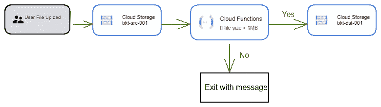
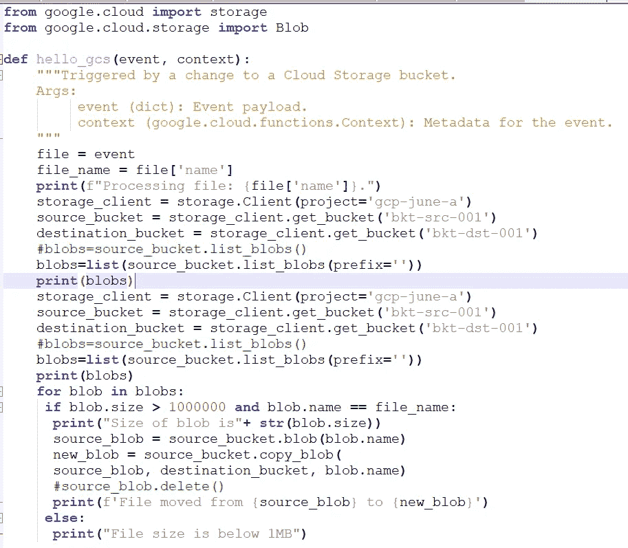

# 使用云功能从 GCS 存储桶移动大文件

> 原文：<https://medium.com/google-cloud/move-large-files-from-gcs-bucket-using-cloud-function-232852b10a4c?source=collection_archive---------0----------------------->

**简介**

Cloud Functions 是一个**轻量级、无服务器、**计算解决方案，开发人员可以创建单一用途的独立功能来响应云事件，而无需管理服务器或运行时环境。

在本文中，我们将利用云功能服务来检测和移动 GCS bucket 中的大文件。

**要求** -

用户将文件上传到 GCS 存储桶(bkt-src-001)，需要将所有大于 1MB 的文件移动到另一个存储桶(bkt-dst-001)。

**实现**

1.  使用创建文件上的云存储事件创建云函数。
2.  云函数包含检查文件大小是否大于 1MB 的代码，然后移动到 bucket bkt-dst-001。
3.  每当用户上传文件到源桶(bkt-src-001)时，它将触发云功能并检查文件大小。
4.  如果文件大小大于 1MB，它将移动到目标存储桶(bkt-dst-001)。
5.  如果文件大小为< 1MB it will exit with message.

**步骤 1** 创建两个存储桶作为源存储桶和目的存储桶。bkt-src-001 & bkt-dst-001

**步骤 2** 创建云函数

从云控制台>创建函数导航到云函数

填写所需的详细信息，如名称、地区等，并选择触发为云存储，如下所示。

选择运行时为 Python 3.7

在 **main.py** 中编写登录代码，在 **requirements.txt** 中编写依赖项(必需的包)

main.py

requirements.txt

部署您的云功能。

功能现在处于活动状态

现在上传存储桶(bkt-src-001)中的文件以验证您的功能。

日志

视频演示，请参考下面的视频