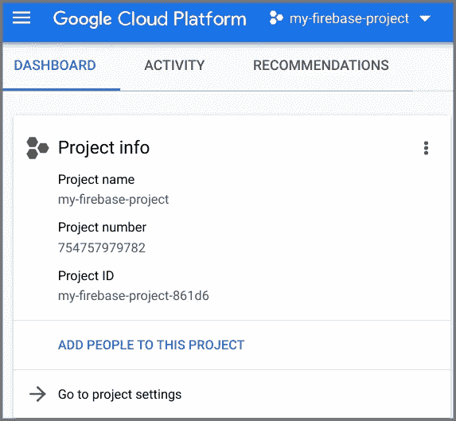
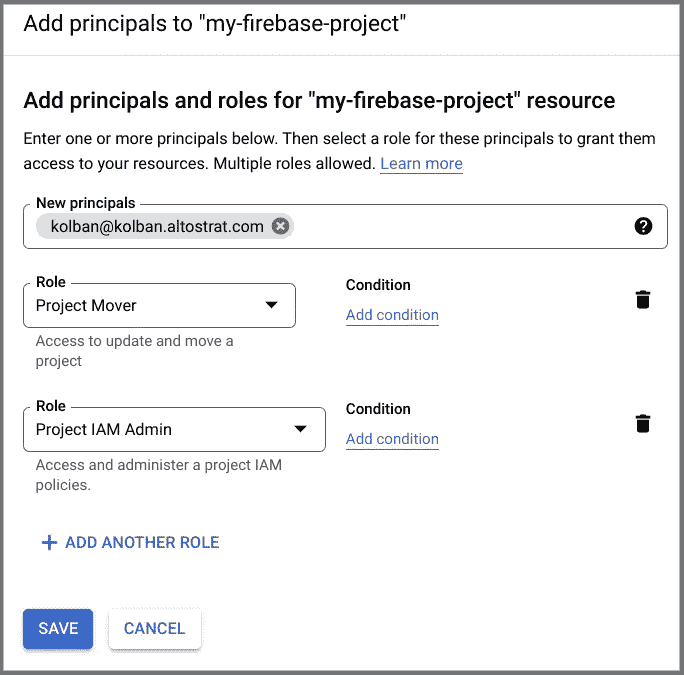

# 将 Firebase 项目转移到 GCP 组织

> 原文：<https://medium.com/google-cloud/moving-a-firebase-project-to-a-gcp-organization-860c46ff416?source=collection_archive---------0----------------------->

最近，我和一个客户一起工作，他创建了一个 Google Firebase 项目，并成功地使用了它。然后，他们意识到 Firebase 项目的创建导致了相应的 GCP 项目的创建，而这个 GCP 项目不属于 GCP 组织，因此不属于他们的环境范围。他们想知道如何将 Firebase/GCP 项目移植到他们想要的 GCP 组织中。

这篇文章描述了一个可以用来完成这个任务的方法。在这个食谱中，我们将会用到很多部分，所以现在让我们来看看。

我们将从 Firebase 环境开始。

我通过点击“添加项目”按钮/卡片创建了 Firebase 项目。在这一点上，还要注意我被认证为我的“Firebase”开发人员用户。在本例中，这是一个名为`kolbandev@gmail.com`的 gmail 帐户。我把我的项目命名为“T1”。

几分钟后，项目创建完毕。我现在可以访问左上方的项目概述菜单，并选择项目设置:

这显示了一些关于我们的 Firebase 项目的有趣信息:

我特别想让你注意的是“项目 ID”。在本例中，它的值为“`my-firebase-project-861d6`”。这个是什么是底层的 GCP 项目。现在，让我们使用 Firebase 电子邮件登录 GCP 控制台(在本例中为`kolbandev@gmail.com`)。

当我们到达那里时，我们将看到一个名为“`my-firebase-project`”的 GCP 项目，其项目 ID 与我们预期的一样。我们可以选择该项目作为我们想要工作的项目。

如果我们将此信息与 Firebase 的详细信息进行比较，我们会发现它们是匹配的，并且我们确实在与正确的 GCP 项目合作。在这一点上，我们有我们的基本故事。我们有一个显示为 GCP 项目的 Firebase 项目。然而，这个 Firebase 项目并没有*而不是*(在这种情况下)存在于我想要的 GCP 组织中。我们现在的目标是将这个项目移到正确的位置。

现在让我们考虑一下正确的位置。在这个例子中，我有一个名为`kolban.altostrat.org`的 GCP 组织。完成后，我希望这个 Firebase GCP 项目在该组织下存在。为了实现这个目标，我需要选择一个有权在我的目标组织中创建新项目的 Google 帐户。我选的身份是`kolban@kolban.altostrat.org`。我们现在需要在 Firebase/GCP 项目中给予这个身份权限，以便能够执行迁移。

当被认证为 Firebase 身份(`kolbandev@gmail.com`)时，进入名为`my-firebase-project`的 GCP 项目的 IAM 页面:

单击“添加”按钮，为项目添加一些新的权限。我们希望添加两个角色。一个叫`Project Mover`，一个叫`Project IAM Admin`。我们希望将这些添加到有权在组织中创建项目的组织用户中(在本例中为`kolban@kolban.altostrat.com`)。

结果将是:

我们现在已经完成了迁移所需的设置。我们现在将打开一个新的浏览器窗口，并以 GCP 组织用户的身份登录到 GCP 控制台(在本例中为`kolban@kolban.altostrat.com`)。

如果一切进展顺利，您应该能够从无组织中选择并看到 firebase 项目。请记住，此时您是 GCP 组织的用户。点击右上角的 3 个垂直点，进入项目设置:

在那里你会发现:

现在我们已经接近结论了。请注意顶部的“迁移”按钮。单击该按钮。

现在，您可以选择要将项目迁移到的目标组织。选择正确的组织，然后单击迁移。将短暂出现一个弹出窗口，告诉您迁移已完成。如果我们现在查看组织内的项目，我们会发现项目现在存在:

剩下的工作就是验证所有资源都已成功迁移，并检查哪个计费帐户与项目相关联，并根据需要进行更改。

# 参考

*   [GCP 文档:迁移项目](https://cloud.google.com/resource-manager/docs/project-migration)