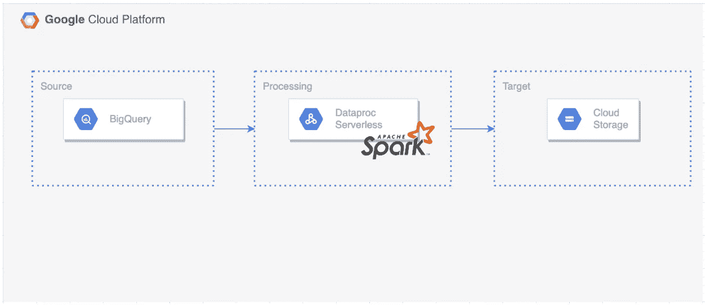

# 使用 GCP Dataproc Serverless 和 PySpark 将数据从 BigQuery 移动到 GCS

> 原文：<https://medium.com/google-cloud/moving-data-from-bigquery-to-gcs-using-gcp-dataproc-serverless-and-pyspark-f6481b86bcd1?source=collection_archive---------0----------------------->



[Dataproc 模板](https://github.com/GoogleCloudPlatform/dataproc-templates)允许我们使用 Java 和 Python 在 Dataproc 无服务器上运行常见用例，而不需要我们自己开发。这些模板实现了常见的 Spark 工作负载，让我们可以轻松地定制和运行它们。

如果您不熟悉 Dataproc Serverless，或者您正在寻找使用 Dataproc Serverless 将数据从 GCS 迁移到 BigQuery 的 PySpark 模板，那么可以使用这个 [blogpost](/@ppaglilla/getting-started-with-dataproc-serverless-pyspark-templates-e32278a6a06e) 。

# 先决条件

为了运行这些模板，我们需要:

*   Google Cloud SDK 已安装并通过验证
*   Python 3.7 以上版本已安装
*   启用了专用 Google 访问的 VPC 子网。默认子网是合适的，只要启用了私有 Google 访问。您可以在这里查看所有的 Dataproc 无服务器网络需求。

# 主要优势

*   使用 Dataproc Serverless 运行 Spark batch 工作负载，而无需提供和管理您自己的集群。
*   [BigQueryToGCS](https://github.com/GoogleCloudPlatform/dataproc-templates/tree/main/python/dataproc_templates/bigquery) 模板是开源的，完全可定制，可用于简单的工作。
*   您可以将 BigQuery 中的数据以 Parquert、AVRO、CSV 和 JSON 格式导入 GCS。

# 配置参数

该模板包括以下用于配置执行的参数:

*   `bigquery.gcs.input.table` : BigQuery 输入表名(格式:project:dataset.table)
*   `bigquery.gcs.output.format`:输出文件格式。实木复合地板、avro、csv、json 之一
*   `bigquery.gcs.output.location`:输出文件的 GCS 位置(格式:gs://BUCKET/…)
*   `bigquery.gcs.output.mode`:输出写入模式。append、overwrite、ignore、errorifexists 之一。默认为追加。你可以在这里了解每种保存模式的行为[。](https://spark.apache.org/docs/latest/sql-data-sources-load-save-functions.html#save-modes)

# 使用

1.  如果你要使用“默认的”由 GCP 生成的 VPC 网络，请确保你已经启用了私有谷歌访问子网。您仍然需要启用如下的私人访问。


2.创建一个 GCS 存储桶，用作 Dataproc 的暂存位置。这个桶将用于存储运行我们的无服务器集群所需的依赖关系。

```
export STAGING_BUCKET=”my-staging-bucket”
gsutil mb gs://$STAGING_BUCKET
```

3.克隆 Dataproc 模板库并导航到 Python。模板的目录

```
git clone [https://github.com/GoogleCloudPlatform/dataproc-templates.git](https://github.com/GoogleCloudPlatform/dataproc-templates.git)
cd dataproc-templates/python
```

4.配置 Dataproc 无服务器作业

为了将作业提交给 Dataproc Serverless，我们将使用提供的 bin/start.sh 脚本。该脚本要求我们使用环境变量来配置 Dataproc 无服务器集群。

强制性配置包括:

*   `GCP_PROJECT`:无服务器运行 Dataproc 的 GCP 项目。
*   `REGION`:运行 Dataproc 无服务器的区域。
*   `GCS_STAGING_LOCATION`:一个 GCS 位置，Dataproc 将在此存储登台资产。应该在我们之前创建的桶内。

```
# Project ID to run the Dataproc Serverless Job
export GCP_PROJECT=<project_id># GCP region where the job should be submitted
export REGION=<region># The staging location for Dataproc
export GCS_STAGING_LOCATION=gs://$STAGING_BUCKET/staging
```

在我们的例子中，GCS 的 BigQuery 需要在类路径中有可用的 [Spark BigQuery 连接器](https://cloud.google.com/dataproc-serverless/docs/guides/bigquery-connector-spark-example)。连接器是公开托管的，所以我们将使用`JARS`环境变量来添加它。您还可以选择将 JAR 文件存储在您自己的存储桶中。

为了以 AVRO 文件格式导出 BigQuery 数据，我们还需要 spark-avro.jar，它已经包含在`bin/start.sh`中

```
# Path to the Spark BigQuery Connector JAR file
export JARS=”gs://spark-lib/bigquery/spark-bigquery-latest_2.12.jar”
```

5.对 GCS Dataproc 模板执行 BigQuery

配置作业后，我们就可以触发它了。我们将运行`bin/start.sh`脚本，指定我们想要运行的模板和执行的参数值。

```
./bin/start.sh \
— — template=BIGQUERYTOGCS \
— bigquery.gcs.input.table=<projectId:datasetName.tableName> \
— bigquery.gcs.output.format=<csv|parquet|avro|json> \
— bigquery.gcs.output.mode=<overwrite|append|ignore|errorifexists> \
— bigquery.gcs.output.location=<gs://bucket/path>
```

**注意**:提交作业将要求您启用 Dataproc API，如果尚未启用的话。

6.监控 Spark 批处理作业

提交作业后，我们将能够在 [Dataproc 批处理 UI](https://console.cloud.google.com/dataproc/batches) 中看到。从那里，我们可以查看作业的指标和日志。

# 参考

*   [Dataproc 无服务](https://cloud.google.com/dataproc-serverless/docs/overview)
*   [Dataproc 模板库](https://github.com/GoogleCloudPlatform/dataproc-templates)