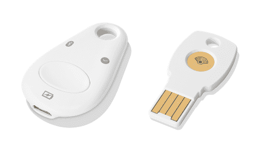
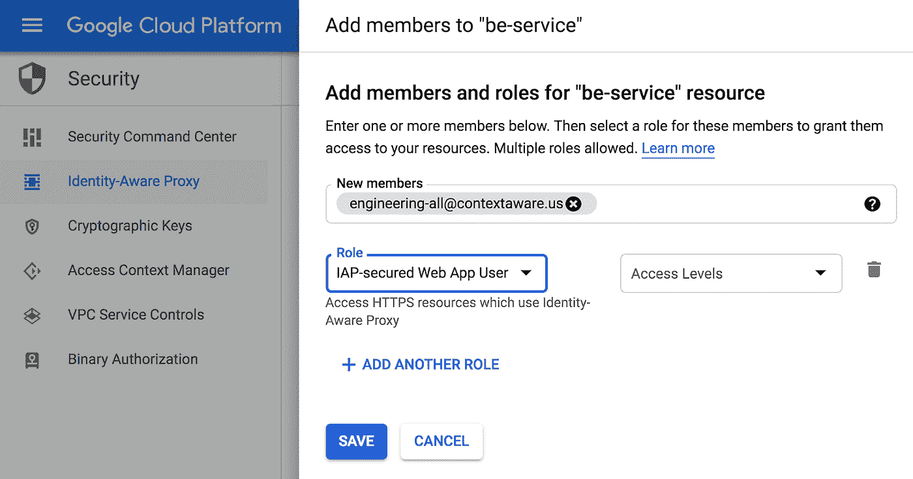

# 将您的身份迁移到云中

> 原文：<https://medium.com/google-cloud/moving-your-identities-to-the-cloud-c21be910d2d2?source=collection_archive---------1----------------------->

您的员工每天都需要使用各种各样的系统，无论是在本地还是在云中运行。但是，通常您的权威身份提供者位于您的服务器上，远离人们需要访问的服务。是时候让身份更贴近人们需要使用它的地方了。

当您应对访问控制和权限方面的挑战时，新的困境就会出现。合适的人群需要进入，但你不能因为害怕受到攻击而把事情搞得太大。随着您的公司和团队的成长，您的访问需求变得更加复杂，这开始成为您的 DevOps 团队的更大负担。随着越来越多的人在现场工作，扩展不在办公室的员工对网络应用的访问需要一个全新的审查水平来验证身份，因为你不能再依赖位置了。

> 您需要知道这个人是谁，他们的身份属于哪个访问组，以及他们是否有权访问资源！

谢天谢地，[云身份](https://cloud.google.com/identity/)可以帮助设计和执行这些访问系统，所以你不必把所有的时间都花在这上面。让我们来看看如何开始。

【youtube.com/watch?v=CilTpRVQppI 

# 通常的方式

最起码，你公司的员工很可能会有一个用户名(有时也叫 LDAP ),它附属于你的 [Active Directory](https://blogs.technet.microsoft.com/ashwinexchange/2012/12/18/understanding-active-directory-for-beginners-part-1/) 服务，帮助定义他们的访问控制。当您同时使用您的身份验证系统和访问控制时，您可以非常轻松地验证身份和进行访问——这对于那些在本地运行、离身份提供商不远的服务来说尤其有利。当您迁移到云，或者您的访问需求开始增长时，这个系统就会崩溃。

1.  这些服务现在需要一个团队进行专门的维护，以授予、撤销和确认访问级别
2.  随着时间的推移，将需要更细粒度的访问，这意味着用户和资源之间更复杂的重叠，需要更多的管理监督
3.  将您的身份验证和授权系统连接到第三方工具和软件即服务应用程序需要更多的工作

现在，如果您的访问需求很简单，并且您的 DevOps guru 带着寻呼机，这就不是问题了。但是随着你继续成长，你将需要更好的工具。

# 云身份

为什么要把身份放在云端？

1.  您可以通过一个身份提供商实现本地服务和云服务的无缝使用
2.  您通过设备管理和安全策略来加强移动设备(自带或公司)的安全性
3.  你可以利用谷歌的可靠性、规模和全球可用性

[来源](https://www.sage.com/na/~/media/site/sagena/responsive/images/smallbiz/section-clouds.jpg)

为了控制对云应用程序和数据的访问，您需要一种方法让您的公司身份和云身份很好地结合在一起。如果你已经在使用 SaaS 的应用程序，比如 Workday 或 Salesforce，那么你已经解决了这个问题的某个版本。你可以走得更远，将更多的身份服务转移到云上，并进行统一。转移到云身份提供商还可以让您收集云服务的使用情况，如 BigQuery 和 App Engine，所有这些都在一个管理保护伞下，以提高可见性和管理。

您会希望将身份信息放入云中，这样您就可以快速高效地做出这些访问决策，而不总是需要回叫您的本地提供商。如果你想利用谷歌云，你需要一种方法来识别人，以便适当的访问控制可以应用到你所有的云资源。我们的访问管理工具让您可以定义每组人如何使用各种云服务，让您根据他们是谁进行细粒度控制[。毕竟，你不希望每个人都随意创建自己的云存储桶！](http://bit.ly/maxsalt-whatisbc)

# 在 Google 中移动到身份

转向谷歌作为您的主要身份提供商意味着支持数十亿身份的基础设施的全球规模的容量、高可用性和安全性。因为谷歌每天处理如此多的登录尝试，我们的团队可以很容易地发现虚假或恶意登录。此外，谷歌提供了多种方式来保护您的多因素认证帐户。

我们已经设置了工具来帮助 IT 团队快速轻松地将他们的内部身份迁移到 Google 云平台。您可以[根据云身份认证您的 LDAP 兼容应用](https://cloud.google.com/blog/products/identity-security/cloud-identity-now-provides-access-to-traditional-apps-with-secure-ldap)，并使用谷歌云目录同步将您的 LDAP 或 Active Directory 帐户移动到谷歌的身份即服务数据库中。

# 授权决策

一旦您将活动目录数据放入 Google Cloud，您就可以轻松地[为您的应用程序创建更细粒度的访问模型](http://bit.ly/maxsalt-setupiap)。[情境感知访问模式](/google-cloud/what-is-beyondcorp-what-is-identity-aware-proxy-de525d9b3f90)依赖于关于人(来自你的身份提供者)和设备(你[主动监控的设备](/google-cloud/secure-your-devices-and-theirs-byod-and-device-management-27e6360c1e34))的信息，对吗？).借助智能分组和访问策略，您可以让新员工或承包商从第一天起就高效工作，并拥有完成工作所需的所有权限。

为了最大限度地限制攻击者或受感染设备可能造成的损害，您需要遵循最低特权原则:

> 给人们足够的权限去做他们需要的事情，而不是更多。

有了关于身份和组的信息，包括谁在哪个报告链或组织单位，您现在可以更精确地做出这些决定。

要做到这一点，您需要将您的整个层次结构(组、个人和所有人)纳入 Google Identity，以便身份识别代理(IAP)、身份和访问管理以及其他工具可以引用这些分组并强制执行您设置的访问规则。这可能很简单，代表公司内部主要组织的小组:

*   工程
*   产品
*   销售
*   营销
*   金融
*   合法的
*   人力资源

使用这些组来控制对应用程序的访问，可以让您随着人们的移动而进行调整，与将个人添加到特定工具相比，这样的设置更持久。例如，您可能希望产品和工程组能够访问源代码，然后财务和人力资源可能需要访问工资单工具集。这些策略决策通过 IAP 转化为实际的执行，IAP 是您创建的规则，它将引用您之前导入的组和您在 GCP 上运行的应用程序。

您还可以使用您的功能分组来定义谁可以创建或使用特定的云产品。您可能希望限制基础架构团队成员创建新的网络或计算资源，同时允许功能开发团队成员创建新的应用引擎应用。以合理的方式分配人员，以最大限度地减少帐户受损或设备丢失可能造成的损失。

# 基于上下文的访问

定义这些策略使我们能够利用基于上下文的访问模型，这是 Google 的 BeyondCorp 努力的核心，也是我们看待安全发展的方式。为了实现这一点，负载平衡器在 IAP 的支持下检查:

> 这个设备能够赢得足够的信任吗？
> 
> 是否允许此人访问此资源？

每次访问请求都会触发这些检查。这样，如果一个人改变了角色，他的访问权限会立即改变。如果恶意软件出现在机器上，一旦您的库存团队(或事件响应小组)发现，访问就会被关闭。

使用身份感知代理，您可以围绕特定角色或个人创建访问规则，授予他们访问特定 web 服务的权限。因此，销售部门的每个人都可以访问您的客户关系管理解决方案，工程部门的每个人都可以访问您的 bug 跟踪器。

# 尝试一下

如果你已经在 G Suite 上，那么你已经为你的家人准备了谷歌身份，你可以直接进入。设置一个[演示应用引擎应用](https://cloud.google.com/iap/docs/app-engine-quickstart)，或者尝试将您的一些 Kubernetes 工作负载迁移到 GCP，然后您可以激活 IAP 对这些应用进行基于身份的访问控制。

如果你的身份仍然在本地，让[免费试用云身份](https://cloud.google.com/identity/)，这样你就可以通过简单的 [quickstart](https://cloud.google.com/iap/docs/app-engine-quickstart) 快速尝试基于身份的访问，或者开始用[云目录同步](https://support.google.com/a/answer/106368?hl=en)工具将你的身份带到谷歌，这样你就可以摆弄真正的员工名单了。

如果你已经在 GCP 上运行工作负载，那么打开 IAP 会很快，你可以根据你想首先试验的地方使用任何[操作指南](https://cloud.google.com/iap/docs/how-to)来尝试一下。

试一试，让我们知道如何更容易地转换到上下文感知访问和 BeyondCorp 模型。