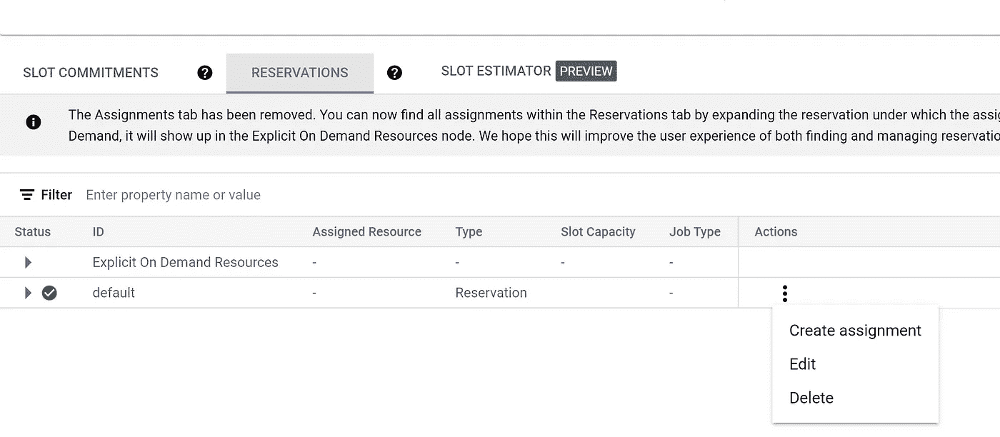

# 使用 BigQuery Omni 的多云分析:没有时间加载！

> 原文：<https://medium.com/google-cloud/multi-cloud-analytics-with-bigquery-omni-no-time-to-load-ed187a9dcf20?source=collection_archive---------0----------------------->

随着越来越多的组织采用多云计算战略，数据移动已经成为分析团队争论的焦点。数据蔓延和主机云提供商的出口成本是一些严重的副作用。

为客户开发多租户数据平台的独立软件供应商(ISV)发现跨多个云分布数据的场景极具挑战性。


BigQuery Omni 报到！

根据 GCPs 的核心理念，即构建一个真正开放且符合多云计算的平台，BigQuery Omni 为正在实施多云计算的数据分析团队和组织注入了一剂强心针。

BigQuery 的核心是分离存储和计算。它的本质是，通过 BigQuery，工程师希望将计算带到大数据所在的位置，而不是将数据带到计算所在的位置。这是传统大规模数据仓库运作方式的一个范式转变。这实现了计算相对于存储的独立扩展，也是 BigQuery 提供巨大可扩展性和灵活性的关键原因之一。

BigQuery Omni 跨云环境扩展了存储与计算的解耦，使团队可以在数据驻留在亚马逊 S3 或 Azure 云 Blob 存储中时从 BigQuery 查询数据。它是由完全由 Google cloud 管理的 Anthos 集群实现的，因此团队不需要提供或管理任何额外的东西。Anthos 集群运行在数据所在的同一区域，因此由于洗牌导致的延迟会进一步减少。


通过这种设置，传统的三步式数据管道**定位、加载和转换**流程现在简化为两步式流程，即**定位和转换**。需要制作数据的副本和编写额外的 ETL 管道的加载部分现在被消除了！

整合后的数据堆栈如下所示，使 BigQuery 成为满足所有分析需求的单一平台，而不管数据驻留在哪个云中。


分享以下 AWS S3 样本数据集的完整实施步骤，

1.  在 AWS IAM 中创建策略和角色，以启用 BigQuery 连接来访问 S3 中的文件。
2.  创建到 AWS S3 的 BigQuery 外部连接
3.  基于 AWS S3 中的数据从 BigQuery 创建外部表

让我们深入了解每一步的细节，

1.  **在 AWS IAM 中创建策略和角色，使 BigQuery 连接能够访问 S3 的文件**。

在美国东部 1 区的 S3 创建一个存储桶，并加载需要处理的数据。对于今天的演示，我们将以 csv 格式加载熟悉的员工和部门数据集，如这里的[所示](http://www.cems.uwe.ac.uk/~pchatter/resources/html/emp_dept_data+schema.html)

复制 S3 URIs，因为稍后在 BigQuery 中创建表时会用到它。


创建策略从 BigQuery 中列出和获取对象，IAM > Policies > Create Policy，比如说 *bqomniread*

```
{
"Version": "2012-10-17",
"Statement": [
{
  "Effect": "Allow",
  "Action": ["s3:ListBucket"],
  "Resource": ["arn:aws:s3:::BUCKET_NAME"]
},
{
  "Effect": "Allow",
  "Action": [
    "s3:GetObject"
  ],
  "Resource": ["arn:aws:s3:::BUCKET_NAME/*"]
}
]
}
```

创建新的角色，它将被用于从 BigQuery 面板连接到 S3，进入 IAM >创建新的角色，并选择如下选项，给你的角色名称，比如说 *bqomniread。*复制已创建角色的 ARN。这将在 BigQuery 中用于建立连接。


**2。创建一个到 AWS S3 的 BigQuery 外部连接**

我们现在将使用 BigQuery 外部连接选项建立从 BigQuery 到 AWS S3 的连接。

单击添加数据>外部数据源>选择 AWS(通过 BigQuery Omni)输入我们之前在 AWS 角色 id 中创建的 AWS 角色的 ARN 详细信息。


一旦创建了连接，它将出现在外部连接下面，如下所示，


单击连接以获取连接详细信息，


BigQuery 外部连接详细信息

我们现在创建的连接必须是可信的，以承担 *bqomni_read_only 的角色。*要信任连接，导航到 AWS IAM >点击角色创建>信任关系>粘贴下面的 json 代码，用 BigQuery 外部连接细节中的 BigQuery Google Identity 值替换“Identity ID”如下所示，

```
{
  "Version": "2012-10-17",
  "Statement": [
    {
      "Effect": "Allow",
      "Principal": {
        "Federated": "accounts.google.com"
      },
      "Action": "sts:AssumeRoleWithWebIdentity",
      "Condition": {
        "StringEquals": {
          "accounts.google.com:sub": "IDENTITY_ID"
        }
      }
    }
  ]
}
```

除此之外，我们现在必须为 BigQuery 外部连接配置身份提供者，为此，导航到 AWS IAM >身份提供者>输入提供者 url，如下所示，并输入 BigQuery Google 身份(来自 BigQuery 外部连接)作为受众。完成后，将要求您分配角色，选择之前创建的 bq_omni_read_only 角色。


现在我们已经准备好从 BigQuery 控制台创建外部表。

**3。从 AWS S3** 中的数据上的 BigQuery 创建一个外部表。

创建一个数据集，比如说， *bqomni* ，选择地区为 aws-us-east-1


导航到新创建的数据集并创建新表，输入如下详细信息，然后选择自动检测模式。


可能会弹出一条错误消息，提示连接无法承担角色，如果我们是第一次创建该连接，请稍后再试。这可能是由于传播延迟，请等待一段时间，然后再次连接。这次应该能成功。

一旦创建了表，您就可以在其上测试正在运行的查询，正如预期的那样，它将在右上角显示“查询将处理 0B ”,因为数据是存储在 BigQuery 中的*而不是*。


当我们运行查询时，会遇到下面的错误，


对于 BigQuery Omni，我们需要为查询预留 100 个位置。每月 100 个插槽的承诺最初让我失望，因为我没有查询该表，但这正是 Flex 插槽预留的救星。

购买 100 个 Flex 类型的插槽，详情如下所示。


一旦您进行了测试运行，并对能够连接和处理来自 BigQuery 的驻留在 S3 的数据感到兴奋，您可以回来取消这个承诺。假设您将在查询上工作大约一个小时，您将为此活动花费 5 美元。

一旦创建了槽，下一步就是为创建了 *bqomni* 数据集的项目保留它们，


在 reservation 选项卡下，单击 slots created 行并选择 Create assignment，在下拉列表中选择创建 *bqomni* 的项目。



一旦创建了分配，您可以看到如下所示的分配，


现在我们已经准备好查询我们的外部表了！


您也可以用类似的方式创建 employee 表，然后将 employee 表和 department 表连接起来，得到两个数据位于 S3 的表的输出，


您可以在 S3 加载一些更大的数据集，并检查这个联邦查询的性能。正如预期的那样，这比数据驻留在 BigQuery 或 GCP 平台上要低一些。然而，它在可比较的范围内，对于生产工作负载来说当然值得实施。

一旦你完成测试，*不要忘记取消预订和你用 flex 类型创建的插槽！*

在生产场景中，如果您没有统一费率预留类型，并且如果您有几个联合管道要开始，那么灵活插槽是开始的最佳方式。

假设您有一个类似 Cloud Composer(managed Apache air flow)的编排工具，下面是如何以自动化的方式实现上述管道，


对于驻留在 Azure blob 存储中的数据，也可以进行类似的实现。

可以在这些外部表上创建 Looker 和 BigQuery ML 模型，这与在内部表上启用它的方式非常相似。这使得 BQ Omni 对现有的 BigQuery 用户来说更加强大！