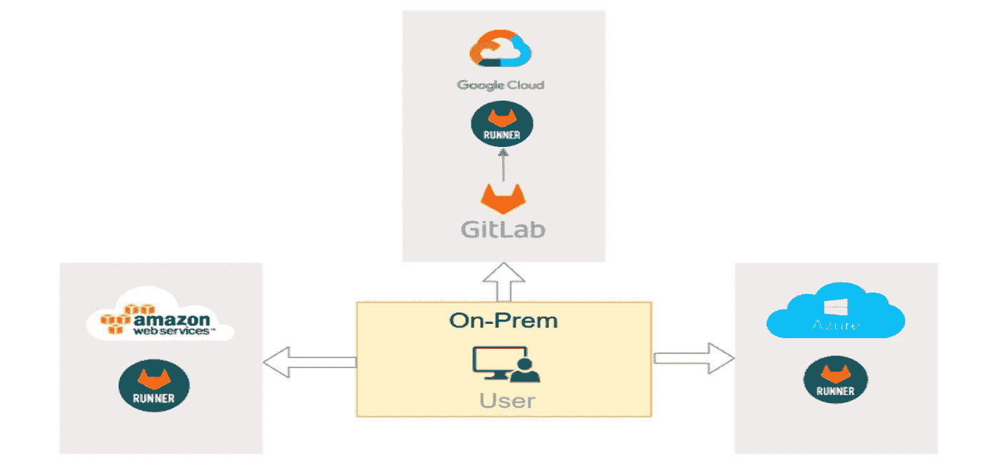
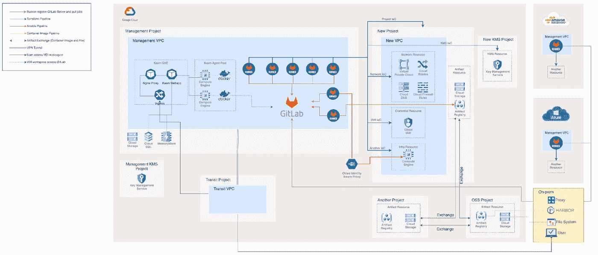
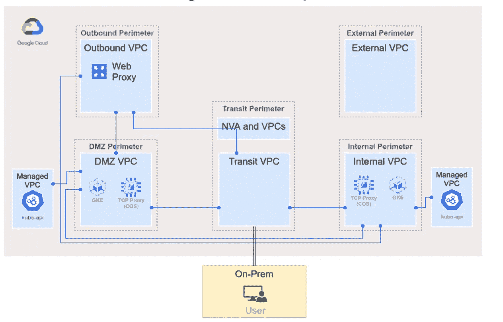
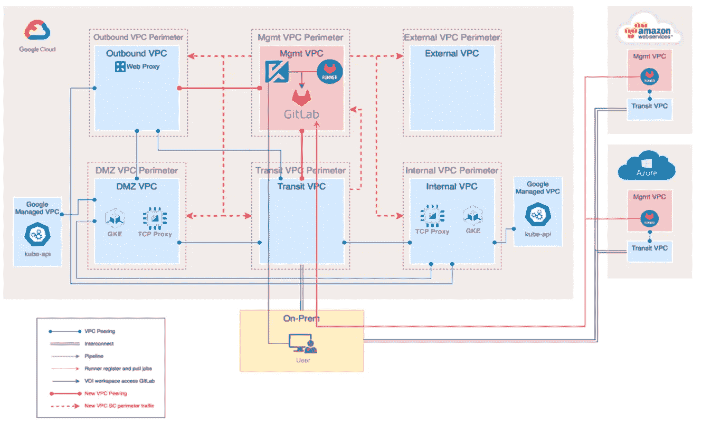
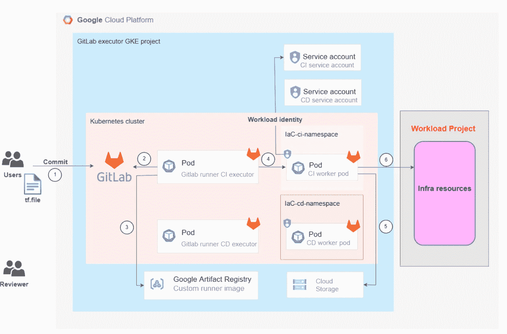
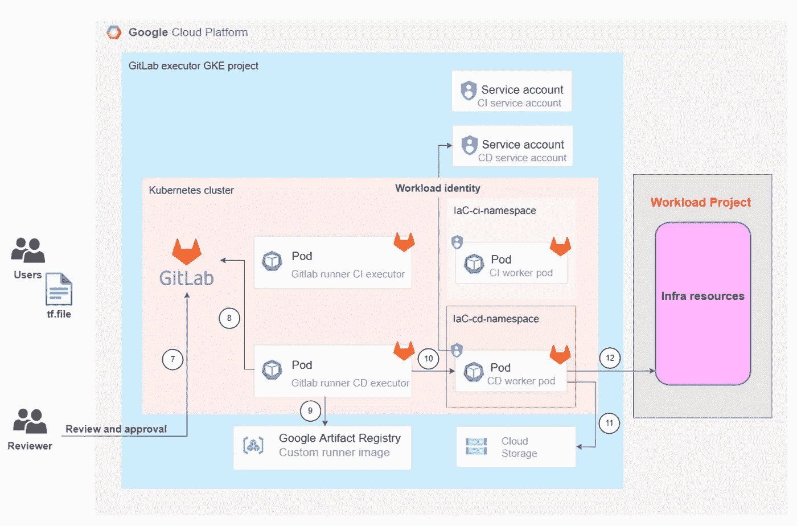

# 用于 Google Kubernetes 引擎上 IaC 自动化的多云 GitLab CI/CD

> 原文：<https://medium.com/google-cloud/multi-cloud-gitlab-ci-cd-for-iac-automation-on-google-kubernetes-engine-f8afc7b55b2f?source=collection_archive---------1----------------------->

毫无疑问，Gitlab 一直是 VCS 企业的首选。同样，它最近因其 CI/CD 产品而广受欢迎。无论是为 GitLab 选择托管服务器的灵活性，还是它多年来在 DevOps 领域获得的成熟性，都使它成为该领域的一个强有力的竞争对手。

Medium 上有许多文章讲述了在 GKE 上设置 GitLab CI/CD 所涉及的步骤，在本文中，我们将进一步讨论如何处理多云 GitLab CI/CD 自动化需求。

# 设计考虑事项—多云概要设计

在上述架构中，GitLab VCS 托管在 Google Kubernetes 引擎上，而负责 CI/CD 的 GitLab runners 分别托管在不同的云提供商各自的 Kubernetes 托管服务产品上。前任。谷歌云上的 Gitlab runner 托管在 GKE，AWS 上的另一个 runner 托管在 EKS，而 Azure 上的第三个 runner 托管在 AKS 上。

# 建筑破冰

上述架构显示了所涉及的多个组件块的细节，以及它们如何组合在一起以实现 multi cloud GitLab CI/CD。

主题可分为监控、GitLab Cloud 原生混合架构细节、多管道设计、人工制品交换和监控、跑步者和 GitLab 服务器之间的多云通信。

# VPC 网络图-轴辐式

这是一个典型的 GCP 轴辐式网络架构，中转 VPC 是一个集线器，通过互连连接到本地，利用 VPC 对等与其他 VPC 对等。

VPC 以共享方式运行 VPCs(内部)VPCs 主要托管面向内部的工作负载，非军事区 VPCs 主要托管服务于互联网的工作负载。

在当前的架构中，所有的 VPC 也受 VPC 服务控制(VPC-SC)的控制，其中每个共享的 VPC 受其自己的边界保护，以限制跨 VPC-SC 的 API 访问。

# IaC 组件的网络设计

正如我们在上一节中看到的一般网络架构，如果我们在其中添加 IaC 组件，那么修改后的网络设计如下所示。根据谷歌 VPC 设计最佳实践和谷歌 VPC 服务控制最佳实践，这里引入了管理 VPC。这个管理 VPC 是云基础架构其余部分的控制平面，由于其数据和工作负载的敏感性，这个管理 VPC 被放置在一个单独的边界中，以防止来自其他边界的 API 调用。

# 使用 GitLab 的 IaC 基础设施 CI 管道工作流

1.  一名开发人员更新了 **Terraform 代码**，向 GitLab 提交代码，并创建了一个**合并请求**来部署基础设施资源。
2.  GitLab runner executor 对 CI 职位进行投票。
3.  运行程序选择一个作业，并提取为管道配置的容器映像。
4.  使用容器映像，运行人员使用 CI 管道中配置的服务帐户将 Kubernetes Pod 旋转到作业。
5.  管道从云存储中获取 tfstate 文件。
6.  通过具有**工作负载标识**的 Google 云服务账户执行 Terraform 计划。

# 使用 GitLab 的 IaC 基础设施 CD 管道工作流程

1.  **审阅者和批准者**允许合并请求，这将触发 CD 作业。
2.  GitLab runner executor 轮询 CD 作业。
3.  运行程序选择一个作业，并提取为管道配置的容器映像。
4.  使用容器映像，运行人员使用 CD 管道中配置的服务帐户将 Kubernetes Pod 旋转到作业。
5.  管道从云存储中获取 tfstate 文件，并执行 Terraform 计划。
6.  通过带有**工作量标识**的 Google 云服务账户管理工作量项目基础设施资源。

# 结论

随着企业在其已经托管的云 DC 中逐渐成熟，作为科技巨头的下一步，多重云最近受到了极大的欢迎。无论是他们的高可用性和灾难恢复目标是实现多云，还是他们的客户要求在特定的云提供商上提供 SaaS 解决方案，企业和科技巨头都在努力实现多云。

在本文中，我介绍了一个这样的用例，企业可以在 Google Kubernetes 引擎上利用多云 GitLab CI/CD，并有效地满足他们的基础设施自动化目标。