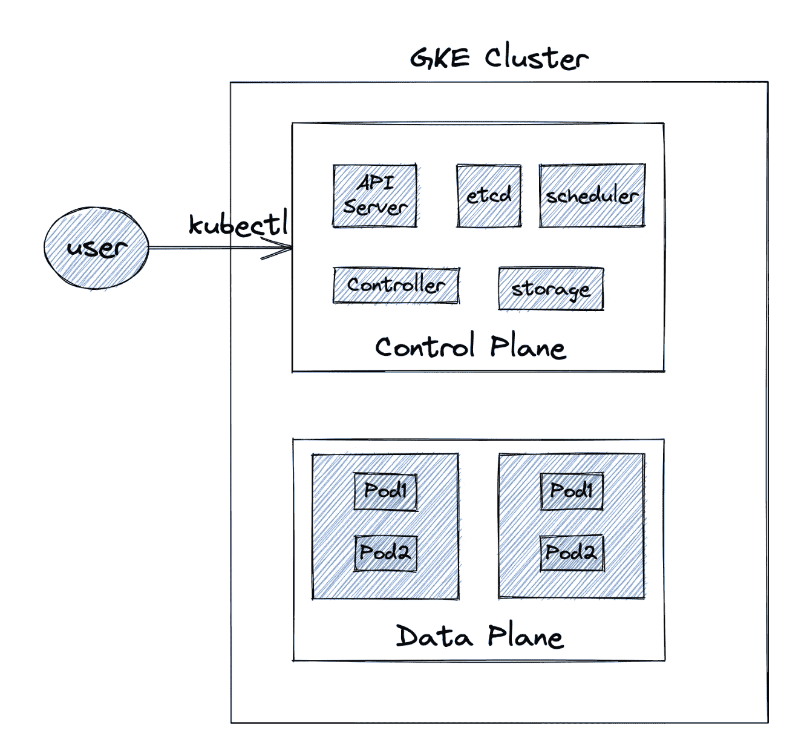
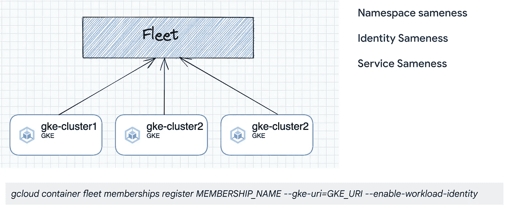
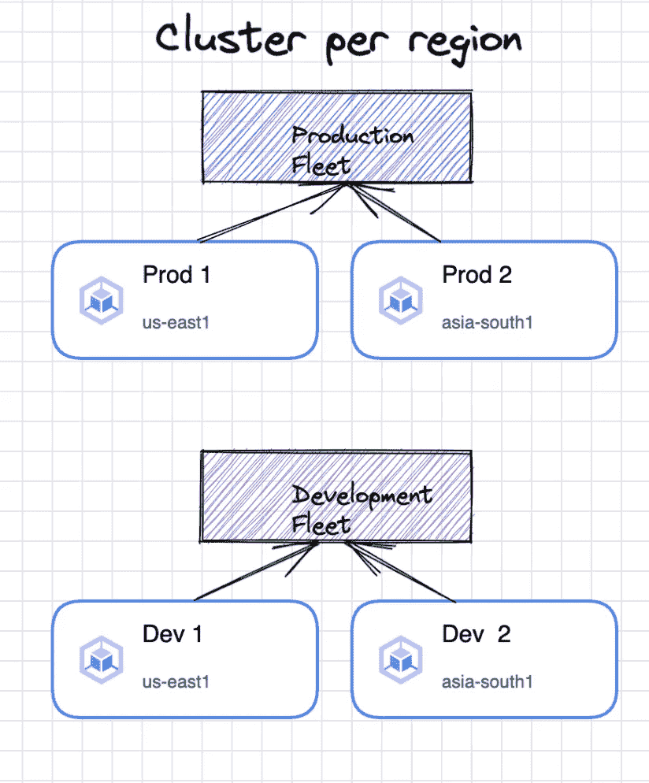
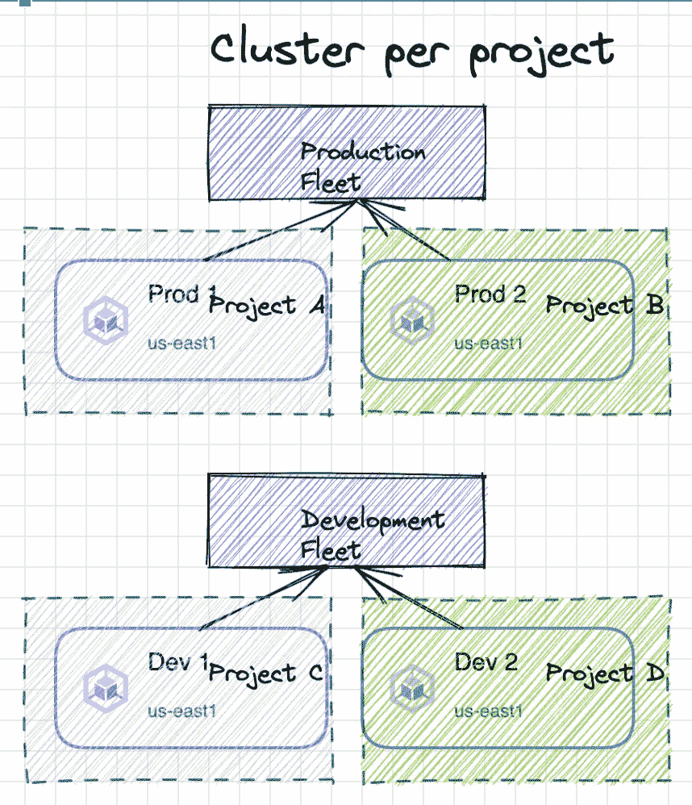
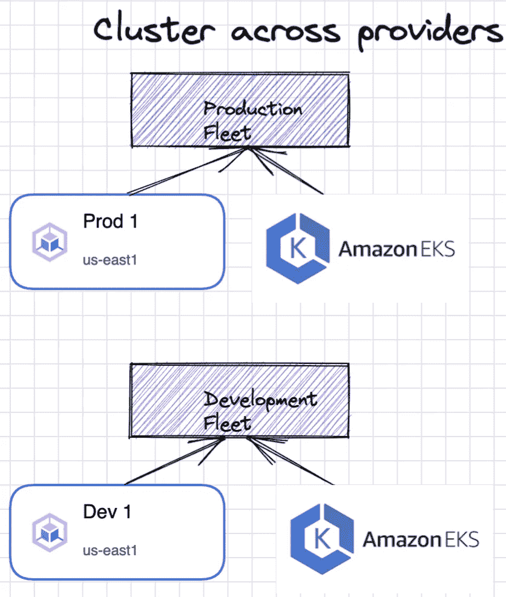
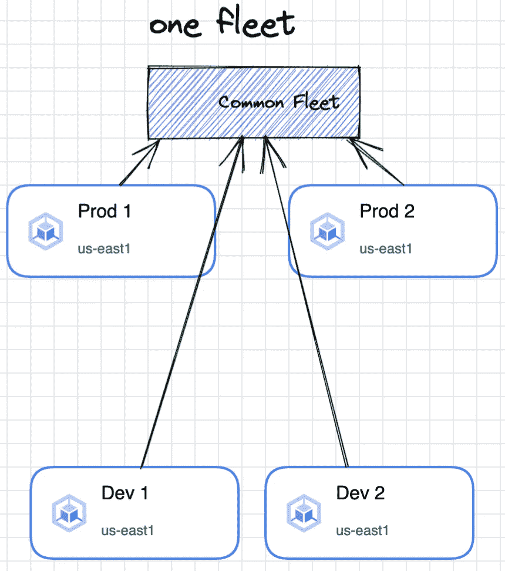

# Kubernetes 与 GKE 的多集群部署:第 1 部分-简介

> 原文：<https://medium.com/google-cloud/multi-cluster-kubernetes-deployments-with-gke-part-1-introduction-e0963860adc9?source=collection_archive---------0----------------------->

Kubernetes 技术在企业采用方面取得了长足的进步。随着微服务的巨大增长，企业正在寻找一种在 Kubernetes 生态系统中部署微服务应用的干净方式。多集群部署不仅实现了完全分离，还提供了更好的灾难恢复、自动扩展和身份管理功能。在这个由三部分组成的系列中，我们将深入讨论如何通过 GKE 实现本机多集群部署。在第一篇文章(第 1 部分)中，我将解释什么是多集群部署，多集群部署的需求，不同的部署模型和挑战。在第 2 部分(即将推出)中，我将解释通过服务导出的多集群通信，在第 3 部分(即将推出)中，我们将研究 MultiClusterIngress，它支持跨多个集群部署 Kubernetes 服务和入口。

注意:本系列只关注 GKE 功能。其他解决方案，如提供多集群通信能力的“服务网格”将不会在本博客系列中讨论。

# GKE 集群

GKE 集群由控制平面和数据平面组成。控制平面完全由 Google Cloud 管理，包含 Kubernetes 组件。Kubernetes 控制平面由 Kubernetes API 服务器、控制器、etcd、调度程序等组成。另一方面，数据平面是 Kubernetes 工作节点，企业在其中部署应用程序工作负载。

# 为什么是多个集群

**高可用性和故障转移:** GKE 集群可以基于区域，也可以跨区域部署。为了避免区域性故障，企业可能希望部署应用程序实例，并跨不同区域扩展这些实例。借助多集群支持，应用程序可以跨区域部署在不同的集群中，并为不同地理位置的最终用户提供服务。

**数据引力:** GKE 集群可以部署在更接近驻留在同一区域内的数据库中的数据的区域。这减少了网络延迟和数据库往返时间。

**隔离:**可以创建不同的 GKE 集群来隔离不同的环境。可以为开发、生产、性能、UAT 等创建单独的集群。也可以为业务单元或 scrum 团队创建单独的集群。

**访问管理:**多个 GKE 集群简化了访问管理。例如，可以创建 IAM 策略，为特定 GKE 集群的各个团队提供访问权限。这允许团队拥有他们自己的 GKE 集群并独立管理它们。

**规模:**通过在同一项目或不同项目中跨多个集群部署应用程序，超越单个集群或项目的限制

**维护:**可以对运行在一个集群内的选定服务进行 Kubernetes 版本升级，屏蔽运行在不同集群内的其他服务。这降低了维护事件中的故障风险。此外，还可以根据群集中部署的应用程序的性质来计划维护事件。

**合规:**特定的应用程序工作负载可能必须在特定的区域运行，以实现数据合规。因此，这些应用程序可以部署在特定区域创建的集群中。

# 挑战

**管理:** Kubernetes 管理员管理多个集群而不是单个集群会有额外的管理开销。应该可以从单个面板管理这些集群。

**东西向通信:**不同集群中的应用服务应该能够跨越集群边界进行东西向通信。例如，集群 A 中的订单服务可能必须与不同集群中的支付服务通信。

**南北通信:**应该可以跨集群边界扩展服务，并将南北外部流量(负载平衡器)路由到跨多个集群的这些服务

# 快速的

Fleet 是 Google Kubernetes Engine 针对多集群架构中涉及的挑战提供的解决方案。它是注册到它的多个集群的逻辑分组。一支舰队提供

**命名空间相同:**命名空间一个车队的名称在车队级别而不是集群级别分配给整个车队。在一个名称空间中部署的许多组件都尊重名称空间的一致性。

**服务相似性:**集群中相同名称空间中的同名服务被认为是相似的。在一个机群内，还可以跨集群边界扩展和负载平衡部署。

**身份相同:**在同一名称空间内跨集群部署的服务在集群内外都继承相同的身份。特别是，这些身份是从外部访问 google 服务的工作负载身份，并通过 Anthos 服务网格限制服务间的访问。

在 GKE，一个项目被指定为机群主机项目，同一项目或不同项目内的多个集群被注册到机群。注册到机群的集群应该托管彼此相关的服务。例如，属于同一环境(生产、开发等)的多个业务部门或团队特定的 GKE 集群。理想情况下，这些集群应该只有一个管理员。

# 多集群部署模型

**每个区域的聚类:**

跨多个区域创建集群，并跨这些区域扩展您的服务。该模型提供了针对区域性故障的弹性，还使您能够将应用程序部署到离最终用户更近的地方。此外，通常还会为不同的环境(如“开发、UAT、生产”)创建单独的设备群来独立管理它们。

**每个项目的集群:**

如果一个企业有多个独立的业务部门和具有不同 GCP 项目的团队，那么可以在每个单独的项目中为每个团队创建一个单独的集群。这在 GKE 集群之间提供了清晰的项目级隔离，以及更好的“身份和访问管理”。

**跨云提供商的集群:**

跨多个云提供商部署集群，并通过 GKE 管理这些集群。这种模式有助于采用多云策略的组织内的多云部署。跨云提供商的部署需要 Anthos 功能，这将不在本博客系列中讨论。

**单舰队管理的集群:**

虽然这通常是一种反模式，但在一个拥有单一机群的组织中，跨不同环境管理所有集群是可能的。由于 fleet 提供相同的名称空间、服务和身份，因此应该注意隔离具有不同名称空间的多个环境(开发、生产、UAT 等)。

# 结论

GKE 车队有助于克服 kubernetes 多集群部署中的多重挑战。它们支持从单一管理平台管理集群，并且有助于跨这些集群进行良好管理的通信和扩展。多集群部署可实现更好的灾难恢复、故障转移，并在组织内的多个业务部门或团队之间提供更清晰的隔离。在本系列的下两部分(即将推出:-)，我将讨论 GKE 舰队的两个主要功能——服务输出和多集群入口，以及如何利用这些功能来应对多集群挑战。